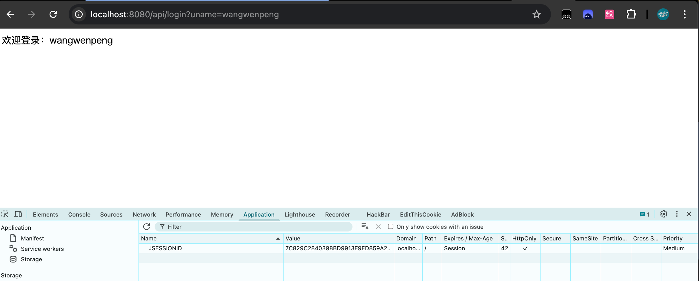
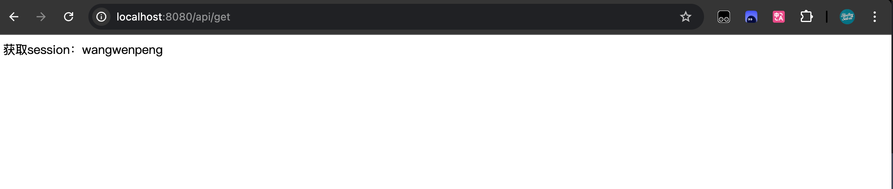

## 传统 SESSION 式

```java
@RequestMapping(path = "/login")  
public String login(String uname, HttpSession httpSession) {  
    httpSession.setAttribute("name", uname);  
    return "欢迎登录：" + uname;  
}  
  
@RequestMapping(path = "/get")  
public String get(String uname, HttpSession httpSession) {  
  
    return "获取session：" + httpSession.getAttribute("name");  
}
```





实现原理就是根据这个 `JSESSIONID`  
当我们键入 `http://localhost:8080/api/login?uname=wangwenpeng`，回车发送请求

简单来说，对有 session 操作的场景，服务器那边会返回一个 `JSESSIONID`，表示这次会话。  
然后服务器也根据这个 ID 在服务器内存中新建一个 `SESSION对象`，对象中存储一个键值对 name = wangwenpeng


当我们输入 `http://localhost:8080/api/get` 访问的时候，也是带着这个 `JSESSIONID`。  
这样到服务器之后就可以根据这个 `ID` 找到对应的 `SESSION对象`，然后拿出 key 为 name 的 value。

浏览器关闭之后，内存中的 `JSESSIONID` 就丢失了，再发送 `http://localhost:8080/api/get` 自然就找不到对应的 `SESSION对象`，拿不到 key = name 的 value 了

## JWT
JSON Web Token 由三部分组成，它们之间用圆点.进行分割，一个标准的 JWT 形如 `xxx.yyy.zzz `
- Header 
- Payload 
- Signature

Header 由两部分组成：
```JSON
{
  "alg": "HS256", // 表示使用的算法
  "typ": "JWT" // 表示token的类型为jwt
}
```

然后，用 Base64对这个 JSON 编码就得到了 JWT 的第一部分

Payload 可以用来存储一些自定义数据：
```json
{
	"exp": 1692256049,
	"username": "wangwenpeng",
	"site": "http://blueboySalvat.top",
}
```

同样 payload 也需要 Base64编码，然后我们就得到了 JWT 的第二部分

Signature:
对 Header、Payload 部分进行签名，需要用到签名算法和密钥。

签名可以用于验证消息在传递过程中有没有被更改。并且，对于使用私钥签名的 token，它还可以验证 JWT 的发送方是否为它的发送方。

