## Idea
### 基本配置
### debug
蓝色背景色：下一步运行的
红色背景色：已经运行的

## 编译和运行

- **java 文件**：这个就是源文件。例如 `test. java`
```java
public class Test {
	public static void main(String[] args) {
		System.out.println("hello,world");
	}
}
```

- **javac 命令**：`javac` 是 java 语言编程**编译器**，负责把 java **源文件** 编译成 class**字节码文件**。
- **class 文件**：字节码文件，这个是跨平台的关键，一份 java 代码对应一份 class 文件，然后通过 java 虚拟机 `JVM` 进行对应的平台转换（JIT 方式）成不同平台的机器码，从而实现跨平台。那么一般一个 java 的类会生成对应的 class 的文件，有多少类就有多少的字节码文件。
```shell
javac Test.java
```

- **java 命令**：Java 应用程序启动器，同时也是 java 的虚拟机 JVM，用于运行 java 的字节码文件，翻译成对应的机器码。
```shell
java Test
```

## 关键字
>关键字就是用作**专门特殊用途**的字符串（单词），不能随便用。

## 标识符
>起名字起的那一串就是标识符。


## 标识符命名规范
>良好的命名规范可以提高效率。

- **包名** ：多单词组成时所有**字母都小写** ：`xxxyyyzzz`
- **类名、接口名** ：多单词组成时，所有单词的**首字母大写** ：`XxxYyyZzz`
- **变量名、方法名** ：多单词组成时，第一个单词首字母小写，第二个单词开始每个单词首字母大写 ：`xxxYyyZzz`
- **常量名** ：所有 **字母都大写**。多单词时每个单词用**下划线连接** ：`XXX_YYY_ZZZ` 

总原则：见名知意

## 注释
>用来注释解释代码，和不删除但是不让代码运行的作用。

```java
//单行注释
/*
多行注释
*/
```
## 变量
### 什么是变量
>在程序执行的过程中，在某个范围内其值可以发生改变的量。
>用来存储值的东西。

### 变量的定义
>`数据类型 变量名 = 初始值`;

变量名实质上是一段连续存储空间的别名，是一个标号(门牌号)，编译器通过变量来申请并命名内存空间，程序员可以通过变量的名字可以使用存储空间。变量名是逻辑概念，变量是物理层面，变量含数据类型和数据值，数据类型决定内存的分配，编译器将变量名和变量对应的内存联系起来，使程序员可以通过变量名来操作内存。

变量名实际上是用名字代表的一个存储地址
从变量中取值，实际上是通过变量名找到相应的内存地址，从该存储单元中读取数据

### 变量的分类
#### 基本数据类型
##### 整型类型
Java 各整数类型有**固定的表数范围和字段长度**，**不受具体操作系统的影响**，以保证 Java 程序的可移植性。

Java 的整型常量默认为 `int` 型，声明 `long` 型常量须后加 `l` 或 `L`

| 类型 | 占用存储空间 | 取值范围 |
| ---- | ---- | ---- |
| Byte | 1 字节=8bit | -128-127 |
| short | 2 字节 |  |
| int | 4 字节 |  |
| long | 8 字节 |  |
##### 浮点类型
与整数类型类似，Java 浮点 类型也有**固定的表数范围和字段长度**，**不受具体操作系统的影响**。

浮点型常量有两种表示形式：

- 十进制数形式，如：`5.12、512.0f、.512 `（**必须有小数点**）；
- 科学计数法形式，如：`5.12e2、512E2、100E-2`。

| 类型 | 占用存储空间 | 补充 |
| ---- | ---- | ---- |
| float | 4 字节 | 声明 `float` 型常量，须后加 `f` 或 `F`或 `F` |
| double | 8 字节 | 浮点型常量的默认为 `double`   |
##### 字符类型
| 类型 | 占用存储空间 | 范围 |
| ---- | ---- | ---- |
| char | 2 字节 |  0-2<sup>16</sup>-1 |
```java
char c1 = 'a';
char c2 = '中';
//使用unicode编码表示单个字符
char c3 = '\u0041';
//表示特殊字符型常量
char c4 = '\n'；
char c5 = '\t';
char c6 = '\\';
char c7 = '\'';
```
char 类型可以进行运算，`char` 变量可以转换成对应的 `unicode` 码进行计算。
##### 布尔类型
>用于程序流程控制，逻辑判断等。

##### 基本数据类型转换
###### 自动类型转换
满足如下条件下会自动进行类型转换：
- **多种类型**的数据进行**混合计算**
- **容量小**的变量赋值给**容量大**的变量
- **精度低**的变量赋值给**精度高**的变量

`byte、short、char` 之间不会相互转换，他们三者在算数运算时首先转换为 `int` 类型。

|  |  |  |  |  |  |
| ---- | ---- | ---- | ---- | ---- | ---- |
| char(2 字节) |  |  |  |  |  |
| byte(1 字节) | -> | int(4 字节) | long(8 字节) | float(4 字节) | double(8 字节) |
| short(2 字节) |  |  |  |  |  |

当把任何基本类型的值和字符串值进行连接运算时(+)，基本类型的值将自动转化为字符串类型（基本数据类型转换成字符串）。

`Auto_Convert.java `
```java
public class Auto_Convert {
	public static void main(String[] args){
		byte b = 10;
		short s = 15;
		char c = 'A';

		int i = 100;


		/*
		 b(byte类型) 和 s(short类型)进行运算时，
		 都会先转换成 int 类型，最终运算结果为 int 类型
		 int类型（大容量 4字节）无法自动赋值给 short（小容量 2字节）
		 报错信息：错误: 不兼容的类型: 从int转换到short可能会有损失
		 */
		//short e = b + s;


		/* 
		把任何基本类型的值和字符串值进行连接运算时(+)
		基本类型的值将自动转化为字符串类型（基本数据类型转换成字符串）。
		*/
		System.out.println("abc" + i);
		//查看实际运算后的数据类型
		System.out.println(("abc" + i) instanceof String);


		/*
		abc 和 c 进行拼接后得到 abca，abca 和 1 进行运算时，1 会先转换成字符串，然后拼接。
		得到结果 abcA1
		*/
		System.out.println("abc" + c + 1);
		//查看实际运算后的数据类型
		System.out.println(("abc" + c + 1) instanceof String);
		
		/*
		自左向右运算
		int和char类型运算时，c 首先转换成int类型 和 1进行 运算
		得到其值 66，然后拼接其后字符串abc。
		得到结果 66abc
		*/
		System.out.println(1 + c + "abc");
		//查看实际运算后的数据类型
		System.out.println(("abc" + 1) instanceof String);

	}

}
```

###### 强制类型转换
>**容量大**（**精度高**）的变量转换成**容量小**（**精度低**）的变量。

`boolean` 类型**不可以**转换为其它的数据类型

字符串不可以用强制类型转换为基本类型。

```java
String numStr = "100";
int num = Integer.parseInt(numStr);
int num = (int)numStr; // X
```

`Force_Convert.java `
```java
public class Force_Convert {
	public static void main(String[] args) {
		char c1 = 'A';
		//char类型可以参与运算，因为char类型对应unicode编码中的数字。
		// 65 + 1 = 66
		System.out.println(c1 + 1);

		/*
		使用强制类型转换，将 int值 66 转换成 char类型的 B
		Java中有多个括号时，运算顺序是从左到右的，但是在下面的句子中，
		它首先要等待里面的第二个括号运算出具体的结果，才能执行第一个括号。
		*/
		System.out.println((char)(c1 + 1));

	}
}
```
#### 引用数据类型
>引用类型是指一种数据类型，其变量并不直接包含数据，而是包含一个指向内存中对象的引用。
>引用数据类型的名和值并不是存储在一起的，而是存储了一个地址值，通过地址值引用到内存中实际存在的数据上

举例：
- `int a = 10; `//通过 a 这个名字你可以找到对应的数据
- `int[] arr = new int[3]; ` //通过 arr 变量这个名字你能找到一个指向内存某处的地址值，通过地址值引用到内存中实际存在的数据上

引用数据类型大致包括：
- 类
- [[#接口 ]]
- [[#数组 ]]
- 字符串类型

引用类型在堆里，基本类型在栈里。

栈空间小且连续，往往会被放在缓存。引用类型cache miss率高且要多一次解引用。

对象还要再多储存一个对象头，对基本数据类型来说空间浪费率太高

### 变量交换实例

`Swap_Pos.java `
```java
public class Swap_Pos {
	public static void main(String[] args) {
		int a = 5;
		int b = 10;
		System.out.println("交换前：");
		System.out.println("a = " + a);
		System.out.println("b = " + b);

		int temp;
		//通过temp变量，进行位置交换
		temp = a;
		a = b;
		b = temp;
		System.out.println("交换后：");
		System.out.println("a = " + a);
		System.out.println("b = " + b);

		

		int aa = 5;
		int bb = 10;
		System.out.println("交换前");
		System.out.println("ab = " + aa);
		System.out.println("bb = " + bb);
		//不是用temp变量，进行位置交换
		aa = aa + bb;
		bb = aa - bb;	//aa + bb - bb = aa
		aa = aa - bb;	//aa + bb - (aa + bb - bb) = bb
		System.out.println("交换前");
		System.out.println("ab = " + aa);
		System.out.println("bb = " + bb);

	}
}
```
## 运算符
### 算数运算符
>自增运算需要在赋值运算中特别考虑，其运算符的前后会影响赋值。

| 运算符 | 运算 |
| ---- | ---- |
| + | 正号 |
| - | 负号 |
| + | 加 |
| - | 减 |
| \* | 乘 |
| / | 除 |
| % | 取模 |
| ++ | 自增 1 |
| -- | 自减 1 |
| + | 字符串相加 |

`Arithmetic_Operation .java`
```java
public class Arithmetic_Operation {
	public static void main(String[] args) {
		int a = 5;
		int b = 10;
		int num;

		//b = b + a
		//b = 10 + 5 = 15
		b += a;

		//b = b - a
		//b = 10 - 5 = 5
		b -= a;

		/*
		对于操作数来说，++ --他们本身是一定会自增或者自减的，无论前后
		在赋值操作中，++ --的前后会影响赋的值是多少。
		*/
		//++ 在前，先把 a 自增 1，再把值返回给 num
		num = ++a;
		System.out.println("num = " + num);
		//++ 在后，先返回值给 num，b 再自增 1

		num = b++;
		System.out.println("num = " + num);


	}
}
```

`Mod_Arithmetic.java`
>如果对负数取模，可以把**模数负号忽略**不记
```java
public class Mod_Arithmetic {
	public static void main(String[] args) {
		int a = 3;
		int b = 2;

		System.out.println(a % b);	//1
        //如果对负数取模，可以把模数负号忽略不记
        System.out.println(3 % 2);	//1
        System.out.println(-3 % 2);	//-1
        System.out.println(3 % -2); //1
        System.out.println(-3 % -2); // -1
	}
}
```

`Divide_Operation.java`
>被除数和除数中**只要有浮点类型**的数，得到的结果就是**浮点类型**的。
```java
public class Divide_Operation {
	public static void main(String[] args) {
		System.out.println(3 / 2);	//1
		System.out.println(3.0 / 2);	//1.5
		System.out.println(3 / 2.0);	//1.5
		System.out.println(3.0 / 2.0);	//1.5
	}
}
```

### 赋值运算符


### 关系运算符
>操作对象布尔类型

| 运算符 | 运算 |
| ---- | ---- |
| == | 相等于 |
| != | 不等于 |
| < | 小于 |
| > | 大于 |
| <= | 小于等于 |
| >= | 大于等于 |
| instanceof | 检查是否是类的对象 |
### 逻辑运算符
>操作对象布尔类型

| 运算符 | 规则 |
| ---- | ---- |
| & | 无论两侧结果如何，都要计算完 |
| && | 左侧只要为假，右侧就不用算了 |
| \| | 无论两侧结果如何，都要计算完 |
| \|\| | 左侧只要为真，右侧就不用算了 |
`Relation_Operation.java`
```java
public class Relation_Operation {
	public static void main(String[] args) {
		int num1 = 10;
		int num2 = 5;
		//num1 自增后为 11，大于 10 ， 左侧为 true
		//num2 自增后为 6 ，大于 5  ， 右侧为 true
		//true 11 6
		System.out.println((++num1) > 10 & (++num2) > 5);
		System.out.println("num1:" + num1);
		System.out.println("num2:" + num2);
		System.out.println("-----------------------------");

		num1 = 10;
		num2 = 5;
		//num1 自增后为 11，大于 10 ， 左侧为 true
		//继续进行右侧计算
		//num2 自增后为 6 ，大于 5  ， 右侧为 true
		//true 11 6
		System.out.println((++num1) > 10 && (++num2) > 5);
		System.out.println("num1:" + num1);
		System.out.println("num2:" + num2);
		System.out.println("-----------------------------");

		num1 = 10;
		num2 = 5;
		//num1 自增后为 11，大于 10 , ** 左侧为 false **
		//** 不再进行右边的计算 **
		//false 11 5
		System.out.println((++num1) == 10 && (++num2) > 5);
		System.out.println("num1:" + num1);
		System.out.println("num2:" + num2);
		System.out.println("-----------------------------");

		num1 = 10;
		num2 = 5;
		//num1 自增后为 11，大于 10 ， 左侧为 true
		//num2 自增后为 6 ，大于 5  ， 右侧为 true
		//true 11 6
		System.out.println((++num1) > 10 | (++num2) > 5);
		System.out.println("num1:" + num1);
		System.out.println("num2:" + num2);
		System.out.println("-----------------------------");

		num1 = 10;
		num2 = 5;
		//num1 自增后为 11，大于 10 ， ** 左侧为 true **
		//** 不再进行右侧计算 **
		//true 11 5
		System.out.println((++num1) > 10 || (++num2) > 5);
		System.out.println("num1:" + num1);
		System.out.println("num2:" + num2);
		System.out.println("-----------------------------");

		num1 = 10;
		num2 = 5;
		//num1 自增后为 11，大于 10 , 左侧为 false
		//继续进行右侧计算
		//num2 自增后为 6 ，大于 5  ， 右侧为 true
		//true 11 6
		System.out.println((++num1) == 10 || (++num2) > 5);
		System.out.println("num1:" + num1);
		System.out.println("num2:" + num2);
		System.out.println("-----------------------------");
	}
}
```
### 三元运算符
>`(条件表达式)? 表达式 1：表达式2`

### 运算符优先级
>在表达式中运算时谁先算，谁后算的问题。

单目运算符、三元运算符、赋值运算符是从右向左运算的。

先算乘除，后算加减，有括号先算括号里面的，在代码中通过括号限定运算顺序


## 控制流程
>用来控制语句如何执行，以什么样的顺序执行。


`Input_Message.java `
为了便于后续操作和学习，这里介绍一下在 Java 中的输入操作：
```java
import java.util.Scanner;
public class Input_Message {
	public static void main(String[] args) {
		//创建一个Scanner类的实例对象
		Scanner sc = new Scanner(System.in);
		String str = sc.next();
		System.out.println("str:" + str);

		int num = sc.nextInt();
		System.out.println("num:" + num);
		System.out.println("-----------------------------");
	}
}
```
```shell
wangwenpeng@AppleBook basic % java Input_Message
hello
str:hello
666
num:666
-----------------------------
wangwenpeng@AppleBook basic % java Input_Message
"hello world"
str:"hello
Exception in thread "main" java.util.InputMismatchException
	at java.util.Scanner.throwFor(Scanner.java:864)
```

`Control_Process.java
使用控制流程完成的一天学习生活的例子。`
```java
import java.util.Scanner;
public class Control_Process{
	public static void main(String[] args){
		Scanner sc = new Scanner(System.in);

		for(int date = 1; date < 7; date++){
			System.out.println("------星期" + date + "-----");
			System.out.println("起床");
			System.out.println("上午上课"); 	
			System.out.println("下午上课");

			if(date >=1 && date <=5) {
				System.out.println("晚自习");
			}else{
				System.out.println("请选择你的活动项目：1.game 2.watch 3.sleep");
				int active_code = sc.nextInt();

				if(active_code == 1){
					System.out.println("gaming");
				}else if(active_code == 2){
					System.out.println("watching");
				}else if(active_code == 3){
					System.out.println("sleeping");
				}
			}
		}
	}
}

```
### 顺序结构
>从上往下，依次执行.

### 分支结构
>会产生选择，每次只能执行一个分支。
#### if

##### if...else

##### if...else if...else

#### switch
>以java8为准，switch支持10种类型 基本类型：byte char short int 对于包装类 ：Byte,Short,Character,Integer String enum 2、实际只支持int类型 Java实际只能支持int类型的switch语句，那其他的类型时如何支持的 a、基本类型byte char short 原因：这些基本数字类型可自动向上转为int, 实际还是用的int。 b、基本类型包装类Byte,Short,Character,Integer 原因：java的自动拆箱机制 可看这些对象自动转为基本类型 c、String 类型 原因：实际switch比较的string.hashCode值，它是一个int类型 如何实现的，网上例子很多。此处不表。 d、enum类型 原因 ：实际比较的是enum的ordinal值（表示枚举值的顺序），它也是一个int类型 所以也可以说 switch语句只支持int类型 ...


```java
switch(表达式) {
 case 常量1:
     //语句1
     break;
 case 常量2:
     //语句2
     break;
 case 常量3:
     //语句3
     break;
 default:
     //默认语句
     break;
}
```

`Switch_Ctrl.java `
```java
import java.util.Scanner;

public class Switch_Ctrl {
	public static void main(String[] args) {
		Scanner sc = new Scanner(System.in);
		int num = sc.nextInt();

		switch(num){
			case 1:
				System.out.println("case1");
				break;
			case 2:
				System.out.println("case2");
				break;
			case 3:
				System.out.println("case3");
				break;	
			default:
				System.out.println("other");
		}
	}
}
```

#### if 和 switch 区别
if 使用场景：
- 针对结果是`boolean`类型的判断
- 针对一个范围的判断
- 针对几个常量值的判断
`switch ` 语句使用场景：
- 针对几个常量值的判断

### 循环结构
>反反复复运行。

#### 三种循环语句
##### for
>初始化语句最少运行一次。
>循环语句最少运行 0 次。
>运行控制语句的时候就是下一次循环运行的时候。

`For_Process.java `
```java
public class For_Process{
	public static void main(String[] args){
		int sum = 0;
		for(int num = 1; num <= 100; num++){
			sum = sum + num;
			num++;
		}
		System.out.println(sum);
	}
}

```
##### while

`While_Process`
```java
public class While_Process{
	public static void main(String[] args){
			int num = 1;
			int sum = 0;
			while(num <= 100){
				sum = sum + num;
				num++;
			}
			System.out.println(sum);
	}
}

```
##### do...while
>至少执行一次循环体

`DoWhile_Process`
```java
public class DoWhile_Process{
	public static void main(String[] args){
			int num = 1;
			int sum = 0;
			do{
				sum = sum + num;
				num++;
			}while(num <= 100);
			ß
			System.out.println(sum);
	}
}

```

#### 无限循环
```java
for(;;) {
    //循环体
}

while(true) {
    //循环体
}

do {
    //循环体
} while(true);
```

#### 循环嵌套
>循环包含循环


`Nested_Repeat_PrintStar.java`
```java
import java.util.Scanner;
/*
1.首先打印一行的星花
2.其次再重复若干次。
3.在特定位置执行换行操作。
*/
public class Nested_Repeat_PrintStar{
	public static void main(String[] args){
		Scanner sc = new Scanner(System.in);
		int row = sc.nextInt();
		int col = sc.nextInt();
		
		int sum = 0;
		//打印row行
		for(int i = 1; i <= row; i++){
			//打印col个星花
			for(int j = 1; j <= col; j++){
				System.out.print("*");
			}
			System.out.print("\n");
		}
	}
}

```

`NineNineTable.java `
```java
/*
1.首先写出打印某一行 row 的乘法表达式
	row 行有 row 个表达式
	例如第 3 行
	System.out.print(1 + "X" + 3 + "=" + 1*3);
	System.out.print(2 + "X" + 3 + "=" + 2*3);
	System.out.print(3 + "X" + 3 + "=" + 3*3);
	我们发现规律
	System.out.print(1 + "X" + row + "=" + 1*row);
	System.out.print(2 + "X" + row + "=" + 2*row);
	System.out.print(3 + "X" + row + "=" + 3*row);
	1 2 3 <= row
	设置一个变量 j ，用 j <= row变量作为判断条件。示例代码：
	//打印第三行的乘法表达式
	int row = 3;
		for(int j = 1; j <=row; j++){
			System.out.print(j + "X" + row + "=" + j*row + "\t");	
		}
2.九九乘法表需要 9 行，我们主要不断改变行数就可以了
	增加外循环，循环条件中用 row 来表示行数，范围 1 - 9
	外循环 row 的变化，会影响内循环的打印数量。
3.在特定位置执行换行操作。
*/
public class NineNineTable{
	public static void main(String[] args){
		for(int row = 1;row <= 9; row++){
			for(int j = 1; j <=row; j++){
				System.out.print(j + "X" + row + "=" + j*row + "\t");	
			}
		System.out.println();			
		}
	}
}
```
#### 特殊控制流程
#####  break

- 跳出 `switch` 结构
- 跳出包裹 `break` 的最近的循环

`BreakCtrl.java`
```java
public class BreakCtrl {
	public static void main(String[] args) {
		//打印1-10
		for(int i =1; i <= 10; i++) {
			System.out.println(i);
		}
		System.out.println("----------------------");
		//打印1-10，但是到打印5后停止打印。
		for(int i =1; i <= 10; i++) {
			System.out.println(i);
			//如果到了第五次，打印完之后就break，阻止进入下一次循环。
			if(i == 5) {
				break;
			}
		}
	}
}
```
##### continue
>结束当前次循环，继续下一次循环。

`ContinueCtrl.java`
```java
public class ContinueCtrl {
	public static void main(String[] args) {
		//打印1-10
		for(int i =1; i <= 10; i++) {
			System.out.println(i);
		}
		System.out.println("----------------------");
		//打印1-10，但是跳过5。
		for(int i =1; i <= 10; i++) {
			if(i == 5) {
				continue;
			}
			System.out.println(i);
			//如果到了第五次，打印完之后就break，阻止进入下一次循环。		
		}
	}
}
```

##### return
>提前结束当前方法的运行。

`ReturnCtrl.java`
```java
public class ReturnCtrl {
	public static void main(String[] args) {
		//打印1-10
		for(int i =1; i <= 10; i++) {
			System.out.println(i);
		}
		System.out.println("----------------------");
		//打印1-10，但是从5开始不打印,直接返回结束main方法体了。
		for(int i =1; i <= 10; i++) {
			if(i == 5) {
				return;
			}
			System.out.println(i);
			//如果到了第五次，打印完之后就break，阻止进入下一次循环。		
		}
	}
}
```


`LoginIn.java
只输入密码，正确的密码是 admin（字符串）
* 输入密码正确，提示登入成功
* 输入密码错误，提示密码输入错误，重新输入
* 输入密码错误达到 3 次，提示输入密码错误达到 3 次，程序退出 `
```java
import java.util.Scanner;

public class LoginIn {
	public static void main(String[] args) {
		Scanner sc = new Scanner(System.in);
		
		int count = 0;	//统计登入错误的计算器

		while(true) {
			//录入用户输入
			String pwd = sc.next();

			if(pwd.equals("admin")) {//如果输入是admin
				System.out.println("login Success!");	//登入成功
			}else {	//如果输入的不是admin
				count++;
				//如果错误次数超过三次，break推出当前循环。
				if(count == 3) {
					System.out.println("您都错三次了，退出程序！!");	//登入失败
					break;
				}
				System.out.println("login failed!");	//登入失败
				System.out.print("re-enter,pls:");	//请重新输入
				continue;	//结束当前次循环，进入下一层循环。
			}
		}		
	}
}
```
## 定义域和代码块

### 代码块和空语句
>任何时候任何时侯分支结构和循环结构的代码块都要使用`{}`进行包裹
任何时侯都不要在 `if()` `for()` `while()` 后面添加 `;`

`CodeBlock_AndSign.java `
```java
public class CodeBlock_AndSign {
	public static void main(String[] args) {
		int a = 10;

		//熟知的 if 形式
		//结果：不打印
		if(a > 10) {
			System.out.println("stay hungry,stay foolish");
		}

		//单独写一个;是可以正常编译运行的，其被称为空语句。
		;	//正常编译运行。

		/*
		if 的两种形式:
			1.if() xxxx;	(和其后第一条语句组合。)
			2.if() {}		(和其后代码块结合)
		*/

		//if和其后空语句结合
		//结果：正常编译运行
		if(a > 10);

		//只会结合第一条语句
		//运行结果为：6666 888888
		//88888不受 if 控制。运行 if 结束后，继续运行下一句.
		if(a == 10)
			System.out.println("6666");System.out.println("888888");

		//只会结合第一条语句，if运行 输出 666。
		//88888不受 if 控制。运行 if 结束后，继续运行下一句.
		//运行结果为：7777 9999
		if(a == 10)
			System.out.println("7777");
			System.out.println("9999");


		//if和其对空语句结合后，代码块成了单独的整体，不再受if控制。
		//运行结果：stay hungry,stay foolish
		if(a > 10); {
			System.out.println("stay hungry,stay foolish");
		}

	}
}
```

## 定义域
>变量作用的范围。


- 从定义变量的位置到包含变量最近的代码块结束的位置
	- 开始，从定义的位置开始-在定义变量之前的位置是不能使用这个变量的。“先定义，再使用”
	- 结束，离变量最近的包含这个变量代码块的 `}` 结束
- 在同一个作用范围内，同名的变量只能有一个
- for 循环初始化语句中定义的变量，作用域只限于 for 循环

```java
public class Def_Domain {
	public static void main(String[] args) {
		
		int a = 10;

		for(int a = 1; a <= 10; a++) {
			System.out.println("hello");
		}//内a的结束
	}//外a的结束
}
```
```shell
$ javac Def_Domain.java
Def_Domain.java:6: 错误: 已在方法 main(String[])中定义了变量 a
		for(int a = 1; a <= 10; a++) {
		        ^
1 个错误
```
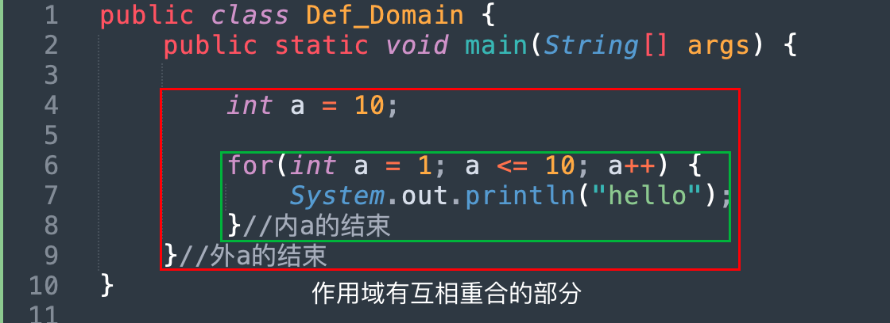

### 练习题

#### RewardXiaoMing .java
```java
import java.util.Scanner;

/*
从键盘输入小明的期末成绩。
	当成绩为100分时，奖励一辆BMW；
	当成绩为（80，99]时，奖励一个台iphone13；
	当成绩为[60,80]时，奖励一本参考书；
	其它时，什么奖励也没有。
*/

public class RewardXiaoMing {
	public static void main(String[] args) {
		Scanner sc = new Scanner(System.in);

		int score = sc.nextInt();
		if(score == 100) {
			System.out.println("奖励一台BMW");	
		}else if (score > 80 && score <= 99) {
			System.out.println("奖励一部IPHONE 13");	
		}else if(score >= 60 && score <= 80) {
			System.out.println("奖励一本参考书");	
		}else {
			System.out.println("什么奖励也没有");	
		}
	}
}
```

#### OrderThreeNum .java
>冒泡排序简单版
```java
import java.util.Scanner;

/*
由键盘输入三个整数分别存入变量num1、num2、num3，
对它们进行排序(使用 if-else if-else),并且从小到大输出。

-----------------example 1-----------------------
	num1	num2	num3
	 4	      2	 	  1
	-----第一回合的比较-----

	如果 num1 > num2 ，则交换顺序，(如果成立，交换)
	num1	num2	num3
	 2	      4	 	  1	

	如果 num2 > num3 ，则交换顺序，(如果成立，交换)
	num1	num2	num3
	 2	      1	 	  4
	 -----第二回合的比较-----
	num1	num2	num3
	 2	      1	 	  4

	如果 num1 > num2 ，则交换顺序，(如果成立，交换)
	num1	num2	num3
	 1	      2	 	  4	

	如果 num2 > num3 ，则交换顺序，（如果不成立,不交换）
	num1	num2	num3
	 1	      2	 	  4

	-----最终结果-----
	num1	num2	num3
	 1	      2	 	  4

-----------------example 2-----------------------
	 
	num1	num2	num3
	 2	      6	 	  1
	-----第一回合的比较-----

	如果 num1 > num2 ，则交换顺序，(如果不成立，不交换)
	num1	num2	num3
	 2	      6	 	  1

	如果 num2 > num3 ，则交换顺序，(如果成立，交换)
	num1	num2	num3
	 2	      1	 	  6

	 -----第二回合的比较-----

	如果 num1 > num2 ，则交换顺序，(如果成立)
	num1	num2	num3
	 1	      2	 	  6	

	如果 num2 > num3 ，则交换顺序，（如果不成立,不交换）
	num1	num2	num3
	 1	      2	 	  6

	--------最终结果---------
	num1	num2	num3
	 1	      2	 	  6
*/
public class OrderThreeNum {
	public static void main(String[] args) {
		Scanner sc = new Scanner(System.in);

		int num1 = sc.nextInt();
		int num2 = sc.nextInt();
		int num3 = sc.nextInt();
		int temp;

		for(int i = 0; i < 3; i++) {
			if(num1 > num2) {
				temp = num1;
				num1 = num2;
				num2 = temp;
			}else if(num2 > num3) {
				temp = num2;
				num2 = num3;
				num3 = temp;
			}
		}
		System.out.println("num1 = " + num1);
		System.out.println("num2 = " + num2);
		System.out.println("num3 = " + num3);
	}
}
```

#### Print_Date .java
```java
import java.util.Scanner;
/*
从键盘上输入2014年的“month”和“day”，要求通过程序输出输入的日期为2014年的第几天。
*/

public class Print_Date {
	public static void main(String[] args) {
		Scanner sc = new Scanner(System.in);
		System.out.println("请输入月份");	
		int month = sc.nextInt();
		System.out.println("请输入日期");	
		int day = sc.nextInt();
		int num;
		num = month * 30 + day;
		System.out.println("这是 2014 的第" + num + "天");	
	}
}
```
```java
import java.util.Scanner;
/*
从键盘上输入2014年的“month”和“day”，要求通过程序输出输入的日期为2014年的第几天。
*/
```

`Print_Date_Advance.java`
```java
public class Print_Date_Advance {
	public static void main(String[] args) {
		Scanner sc = new Scanner(System.in);
		System.out.println("请输入月份");	
		int month = sc.nextInt();
		System.out.println("请输入日期");	
		int day = sc.nextInt();
		
		int sum = 0;

		/*
		如果是 1 月，就可以直接 0 + day
		如果是 2 月，就可以 1 月的天数 + day
		如果是 3 月，就可以 1 2 月的天数 + day
		。。。
		如果是 11 月，就可以 1 2 3 ··· 10 月的天数 + day
		如果是 12 月，就可以 1 2 3 ··· 11月的天数 + day
		*/
		switch(month) {
			case 12:
				sum = sum + 30;//11
			case 11:
				sum = sum + 31;//10
			case 10:
				sum = sum + 30;//9
			case 9:
				sum = sum + 31;//8
			case 8:
				sum = sum + 31;//7
			case 7:
				sum = sum + 30;//6
			case 6:
				sum = sum + 31;//5
			case 5:
				sum = sum + 30;//4
			case 4:
				sum = sum + 31;//3
			case 3:
				sum = sum + 28;//2
			case 2:
				sum = sum + 31;//1
			case 1:
				sum = sum + day;//day
		}
			

		System.out.println("这是 2014 的第 " + sum + "天");	
	}
}
```
#### Print_Season .java
```java
import java.util.Scanner;
/*
根据用于指定月份，打印该月份所属的季节。3,4,5 春季 6,7,8 夏季  9,10,11 秋季 12, 1, 2 冬季
*/

public class Print_Season {
	public static void main(String[] args) {
		Scanner sc = new Scanner(System.in);

		int month = sc.nextInt();
		if(month >=3 && month <= 5) {
			System.out.println("当前是春季！");
		}else if(month >= 6 && month <= 8) {
			System.out.println("当前是夏季！");
		}else if(month >= 9 && month <= 11) {
			System.out.println("当前是秋季！");
		}else {
			System.out.println("当前是冬季！");
		}

	}
}
```

#### Rating_Score .java
```java
import java.util.Scanner;
/*
使用switch-case，对学生成绩大于60分的，输出“合格”。低于60分的，输出“不合格”	
*/

public class Rating_Score {
	public static void main(String[] args) {
		Scanner sc = new Scanner(System.in);

		int score = sc.nextInt();
		switch((score > 60)?1:0) {
			case 1:
				System.out.println("合格");
				break;
			default:
				System.out.println("不合格");
		}
	}
}
```

#### Odd_Number.java
```java
/*
1.打印1~100之间所有的奇数之和
规律：
	1.奇数不能被2整除
	2.奇数对2取模余数 = 1

思路：
	用取模运算，若这个对小于自身数取模运算且余数的结果超过 2 个，则不是质数。
	1 : 1（奇数）
	2 : 
	3 : 3 % 2 = 1（奇数）
	4 : 
	5 : 5 % 2 = 1（奇数）

*/
public class Odd_Number {
	public static void main(String[] args) {
		int sum = 0;
		for(int i = 1; i < 101; i++) {
			if(i % 2 == 1){
				//System.out.println(i);
				sum = sum + i;
			}
		}
		System.out.println("sum:" + sum);
	}
}
```
`Odd_Number2.java`
```java
public class Odd_Number2 {
	public static void main(String[] args) {
		int sum = 0;
		for(int i = 1; i < 101; i = i + 2) {
				sum = sum + i;
		}
		System.out.println("sum:" + sum);
	}
}
```

#### Prime_Number.java
```java
/*
1.打印1~100之间所有的质数
规律：
	1.质数只能被自身和1整除

思路：
	用取模运算，若这个对小于自身数取模运算且余数的结果超过 2 个，则不是质数。
	2 : 1 2(质数)
	3 : 1 3(质数)
	4 : 1 2 4
	5 : 1 5(质数)
	6 : 1 2 3 6
	7 : 1 7(质数)
*/
public class Prime_Number {
	public static void main(String[] args) {
		for(int i = 2; i < 101; i++) {
			int count = 0;
			for(int j = 1; j <= i ; j++) {
				if(i % j == 0){
					count++;
				}
			}
			if(count <=2){
				System.out.println(i);
			}
		}
	}
}
```

#### Print_MultipleSum
```java
/*
2.打印1~100之间所有是7的倍数的整数的个数及总和
规律：
	7	7 * 1
	14	7 * 2
	21	7 * 3
	...	7 * i
*/
//规律2：根据7 的倍数对 7 取余等于 0 
public class Print_MultipleSum {
	public static void main(String[] args) {
		int count = 0;
		int sum = 0;
		int i = 1;
		while(7 * i < 101) {
			count++;
			sum = sum + i * 7;
			//System.out.println(7 * i);
			i++;
		}

		System.out.println("个数：:" + count);
		System.out.println("总和:" + sum);
	}
}

```

#### Print_WaterFlower
```java
/*
输出所有的水仙花数，所谓水仙花数是指一个3位数，其各个位上数字立方和等于其本身。
   例如： 153 = 1*1*1 + 3*3*3 + 5*5*5
思路：
   1.获取三位数的输入
   2.使用除法拆开
      1)输入 / 100 ---> 百位数
      2)输入 % 100 / 10 ---> 十位数
      3)输入对10取模  ---> 个位数
   3.分别计算立方，最后求和
   4.若所求之和等于原数，则输出。
*/
public class Print_WaterFlower {
   public static void main(String[] args) {

      for(int i = 100; i <=999; i++) {

         int hundredplace = i / 100;
         int tenplace = i % 100 /10;// i /10 % 10;
         int oneplace = i % 10;
         //System.out.println(i);
         //System.out.println(" 百：" + hundredplace + " 十：" + tenplace + " 个：" + oneplace);
         
         int sum = hundredplace * hundredplace * hundredplace + tenplace * tenplace * tenplace + oneplace * oneplace * oneplace;
         if(sum == i){
            System.out.println(i);
         }
      }
   }
}
```

#### Print_LeapYear
```java
/*
已知判断闰年的规则是：
	1.能被4整除，但是不能被100整除。
	2.或者能被400整除。

打印从1900年至2050年期间所有的闰年。
*/
public class Print_LeapYear {
	public static void main(String[] args) {
		for(int year = 1900; year <= 2050; year++) {
			if(year % 4 == 0 && year % 100 != 0 || year % 400 == 0) {
				System.out.println(year);
			}
		}	
	}
}
```

#### Print_ChristmasTree .java
```java
/*
打印圣诞树
    *
   *** 
  *****
 *******
*********
规律：
    1. 第一行 1 个星花
    2. 第二行 3 个星花
    3. 第三行 5 个星花
    4. 第四行 7 个星花
    5. 星花为 奇数个。
思路1：
    1.写出生成奇数的代码
    2.打印星花，重复当前奇数的奇数次，计算需要给星花对齐的次数。
    （基于现学的知识不好实现，需要用数组存储生成的奇数，存储的奇数，就可以第二行取出第二个奇数，第三行取出第三个奇数用于生产奇数个 *。）
思路2:
    您输入的是 5 行 9 列
    第 1 行打印 0 + 1 = 1 个星花（当前所在行号+前一行号个星花），需要打印 4 个空格 1 + 4 = 5(行数 - 当前行号个空格)
    第 2 行打印 1 + 2 = 3 个星花（当前所在行号+前一行号个星花），需要打印 3 个空格 2 + 3 = 5
    第 3 行打印 2 + 4 = 5 个星花（当前所在行号+前一行号个星花），需要打印 2 个空格 3 + 2 = 5
    第 4 行打印 3 + 4 = 7 个星花（当前所在行号+前一行号个星花），需要打印 1 个空格 4 + 1 = 5
    第 5 行打印 4 + 5 = 9 个星花（当前所在行号+前一行号个星花），需要打印 0 个空格 5 + 0 = 5 
    
最优思路步骤:（拆解）
	1.写出打印根据行号打印出数的代码
		*
		**
		***
		****
		*****
	2.写出每行是奇数个星花的代码
		*
		***
		*****
		*******
	3.写出打印空格的代码

*/
public class Print_ChristmasTree {
    public static void main(String[] args) {
        int row = 5;
        //int col = 7;
 
        for(int i = 1; i <= row; i++) {
                //打印空格
                for(int k = 1; k <= row-i; k++) {
                    System.out.print(" ");
                }


                //打印星花
                for(int p = 1; p <= i + i - 1; p++) {
                    System.out.print("*");
                }
                System.out.println();
        }

    }
}
```

#### Monkey_PickPeach.java
```java
/*
有一只猴子摘了一堆桃子，每天吃掉一半桃子还不过瘾再多吃一个，
吃到第十天的时候发现还剩下一个桃子，问猴子第一天一共摘了多少个桃子

思路：
	倒着算
	day10 有 1 个桃子
	day9  有 4 个桃子 (day10桃子数 + 1) * 2    // day9 / 2 - 1 = day10 ---> day9 = (day10+1) * 2
	day8  有 10 个桃子(day9桃子数 + 1) * 2
	day8  有 22 个桃子

*/

public class Monkey_PickPeach {
	public static void main(String[] args) {
    int day = 9;
    int x2 = 1;	//基数
    while (day>0)
    {
        x2 = (x2 + 1) * 2;
        day--;
    }
	System.out.println("摘了" + x2 + "个桃子");
	}
}

//--------------------错误版本--------------------
/*
首先是 1 个桃子，试试满不满足条件
其次是 2 个桃子，试试满不满足条件
然后是 3 个桃子，试试满不满足条件
*/
// public class Monkey_PickPeach {
// 	public static void main(String[] args) {
// 		int x = 0;

// 		//生成桃子
// 		int peach = 1;
// 		while(true) {
// 			x = peach;
// 			for(int i = 1 ; i <= 10 ; i ++) {
// 				x = x - (x / 2 + 1);
// 			}
// 			if(x == 1){
// 				break;
// 			}
// 			peach++;
// 		}
// 		System.out.println("摘了" + peach + "个桃子");
// 	}
// }
```

#### BuyChicken .java
```java
/*
(百元钱买百只鸡问题）一只公鸡5元钱，一只母鸡3元钱，三只小鸡1元钱。
要求100元买100只鸡，请给出所有可行的结果？
思路：
	1.公鸡买 i 只 ，母鸡买 j 只 ， 小鸡买 k 组
	2.计算所有总额不超过100的组合(i * 5 + j * 3 + k * 1 100)
	3.从这些组合中找出鸡的总数和等于100的组合 ()
*/
public class BuyChicken {
	public static void main(String[] args) {
		int boychicken = 5;
		int girlchicken = 3;
		int littlechicken = 1;

		int money = 100;

		for(int i = 0; i <= 20; i++) {
			for(int j = 0; j <= 33; j++) {
				for(int k = 0; k <= 100; k++){
					if((boychicken * i + girlchicken * j + littlechicken * k == 100) && (i + j +  3 * k == 100)) {
						System.out.println("公鸡：" + i + " 只" + "\t" + "花费：" + boychicken * i);
						System.out.println("母鸡：" + j + " 只" + "\t" + "花费：" + girlchicken * j);
						System.out.println("小鸡：" + 3*k + " 只" + "\t" + "花费：" + littlechicken * k);
						System.out.println("---------------------");
					}
				}
			}
		}
	}
}
```

#### SameOrder .java
```java
/*
8.所谓回文数是指正着数和倒着数一样大，比如1001,5005,8228,9999。请打印出1000-9999之间所有的回文数
step1:写出一个判断是否是回文的代码。
	规律：第一位和第四位交换，第二位和第三位交换后，值不变。
	思路：使用位置互换知识点，判断互换后的顺序值是否等于原来的值。
*/
public class SameOrder {
	public static void main(String[] args) {
		//-------------------第一版-------------------
		// int num1;
		// int num2;
		// int num3;
		// int num4;
		// for(int i = 1; i < 10; i++){
		// 	for(int j = 0; j < 10; j++){
		// 		for(int k = 0; k < 10; k++){
		// 			for(int l = 1; l < 10; l++){
		// 				num1 = l;
		// 				num2 = k;
		// 				num3 = j;
		// 				num4 = i;
		// 				if(i == num1 && j == num2 && k == num3 && l == num4) {
		// 					System.out.println("" + i + j + k + l);
		// 				}
		// 			}
		// 		}
		// 	}
		// }


		//----------------除法分离数字法--------------
      	for(int i = 1000; i <=9999; i++) {
      		int num1;
      		int num2;
      		int num3;
      		int num4;
      		int kiloplace = i / 1000;
		    int hundredplace = i / 100 % 10;
		    int tenplace = i % 100 /10;
		    int oneplace = i % 10;
		    //System.out.println(i);
		    //System.out.println("千：" + kiloplace + " 百：" + hundredplace + " 十：" + tenplace + " 个：" + oneplace);
		    //判断方法1
			num1 = oneplace;
			num2 = tenplace;
			num3 = hundredplace;
			num4 = kiloplace;
			if(kiloplace == num1 && hundredplace == num2 && tenplace == num3 && oneplace == num4) {
				System.out.println("" + num1 + num2 + num3 + num4);
			}
			System.out.println("---------------------------------------------");
			//判断方法2
			if(kiloplace == oneplace && hundredplace == tenplace) {
				System.out.println("" + num1 + num2 + num3 + num4);
			}
      }

	}
}
```


更新时间：2024-01-16
## 方法
### 什么是方法
>完成特定功能的代码块。
>用于解决代码重复，臃肿的问题。

### 方法的定义和调用

```java
[修饰符] 返回值类型 方法名(参数类型参数名 1，参数类型参数名 2…) {
	函数体;
	return 返回值;
}
```

修饰符：目前统一使用 `public static`

方法名：一个名字，为了方便我们调用方法，要符合[标识符命名规范](#标识符命名规范)，见名知意

参数类型：限定调用方法时传入参数的数据类型

参数名：接收调用方法时传入的参数，要符合标[标识符命名规范](#标识符命名规范)，见名知意

方法体：完成功能的代码

return：结束方法以及返回方法指定类型的值

返回值类型：用于限定返回值的数据类型(基本/引用)。如果没有返回值，返回值类型为 `void`，此时 `return` 语句有如下两种写法：
- `return`;
- 可以不写 `return` 语句
返回值：程序被 `return` 带回的结果，返回给调用者（要和**返回值类型**兼容）

`Function_Learn.java`
```java
public class Function_Learn {

	public static int add(int a, int b) {
		return a + b;
	}

	public static void printStar(int row, int col) {
		for(int i = 1; i <= row; i++) {
			for(int j = 1; j <= col; j++){
				System.out.print("*");
			}
			System.out.println();
		}
	}

	public static void main(String[] args) {
		System.out.println(add(1,1));
		printStar(5,5);

	}
}
```

#### 方法调用流程 

`Function_Call.java`
```java
public class Function_Call {

	public static int add(int a, int b) {
		return a + b;
	}
	
	public static int add(int a, int b, int c) {
		return add(a,b) + c;
	}
	public static int add(int a, int b, int c, int d) {
		return add(a,b,c) + d;
	}
	
	public static void main(String[] args) {
		System.out.println("进入了main方法");
		System.out.println(add(1,2,3,4));
	}
}
```
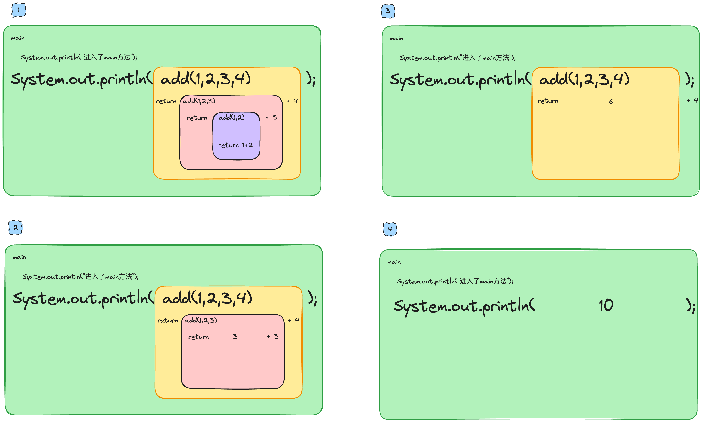
### 递归
>方法调用方法本身
>要求明确的退出条件

`FibonacciSequence.java`
斐波那契数列
```java
public class FibonacciSequence {

	public static int f(int n) {
		//明确的退出条件
		//当是如下两种情况时，都会return结束f方法。
		if( n == 1) {
			return 1;
		}
		if( n == 2) {
			return 1;
		}
		//如果不是上面的退出条件
		return f(n - 1) + f(n - 2);
		

	}

	public static void main(String[] args) {

		System.out.println(f(5));
		System.out.println(f(6));
		System.out.println(f(7));
		System.out.println(f(8));

	}
}
```


### 方法重载
>同名方法，但是 **参数个数** 或者 **参数类型** 或者 **顺序不同** 不同。
>与 **返回值类型** 、**参数名字** 无关（调用时，JVM 通过参数列表的不同来区分同名方法）

`Function_Reload.java`
```java
public class Function_Reload {

	public static int add(int a, int b) {
		return a + b;
	}
	//同名，但是参数列表的 *参数个数不同*
	public static int add(int a, int b, int c) {
		return a + b + c;
	}
	//同名，但是参数列表的 *参数类型不同*
	public static double add(int a, double b) {
		return a + b;
	}
	//同名，但是参数列表的 *参数顺序不同*
	public static double add(double a, int b) {
		return a + b;
	}

	public static void main(String[] args) {
		System.out.println(add(1,1));
		System.out.println(add(1,1,1));
		System.out.println(add(1,1.0));
		System.out.println(add(1.0,1));
		

	}
}
```

## 数组
### 什么是数组
>数组是存储 `同一种数据类型` 的 `多个元素` 的集合，也可以看成一个容器。
>便于维护多个多个相同数据类型的变量

- 可以存储[基本数据类型](#基本数据类型)，也可以存储[引用数据类型](#引用数据类型)

- 数组属于[[#引用数据类型]]，可以理解为对象（`object`），数组中的每个元素相当于该对象的成员变量。
- 数组一旦初始化，长度不可变。
- 查看数组长度：`数组名.length`

### 数组的定义
- `数据类型[] 数组名;`
- `数据类型 数组名[];`
仅定义完之后，数组中是没有元素值的。

### 数组的初始化
>数组中的数组元素分配内存，并为每个数组元素赋值

#### 动态初始化
>初始化时只指定数组长度，由**系统为数组分配初始值**

|  |  |
| ---- | ---- |
| 格式 | `数据类型[] 数组名 = new 数据类型[数组长度];` |
| 长度 | 数组的长度-1 |
| 访问数据的格式 | `数组名[下标]` |

| 数据类型 | 初始值 |
| ---- | ---- |
| byte | 0 |
| short | 0 |
| int | 0 |
| long | 0 |
| float | 0.0 |
| double | 0.0 |
| char | '\\u0000' |
| boolean | false |
| 引用数据类型 | null |

#### 静态初始化
>初始化时指定每个数组元素的初始值，**由系统决定数组长度**

格式： `数据类型[] 数组名 = new 数据类型[]{元素1,元素2,…};`

### 关于数组的报错
- 数组索引越界异常
	- `ArrayIndexOutOfBoundsExceptio`
	- 访问到了数组中的不存在的索引时发生
- 空指针异常
	- `NullPointerException`
	- 数组引用没有指向实体，却在操作实体中的元素时

## 数组的常见操作
### 数组定义和初始化

`DefAndInit.java`
```java
public class DefAndInit {  
	    public static void main(String[] args) {  
        //静态初始化，由系统分配长度  
        int[] arr1;  
        arr1 = new int[]{1, 2, 3, 4, 5};  
  
        int[] arr2 = new int[]{1, 2, 3, 4, 5};  
  
        //动态初始化，由系统自动分配初始值  
        int[] arr3;  
        arr3 = new int[5];  
  
        int[] arr4 = new int[5];  
  
    }  
}
```
### 求最值

`MaxInArray.java`
```java
public class MaxInArray {  
  
    public static void main(String[] args) {  
  
        int[] arr = {5, 8, -1, 9, 6};  
  
        /*  
        首先假定最大值为 5，  
        若 5  < 8 ，则最大值设置 8         8 > -1 ，最大值仍未 8         8 < 9 ，最大值设为9  
         9 > 6 ，最大值仍未 9         */  
        int max = arr[0];  
        for (int i = 0; i < arr.length; i++) {  
            if (max < arr[i]) {  
                max = arr[i];  
            }  
        }  
        System.out.println("max:" + max);  
  
    }  
}
```

### 数组逆序

`ReverseArray.java`
```java
import java.util.Arrays;  
  
public class ReverseArray {  
    public static void main(String[] args) {  
        int[] arr = {2, 3, 5, 0, 1};  
        int temp = 0;  
        System.out.println(Arrays.toString(arr));  
        for (int head = 0, tail = arr.length-1; head < tail; head++,tail--) {  
            temp = arr[head];  
            arr[head] = arr[tail];  
            arr[tail] = temp;  
        }  
        System.out.println(Arrays.toString(arr));  
  
    }  
}
```
### 数组元素查找

`FindInArray.java`
```java
public class FindInArray {  
    public static void find_Function1 (int n, int[] arr) {  
        for (int i = 0; i < arr.length; i++) {  
            if (n == arr[i]) {  
                System.out.println("find it at:" + i);  
                return;  
            }  
        }  
        System.out.println("Not find it");  
    }  
  
  
    public static void find_Function2 (int n, int[] arr) {  
        boolean flag = false;  
        for (int i = 0; i < arr.length; i++) {  
            if (n == arr[i]) {  
                flag = true;  
                System.out.println("find it at:" + i);  
                break;  
            }  
  
        }  
        if (flag == false) {  
            System.out.println("Not find it");  
        }  
    }  
  
    public static void main(String[] args) {  
        int[] array = {2, 3, 5, 0, 1};  
        int num = 0;  
  
        find_Function1(100, array);  
        find_Function1(1, array);  
  
        System.out.println("--------------------");  
  
        find_Function2(100, array);  
        find_Function2(1, array);  
  
    }  
}
```

### 数组拓展

```java
int[] arr1 = new int[5];  
arr1 = new int[10];
```
这并非是把 arr 1 给扩展了，而是在堆内存新开辟了一块空间，arr 1 指向了这块空间，在后文将有具体的解释[内存空间](#数组结构详解)。

`ExpandArray.java`
```java
import java.util.Arrays;  
  
public class ExpandArray {  
    //确定方法三要素：返回值类型、方法名、参数列表  
    //方法的 参数 可以是基本数据类型也可以是 引用数据类型（数组）  
    //方法的 返回值类型 可以是基本数据类型也可以是 引用数据类型（数组）  
    public static int[] expandArray(int[] oldArray) {  
        //根据 旧数组的长度，声明并且初始化一个新的数组  
        int[] newArray = new int[ oldArray.length * 2 ];  
        //遍历数组，把旧数组的值赋值给新数组  
        for (int i = 0; i < oldArray.length; i++) {  
            newArray[i] = oldArray[i];  
        }  
        return newArray;  
    }  
    public static void main(String[] args) {  
  
        int[] arr1 = new int[] {1,2,3,4};  
        //创建一个新的数组 arr2，用于指向扩容后的数组  
        int[] arr2 = expandArray(arr1);  
        System.out.println(arr2.length);  
        System.out.println(Arrays.toString(arr2));  
    }  
}
```


### 变长参数
- 使用在方法的参数列表
- 可接收多个同类型参数，个数不限
- 在方法内部使用时“要当成数组使用，本质就是数组
- 可变参数只能定义一个，并且只能在参数列表的最后

`DynamicLengthParameter.java`
```java
public class DynamicLengthParameter {  
  
    public static void printArray(int... args) {  
        for (int i = 0; i < args.length; i++) {  
            System.out.println(args[i]);  
        }  
    }  
    public static void main(String[] args) {  
        //传入一个 int类型 的数组  
        int[] arr = {2, 3, 5, 0, 1};  
        printArray(arr);  
  
        System.out.println("*****************");  
  
        //传入三个 int类型的数据，传进去本质上还是数组  
        printArray(1, 2, 3);  
    }  
}
```

### 数组遍历
- 使用普通 for 遍历
- 使用增强 for 遍历
- 使用 [Stream](javaEnhance.md#Stream) 流遍历

`DefInitAndTraverse.java`
```java
public class DefInitAndTraverse {  
      
  
    public static void main(String[] args) {  
  
        int[] a = new int[]{1, 2, 3, 4, 5};  
        //使用 for 遍历数组  
        System.out.println("使用 for 遍历数组:");  
        for (int i = 0; i < 5; i++) {  
            System.out.println(a[i]);  
        }  
        //使用 while 遍历数组  
        System.out.println("使用 while 遍历数组:");  
        int index = 0;  
        while (index < a.length) {  
            System.out.println(a[index]);  
            index++;  
        }  
        //使用 增强for 遍历数组  
        //把 a 数组中的 赋值给 i ，然后再打印出来  
        System.out.println("使用 增强for 遍历数组:");  
        for (int i : a) {  
            System.out.println(i);  
        }  
    }  
}
```

### 数组复制

`ArrayCopy.java`
```java
import java.util.Arrays;  
  
public class ArrayCopy {  
    public static void main(String[] args) {  
        int[] arr = new int[]{1, 2, 3, 4, 5};  
  
        int[] newArr1 = new int[arr.length];  
        for (int i = 0; i < arr.length; i++) {  
            newArr1[i] = arr[i];  
        }  
        System.out.println("原数组 :" + Arrays.toString(arr));  
        System.out.println("新数组 1 :" + Arrays.toString(newArr1));  
  
        //使用java提供的方法进行复制  
        int[] newArr2 = Arrays.copyOf(arr, arr.length);  
        System.out.println("新数组 2 :" + Arrays.toString(newArr2));  
  
        //使用java提供的方法进行复制，在使用方法之前，需要先自己 new 一个数组  
        int[] newArr3 = new int[arr.length];  
        //旧数组的名字，从旧数组的哪里开始复制，复制那个新数组的名字，复制到新数组的什么位置，复制多长  
        System.arraycopy(arr, 0, newArr3, 0, arr.length);  
        System.out.println("新数组 3 :" + Arrays.toString(newArr3));  
          
    }  
}
```


### 数组排序
#### 选择排序


| 待排数据 | 第一回合 |  |  |  |  |
| ---- | ---- | ---- | ---- | ---- | ---- |
| 5 |  | <font color="#ffc000">4</font> | <font color="#ffc000">3</font> | <font color="#ffc000">2</font> | <font color="#ffc000">1</font> |
| 4 |  | <font color="#ffc000">5</font> | 5 | 5 | 5 |
| 3 |  | 3 | <font color="#ffc000">4</font> | 4 | 4 |
| 2 |  | 2 | 2 | <font color="#ffc000">3</font> | 3 |
| 1 |  | 1 | 1 | 1 | <font color="#ffc000">2</font> |
|  | 第二回合 |  |  |  |  |
| 1 |  | 1 | 1 | 1 |  |
| 5 |  | <font color="#ffc000">4</font> | <font color="#ffc000">3</font> | <font color="#ffc000">2</font> |  |
| 4 |  | <font color="#ffc000">5</font> | 5 | 5 |  |
| 3 |  | 3 | <font color="#ffc000">4</font> | 4 |  |
| 2 |  | 2 | 2 | <font color="#ffc000">3</font> |  |
|  | 第三回合 |  |  |  |  |
| 1 |  | 1 | 1 |  |  |
| 2 |  | 2 | 2 |  |  |
| 5 |  | <font color="#ffc000">4</font> | <font color="#ffc000">3</font> |  |  |
| 4 |  | <font color="#ffc000">5</font> | 5 |  |  |
| 3 |  | 3 | <font color="#ffc000">4</font> |  |  |
|  | 第四回合 |  |  |  |  |
| 1 |  | 1 |  |  |  |
| 2 |  | 2 |  |  |  |
| 3 |  | 3 |  |  |  |
| 5 |  | <font color="#ffc000">4</font> |  |  |  |
| 4 |  | <font color="#ffc000">5</font> |  |  |  |
规律 1：
	第一回合拿着第 1 个数和其后 4 个数比较交换
	第二回合拿着第 2 个数和其后 3 个数比较交换
	第三回合拿着第 3 个数和其后 2 个数比较交换
	第四回合拿着第 4 个数和其后 1 个数比较交换
	

```java
1.手动写出各个回合的情况
int i = 0; //从 0 开始
for (int j = i + 1; j < arr.length; j++) {
	if (arr[i] > arr[j]) {//拿着第 1 个数和其后的数进行比较
		int temp = arr[i];
		arr[i] = arr[j];
		arr[j] = temp;
	}
}
int i = 1; //从 1 开始
for (int j = i + 1; j < arr.length; j++) {
	if (arr[i] > arr[j]) {//拿着第 2 个数和其后的数进行比较
		int temp = arr[i];
		arr[i] = arr[j];
		arr[j] = temp;
	}
}
            ...
```
规律 2：
	5 个数分别拿着前 4 个数和其后进行比较了，即从 `0` 到 `数组.length-1` 
```java
2.把重复的用循环结构实现
for(int i = 0; i < arr.length-1; i++) {
	for (int j = i + 1; j < arr.length; j++) {
		if (arr[i] > arr[j]) {
			int temp = arr[i];
			arr[i] = arr[j];
			arr[j] = temp;
		}
	}
}
```

上述方法存在的问题是<font color="#00b050">比较太多次了</font>，是个比它小的元素都要进行交换。
如果元素只需要和其后元素中最小的元素进行比较就好了。

假设一个最小值下标：`minIndex = 0`
找出 0 之后所以元素中，比 0还小的元素的下标（4次比较操作）
```
arr[0] > arr[1] --> minIndex = 1
arr[1] > arr[2] --> minIndex = 2
arr[2] > arr[3] --> minIndex = 3
arr[3] > arr[4] --> minIndex = 4
```
本来假设了一个最小下标，结果发现变了，直接和这个已经是最小值的下标进行交换。（1 次交换操作）


默认设置第一个数是最小的
第 1 个数和其后数据比较完之后，和最小的那个数交换，这样这个最小的数就<font color="#00b050">被选择</font>了出来。

| 待排数据 | 第 0 回合合 |  |  |  |  |  |
| ---- | ---- | ---- | ---- | ---- | ---- | ---- |
| 5 | 比 5 小的数的 | 4 |  |  |  | <font color="#ffc000">1</font> |
| 4 |  |  | 3 |  |  | 4 |
| 3 |  |  |  | 2 |  | 3 |
| 2 |  |  |  |  | 1 | 2 |
| 1 |  |  |  |  |  | <font color="#ffc000">5</font> |
|  | 第 1 回合合 |  |  |  |  |  |
| 1 |  |  |  |  | 1 |  |
| 4 | 比 4 小的数 | 3 |  |  | <font color="#ffc000">2</font> |  |
| 3 |  |  | 2 |  | 3 |  |
| 2 |  |  |  |  | <font color="#ffc000">4</font> |  |
| 5 |  |  |  |  | 5 |  |
|  | 第 2 回合合 |  |  |  |  |  |
| 1 |  |  |  |  |  |  |
| 2 |  |  |  |  |  |  |
| 3 | 比 3 小的数 | 无 |  |  |  |  |
| 4 |  |  |  |  |  |  |
| 5 |  |  |  |  |  |  |
|  | 第 3 回合合 |  |  |  |  |  |
| 1 |  |  |  |  |  |  |
| 2 |  |  |  |  |  |  |
| 3 | 比 4 小的数4 | 无 |  |  |  |  |
| 4 |  |  |  |  |  |  |
| 5 |  |  |  |  |  |  |


`SelectionSorting.java`
```java
import java.util.Arrays;  
  
//从小到大排序  
public class SelectionSorting {  
  
    public static void selectionSorting1(int[] arr) {  
        for (int i = 0; i < arr.length - 1; i++) {  
            System.out.println("当前是第 "+ i + "回合");  
            for (int j = i + 1; j < arr.length; j++) {  
                if (arr[i] > arr[j]) {  
                    System.out.println("交换了一次");  
                    int temp = arr[i];  
                    arr[i] = arr[j];  
                    arr[j] = temp;  
                }  
            }  
        }  
        return;  
    }  
  
  
    public static void selectionSorting2(int[] arr) {  
  
        for (int i = 0; i < arr.length - 1; i++) {  
            System.out.println("当前是第 "+ i + "回合");  
            int minIndex = i;   //假设当前下标为最小元素  
            //从 i 的后面找 比 maxIndex 还小的 元素的下标  
            for (int j = i + 1; j < arr.length; j++) {  
                if (arr[minIndex] > arr[j]) {  
                    minIndex = j;  
                }  
            }  
  
            if (minIndex != i) {  
                System.out.println("交换了一次");  
                int temp = arr[i];  
                arr[i] = arr[minIndex];  
                arr[minIndex] = temp;  
            }  
        }  
        return;  
    }  
    public static void main (String[] args){  
        int[] array = new int[]{5, 4, 3, 2, 1};  
        int[] array2 = new int[]{5, 4, 3, 2, 1};  
        selectionSorting1(array);  
        System.out.println(Arrays.toString(array));  
        System.out.println("--------进阶版--------");  
        selectionSorting2(array2);  
        System.out.println(Arrays.toString(array2));  
    }  
}
```
```shell
当前是第 0回合
交换了一次
交换了一次
交换了一次
交换了一次
当前是第 1回合
交换了一次
交换了一次
交换了一次
当前是第 2回合
交换了一次
交换了一次
当前是第 3回合
交换了一次
[1, 2, 3, 4, 5]
--------进阶版--------
当前是第 0回合
交换了一次
当前是第 1回合
交换了一次
当前是第 2回合
当前是第 3回合
[1, 2, 3, 4, 5]
```
如上运行结果所示，时间复杂度有所降低。
#### 冒泡排序

过程分析：

| 待排数据 | 第 0 回合合 |  |  |  |  |
| ---- | ---- | ---- | ---- | ---- | ---- |
| 5 |  | <font color="#ffc000">4</font> | 4 | 4 | 4 |
| 4 |  | <font color="#ffc000">5</font> | <font color="#ffc000">3</font> | 3 | 3 |
| 3 |  | 3 | <font color="#ffc000">5</font> | <font color="#ffc000">2</font> | 2 |
| 2 |  | 2 | 2 | <font color="#ffc000">5</font> | <font color="#ffc000">1</font> |
| 1 |  | 1 | 1 | 1 | <u><font color="#ffc000">5</font></u> |
|  | 第 1 回合合 |  |  |  |  |
| 4 |  | <font color="#ffc000">3</font> | 3 | 3 |  |
| 3 |  | <font color="#ffc000">4</font> | <font color="#ffc000">2</font> | 2 |  |
| 2 |  | 2 | <font color="#ffc000">4</font> | <font color="#ffc000">1</font> |  |
| 1 |  | 1 | 1 | <u><font color="#ffc000">4</font></u> |  |
| 5 |  | 5 | 5 | 5 |  |
|  | 第 2 回合合 |  |  |  |  |
| 3 |  | <font color="#ffc000">2</font> | 2 |  |  |
| 2 |  | <font color="#ffc000">3</font> | <font color="#ffc000">1</font> |  |  |
| 1 |  | 1 | <u><font color="#ffc000">3</font></u> |  |  |
| **4** |  | 4 | 4 |  |  |
| 5 |  | 5 | 5 |  |  |
|  | 第 3 回合合 |  |  |  |  |
| 2 |  | <font color="#ffc000">1</font> |  |  |  |
| 1 |  | <u><font color="#ffc000">2</font></u> |  |  |  |
| **3** |  | 3 |  |  |  |
| 4 |  | 4 |  |  |  |
| 5 |  | 5 |  |  |  |


`BubbleUpSorting.java`
```java
import java.util.Arrays;  
  
public class BubbleUpSorting {  
  
    //初级版 冒泡排序：  
    public static void bubbleUpsSort1 (int[] arr) {  
        System.out.println("---------------初级版冒泡排序----------------");  
        for (int i = 0; i < arr.length - 1; i++) {  
            System.out.println("当前进行的是第：" + i + "轮");  
            for (int j = 0; j < arr.length - 1; j++) {//第 0 轮，参与的数据5个数，第 1 轮，5个数，第 2 轮，5 个数，第 3 轮，5个数  
                if (arr[j] > arr[j+1]) {  
                    System.out.println("交换了一次");  
                    int temp = arr[j];  
                    arr[j] = arr[j+1];  
                    arr[j+1] = temp;  
                }  
            }  
            System.out.println("**********************************");  
        }  
        return;  
    }  
    /*  
     * 仍然存在的问题：  
     *  进行第 0 轮排序后，已经冒出来一个最大的数沉底了，第二轮没有再考虑这个数的必要了，也就少考虑了 1 个数  
     *  进行第 1 轮排序后，又又冒出来一个最大的数沉底了，第三轮没有再考虑这个数的必要了，也就少考虑了 2 个数  
     *  。。。。。  
     * */  
    //优化版 冒泡排序：  
    public static void bubbleUpsSort2 (int[] arr) {  
        System.out.println("---------------优化版冒泡排序----------------");  
        for (int i = 0; i < arr.length - 1; i++) {  
            System.out.println("当前进行的是第：" + i + "轮");  
            for (int j = 0; j < arr.length - 1 - i; j++) {// *** 第 0 轮，5个数，第 1 轮，4个数，第 2 轮，3 个数，第 3 轮，2个数  
                if (arr[j] > arr[j+1]) {  
                    System.out.println("交换了一次");  
                    int temp = arr[j];  
                    arr[j] = arr[j+1];  
                    arr[j+1] = temp;  
                }  
            }  
            System.out.println("**********************************");  
        }  
        return;  
    }  
    /*  
    * 仍然存在的问题：若果给定数组为排好序的数组，它仍然要进行四轮，其实一轮都不用。  
    * */  
    /*更进一步版 冒泡排序：  
        假设一开始就是排好序的数组，但是如何判断它是不是真的排好序了呢？        如果这个数组一旦进入了某两个数要交换的阶段，说明本来就是没有排序好序的。  
     */  
    public static void bubbleUpsSort3 (int[] arr) {  
        System.out.println("---------------更近一步冒泡排序----------------");  
        for (int i = 0; i < arr.length - 1; i++) {//开始第 i 轮  
            boolean flag = true;//每开始第 i 轮前，都假定为排序好的。   ***
            System.out.println("当前进行的是第：" + i + "轮");  
            for (int j = 0; j < arr.length - 1 - i; j++) {  
                if (arr[j] > arr[j+1]) {  
                    System.out.println("交换了一次");  
                    flag = false;   //出现交换的情况，就判定为这一轮的数据没有排序好，进行第一轮的判断和交换流程。  
                    int temp = arr[j];  
                    arr[j] = arr[j+1];  
                    arr[j+1] = temp;  
                }  
            }  
            if (flag == true) {//如果第一轮  
                break;  
            }  
            System.out.println("**********************************");  
        }  
        return;  
    }  
  
    public static void main(String[] args) {  
  
        int[] array = new int[] {5, 4, 3, 2, 1};  
        bubbleUpsSort1(array);  
        System.out.println(Arrays.toString(array));  
  
        System.out.println();  
        System.out.println();  
  
        int[] array2 = new int[] {5, 4, 3, 2, 1};  
        bubbleUpsSort2(array2);  
        System.out.println(Arrays.toString(array2));  
  
        System.out.println();  
        System.out.println();  
  
        int[] array3 = new int[] {1, 2, 3, 4, 5};//已经从小到大排序好的数组  
        bubbleUpsSort3(array3);  
        System.out.println(Arrays.toString(array3));  
  
    }  
}
```


## 二维数组
>数组中包含数组，其本质仍为一维数组

### 定义/初始化/遍历
- 二维数组的每一行的长度可以不一样
`TwoDimensionalArray.java`
```java
public class TwoDimensionalArray {  
    public static void main(String[] args) {  
  
        //动态初始化，由系统分配默认值  
        int[][] arr1 = new int[3][5];  
        for (int i = 0; i < arr1.length; i++) {  
            for (int j = 0; j < arr1[i].length; j++) {  
                System.out.print(arr1[i][j] + "\t");  
            }  
            System.out.println();  
        }  
  
        System.out.println("---------------------");  
  
        //静态初始化，由系统分配长度  
        int[][] arr2 = new int[][]{{1, 2, 3, 4, 5},{6, 7, 8, 9, 0},{11, 12, 13}};  
        for (int i = 0; i < arr2.length; i++) {  
            for (int j = 0; j < arr2[i].length; j++) {  
                System.out.print(arr2[i][j] + "\t");  
            }  
            System.out.println();  
        }  
  
        System.out.println("---------增强for---------");  
        //使用增强 for 遍历  
        for (int[] item : arr2) {  
            for (int i = 0; i < item.length; i++) {  
                System.out.print(item[i] + "\t");  
            }  
            System.out.println();  
        }  
    }  
}
```

### 杨辉三角


规律：
	1.每一行的最后一个数字是 1，第一行的第一个数字是 1(行数 = 列数的时候，所以元素 = 1)
	2.中间的数是上一行的值 + 上一行的前一个值
	3.有三个初始值 1 1 1
	4.列数 = 行数 + 1
`YangHuiRectangle.java`
 ```java
public class YangHuiRectangle {  
    public static void main(String[] args) {  
        int[][] arr = new int[10][];  
            for (int i = 0; i < arr.length; i++) {//行  
                arr[i] = new int[i+1];//动态的根据行号生成列数  
                for (int j = 0; j < arr[i].length; j++) {//给列赋值  
                    if (j == 0 || j == arr[i].length - 1) {//如果行数 = 列数，即前两行的情况，都给赋值 1                        
	                    arr[i][j] = 1;  
                    }else {  
                        arr[i][j] = arr[i - 1][j] + arr[i - 1][j - 1];  
                    }  
                }  
            }  
            for (int i = 0; i < arr.length; i++){  
                for (int j = 0; j < arr[i].length; j++) {  
                    System.out.print(arr[i][j] + "\t");  
                }  
                System.out.println();  
            }  
    }  
}
```


## 数组结构详解

在 **[Java 语言](https://haicoder.net/java/java-development.html)** 中，虚拟机的内存空间分为堆内存空间和栈内存空间。Java 的数组就需要用到这两个空间，我们定义的数组的名字，它是保存在 Java 栈上面，然后记录的数据指向堆里面具体数据的地址。
参考：[javaRAM](javaRAM.md)
### 堆栈内存解释

数组的操作中，在栈内存中保存的永远是数组的名称，只开辟了栈内存空间的数组是永远没有办法被使用的，必须有指向的堆堆内存数组才可以被使用，要开辟新的堆内存，需要使用 new 关键字。然后就可以将此堆堆使用权交给栈。一个堆内存空间可以被多个栈内存空间同时指向。

生活中的场景就是一个人，它可以有多个名字，而名字我们可以理解为栈，而人就相当于一个堆。


### 一维数组堆栈例子 1

```java
package com.haicoder.net.array;
public class ArrayTest {     
	public static void main(String[] args) {
		int[] scores = null; //定义一个数组         
		scores = new int[3]; //为每个数组分配内存空间    
	} 
}
```

具体的内存分配图如下：


我们可以看到，`scores` 这个名词指向了堆里面的一块内存空间，它被分了三个连续的空间，里面的值都是 `0` ，因为我们定义了 `int` 类型的数组，并且给它分配了空间，而 `int` 类型的默认值是 `0` ，所以我们刚初始化的时候，数组就是这样的分配模型。

在后面对数组进行操作的时候，其实是对堆里面的数据进行操作。

原文链接：
[Java数组内存分配](https://haicoder.net/java/java-array-memory.html)

### 一维数组堆栈例子 2

```java
public class StackAndHeap {  
    public static void main(String[] args) {  
        //定义数组，使用动态初始化  
        //现在 arr1 是指向堆内存中一块都是存着 0 的区域  
        int[] arr1 = new int[5];  
  
        //遍历数组  
        for (int index = 0; index < arr1.length; index++) {  
            System.out.println(arr1[index]);  
        }  
  
        //给 arr1 的第二个位置赋一个值  
        arr1[1] = 10;  
  
        //遍历数组 arr1        System.out.println("**** 赋值arr1 10之后，arr1 的遍历结果：****");  
        for (int index = 0; index < arr1.length; index++) {  
            System.out.println(arr1[index]);  
        }  
  
        //定义数组，使用动态初始化  
        //现在 arr2 是指向堆内存中一块都是存着 0 的区域  
        int [] arr2 = new int[5];  
  
        //把数组 arr1 的指向堆内存首地址赋值给 arr2        //现在 arr2 和 arr1 一样，同样指向堆内存中某一处位置  
        arr2 = arr1;  
  
        //遍历数组 arr2        //打印结果应该是和 arr1 一样的  
        System.out.println("**** arr2 的遍历结果：****");  
        for (int index = 0; index < arr2.length; index++) {  
            System.out.println(arr2[index]);  
        }  
  
        //给  arr2 指向数组的第二个位置赋值 100        //因为 arr2 指向的和 arr1 是堆空间中的同一个用来存储数组的区域  
        //所以修改 arr2之后，遍历 arr1 也会看到修改的结果  
        arr2[1] = 100;  
  
        //遍历数组 arr1        System.out.println("**** 赋值arr2 100之后，arr1 的遍历结果：****");  
        for (int index = 0; index < arr1.length; index++) {  
            System.out.println(arr1[index]);  
        }  
  
        //使得 arr1 arr2 都指向 空，之后会由java垃圾回收机制回收  
        arr1 = null;  
        arr2 = null;  
  
    }  
}
```

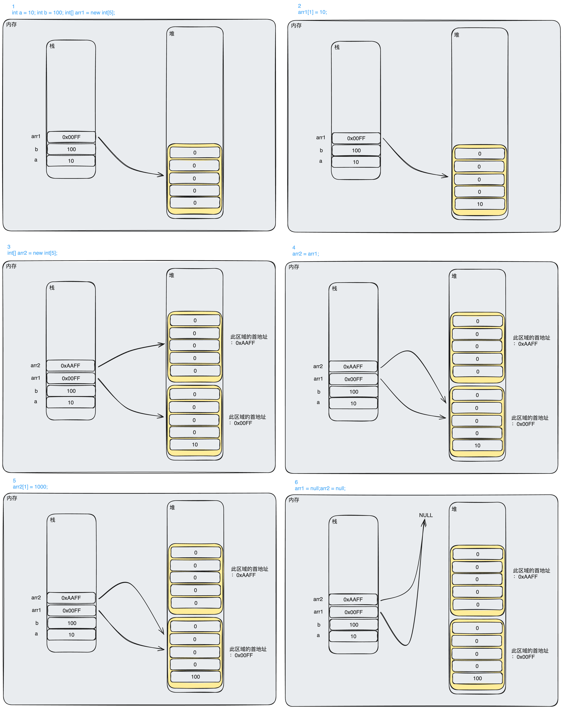

### 二维数组堆栈例子详解

```java
public class TwoDimensionalArray {  
    public static void main(String[] args) {  
		int a = 10;
		int b = 100;
        //动态初始化，由系统分配默认值  
        int[][] arr1 = new int[3][5];  
        for (int i = 0; i < arr1.length; i++) {  
            for (int j = 0; j < arr1[i].length; j++) {  
                System.out.print(arr1[i][j] + "\t");  
            }  
            System.out.println();  
        }  
  
        System.out.println("---------------------");  
  
        //静态初始化，由系统分配长度  
        int[][] arr2 = new int[][]{{1, 2, 3, 4, 5},{6, 7, 8, 9, 0},{11, 12, 13}};  
        for (int i = 0; i < arr2.length; i++) {  
            for (int j = 0; j < arr2[i].length; j++) {  
                System.out.print(arr2[i][j] + "\t");  
            }  
            System.out.println();  
        }  
  
        System.out.println("---------增强for---------");  
        //使用增强 for 遍历  
        for (int[] item : arr2) {  
            for (int i = 0; i < item.length; i++) {  
                System.out.print(item[i] + "\t");  
            }  
            System.out.println();  
        }  
    }  
}
```
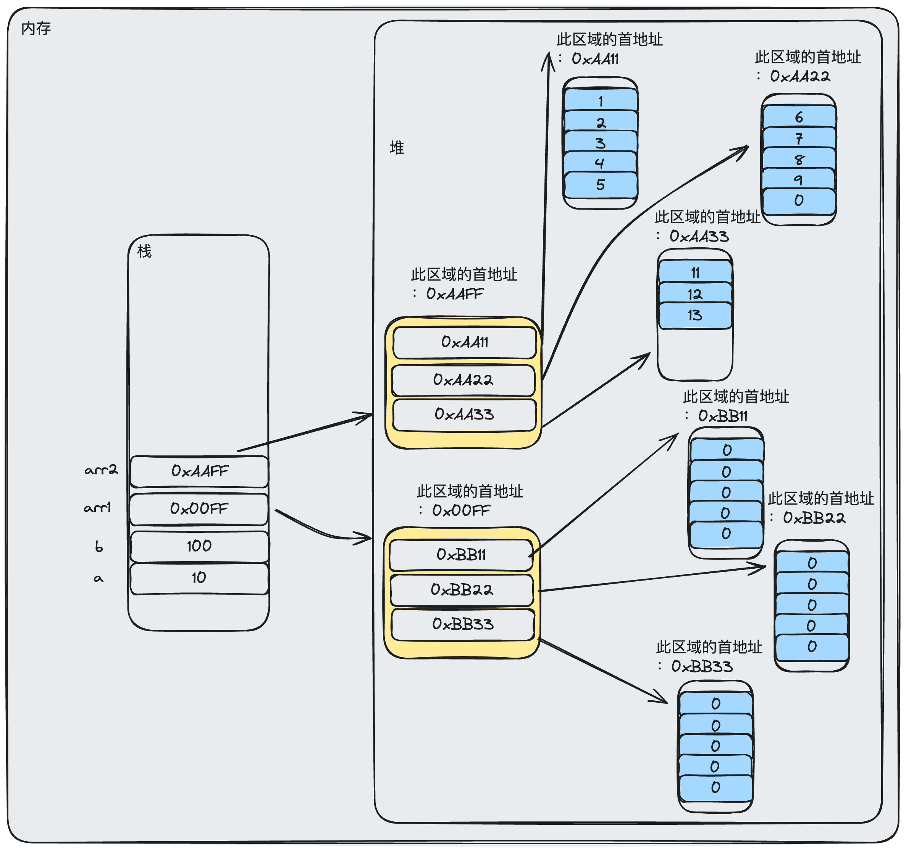

## 面向对象
### 面向对象编程的步骤
- 根据需求设计类
- 根据需求创建类

### 类
#### 什么是类
>类是一种自定义类型,对一类事物的描述。

通俗的可以理解为类就是一种模板，我们使用模板来做出有相似属性的具体的物。
形形色色的那么多人，但是不管是啥人，它们都有共同的特性，比如都有 <font color="#de7802">名字</font>，<font color="#de7802">性别</font> 的属性，都能做 <font color="#de7802">跑</font>，<font color="#de7802">吃</font> 的动作。
再比如我们北方过节经常吃的鱼馒头：

之前大家都是手工制作，一个一个捏太麻烦，于是就有人做出了模子，

现在每逢想吃，就拿着模子一卡一个，一卡一个。这个模子就是所谓的<font color="#de7802">类</font>。


#### 为什么要有类
>基本数据类型难以描述复杂的事物，例如人。

强行使用基本数据类型描述，会导致代码冗余和修改维护困难

#### 类和对象的关系
>类是对象的模板

### 对象
#### 什么是对象
>对象是现实存在的事物，比如：实实在在的能开的 BMW 汽车，实实在在的一个人，实实在在的一个能吃的鱼馒头。
#### 对象和类的关系
>对象是通过模板做出来的东西。对象就是类的一个具体的实例。


### 类的组成和创建类
```java
[修饰符] class 类名 {
    属性
    [构造方法]
    方法    
}
```

 **修饰符**：可以省略，目前我们暂时填写 `public`；
 
 **类名**：要符合[标识符命名规范](#标识符命名规范)。
 
 **属性**描述了**类**描述的事物所具有的特性，代表**有什么**。

 **方法**描述了**类**描述的事物所具有的动作，代表**能做什么**。
 
#### 属性
> `[修饰符] 数据类型属性名 [= 初始值];`

修饰符：可以省略，目前我们暂时填写 `public`；

数据类型：任意的数据类型，可以是基本数据类型也可以是引用数据类型；

属性名：属性的名字，要符合[[#标识符命名规范 ]]；

初始值：在设计类时，可以为属性指定初始值，也可以不指定初始值，如果不指定，那么属性有默认的初始值。

属性有时也被称为：成员变量，数据成员。

#### 方法

```java
[修饰符] 返回值类型 方法名(参数类型 参数名1，参数类型 参数名2…) {
    方法体;
    return 返回值;
}
```
修饰符：比较多，后面会详细介绍。目前我们暂时填写 `public`；

方法名：一个名字，为了方便我们调用方法，要符合标识符的命名规范，见名知意；

参数类型：限定调用方法时传入参数的数据类型；

参数名：接收调用方法时传入的参数，要符合标识符的命名规范，见名知意；

方法体：完成功能的代码；

return：结束方法以及返回方法指定类型的值；

返回值类型：用于限定返回值的数据类型。如果没有返回值，返回值类型为 `void`，此时 `return` 语句有如下两种写法：

return;
可以不写 return 语句
返回值，程序被 return 带回的结果，返回给调用者。

`Student.java`
```java 
public class Student {  
  
    public String name;  
    public int age;  
    public String gender;  
    public int height;  
    public int weight;  
  
    public void eat() {  
        System.out.println("Eating...");  
    }  
    //方法重载
    public void eat(String food) {  
        System.out.println("Eating" + food);  
    }  
  
}
```
`StudentTest.java`
```java
public class StudentTest {  
    public static void main(String[] args) {  
        Student stu = new Student();  
        stu.name = "wangwenpeng";  
        System.out.println(stu.name);  
        stu.eat();  
        stu.eat("bread");  
		//创建多个对象
        Student stu1 = new Student();  
        Student stu2 = new Student();  
        Student stu3 = new Student();  
  
        stu1.name = "zhangsan";  
        stu1.name = "lizi";  
        stu1.age = 20;  
  
        System.out.println("stu的名字:" + stu.name);  
        System.out.println("stu1的名字:" + stu1.name);  
        System.out.println("stu2的名字:" + stu2.name);  
        System.out.println("stu3的名字:" + stu3.name);  
  
        System.out.println("stu的年龄:" + stu.age);  
        System.out.println("stu1的年龄:" + stu1.age);  
        System.out.println("stu2的年龄:" + stu2.age);  
        System.out.println("stu2的年龄:" + stu3.age);  
  
    }  
}
```
当没有给对象的属性赋予初始值时，系统会自动分配属性的默认值

| 数据类型 | 初始值 |
| ---- | ---- |
| int | 0 |
| byte | 0 |
| short | 0 |
| long | 0 |
| float | 0 |
| double | 0.0 |
| char | \\u0000 |
| boolean | false |
| 引用数据类型 | null |
### 类和对象结构详解

`ObjectInStackAndHeap.java`
```java
public class ObjectInStackAndHeap {  
    public static void main(String[] args) {  
        int a = 10;  
        int b = 100;  
  
        Student stu1 = new Student();  
        stu1.name = "WangWenpeng";  
  
        Student stu2 = new Student();  
        stu2.name = "Lisi";  
  
        Student stu3 = new Student();  
        stu3.name = "WangWu";  
  
        stu1 = stu2;  
        stu1.name = "鹏";  
  
        System.out.println("stu1的名字：" + stu1.name);  
        System.out.println("stu2的名字：" + stu2.name);  
        System.out.println("stu3的名字：" + stu3.name);  
  
        //让对象名指向 null，待垃圾回收来回收它们  
        stu1 = null;  
        stu2 = null;  
        stu3 = null;  
  
  
    }  
}
```
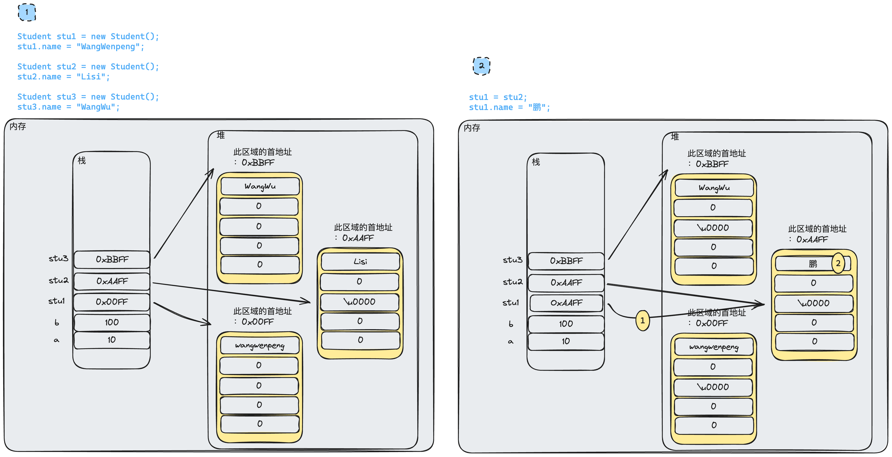

### 值传递和引用传递
传值和传引用区别
值传递：当基本类型作为參数传入方法时，无论该参数（原型变量的一个值得拷贝）在方法内怎样被改变，外部的变量原型总是不变的。
引用传递：当引用作为参数传入方法时，通过引用在方法内部修改引用关联的数据，数据本身会被修改。
`ValueAndQuoteDeliver.java`
```java
import java.util.Arrays;  
  
public class ValueAndQuoteDeliver {  
  
    public static void test(int number) {  
        number = 100;  
    }  
  
    public static void test(Demo d) {//d = 地址  
        d.x = 100;//地址.x 操作到 x 属性，给属性赋值 100    }  
  
  
    public static void sort(int[] arr) {  
        for (int i = 0; i < arr.length - 1; i++) {  
            boolean flag = true;  
            for (int j = 0; j < arr.length - 1 - i; j++) {  
                if(arr[j] > arr[j+1]) {  
                    flag = false;  
                    int temp = arr[j];  
                    arr[j] = temp;  
                    arr[j+1] = temp;  
                }  
            }  
            if (flag == true) {  
                break;  
            }  
        }  
    }  
  
    public static void test(int[] arr) {  
        for (int i : arr) {  
            i = 100;  
        }  
    }  
  
    public static void main(String[] args) {  
  
        int[] num = new int[]{9, 8, 7, 6, 5};//创建一个新数组  
  
        test(num);//注意，此方法是把arr中的元素赋值给了 i，然后又对 i 进行的操作，和原数组无关。所以 arr 值不变。  
  
        System.out.println(Arrays.toString(num));//打印结果不变  
        int m = 10;//创建一个 int 类型变量  
        test(m);//传到参数那里之后，相当于做了这么一个曹走：int number = 10，此时在这个方法里面都是对作用域是这个函数范围的 number 变量操作，和外边的 m 无关。  
        System.out.println("m=" + m);//10  
        Demo a = new Demo();//new 一个对象，a是引用，存储着的是一个指向 堆空间的地址。  
        a.x = 10;//给那个堆空间中的 x 属性赋值为10  
        test(a);//传进去 一个引用（地址）  
        System.out.println("a.x=" + a.x);//地址.属性  
    }  
}  
  
class Demo {  
    public int x;  
}
```

### 类的访问机制

### 成员变量和局部变量

|  | 成员变量 | 局部变量 |
| ---- | ---- | ---- |
| 定义位置 | 类的内部，方法的外部 | <font color="#de7802">方法</font>或<font color="#de7802">方法内的代码块</font>中 |
| 默认值 | 有默认值，和数组元素默认值相同 | 没有默认值 |
| 生命周期 | 成员变量随着对象的创建而产生，随着对象的消失而消失 | 局部变量随着区域的执行而存在，随着区域的结束而释放 |
| 使用范围 | 成员变量定义在类中，整个类中都可以使用 | 局部变量定义在方法代码块中，只在所属的区域有效 |

### 构造方法
*更新时间：2024-01-21 21:14:03*
#### 什么是构造方法
>在类进行创建对象时，给对象初始化一些属性值的时候用的。

#### 构造方法的特点
- 方法名与类名相同；
- 不用定义返回值类型；
- 没有具体的返回值。
#### 构造方法相关细节
- 不管有没有显式定义构造方法，创建对象都必须要通过构造方法初始化；
- 一个类中如果没有定义过构造方法，那么该类中会有一个默认的空参数构造方法；
- 如果在类中定义了有参的构造方法，那么类中的默认构造方法会<font color="#de7802">被覆盖</font>，如果此时需要使用无参的构造方法，则要手动定义；
- 构造方法可以有多个，用于对不同的对象进行针对性的初始化；多个构造方法在类中是以重载的形式来体现的。
- 
`Person.java`
```java
public class Person {  
    String name;  
    int age;  
    String gender;  
  
  
    public Person() {//无参的构造方法  

    }  
  
    public Person(String name, int age, String gender) {//全参的构造方法  
        this.name = name;
        this.age = age;        
        this.gender = gender;  
    }  
  
    public String getName() {  
        return name;  
    }  
  
    public void setName(String name) {  
        this.name = name;  
    }  
  
    public int getAge() {  
        return age;  
    }  
  
    public void setAge(int age) {  
        this.age = age;  
    }  
  
    public String getGender() {  
        return gender;  
    }  
  
    public void setGender(String gender) {  
        this.gender = gender;  
    }  
}
```

### this关键字
#### 表示当前对象
```java
public class PersonThis {  
    String name;  
    int age;  
    String gender;  
  
  
    public PersonThis(String name,int age) {//无参的构造方法  
        this.name = name;  //属性和参数的名字重来，需要用this来表示这是当前调用对象的属性，并非是参数。
        this.age = age;  
    }  
}
```

#### 表示构造方法
`PersonThis.java`
```java
public class PersonThis {  
    String name;  
    int age;  
    String gender;  
  
  
    public PersonThis(String name,int age) {
        this.name = name;  
        this.age = age;  
    }  
  
    public PersonThis(String name, int age, String gender) {//全参的构造方法  
        this(name,age);//调用其他的构造函数 ***        
        this.gender = gender;  
    }  
  
    public String getName() {  
        return name;  
    }  
  
    public void setName(String name) {  
        this.name = name;  
    }  
  
    public int getAge() {  
        return age;  
    }  
  
    public void setAge(int age) {  
        this.age = age;  
    }  
  
    public String getGender() {  
        return gender;  
    }  
  
    public void setGender(String gender) {  
        this.gender = gender;  
    }  
}
```
`TestThis.java`
```java
public class TestThis {  
    public static void main(String[] args) {  
        PersonThis pt = new PersonThis("王文鹏",24,"男");  
        System.out.println(pt.getName());  
        System.out.println(pt.getAge());  
        System.out.println(pt.getGender());  
    }  
}
```
```shell
王文鹏
24
男

进程已结束，退出代码为 0
```
## 面向对象的三大特性
### 封装
#### 为什么要封装 ？
>在对象外部为对象属性赋值`对象名.属性名`，可能存在非法输入对问题。

#### 什么是封装
>隐藏对象的内部实现细节，控制对象的修改及访问的权限。
>隐藏该隐藏的，暴露该暴露的。

#### 如何实现封装
将属性使用访问修饰符 `private` 进行修饰，被 `private` 修饰后，属性仅在本类可见。

提供公共的方法（被 `public` 修饰）`getXXX` 和 `setXXX` 实现对该属性的操作。idea 中可是使用右键菜单进行快速生成。

在公共的访问方法内部，添加逻辑判断，进而过滤掉非法数据，以保证数据安全（可选的）。


#### 通讯录综合练习题
##### 什么是对象数组
`ObjectArray.java`
```java
public class ObjectArray {  
    String name;  
    int age;  
    String gender;  
}
```
`ObjectArrayTest.java`
```java
public class ObjectArrayTest {  
    public static void main(String[] args) {  
        ObjectArray[] oa = new ObjectArray[2];  
        System.out.println(oa[0]);  
        oa[0] = new ObjectArray();  
        oa[1] = new ObjectArray();  
        for (int i = 0; i < oa.length; i++) {  
            System.out.println(oa[i].name);  
            System.out.println(oa[i].age);  
            System.out.println(oa[i].gender);  
        }  
    }  
}
```
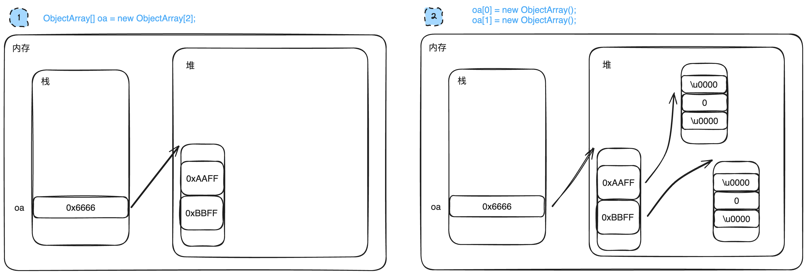
##### 示例
*更新时间：2024-01-19 10点39分13 秒*
`Ex_TelephoneBook_Info.java`
```java
public class Ex_TelephoneBook_Info {  
    private String name;  
    private String sex;  
    private int age;  
    private String tel;  
    private String qq;  
    private String address;  
  
    public Ex_TelephoneBook_Info() {  
    }  
  
    public Ex_TelephoneBook_Info(String name, String sex, int age, String tel, String qq, String address) {  
        this.name = name;  
        this.sex = sex;  
        this.age = age;  
        this.tel = tel;  
        this.qq = qq;  
        this.address = address;  
    }  
  
  
    //重写String方法，这样println时就是以键值对形式，打印出对象全属性  
    @Override  
    public String toString() {  
        return "Ex_TelephoneBook{" +  
                "name='" + name + '\'' +  
                ", sex='" + sex + '\'' +  
                ", age=" + age +  
                ", tel='" + tel + '\'' +  
                ", qq='" + qq + '\'' +  
                ", address='" + address + '\'' +  
                '}';  
    }  
  
    public String getName() {  
        return name;  
    }  
  
    public void setName(String name) {  
        this.name = name;  
    }  
  
    public String getSex() {  
        return sex;  
    }  
  
    public void setSex(String sex) {  
        this.sex = sex;  
    }  
  
    public int getAge() {  
        return age;  
    }  
  
    public void setAge(int age) {  
        this.age = age;  
    }  
  
    public String getTel() {  
        return tel;  
    }  
  
    public void setTel(String tel) {  
        this.tel = tel;  
    }  
  
    public String getQq() {  
        return qq;  
    }  
  
    public void setQq(String qq) {  
        this.qq = qq;  
    }  
  
    public String getAddress() {  
        return address;  
    }  
  
    public void setAddress(String address) {  
        this.address = address;  
    }  
}
```
`Ex_TelephoneBook_UI.java`
```java
import java.util.Scanner;  
  
public class Ex_TelephoneBook_UI {  
  
    //打印UI界面  
    public static void menu() {  
        System.out.println("--------------通讯录管理系统-----------");  
        System.out.println("1.添加" + "\t" + "2.删除" + "\t" + "3.修改" + "\t" + "4.查询所有" + "\t" + "5.根据姓名查询" + "\t" + "0.退出");  
        System.out.println("--------------通讯录管理系统-----------");  
        System.out.print("请选择业务:");  
    }  
  
  
    public static void main(String[] args) {  
        Scanner sc = new Scanner(System.in);  
  
        //生成了一个管理类，其中包括用于存储 Ex_TelephoneBook_Info 类型的 数组  
        Ex_TelephoneBook_Manage manage = new Ex_TelephoneBook_Manage();  
  
  
        while (true) {  
            menu();//打印UI界面  
            int num = sc.nextInt(); //录入用户操作数  
            switch (num) {  
                case 0://退出  
                    System.exit(0);  
                case 1://添加  
                    System.out.println("***添加通讯录***");  
  
                    System.out.print("请输入姓名：");  
                    String nameAdd = sc.next();  
  
                    if (manage.searchByName(nameAdd) != null) {//判断是否有重名的,有的化直接跳出switch，进行下一次循环  
                        System.out.println("系统中存在重名用户，无法添加...");  
                        break;  
                    }  
                    //无重名，进入后续信息的录入  
                    System.out.print("请输入性别：");  
                    String sexAdd = sc.next();  
                    System.out.print("请输入年龄：");  
                    int ageAdd = sc.nextInt();  
                    System.out.print("请输入电话：");  
                    String telAdd = sc.next();  
                    System.out.print("请输入QQ：");  
                    String qqAdd = sc.next();  
                    System.out.print("请输入地址：");  
                    String addressAdd = sc.next();  
  
                    //把所以用户输入数据，存入到一个新的 Ex_TelephoneBook_Info 的对象中  
                    //itemAdd中实际存着的是地址，这个地址指向刚刚开辟的一块堆空间，空间中包含上述信息  
                    Ex_TelephoneBook_Info itemAdd = new Ex_TelephoneBook_Info(nameAdd,sexAdd,ageAdd,telAdd,qqAdd,addressAdd);  
  
                    Boolean flag;//设置标识位，用于判断是否添加成功  
                    flag = manage.add(itemAdd);//把地址传给 add方法  
                    if (flag == true){  
                        System.out.println("添加成功");  
                    }else {  
                        System.out.println("添加失败");  
                    }  
                    break;  
                case 2://删除  
                    System.out.print("请输入要删除的姓名：");  
                    String nameDel = sc.next();  
  
                    if (manage.searchByName(nameDel) == null) {//判断数组中是否存在要删除的名字的对象  
                        System.out.println("系统中不存在要删除的用户，无法删除...");//系统中没有这个用户，何来删除  
                        break;  
                    }  
                    //系统中有要删除名字的对象  
                    System.out.println("请问确定删除吗？y:确定 n:取消");  
                    String confirm = sc.next();  
                    if (confirm.equalsIgnoreCase("y")) {  
                        Boolean flag2;//设置标识位，用于判断是否添加成功  
                        flag2 = manage.del(nameDel);//执行删除方法，并且返回布尔值  
                        if (flag2 == true) {//判断是否删删除成功  
                            System.out.println("删除成功！");  
                        }  
                    }else {  
                        System.out.println("取消删除！");  
                    }  
                    break;  
                case 3://修改  
                    System.out.println("修改信息");  
                    System.out.print("请输入要修改的旧姓名：");  
                    String nameOld = sc.next();  
  
                    Ex_TelephoneBook_Info oldItem = manage.searchByName(nameOld);//根据旧姓名查询系统中是否有此人  
                    if (oldItem == null){  
                        System.out.println("无信息");  
                        break;  
                    } else {  
                        System.out.println(oldItem);  
                    }  
  
                    /*  
                    需改数据之前，进行校验，要求修改的新名字不能和现存的信息重复  
  
                    查询要修改的新名字在当前系统中是否存在（你不能改成系统中存在的名字）                        不存在，允许修改（数组中没有叫这个名的，可以直接修改）                        存在 则需要进一步判断（有可能录入的新名字还是旧名字，所以判重了。也有可能新名字确实是和其他名字冲突了。）  
                            nameNew可能是和nameOld重复的，自己改的新名字还是自己名字，是被允许的；  
                            nameNew是数组中对象中已经存在的一个名字，则不允许被修改。  
                     */  
                    //根据旧姓名可以在系统中查询到此人，进行要修改信息的录入  
                    System.out.print("请输入新姓名：");  
                    String nameNew = sc.next();  
  
                    //根据新姓名判断重名情况  
                    //写出不允许修改的情况，其他情况都是允许的情况  
                    Ex_TelephoneBook_Info newItem = manage.searchByName(nameNew);//查询系统中是否存在 nameNew                    //如果查到了，进一步判断（&&右边之后的内容） 是不是自己新名字重名自己，如果不是，那就是重名别人了，不允许修改  
                    if (newItem != null && newItem != oldItem ) {  
                        System.out.println("修改之后的名字和系统中现存用户重名，不允许修改");  
                        break;  
                    }  
  
                    System.out.print("请输入性别：");  
                    String sexNew = sc.next();  
                    System.out.print("请输入年龄：");  
                    int ageNew = sc.nextInt();  
                    System.out.print("请输入电话：");  
                    String telNew = sc.next();  
                    System.out.print("请输入QQ：");  
                    String qqNew = sc.next();  
                    System.out.print("请输入地址：");  
                    String addressNew = sc.next();  
  
                    //创建一个对象，用于更新信息  
                    Ex_TelephoneBook_Info chgInfo = new Ex_TelephoneBook_Info(nameNew,sexNew,ageNew,telNew,qqNew,addressNew);  
  
  
  
                    manage.chg(nameOld,chgInfo);//调用修改方法  
                    System.out.println("修改成功！");  
                    break;  
                case 4://查询所由数据  
                    Ex_TelephoneBook_Info[] allInfo = manage.listAll();//调用管理类对象 manage下的 listAll()方法,返回了数据库（数组）  
                    for (int i = 0; i < allInfo.length; i++) { //  遍历数组中的内容  
                        if (allInfo[i] != null) {//把数组中非空的位置打印出来  
                            System.out.println(allInfo[i]);  
                        }  
                    }  
                    break;  
                case 5://根据姓名查询  
                    String nameSearch = sc.next();  
  
                    Ex_TelephoneBook_Info searchInfo = manage.searchByName(nameSearch);  
                    //判断  
                    if (searchInfo == null) {  
                        System.out.println("查询失败");  
                    }else {  
                        System.out.println("查询成功");  
                        System.out.println(searchInfo);  
                    }  
                    break;  
                default:  
                    System.out.print("请根据提示选择:");  
            }  
        }  
    }  
}
```
`Ex_TelephoneBook_Manage.java`
```java
public class Ex_TelephoneBook_Manage {  
  
    //创建了一个数组，包有 5 个位置可以存储 Ex_TelephoneBook_Info 的对象  
    private Ex_TelephoneBook_Info[] database = new Ex_TelephoneBook_Info[5];  
  
    //增  
    public  boolean add(Ex_TelephoneBook_Info itemAdd_M) {//从外边传进来一个地址，进到这个方法里就由 itemAdd_M 存储了  
        for (int i = 0; i < database.length; i++) {    //遍历数组  
            if (database[i] == null) {  //如果有空的位置，  
                database[i] = itemAdd_M;//把 itemAdd_M 所指向的地址给 database[i] 存储  
                return true; //  返回值  
            }  
        }  
        return false;  
    }  
    //删  
    public boolean del(String nameDel) {  
        for (int i = 0; i < database.length; i++) {  
            if (this.database[i] != null && this.database[i].getName().equals(nameDel)) {//遍历数组中有对象的位置，依次和 要删除的名字 比对  
                database[i] = null;//匹配成功，数组中这个位置本来存储的是指向堆空间中某个存储区域的，现在改成 null，取消这个位置和对空间对应位置的关联 = 删除  
                return true;  
            }  
        }  
        return false;  
    }  
  
    //改  
    //修改是否成功 boolean类型，方法名，要修改的旧的名字，新的信息  
    //从外边传进来要就修改的那个旧名字，和一个包含更新信息的地址  
    public boolean chg(String nameOld_M, Ex_TelephoneBook_Info chgInfo_M) {  
        for (int i = 0; i < database.length; i++) {//遍历数组  
            if (this.database[i] != null && database[i].getName().equals(nameOld_M)) {//如果能在数组中找到就旧名字  
                database[i] = chgInfo_M;//修改旧名字指向的对象，指向了堆空间中新的包含更新信息的新区域。  
                return true;  
            }  
        }  
        return false;  
    }  
  
    //查询所有  
    public Ex_TelephoneBook_Info[] listAll() {  
        return this.database;  
    }  
  
    //根据姓名查询  
    //三要素：返回值类型 名字 参数  
    //查询成功返回一个含有特定姓名的那个对象，searchByName，需要查询的姓名  
    public Ex_TelephoneBook_Info searchByName(String nameSearch_M) {  
        for (int i = 0; i < database.length; i++) {//遍历数组  
            //数组中 null的位置（没有存储对象的位置） 再getname()的话就会出现空指针异常报错  
            //找到数组中存着对象的位置，依次和其中的名字进行比较  
            if (this.database[i] != null && this.database[i].getName().equals(nameSearch_M)) {  
                return database[i];//存在名字一样的情况，说明查找成功，返回这个对象  
            }  
        }  
        return null;  
    }  
  
}
```

### 继承
*更新时间：2024-01-19 17点55分23秒*
#### 为什么要有继承？
>类之间可能会有很多重复的属性和方法，为了减少冗余，遍于维护。

#### 什么是继承？
>类和类之间的一种关系。
>从父类的角度：父类不能满足要求，使用子类进行拓展，以遍满足特殊场景。
>
从子类的角度：从各种子类中抽取出来的共同的属性和方法，写成一个新的类

两个类之间的继承关系必须满足 `is a` 的关系。如果不是，即使有公共代码也不能使用继承

例如:

`student is a person`

`teacher is a person`

它们不但有公共的代码（属性 `name` `age` 等，方法吃喝拉撒等）,而且都是 `person`

`cat` 也有 `name` `age`，吃喝拉撒等和 person 相同的属性方法，但是不满足 `cat is a person` 关系，所以 `cat`  不能继承 `person`。

一个直接父类，多个间接父类。所有类的父类是 `Object`（直接或间接）

#### 如何实现继承

```java
//继承语法
class 子类名 extends 父类 { //定义子类时，指定其父类
    //属性
    //构造方法
    //方法
}
```

`Person.java`
父类：定义公共的内容
```java
public class Person {  
    private String name;  
  
    private int age;  
  
    private String sex;  
  
    private String address;  
  
    public String getName() {  
        return name;  
    }  
  
    public void setName(String name) {  
        this.name = name;  
    }  
  
    public int getAge() {  
        return age;  
    }  
  
    public void setAge(int age) {  
        this.age = age;  
    }  
  
    public String getSex() {  
        return sex;  
    }  
  
    public void setSex(String sex) {  
        this.sex = sex;  
    }  
  
    public String getAddress() {  
        return address;  
    }  
  
    public void setAddress(String address) {  
        this.address = address;  
    }  
}
```

`Student.java`
继承父类的子类：定义特有的内容

产生继承关系之后，子类可以使用父类中的属性和方法，也可以定义子类独有的属性和方法。
```java
public class Student extends Person{  
    //特有的属性  
    private String class_grade;  
  
    //特有的方法  
    public void study() {  
        System.out.println("学习");  
    }  
  
    //get and set  
    public String getClass_grade() {  
        return class_grade;  
    }  
  
    public void setClass_grade(String class_grade) {  
        this.class_grade = class_grade;  
    }  
}
```

`Teacher.java`
继承父类的子类：定义特有的内容

产生继承关系之后，子类可以使用父类中的属性和方法，也可以定义子类独有的属性和方法。
```java
public class Teacher extends Person{
    //特有的属性(教书科目)
    private String subject;

    //特有的方法
    public void teach() {
        System.out.println("教书...");
    }

    //get and set

    public String getSubject() {
        return subject;
    }

    public void setSubject(String subject) {
        this.subject = subject;
    }
}

```

`Test1.java`
测试类
```java  
public class Test1 {  
    public static void main(String[] args) {  
        Student stu = new Student();  
        stu.setName("王文鹏");//使用从父类继承过来的方法对继承过来的私有属性进行赋值  
        System.out.println(stu.getName());  
  
        stu.setClass_grade("Java班");//使用子类具有的方法对私有属性进行赋值  
        System.out.println(stu.getClass_grade());  
    }  
}
```

>	A subclass inherits all the members (fields, methods, and nested classes) from its superclass. Constructors are not members, so they are not inherited by subclasses, but the constructor of the superclass can be invoked from the subclass.   \[子类从其父类继承所有成员（字段，方法和嵌套类）。构造函数不是成员，所以它们不被子类继承，但是可以从子类调用超类的构造函数。\]  


#### 访问控制符

|  | 本类 | 同包 | 非同包子类 | 其他 |
| ---- | ---- | ---- | ---- | ---- |
| `private` | ✔ | ✘ | ✘ | ✘ |
| `default` | ✔ | ✔ | ✘ | ✘ |
| `protected` | ✔ | ✔ | ✔ | ✘ |
| `public` | ✔ | ✔ | ✔ | ✔ |

* 成员（属性/方法）被不同的访问控制修饰符修饰，外界的访问权限是不同的
- 三个修饰符 `private` `protected` `public`
- 四个级别 `private` `default` `protected` `public` --- 什么都不写就是 `default` 级别
	- 最严格 - `private`
		- `private` 修饰的属性和方法，只能在本类中访问
	- `default` - 不写访问控制修饰符
		- 被 `default` 修饰的属性和方法，可以在同一个包下访问，不同的包下不能访问
	- `protected`
		- 被 `protected` 修饰的属性和方法，只要是子类都可以访问
	- `public`


#### 方法重写
##### 为什么要方法重写
> 父类的方法无法满足子类的需求，需要在子类中进行扩展。
##### 为什么不直接修改父类中的方法
>一个父类可能有多个子类，可能只是对其中某几个子类来说不合适，只需要更改不合适的，更该父类可能影响其他原本就合适的子类。

##### 如何进行方法重写
- 发生在在父类和子类之间
- 子类重写父类的方法，且重写的方法的三要素（返回值类型、方法名、参数列表）要和重写的父类方法一致。
- 访问修饰符可与父类相同或是比父类<font color="#de7802">更宽泛</font>。
- 按需重写你想重写的方法，不需要重写所有的方法。

 方法的重写（`override`）两同两小一大原则：
- 方法名相同，参数列表相同
- 子类返回类型小于等于父类方法返回类型
	- 如果父类方法返回值是基本数据类型，那么子类重写方法和父类的被重写方法必须相同(即三要素相同)
- 子类抛出异常小于等于父类方法抛出异常
- 子类访问权限大于等于父类方法访问权限

##### 重写方法的调用
- 如果通过子类对象调用重写的方法，会优先调用子类自己重写的方法，如果子类没有，就调用父类的方法。
- 如果通过父类调用方法（这个方法被子类重写过），此时调用的是父类的方法
- 在有重写的情况下，自己调用自己的方法，如果自己没有，就调用父类的。
##### 建议
>只要重写方法，就在重写的方法上添加注解：`@Override`

idea 中可以直接 `option + enter` 生成。(windows `alt + enter`)
`Person.java` 
```java
public class Person {  
    private String name;  
    private int age;  
  
    public void study() {  
        System.out.println("学习");  
    }  
}
```
`Student.java`
```java
public class Student extends Person{  
    @Override  
    public void study() {  
        System.out.println("学生在学习");  
    }  
}
```
`Test.java`
```java
public class Test {  
    public static void main(String[] args) {  
        Student stu = new Student();  
        stu.study();  
    }  
}
```
```shell
学生在学习

进程已结束，退出代码为 0
```

#### super 关键字
##### 代表父类的对象
>在子类中，可直接访问从父类继承到的属性和方法，但如果父子类的属性或方法存在重名（属性遮蔽、方法重写）时，需要加以区分，才可访问到父类中的属性或方法

`super.父类属性名` 
`super.父类方法名`

##### 代表父类的构造方法
- `super()` 表示<font color="#de7802">父类默认的构造方法</font>
- `super(参数列表)` 表示<font color="#de7802">父类有参的构造方法</font>
- `super` 代表父类的构造方法必须写在<font color="#de7802">子类构造方法的第一行</font>
- 如果在子类中没有通过 `super` 显式的调用父类的构造方法，则表示调用父类默认的构造方法
- 如果子类构造方法中没有调用父类构造方法，那么子类构造方法首行就默认是 `super()`
- 如果子类构造方法中调用了 `this()` 或 `this(参数)`，那么在这个子类构造方法中就不可以再调用`super()`或者`super(参数)`
	- 为什么？`this()` 或 `this(参数)` 结合第 4 点会默认调用父类的构造方法，如果再调用 `super()` 或者 `super(参数)` 就会创建多个父类对象（使用 `this()` 时，其中就包含了默认的 `super()` 构造方法了,再用一次就重复了。）

`PersonSuper.java`
```java
public class PersonSuper {  
    private String name;  
    private int age;  
    private String gender;  
    public PersonSuper(){  
  
    }  
    public PersonSuper(String name, int age, String gender) {  
        this.name = name;  
        this.age = age;  
        this.gender = gender;  
    }  
  
    public String getName() {  
        return name;  
    }  
  
    public void setName(String name) {  
        this.name = name;  
    }  
  
    public int getAge() {  
        return age;  
    }  
  
    public void setAge(int age) {  
        this.age = age;  
    }  
  
    public String getGender() {  
        return gender;  
    }  
  
    public void setGender(String gender) {  
        this.gender = gender;  
    }  
}
```
`StudentSuper.java`
```java
public class StudentSuper extends PersonSuper {  
    private String cls;  
  
    public StudentSuper() {  
  
    }  
    public StudentSuper(String name, int age, String gender, String cls) {  
        super(name, age, gender);  // ***
        this.cls = cls;  
    }  
  
    public String getCls() {  
        return cls;  
    }  
  
    public void setCls(String cls) {  
        this.cls = cls;  
    }  
}
```
`TestSuper.java`
```java
public class TestSuper {  
    public static void main(String[] args) {  
        StudentSuper ss = new StudentSuper("王文鹏",24,"男","JAVA");  
        System.out.println(ss.getName());  
        System.out.println(ss.getAge());  
        System.out.println(ss.getGender());  
        System.out.println(ss.getCls());  
    }  
}
```
##### 继承中对象的创建
- 先创建父类对象，再创建子类对象
* 先初始化属性，再调用构造方法

### 多态
#### 什么是多态
>编译时和运行时呈现出不同的状态。

#### 怎么实现类的多态？
> 子类对象赋值给父类引用/父类引用指向子类对象
> 
> `Person p = new Student();`
> 
> 从左边看就是一个引用 p 指向了子类对象，从右边看，就是子类对象赋值给了引用 p

对比链接：[怎么实现接口的多态](#怎么实现接口的多态)

`Animal.java`
```java
public class Animal {  
    public void eat() {  
        System.out.println("eating");  
    }  
    public void sleep() {  
        System.out.println("sleeping");  
    }  
    public void run() {  
        System.out.println("running");  
    }  
}
```
`Dog.java`
```java
public class Dog extends Animal{  
    @Override  
    public void eat() {  
        System.out.println("小狗吃骨头");  
    }  
    public void bark() {  
        System.out.println("小狗汪汪汪");  
    }  
}
```
`Cat.java`
```java
public class Cat extends Animal {  
    @Override  
    public void eat() {  
        System.out.println("小猫吃鱼");  
    }  
    @Override  
    public void run() {  
        System.out.println("小猫快跑～");  
    }  
    public void catchFish() {  
        System.out.println("小猫捉鱼");  
    }  
}
```
`Test.java`
```java
public class Test {  
    public static void main(String[] args) {  
        Cat cat = new Cat();  
        Dog dog = new Dog();  
        cat.catchFish();  
        dog.bark();  
  
        System.out.println("----------------------");  
        //可以调用Animal中有的 eat/sleep/run方法  
        Animal a1 = new Dog();  
        a1.eat();//实际调用的是 dog 的 eat 方法  
        a1.sleep();  //这是dog中继承过来的
        a1.run();  //这是dog中继承过来的
        //a1.bark;不能调用  
  
		//可以调用Animal中有的 eat/sleep/run方法  
        Animal a2 = new Cat();  
        a2.eat();//实际调用的是 Cat 的 eat 方法  
        a2.sleep();  //这是dog中继承过来的
        a2.run();//实际调用的是 Cat 的 run 方法  
        //a2.catFish();不能调用  
    }  
}
```
```shell
小猫捉鱼
小狗汪汪汪
----------------------
小狗吃骨头
sleeping
running
小猫吃鱼
sleeping
小猫快跑～

```
让我来试着解释一下什么是多态，试着回想我们刚开始学[面向对象](#面向对象)的时候，写的最多的一行代码 `Student stu = new Student();` 然后我们就可以调用 `Student` 类型有的那些方法了，对吧。比如 `stu.study()`，不管你再 `new` 一个 `Student` 类型的 `stu1` 还是 `stu100` ，调用 `study()` 时的结果都是一样的。

但是让我们现在回到多态 `Animal a1 = new Dog(); ` `a1.eat();` 结果是 <font color="#de7802">小狗吃骨头</font>。 ` Animal a2 = new Cat();  ` `a2.eat();` 结果是 <font color="#de7802">小猫吃鱼</font> 。你看，我们明明是创建的都是 `Animal` 类型的对象，调用相同的方法却展现出不同的状态，我想这就是多态的吧。

编译时（写程序时），看左边，左侧是什么类型，就能调用什么样的方法；  
运行时（点击运行代码时），看右边，右侧是什么类型，运行时就是调用什么样的方法。  
  
编译时，看左边，编译器只知道a1是Animal类型，因此只能调用Animal类中定义的方法（eat，sleep，run）。若 `a1.bark()`，编译不通过，因为编译器认为的Animal类型的a1中没有。

运行时，看右边，a1实际是一个Dog对象，所以调用a1.eat()时，会执行Dog类中的eat方法，而不是Animal类中的eat方法。这就是多态的表现。(Dog 的重写后的 eat,从父类继承过来的 sleep 和 run)。


#### 多态的用处
 - 父类作为<font color="#de7802">方法的参数</font>，实现多态 -- 方法的参数可以兼容所有的子类对象
 - 父类作为<font color="#de7802">方法的返回值类型</font>，实现多态
 
父类作为方法的参数时，简化一些代码，去冗余，便维护的例子：
`Master.java`
```java
public class Master {  
    public void feed(Dog d) {  
        d.eat();  
    }  
    public void feed(Cat c) {  
        c.eat();  
    }  
}
```
主人这个类可以有喂动物的动作，一个两个动物还好，但是如果好多好多呢，那就要写大量相似的方法来实现了。但是现在可以使用多态来简化：
`Master.java`
```java
public class Master {  
    public void feed(Animal a) {  
       a.eat();  
    }  
}
```
无论你是传一只 `Dog`，还是一只 `Cat`，都可以喂到它 ❤️❤️❤️
`Test.java`
```java
public class Test {  
    public static void main(String[] args) {  
        Animal a1 = new Dog();  
        Animal a2 = new Cat();  
  
        Master m = new Master();  
        m.feed(a1);  
        m.feed(a2);  
    }  
}
```
```shell
小狗吃骨头
小猫吃鱼

进程已结束，退出代码为 0
```
分析一下以上两个代码的过程：
还记得 `Student stu = new Student();` 这个 `stu` 是什么吗？它叫<font color="#de7802">引用</font>，存储的是一个<font color="#de7802">首地址</font>哦。ok 让我们继续。

- `Animal a1 = new Dog();` 。 `a1` 中现在存储着一个指向 Dog 类型的堆空间的首地址。
- `m.feed(a1);`。 把这个首地址传入方法。
- `public void feed(Animal a) { a.eat() }`。相当于 `a = a1` 这和 `Animal a = new Dog()` 本质上是一样的。都是把 a 指向了一块 Dog 类型的堆空间。所以都能实现多态。

父类作为返回值类型的例子：
```java
public Animal send (String name) {
	switch (name) {
	case "dog":
		return new Dog();
	case "cat":
		return new Cat();
	}
```

#### 向上转型
>子类引用的对象转换为父类类型称为<font color="#de7802">向上转型。</font>

`MyTest6.java`
```java
public class MyTest6 {
    public static void main(String[] args) {
        //子类对象的多态性---子类对象赋值给父类引用---父类引用指向子类对象
        Animal d = new Dog();
        d.eat();
    }
}
```


#### 向下转型
>父类引用的对象转换为子类类型称为<font color="#de7802">向下转型</font>。

注意：只有转换回子类真实类型，才可调用<font color="#de7802">子类独有的属性和方法</font>。

向下转型时，如果父类引用中的子类对象类型和目标类型不匹配，则会发生类型转换异常(`ClassCastException`)。

通常向下转型前，应判断引用中的对象真实类型，保证类型转换的正确性。

语法：`父类引用 instanceof 类型`
`Master.java`
```java
public class Master {
    public void feed(Animal a) {
        if(a instanceof Dog) {
            Dog d = (Dog)a;
             d.eat();
        } else if(a instanceof Cat) {
            Cat c = (Cat)a;
            c.eat();
        }
    }
}
```
## 三个修饰符
<font color=#646a73>*更新时间：2024-01-23 10点19分32秒*</font>
### abstract
#### 为什么有抽象类？
>并不是所有的类都需要被创建，但是它需要被设计。

例如 `Animal` 类，真是的世界中没有 `Animal` 这种动物，它仅仅是作为父类用于创建一些子类用的，例如创建 `Cat` `Dog` 

`Animal.java`
```java
public abstract class Animal {  
    private String name;  
    private int age;  
    private String gender;  
    public Animal() {  
  
    }  
    public Animal(String name, int age, String gender) {  
        this.name = name;  
        this.age = age;  
        this.gender = gender;  
    }  
    public void eat() {  
        System.out.println("eating");  
    }  
    public void sleep() {  
        System.out.println("sleeping");  
    }  
    public void run() {  
        System.out.println("running");  
    }  
  
    public String getName() {  
        return name;  
    }  
  
    public void setName(String name) {  
        this.name = name;  
    }  
  
    public int getAge() {  
        return age;  
    }  
  
    public void setAge(int age) {  
        this.age = age;  
    }  
  
    public String getGender() {  
        return gender;  
    }  
  
    public void setGender(String gender) {  
        this.gender = gender;  
    }  
}
```
`Dog.java`
```java
public class Dog extends Animal {  
    public Dog() {  
    }  
  
    public Dog(String name, int age, String gender) {  
        super(name, age, gender);  
    }  
  
    public void eat() {  
        System.out.println("dog eating");  
    }  
    public void sleep() {  
        System.out.println("dog sleeping");  
    }  
    public void run() {  
        System.out.println("dog running");  
    }  
    public void bark() {  
        System.out.println("dog wang wang~");  
    }  
}
```
`Cat.java`
```java
public class Cat extends Animal {  
    public Cat() {  
    }  
  
    public Cat(String name, int age, String gender) {  
        super(name, age, gender);  
    }  
  
    public void eat() {  
        System.out.println("cat eating");  
    }  
    public void sleep() {  
        System.out.println("cat sleeping");  
    }  
    public void run() {  
        System.out.println("cat running");  
    }  
    public void catchFish() {  
        System.out.println("cat catchFish~");  
    }  
}
```
#### 抽象方法
##### 为什么有抽象方法 ？
>需要定义，但是不需要方法体的方法。

例如 `Animal` 这个类需要定义，但是没必要实现方法体，因为各式各样的子类的吃喝跑都不一样，  
创建子类时都会重写这些方法，那么原本父类中实现的方法就显得没有意义了。

##### 如何定义抽象方法？
- 使用关键字 `abstract`
- 抽象方法没有方法体，例如 `public abstract void example();` 


- 抽象方法只可以被public 和 protected修饰；


`Animal.java`
```java
public abstract class Animal {  
    private String name;  
    private int age;  
    private String gender;  
    public Animal() {  
  
    }  
    public Animal(String name, int age, String gender) {  
        this.name = name;  
        this.age = age;  
        this.gender = gender;  
    }  
    /*  
    Animal这个类需要定义，但是没必要要实现方法体，因为各式各样的子类的吃喝跑都不一样，  
    创建子类时都会重写这些方法，那么原本父类中实现的方法就显得没有意义了。  
     */    
    public abstract void eat();  
    public abstract void sleep();  
    public abstract void run();  
  
    public String getName() {  
        return name;  
    }  
  
    public void setName(String name) {  
        this.name = name;  
    }  
  
    public int getAge() {  
        return age;  
    }  
  
    public void setAge(int age) {  
        this.age = age;  
    }  
  
    public String getGender() {  
        return gender;  
    }  
  
    public void setGender(String gender) {  
        this.gender = gender;  
    }  
}
```
##### 抽象方法和抽象类的关系
- 有抽象方法的类<font color="#de7802">一定</font>是抽象类
- 抽象类中<font color="#de7802">不一定</font>要有抽象方法
- 如果一个类继承了抽象类，那么就要<font color="#de7802">重写所有的</font>抽象方法。
	- 如果子类没有重写所有的抽象方法，那么子类也要定义为抽象类。


### static
- 可以修饰<font color="#de7802">属性</font>和<font color="#de7802">方法</font>
#### 静态属性
- 被 `static` 修饰的属性<font color="#de7802">在内存中只有一份</font>。
- 被 `static` 修饰的属性或方法的访问：
	- `类名.成员` 
	- `对象名.成员`
- 如果修改了被 `static` 修饰的属性的值，那么所有对象都会观察到。

`Student.java`
```java
public class Student {  
    public String name;  
    public int age;  
    public String gender;  
    public static String country = "中国";  
}
```
`Test.java`
```java
public class Test {  
    public static void main(String[] args) {  
        Student stu1 = new Student();  
        stu1.name = "王文鹏";  
        
        System.out.println(stu1.name);  
        System.out.println(stu1.country);// idea不建议这样使用  
        System.out.println(Student.country);//建议的用法  
        
        Student stu2 = new Student();  
        stu1.name = "李四";  
        stu1.country = "China MainLand";  
  
        System.out.println(stu1.country);  
        System.out.println(stu2.country);  
        System.out.println(Student.country);  
  
    }  
  
}
```
```shell

王文鹏
中国
中国
China MainLand
China MainLand
China MainLand

进程已结束，退出代码为 0
```
从内存空间中理解：
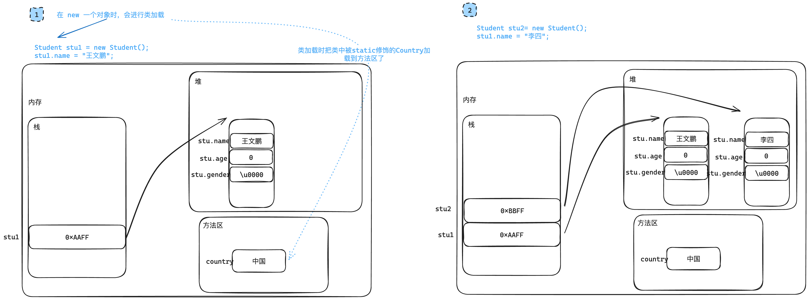
#### 静态方法
##### 什么是静态方法？
>使用 `static` 修饰的方法。

##### 如何调用静态方法
- `类名.成员`
- `对象名.成员`
##### 细节
- `static` 修饰方法可以访问当前类被 `static` 修饰的属性，不能直接访问当前类的实例属性
- `static` 能直接访问 `static` 的属性/方法。
	- 之前写过的 `static`：`main` 方法中的 `static`，这样 `static` 就可以直接访问其他的 `static` 了。之前刚开始写方法的时候都加了 `static`，这样就能直接在 `main` 方法中访问我们写过的方法了，要不然我们还要先 `new` 一个类才能使用方法，增加了我们学习方法时的步骤。
- `static` 修饰的方法不能出现 `this` 和 `super` 关键字。`static` 是在类加载时就在内存中加载好了，这时候还没对象什么事，是调用不到对象的属性/方法的。

`Myclass.java` `Test.java`
```java
public class Myclass {  
    public int a;//实例属性  
    public static int b ;//static 属性  
    public static void testStaticFunc() {  
        System.out.println("i am Static Function");  
    }  
}
public class Test {  
    public static void main(String[] args) {  
        Myclass.testStaticFunc();//通过类名调用  
  
        Myclass mc = new Myclass();  
        mc.testStaticFunc();//通过对象调用  
  
    }  
}
```

#### 动态/静态代码块
##### 动态代码块
>和<font color="#de7802">属性</font>、<font color="#de7802">方法</font>、<font color="#de7802">构造方法</font>平级
```java
class 类名 {
    {
    	//动态代码块
    }
}
```
- 创建对象时被调用，<font color="#de7802">创建一次，调用一次</font>
- <font color="#de7802">动态代码块</font>执行和<font color="#de7802">实例属性</font>初始化<font color="#de7802">优先于构造方法</font>执行
- <font color="#de7802">动态代码块</font>执行和<font color="#de7802">实例属性</font>初始化的顺序由代码<font color="#de7802">编写的顺序决定</font>，写在前面的先运行。
- 应用：可为实例属性赋值，或必要的初始行为。
`.java`
```java
public class X {  
    public X() {  
        System.out.println("实例属性");  
    }  
}
public class Y {  
    private X x = new X(); //实例属性  
    //动态代码块  
    {  
        System.out.println("动态代码块");  
    }  
    public Y() {  
        System.out.println("构造方法");  
    }  
}
public class Test {  
    public static void main(String[] args) {  
        Y y1 = new Y();  
        System.out.println("-------------");  
        Y y2 = new Y();  
    }  
}
```

##### 类加载
>JVM 首次使用某个类时，查找到该类的`.class` 文件，将`.class` 文件中对类的描述信息（如：包名、类名、父类、属性、方法、构造方法）加载到内存中，进行保存。

类加载时机：
- 创建对象；
- 创建子类对象；
- 访问静态属性；
- 调用静态方法；
- 主动加载：`Class.forName("全类名")`

##### 静态代码块
```java
class 类名 {
 static {
     //静态代码块
 }
}
```
<font color="#de7802">类加载</font>时，触发静态代码块的执行（仅一次）。

**执行时机**：
- <font color="#de7802">静态代码块</font>和<font color="#de7802">静态属性</font>的初始化顺序，由在类中书写的<font color="#de7802">顺序决定</font>；
- 静态代码块和属性的初始化<font color="#de7802">先于构造方法</font>执行。

**作用**：可为静态属性赋值，或必要的初始行为。

#### 对象创建过程
```java
public class X {  
    public X() {  
        System.out.println("实例属性初始化");  
    }  
}
```
```java
public class Y {  
    public Y() {  
        System.out.println("静态属性初始化");  
    }  
}
```
```java
public class XY {  
    private X x = new X();  //***********************
  
    private static Y y = new Y();  
  
    {  //****************************
        System.out.println("动态代码块");  
    }  
  
    static {  
        System.out.println("静态代码块");  
    }  
    public XY() {  
        System.out.println("TestXY的构造方法");  
    }  
}
```
```java
public class TestXY {  
    public static void main(String[] args) {  
        XY xy = new XY();  
    }  
}
```
```shell
静态属性初始化
静态代码块
实例属性初始化
动态代码块
TestXY的构造方法

进程已结束，退出代码为 0
```
将星花处<font color="#de7802">实例属性</font>和<font color="#de7802">动态代码块</font>调换位置后：
```shell
静态属性初始化
静态代码块
动态代码块
实例属性初始化
TestXY的构造方法

进程已结束，退出代码为 0
```
简单来说，被 `static` 修饰的按照前后顺序执行，然后时<font color="#de7802">动态代码块</font>和<font color="#de7802">实例属性</font>按照前后位置执行，最后是<font color="#de7802">构造方法</font>。

#### 带有继承的对象创建过程
```java
public class X {
    public X() {
        System.out.println("父类实例属性");
    }
}

public class Y {
    public Y() {
        System.out.println("父类静态属性");
    }
}

public class M {
    public M() {
        System.out.println("子类实例属性");
    }
}

public class N {
    public N() {
        System.out.println("子类静态属性");
    }
}

public class SuperClass {
    private X x = new X();
    private static Y y = new Y();

    //动态代码块
    {
        System.out.println("父类动态代码块");
    }

    //静态代码块
    static {
        System.out.println("父类静态代码块");
    }
    
    public SuperClass() {
        System.out.println("父类构造方法...");
    }
}

public class SubClass extends SuperClass {
    private M m = new M();
    private static N n = new N();

    //动态代码块
    {
        System.out.println("子类动态代码块");
    }

    //静态代码块
    static {
        System.out.println("子类静态代码块");
    }
    
    public SubClass() {
        System.out.println("子类构造方法...");
    }
}

public class MyTest6 {
    public static void main(String[] args) {
        SubClass subClass = new SubClass();
        System.out.println("***************************");
        SubClass subClass1 = new SubClass();
    }
}
```
```shell
父类静态属性
父类静态代码块
子类静态属性
子类静态代码块
父类实例属性
父类动态代码块
父类构造方法...
子类实例属性
子类动态代码块
子类构造方法...
***************************
父类实例属性
父类动态代码块
父类构造方法...
子类实例属性
子类动态代码块
子类构造方法...

进程已结束，退出代码为 0
```
简单来说：有父类时，首先到父类中去，把父类的被 `static` 修饰的给执行了。然后再把子类的被 `static` 修饰的东西给执行了。
再回到父类把<font color="#de7802">实例属性</font>和<font color="#de7802">动态代码</font>按照<font color="#de7802">顺序执行</font>，最后<font color="#de7802">父类的构造方法</font>。再到子类中把<font color="#de7802">实例属性</font>和<font color="#de7802">动态代码</font>按照<font color="#de7802">顺序执行</font>，最后<font color="#de7802">子类的构造方法</font>。第二次时，就跳过所有有关 `static` 的操作了，因为类只加载一次，与 `static` 有关的东西在类加载时已加载到方法区中。
### final
>释意：最终的、最后的、决定性的、不可改变的。

可以修饰：
- 变量
	- 被修饰的变量，是常量，不可修改值。所以 `final` 修饰的变量只能赋值一次，值不允许被改变
- 方法
	- 被修饰的方法不能被重写（覆盖）
- 类
	- 被修饰的类不能被继承。例如：`String`，`Math`，`System` 类

`finalModifier.java`

<font color="#de7802">实例常量</font>不再提供默认值，必须手动赋予初始值；赋值时机：<font color="#de7802">显式初始化</font>，<font color="#de7802">动态代码块</font>，<font color="#de7802">构造方法</font>。

<font color="#de7802">静态常量</font>不再提供默认值，必须手动赋予初始值；赋值时机：<font color="#de7802">显式初始化</font>，<font color="#de7802">静态代码块</font>。
```java
public class finalModifier {  
        final int a;  // X 
        int b;  
}

public class MyClass1 {
    private static final int x = 10;//

    static  {
        //x = 10;
    }
}

```

`Student.java` `MyTest.java`
```java
public class Student {
    int x = 10;
}

public class MyTest {
    public static void main(String[] args) {

        final Student s1 = new Student();
        s1.x = 1000; //final修饰的对象，对象本身的内容可以修改。

        //s1 = new Student(); //错误
    }
}
```
分析： `s1` 是个引用类型，存着一个首地址，经过 `final` 修饰后，`s1` 便不可以修改了。但是仍然可以通过 `s1` 保存的首地址，找到对应的那块<font color="#de7802">堆空间</font>，对堆空间的内容进行修改。

### 综合练习题
涉及知识点：[怎么实现类的多态？](#怎么实现类的多态？) [equals](#equals)
`UI.java`
```java
package com.situ.objectlearning.ex_employeemanage;  
  
import java.util.Scanner;  
  
public class UI {  
    public static void menu() {    //UI菜单  
        System.out.println("|------------------------------|");  
        System.out.println("|------------ 1 增加------------|");  
        System.out.println("|------------ 2 删除------------|");  
        System.out.println("|------------ 3 修改------------|");  
        System.out.println("|------------ 4 按编号查询------------|");  
        System.out.println("|------------ 5 查询所有------------|");  
        System.out.println("|------------ 0 退出------------|");  
        System.out.println("|------------------------------|");  
    }  
    public static void main(String[] args) {    //程序入口  
        Scanner sc = new Scanner(System.in);  
  
        while (true){  
            menu();  
            System.out.print("请输要办理的业务序号：");  
            String num = sc.next(); //录入用户操作数  
  
            switch (num) {  
                case "0"://退出  
                    System.exit(0);  
                case "1":   //增加  
                    System.out.print("请输入员工编号：");  
                    String numAdd = sc.next();  
                    System.out.print("请输入员工姓名：");  
                    String  nameAdd= sc.next();  
                    System.out.print("请输入员工职务：");  
                    String  positionAdd= sc.next();  
                    System.out.print("请输入员工请假天数：");  
                    int  leaveDaysAdd = sc.nextInt();  
                    System.out.print("请输入员工基本工资：");  
                    double  basicSalaryAdd= sc.nextDouble();  
  
                    Employee e = null;//创建一个 Employee类型的引用，并且初始化。Employee类型的引用可以兼容的指向所有子类。  
                    if (positionAdd.equals("普通员工") ) {  
                        e = new Staff(numAdd,nameAdd,positionAdd,leaveDaysAdd,basicSalaryAdd);  //相当于 Employee e = new Staff();父类引用指向子类对象  
                    }else if(positionAdd.equals("经理")) {  
                        e = new Manager(numAdd,nameAdd,positionAdd,leaveDaysAdd,basicSalaryAdd);//相当于 Employee e = new Manager();父类引用指向子类对象  
                    }  
                    else if(positionAdd.equals("董事长")) {  
                        e = new Chairman(numAdd,nameAdd,positionAdd,leaveDaysAdd,basicSalaryAdd);//相当于 Employee e = new Chairman();父类引用指向子类对象  
                    }else {  
                        System.out.println("请输入正确的职务！");  
                        break;  //跳出 switch 结构，重新让用户进行下一次循环。  
                    }  
  
                    if (Management.add(e)) {//根据add方法返回回来的 boolean 进行判断，打印出相应的反馈信息  
                        System.out.println("添加成功！");  
                        System.out.println(e.toString());//上面前几行的操作：Employee e = new Staff(); 这一步：e.toString()，编译时看左边，左边父类有 toString 方法，但是子类没有重写 toString 方法，于是调用父类的toString方法，于是打印的就是之前自定义的toString。（详见多态知识点）  
                    }else {  
                        System.out.println("添加失败！");  
                    }  
                    break;  
                case "2":   //删除  
                    System.out.print("请输入您想要 删除的编号：");  
                    String numDel = sc.next();  //录入用户想要删除的编号。  
                    if (Management.del(numDel)) {  
                        System.out.println("删除成功！");  
                    }else {  
                        System.out.println("删除失败！");  
                    }  
                    break;  
                case "3":   //修改  
                    System.out.print("请输入您想要 修改的编号：");  
                    String numUpd = sc.next();  //录入用户想要修改的编号。  
                    if (Management.search(numUpd) == null) {//首先判断是否有这个编号  
                        System.out.println("系统中没有此编号");  
                        break;  
                    }  
                    System.out.print("请输入员工姓名：");  
                    String  nameUpd= sc.next();  
                    System.out.print("请输入员工职务：");  
                    String  positionUpd= sc.next();  
                    System.out.print("请输入员工请假天数：");  
                    int  leaveDaysUpd = sc.nextInt();  
                    System.out.print("请输入员工基本工资：");  
                    double  basicSalaryUpd= sc.nextDouble();  
  
                    Employee eUpd = null;//创建一个 Employee类型的引用，并且初始化。Employee类型的引用可以兼容的指向所有子类。  
                    if (positionUpd.equals("普通员工") ) {  
                        eUpd = new Staff(numUpd,nameUpd,positionUpd,leaveDaysUpd,basicSalaryUpd);  //相当于 Employee eUpd = new Staff();父类引用指向子类对象  
                    }else if(positionUpd.equals("经理")) {  
                        eUpd = new Manager(numUpd,nameUpd,positionUpd,leaveDaysUpd,basicSalaryUpd);//相当于 Employee eUpd = new Manager();父类引用指向子类对象  
                    }  
                    else if(positionUpd.equals("董事长")) {  
                        eUpd = new Chairman(numUpd,nameUpd,positionUpd,leaveDaysUpd,basicSalaryUpd);//相当于 Employee eUpd = new Chairman();父类引用指向子类对象  
                    }else {  
                        System.out.println("请输入正确的职务！");  
                        break;  //跳出 switch 结构，重新让用户进行下一次循环。  
                    }  
  
                    if (Management.alter(numUpd,eUpd)) {//根据add方法返回回来的 boolean 进行判断，打印出相应的反馈信息  
                        System.out.println("修改成功！");  
                        System.out.println(eUpd.toString());//上面前几行的操作：Employee e = new Staff(); 这一步：e.toString()，编译时看左边，左边父类有 toString 方法，但是子类没有重写 toString 方法，于是调用父类的toString方法，于是打印的就是之前自定义的toString。（详见多态知识点）  
                    }else {  
                        System.out.println("修改失败！");  
                    }  
  
                    break;  
                case "4":   //查询根据编号  
                    System.out.print("请输入您想要 查询的编号：");  
                    String numSearch = sc.next();  //录入用户想要查询的编号。  
                    Employee tempSearch = Management.search(numSearch);  //用于暂时存储符合要求的对象。  
                    System.out.println(tempSearch.toString());  
                    break;  
                case "5"://查询所有  
                    for (int i = 0; i < Management.database.length; i++) {  
                        if (Management.database[i] != null) {  
                            System.out.println(Management.database[i]);  
                        }  
                    }  
                    System.out.println("----------打印完毕---------");  
                    break;  
                default:  
                    System.out.println("键入错误！");  
                    break;  
            }  
        }  
  
    }  
}
```
`Employee.java`
```java
package com.situ.objectlearning.ex_employeemanage;  
  
public abstract class Employee {  
    private String num; //编号  
    private String name;    //姓名  
    private String position;    //职位  
    private int leaveDays;  //请假天数  
    private double basicSalary; //基本工资  
  
    public abstract double calculateSalary();//计算总工资的抽象方法，父类不需要实现，只需要三个子类按需实现即可。  
  
    public double deductSalary(double sum) {//扣除工资的计算方法。  
        return this.getLeaveDays() * (sum/21.75);  
    }  
  
    public Employee() { //无参的构造方法  
  
    }  
  
    public Employee(String num, String name, String position, int leaveDays, double basicSalary) {//全参的构造方法，供子类创建对象时调用。  
        this.num = num;  
        this.name = name;  
        this.position = position;  
        this.leaveDays = leaveDays;  
        this.basicSalary = basicSalary;  
    }  
  
    @Override  
    public String toString() {  
        return  "编号='" + num + '\'' +  
                ", 姓名='" + name + '\'' +  
                ", 职务='" + position + '\'' +  
                ", 请假天数=" + leaveDays +  
                ", 总工资=" + this.calculateSalary() +  
  
                //", 总工资=" + (this.calculateSalary() - this.deductSalary()) + //stackOverfolat  
  
                '}';  
    }  
  
    //---------------------------- setter and getter -------------------------------  
    //作用：供子类继承过去，便于对属性的操作。  
    public String getNum() {  
        return num;  
    }  
  
    public void setNum(String num) {  
        this.num = num;  
    }  
  
    public String getName() {  
        return name;  
    }  
  
    public void setName(String name) {  
        this.name = name;  
    }  
  
    public String getPosition() {  
        return position;  
    }  
  
    public void setPosition(String position) {  
        this.position = position;  
    }  
  
    public int getLeaveDays() {  
        return leaveDays;  
    }  
  
    public void setLeaveDays(int leaveDays) {  
        this.leaveDays = leaveDays;  
    }  
  
    public double getBasicSalary() {  
        return basicSalary;  
    }  
  
    public void setBasicSalary(double basicSalary) {  
        this.basicSalary = basicSalary;  
    }  
}
```
`Management.java`
```java
package com.situ.objectlearning.ex_employeemanage;  
  
public class Management {  
    public static final Employee[] database = new Employee[10];//创建了一个大小为10的对象数组，可以存储Employee类型的对象。  
  
  
    //增  
    public static boolean add(Employee e_A) {  
        for (int i = 0; i < database.length; i++) { //遍历数组  
            if (database[i] == null) {//寻找数组中空的位置  
                database[i] = e_A;//把空的位置指向 一个 堆空间。  
                return true;    //返回真返回值  
            }  
        }  
        return false;   //返回假返回值  
    }  
  
  
  
    //删  
    public static boolean del(String numDel) {  
        for (int i = 0; i < database.length; i++) {//遍历数组中的对象信息  
            if (database[i] != null && database[i].getNum().equals(numDel) ) { //判断数组中存的每个对象的编号属性是否符合要求。  
                database[i] = null;/*匹配正确,将存储那个对象的引用指向 null */                return true; //返回一个 Employee类型的数组  
            }  
        }  
        return false;  
    }  
  
  
    //改  
    public static boolean alter(String num_a, Employee update_a) {  
        for (int i = 0; i < database.length; i++) {//遍历数组中的对象信息  
            if (database[i] != null && database[i].getNum().equals(num_a) ) { //判断数组中存的每个对象的编号属性是否符合要求。  
                database[i] = update_a;  
                return true;  
            }  
        }  
        return false;  
    }  
  
    //查所有  
    public static Employee[] searchAll() {  
        return database;  
    }  
  
    //查根根据编号  
    public static Employee search(String numSearch_M) {   //根据 number 进行数组遍历和对比，查询成功后返回这个对象。  
        Employee temp = null;   //用于暂时存储符合要求的对象。  
        for (int i = 0; i < database.length; i++) {//遍历数组中的对象信息  
            if (database[i] != null && database[i].getNum().equals(numSearch_M) ) { //判断数组中存的每个对象的编号属性是否符合要求。  
                /*匹配正确 的 对象引用存储到暂存数组中 。返回的可能是 staff 类型的对象，manager chairman。返回出去被父类接受到之后，父类类型的引用指向了子类*/  
                temp = database[i];  
                return temp; //返回一个 Employee类型的数组  
            }  
        }  
        return null;    //若遍历完所以数组之后，没有匹配的项，最后返回 null。  
    }  
  
}
```
`Staff.java`
```java
package com.situ.objectlearning.ex_employeemanage;  
  
public class Staff extends Employee {  
    public double calculateSalary() {//在普通员工类中实现抽象方法。  
        //double sum = this.getBasicSalary() + this.getBasicSalary() * 0.1 + this.getBasicSalary() * 0.5 + 200;  
        //return  sum - sum/21.75 * this.getLeaveDays();  
        double sum = this.getBasicSalary() + this.getBasicSalary() * 0.1 + this.getBasicSalary() * 0.5 + 200;  
        return sum - this.deductSalary(sum);  
    }  
  
    public Staff() {    //员工的无参构造方法  
    }  
  
    public Staff(String num, String name, String position, int leaveDays, double basicSalary) {//子类的构造函数，调用了父类的构造函数进行初始化。  
        super(num, name, position, leaveDays, basicSalary);  
    }  
}
```
`Manager.java`
```java
package com.situ.objectlearning.ex_employeemanage;  
  
public class Manager extends Employee {  
    public  double calculateSalary() {//在经理类中实现抽象方法。  
        double sum = this.getBasicSalary() + this.getBasicSalary() * 0.2 + this.getBasicSalary() * 0.5 + 500;  
        return  sum - sum/21.75 * this.getLeaveDays();  
        //return this.getBasicSalary() + this.getBasicSalary() * 0.2 + this.getBasicSalary() * 0.5 + 500 - this.deductSalary();  
    }  
  
    public Manager() {  //经理的的无参构造方法  
    }  
  
    public Manager(String num, String name, String position, int leaveDays, double basicSalary) {//子类的构造函数，调用了父类的构造函数进行初始化。  
        super(num, name, position, leaveDays, basicSalary);  
    }  
}
```
`Chairman.java`
```java
package com.situ.objectlearning.ex_employeemanage;  
  
public class Chairman extends Employee {  
  
    public  double calculateSalary() {//在董事长类中实现抽象方法。  
        double sum = this.getBasicSalary() + this.getBasicSalary() * 0.08 + this.getBasicSalary() * 0.3 + 2000 + 3000;  
        return  sum - sum/21.75 * this.getLeaveDays();  
        //return this.getBasicSalary() + this.getBasicSalary() * 0.08 + this.getBasicSalary() * 0.3 + 2000 + 3000;  
    }  
  
    public Chairman() {  
    }  
  
    public Chairman(String num, String name, String position, int leaveDays, double basicSalary) {  
        super(num, name, position, leaveDays, basicSalary);  
    }  
}
```
## 接口
>接口(interface)是抽象方法和常量值定义的集合。
>简单理解：一种特殊的抽象类，只能定义抽象方法，默认方法和常量
### 为什么要有接口？
>生活中接口无处不在，接口可以说是<font color="#de7802">规范</font>的集合。例如 USB 接口，倘若你的笔记本要想能用 USB 的设备，那你的笔记本的接口就要按照 USB 规范实现。另外接口可以说是代表着<font color="#de7802">能力</font>，比如 USB 接口能传输数据，网口能上网。

java 中的接口 -- 它能不能
java 中的继承 -- 它是不是
### 怎么实现接口？
>在实现类中实现接口时，**方法的名字、返回值类型、参数的个数及类型**必须与接口中的完全一致，并且**必须实现接口中的所有方法。**
>实现接口时的子类重写方法时访问权限是不能比父类小的
```java
//定义接口
public interface 接口名 {
    //常量
    //抽象方法
}

//定义接口，可以继承其他多个接口
public interface 接口名 extends 父接口名1, 父接口名2, 父接口名3... {
    //常量
    //抽象方法
}
```

- 用 `interface` 来定义；
- 接口中的定义的属性<font color="#de7802">都是常量</font>，默认是由 `public static final` 修饰的；
- 接口中的所有方法<font color="#de7802">都是抽象方法</font>，默认是由 `public abstract` 修饰的；
- 接口中<font color="#de7802">没有构造方法</font> -- 接口不能创建对象
- 接口可以继承接口，并且支持多继承，可以实现多个接口
- 如果一个类实现了接口，那么就要重写接口的所有抽象方法；
- 如果实现类没有重写所有的抽象方法，那么这个实现类就要被定义为抽象类
- 接口叫<font color="#de7802">实现(implement)</font>，类叫<font color="#de7802">继承(extends)</font>


写了两个接口，简单可以理解为写了两种规范，实现类满足这种规范就可以具备这些功能。实现 <font color="#de7802">vehicle （载具）</font>规范可以有<font color="#de7802">启动</font>，<font color="#de7802">运行</font>，<font color="#de7802">停止</font>的功能，实现 <font color="#de7802">Engine（引擎）规范</font>，就可以有<font color="#de7802">加油</font>的功能。
`Vehicle.java`
```java
public interface Vehicle {  
    void start();  
    void run();  
    void stop();  
}
```
`Engine.java`
```java
public interface Engine {  
    void addOil();  
}
```
`Car.java`
```java
public class Car implements Vehicle,Engery {  
    @Override  
    public void start() {  
        System.out.println("汽车启动");  
    }  
  
    @Override  
    public void run() {  
        System.out.println("汽车嘟嘟嘟");  
    }  
  
    @Override  
    public void stop() {  
        System.out.println("汽车刹车");  
    }  
    public void addOil() {  
        System.out.println("汽车加油");  
    }  
}
```
`Plane.java`
```java
public class Plane implements Vehicle,Engery {  
    @Override  
    public void start() {  
        System.out.println("飞机启动");  
    }  
  
    @Override  
    public void run() {  
        System.out.println("飞机起飞");  
    }  
  
    @Override  
    public void stop() {  
        System.out.println("飞机降落");  
    }  
    public void addOil() {  
        System.out.println("飞机加油");  
    }  
}
```
`InterfaceTest.java`
```java
public class InterfaceTest {  
    public static void main(String[] args) {  
        Car car = new Car();  //创建一个实现这两个规范，具有这些功能的汽车
        car.addOil();  
        car.start();  
        car.run();  
        car.stop();  
        Plane plane = new Plane();  
        plane.addOil();  
        plane.start();  
        plane.run();  
        plane.stop();  
    }  
}
```
```shell
汽车加油
汽车启动
汽车嘟嘟嘟
汽车刹车
飞机加油
飞机启动
飞机起飞
飞机降落
```

1．类实现接口
一个类可以实现多个接口
接口能继承接口，能继承多个接口

### 接口的多态
#### 怎么实现接口的多态
>实现类对象赋值给接口引用/接口引用指向实现类对象
>
> `Vehicle v = new Car();`
> 
>从左边看就是接口引用指向实现类对象，从右边看就是实现了对象赋值给接口引用

编译时 - 看左边 - 在编译时左边有的方法才可以调用

运行时 - 看右边 - 运行期间实际运行的是右边对象拥有的和左边同名方法

相关链接：[怎么实现类的多态？](#怎么实现类的多态？)


#### 多态的用处
- 接口类型作为方法的<font color="#de7802">参数</font>
- 接口类型作为方法的<font color="#de7802">返回值</font>
#### 向上转型
见例子
#### 向下转型
见例子
`Plane.java`
```java
public class Plane implements Vehicle,Engery {  
    @Override  
    public void start() {  
        System.out.println("飞机启动");  
    }  
  
    @Override  
    public void run() {  
        System.out.println("飞机起飞");  
    }  
  
    @Override  
    public void stop() {  
        System.out.println("飞机降落");  
    }  
    public void addOil() {  
        System.out.println("飞机加油");  
    }  
  
    public void fight() {  
        System.out.println("飞机biubiubiu");  
    }
```
`Car.java`
```java
public class Car implements Vehicle,Engery {  
    @Override  
    public void start() {  
        System.out.println("汽车启动");  
    }  
  
    @Override  
    public void run() {  
        System.out.println("汽车嘟嘟嘟");  
    }  
  
    @Override  
    public void stop() {  
        System.out.println("汽车刹车");  
    }  
    public void addOil() {  
        System.out.println("汽车加油");  
    }  
    public void didi() {  
        System.out.println("滴滴滴");  
    }  
}
```
`InterfaceTest.java`
```java
public class InterfaceTest {  
    public static void main(String[] args) {  
        Vehicle v1 = new Car();  
        Vehicle v2 = new Plane();  
  
        //v1.addOil();    //编译不同过，编译时左边有的方法才可以调用，左边并没有 addOil 方法，所以不能调用  
        //v2.fight();     //编译不同过，编译时左边有的方法才可以调用，左边并没有 fight 方法，所以不能调用  
  
  
        test(v1);  
        test(v2);  
          
    }  
  
    public static void test(Vehicle v) {//接口多态的用处1:作为参数，实现了一个方法但是对不同的类进行处理。  
        if(v instanceof Car) {  
            Car c = (Car)v;//向下转型，重新获得特有属性/方法  
            c.didi();  
        }else if(v instanceof Plane) {  
            Plane p = (Plane)v;  
            p.fight();//向下转型，重新获得特有属性/方法  
        }  
    }  
    public static Vehicle create(String name) {//接口多态的用处2:作为返回值  
        switch (name) {  
            case "car":  
                return new Car();  
            case "plane":  
                return new Plane();  
            default:  
                return new Car();  
        }  
    }  
}
```

#### 抽象类和接口对比
- 相同点：
	- 接口和抽象类都不能被实例化，只能被其他类实现和继承；
	- 接口和抽象类都可以包含抽象方法，实现接口和抽象类的类都必须实现这些抽象方法，否则实现的类就是抽象类。
- 不同点：
	- 抽象类与接口定义不同：抽象类 `abstract class` ，接口 `interface`
	- 接口里只能包含抽象方法，不包含已经实现的方法(<font color="#de7802">JDK 7.0 及之前</font>)，抽象类则完全可以包含普通的方法；
	- 接口里不能定义静态方法(JDK 7.0 及之前)，抽象类可以定义静态方法；
	- 接口里只能定义静态常量属性，不能定义普通属性，抽象类里既可以定义普通属性，也可以定义静态常量；
	- <font color="#de7802">接口不包含构造函数</font>，<font color="#de7802">抽象类可以包含构造函数</font>，抽象类里的构造函数并不是用于创建对象，而是让其子类调用这些构造函数来完成属于抽象类的初始化操作；
	- 接口不包含初始化块，但抽象类可以包含初始化块；
	- 一个类最多只能有一个直接父类，包括抽象类，但一个类可以直接实现多个接口，通过实现多个接口可以弥补 Java 的单继承不足。
#### Java 8 对接口的改进
- 静态方法：使用 `static` 关键字修饰。可以通过接口直接调用静序列号态方法，并执行其<font color="#de7802">方法体</font>。
- 默认方法：默认方法使用 `default` 关键字修饰。**可以通过实现类对象来调用**。我们在**已有的接口中提供新方法的同时，还保持了与旧版本代码的兼容性**
```java
public interface A {
    double PI = 3.14; //常量
    default void m1() {
        System.out.println("test1...");
    }
    
    public static void m2() {
        System.out.println("test2...");
    }
}

public class MyClass implements A {

}

public class MyTest3 {
    public static void main(String[] args) {
        MyClass myClass = new MyClass();
        myClass.m1(); //通过实现类对象来调用 ******
        A.m2(); //调用接口中的静态方法
    }
}
```
#### 同名冲突问题
若一个接口中定义了一个默认方法，而另外一个接口中也定义了一个同名同参数的方法（不管此方法是否是默认方法），在实现类同时实现了这两个接口时，会出现**接口冲突**。

**解决办法**：实现类必须覆盖接口中同名同参数的方法，来解决冲突。
```java
public interface M {
    default void test() {
        System.out.println("M....");
    }
}

public interface N {
    default void test() {
        System.out.println("N....");
    }
}

public class MyClass1 implements M, N {
    //实现类必须覆盖接口中同名同参数的方法，来解决冲突
    @Override
    public void test() {
        M.super.test();
        N.super.test();
        System.out.println("MyClass1....");
    }
}

public class MyTest4 {
    public static void main(String[] args) {
        MyClass1 myClass1 = new MyClass1();
        myClass1.test();
    }
}
```
若一个接口中定义了一个默认方法，而父类中也定义了一个同名同参数的非抽象方法，则不会出现冲突问题。因为此时遵守：<font color="#de7802">类优先原则</font>。接口中具有相同名称和参数的默认方法会被忽略。
```java
public class SuperClass {
    public void test() {
        System.out.println("SuperClass....");
    }
}

public class MyClass2 extends SuperClass implements M, N {

}

public class MyTest5 {
    public static void main(String[] args) {
        MyClass2 myClass2 = new MyClass2();
        myClass2.test();
    }
}
```
#### 其他补充
如果定义类，既要实现接口，又要继承父类，那么要先写 `extends`，后写 `implements`。
```java
//实现多个接口
public 类名 extends 父类 implements 接口1, 接口2... {
 //属性
 //构造方法
 //方法
}
```

```java
//飞机类
public abstract class Plane {
    private int height; //高度
    private int length; //长度
    private int wingSpan; //翼展
    private int emptyWeight; //空重
    private int weight; //载重
   	private int speed; //最大速度
    private int numOfPilots; //飞行员数量
    
    //get/set
}

//交通工具接口
public interface Vehicle {
	//启动
	void start();
	//停止
	void stop();
	//运行
 	void run();
}

//能源接口
public interface Energy {
	//加油
	void addOil();
}

//战斗机类 - 继承父类，实现接口
public class Fighter extends Plane implements Vehicle, Energy {
    @Override
	public void start() {
		System.out.println("战斗机启动");
	}

	@Override
	public void stop() {
		System.out.println("战斗机停止");
	}

	@Override
	public void run() {
		System.out.println("战斗机运行");
	}

	@Override
	public void addOil() {
		System.out.println("战斗机加油");
	}
}

public class MyTest2 {
    public static void main(String[] args) {
        Fighter fighter = new Fighter();
        fighter.addOil();
        fighter.start();
        fighter.run();
        fighter.stop();
    }
}
```


## 内部类
### 为什么要有匿名内部类
>在实际开发过程中，并不是所有的类都需要创建一个 `java` 文件然后再 `new` 出来使用，比如拿来测试的类，测试多了会让工程结构变得复杂。
### 匿名内部类
抽象类和接口都可以创建匿名内部类，这样单纯只是测试抽象类和接口的时候就不要再新建文件了。
`Vehicle.java`
```java
public interface Vehicle {  
    void start();  
    void run();  
    void stop();  
  
    default void speedUp() {  
        System.out.println("交通工具加速");  
    }  
    default void speedDow() {  
        System.out.println("交通工具减速");  
    }  
}
```
`AnonymousTest.java`
```java
public class AnonymousTest {  
    public static void test(Vehicle v) {  
        v.start();  
        v.run();  
        v.speedUp();  
        v.speedDow();  
        v.stop();  
    }  
  
    public static void main(String[] args) {  
        /*  
        {} 在这之间的都是定义  
        () 在这之间的是匿名内部类对象(是一个实现对象)  
        比如下面这个例子括号里就是 Vehicle接口的一个实现类。然后就可以直接跑了  
        放在之前我们需要先实现这个接口，比如实现一个 Car，再测试方法  
        */        test(new Vehicle() {  
            @Override  
            public void start() {  
  
            }  
  
            @Override  
            public void run() {  
  
            }  
  
            @Override  
            public void stop() {  
  
            }  
        });  
  
  
    }  
}
```
## 包
<font color=#646a73>*更新时间：2024-01-24 21点34分12秒*</font>
### 声明包
在源文件的开始：`package 包名;`

目的：告诉编译器，当前类所属的包。

在IDEA声明包的两种方式：

- 通过创建`package`就表示声明包，然后在包下创建类；
- 创建类的同时指定`package`。

关于包的理解：

- 包的本质就是文件夹目录结构，功能相似的类放在同一目录下；
- 对类进行了包装，在不同的包中允许有相同类名存在，在一定程度上可以避免命名冲突。

### 使用包
如果当前类要用到其他包中的类，需要使用 import 关键字来导入

例如：i`mport java.util.Scanner;`
如果需要用到某个包的多个类可以用*代替所有类

例如：`import java.util.*;`

### 常用包介绍
`java.lang`：包括了 Java 语言程序设计的基础类；

`java.util`：包含集合、日期和各种实用工具类；

`java.io`：包含可提供数据输入、输出相关功能的类；

`java.net`：提供用于实现Java网络编程的相关功能类；

`java.sql`：提供数据库操作相关功能类。

注意：`java.lang`是<font color="#de7802">默认会导入的包</font>，不需要手动导入。

## API
### 什么是 API
> 定义：`Application Programming Interface`，`API` 是应用程序编程接口，指一些预先定义好的类。

### Java API
[Overview (Java Platform SE 8 )](https://docs.oracle.com/javase/8/docs/api/)
## 常用类

### Object 类
>所有类的直接父类或者间接父类。

- 设计一个类时，如果没有指定父类，那么它的父类一定是 `Object` 类
- 所以类都有 `Object` 类的属性和方法。
- `Object` 类的应用：
	- 作为参数
	- 作为返回值
#### 常用方法
##### toString
>作用：返回对象的字符串表示形式

- 方法定义：`public String toString()`

- 返回一个对象的字符串表示形式；

- 当打印引用，如调用 `System.out.println()` 时，会自动调用对象的 `toString()` 方法，打印出引用所指的对象的 `toString()` 方法的返回值；

- 每个类都直接或间接地继承自 `Object`，因此每个类都有 `toString()` 方法；

- 可以根据程序要求重写该方法。

- 返回的内容：`全类名@hash值`

`Student.java`
```java
public class Student {  
    private String num;  
    private String name;  
    private int age;  
  
    public Student() {  
    }  
  
    public Student(String num, String name, int age) {  
        this.num = num;  
        this.name = name;  
        this.age = age;  
    }  
  
    public String getNum() {  
        return num;  
    }  
  
    public void setNum(String num) {  
        this.num = num;  
    }  
  
    public String getName() {  
        return name;  
    }  
  
    public void setName(String name) {  
        this.name = name;  
    }  
  
    public int getAge() {  
        return age;  
    }  
  
    public void setAge(int age) {  
        this.age = age;  
    }  
}
```
`Test.java`
```java
public class Test {  
    public static void main(String[] args) {  
        Object o = new Object();  
        System.out.println(o.toString());  
        System.out.println(o);  
    }  
}
```
```shell
java.lang.Object@1540e19d
java.lang.Object@1540e19d

进程已结束，退出代码为 0
```
```java
public class Test {  
    public static void main(String[] args) {  
        Student s = new Student();  
        s.setNum("王文鹏");  
        System.out.println(s.toString());  
        System.out.println(s);  
    }  
}
```
```shell
com.situ.commonlyusedclass.objectclass.Student@1540e19d
com.situ.commonlyusedclass.objectclass.Student@1540e19d

进程已结束，退出代码为 0
```

###### 注意
- `Object` 类是所有类的父类，其他的类都具有 `toString` 方法
- 使用 `System.out.println` 打印引用，会自动调用 `toString` 方法
- `System.out.println(s.toString());`  =  `System.out.println(s));`
- 多数时候，继承自 `Object` 类的 `toString` 方法无法满足要求，需要在子类中重写 `toString` 方法
- 重写 `toString` 方法通常是为了能够打印对象属性的值，可以使用 IDE 快速生成

##### equals
###### 双等号的作用 (\=\=）
- 判断基本数据类型值是否相同
```java
int a = 10;
int b = 10;
System.out.println(a == b);
```
- 判断引用是否相等（判断是否是同一个对象）
```java
Student s1= new student();
Student s2= new student();
System.out.println(s1 == s2);
s1 = s2;
System.out.println (s1 == s2);
```
###### Object 类中的 equals 方法
`public boolean equals(Object obj)`

* `Object` 类中的 `equals` 的作用和\=\=的作用相同，用来判断两个对象是否是同一个对象
- `Object` 类是所有类的父类，其他的类都具有 `equals` 方法，如果子类中没有重写 `equals` 方法，那么子类对象调用 `equals` 实际调用的是 `Object` 类的 `equals` 方法。

```java
public class Test {  
    public static void main(String[] args) {  
        Student s1 = new Student();  
        Student s2 = new Student();  
        System.out.println(s1 == s2);//两个对象的地址并不相同  
        s1 = s2;  
        System.out.println(s1 == s2);//两个存储地址的引用值要一样了  
  
        System.out.println("----------------");  
  
        Object o1 = new Object();  
        Object o2 = new Object();  
        /*  
        public boolean equals(Object obj) {            return (this == obj);//object类中的 equals方法就是判断地址  
        }         */        System.out.println(o1.equals(o2));//两个对象的地址不一样  
        o1 = o2;  
        System.out.println(o1.equals(o2));//赋值之后一样了。  
        System.out.println("---------------------");  
        Student s3 = new Student("JAVA", "wwp", 20);  
        Student s4 = new Student("JAVA", "wwp", 20);  
        System.out.println(s3.equals(s4));//两个不同的对象。  
  
    }  
}
```

###### 重写 equals 方法
>在多数情况下，我们希望 `equals` 方法能够判断对象的“值”（属性）是否相同，所以需要重写。

`String` 类中重写后的 `equals` 方法比较结果：
```java
public class Test {  
    public static void main(String[] args) {  
        String str1 = "abc";  
        String str2 = "abc";  
        System.out.println(str1.equals(str2));  
  
        String str3 = "abc";  
        String str4 = "ABC";  
        System.out.println(str3.equals(str4));  
  
    }  
}
```
```shell
true
false

进程已结束，退出代码为 0
```
`String` 类中重写后的 `equals` 方法展示：
```java
public boolean equals(Object anObject) {  
    if (this == anObject) {  //若果是同一个对象，直接 真
        return true;  
    }  
    if (anObject instanceof String) {  //判断是否是 String类型的对象，如果都不是和String对象比较，直接没有比较的必要了
        String anotherString = (String)anObject;  //向下转型，获取原来的属性/方法
        int n = value.length;  //调用equals方法的字符串对象的字符数组的对象的长度
        if (n == anotherString.value.length) {  //如果n都不等于equals括号里的字符串对象的字符数组的长度值，就直接没有比较的必要了
            char v1[] = value;  //调用equals方法的字符串对象的字符数组
            char v2[] = anotherString.value;  //equals括号里的字符串对象的字符数组
            int i = 0;  //分别把字符串拆分字符数组，逐个比较字符。
            while (n-- != 0) {  
                if (v1[i] != v2[i])  
                    return false;  
                i++;  
            }  
            return true;  
        }  
    }  
    return false;  
}
```
重写自定义类的 `equals` 方法：
```java
/*
 * 表示Person的类
 * */
public class Person {
	private String name;
	private int age;
	private String gender;
    
    //set/get
    
    @Override
    public boolean equals(Object o) {//由ide生成的重写方法。
        if (this == o) return true;//首先判断地址是否相同
        if (!(o instanceof Person)) return false;//其次判断是否是同一种类型
        Person person = (Person) o;//向下转型，获得原来独有的属性和方法
        return age == person.age && Objects.equals(name, person.name) && Objects.equals(gender, person.gender);
        /*
	    年龄相同，且名字相同，且性别相同就返回真。后面调用了Objects.equals方法，是因为 name 和person.name都是字符串对象，点进equals方法可以看到，判断这两个对象的引用是否相同（即是否是同一个对象），不是的话判断后面的，如果引用a是空，直接返回假，如果不是，判断这两个字符串的内容是否相同。
	    Objects类中的equals
        public static boolean equals(Object a, Object b) {  
		    return (a == b) || (a != null && a.equals(b));  
		}
        */
    }

    //Object类中的toString方法不能满足要求，重写toString
	@Override
	public String toString() {
		return "Person [name=" + name + ", age=" + age + ", gender=" + gender + "]";
	}
}
```

###### \=\= 和 equals 的区别
>从三个方面回答
- \=\= 的作用
- `Object` 类的 `equals` 作用
- 需要判断内容/值是否相同时，如何重写 `equals` 方法

###### 重写 equals 注意事项
重写 `equals` 方法也要同时重写 `hashcode` 方法，因为判断为两个对象相等的话，它们的 `hashcode` 返回值应该也是一样的。

### 包装类
>包装类解决了 8 种基本数据类型无法当成引用数据类型（类）使用的问题，这使 java 变成类完全面向对象编程的语言。
#### 目前存在的问题
>8 种基本数据类型无法当成引用数据类型（类）使用的问题。
#### 怎么解决？
想一种方式将 8 种基本数据类型当成引用（类）使用就可以了 --- 包装类
#### 包装类简介
>一种基本数据类型对应一种包装类。

| Primitive Type | Wrapper Class |
| --------------- | ------------- |
| byte            | Byte          |
| short           | Short         |
| int             | Integer       |
| long            | Long          |
| float           | Float         |
| double          | Double        |
| char            | Character     |
| boolean         | Boolean       |

#### 装箱和拆箱
##### 装箱
>将基本数据类型转换成对应的包装类。

##### 拆箱
>将包装类转换成对应的基本数据类型。

##### 手动装箱和拆箱(了解)

##### 自动装箱和拆箱(掌握)
自动装箱 - 本质：手动装

##### 基本数据类型和字符串转换
###### 基本数据类型转字符串
-  `100 + ""`
-  `String.valueOf(基本数据类型的值)`
###### 字符串转基本数据类型
- 使用包装类的静态方法 `Integer.parseInt(字符串)`

`BoxAndParseTest.java`
```java
public class BoxAndParseTest {  
    public static void main(String[] args) {  
        //手动装箱  
        int a = 100;  
        Integer i = Integer.valueOf(100);//转化成包装类  
        System.out.println(i.toString());  
  
        //手动拆箱  
        //包装类 -> 基本数据类型  
        int b = i.intValue();  
        System.out.println(b);  
        System.out.println("-------------");  
        //自动装箱  
        Integer i1 = a;  //整数（基本数据类型）直接赋值给包装类
        System.out.println(i1);
        //自动拆箱  
        int c = i1;  //包装类直接赋值给基本数据类型
        System.out.println(c);  
        System.out.println("-------------------");  
  
  
        //数据类转字符串  
        String str1 = a + "";  
        System.out.println(str1);  
        String str2 = String.valueOf(a);  
        System.out.println(str2);  
        System.out.println("---------------");  
        //字符串 --> 基本数据类型  
        int m  = Integer.parseInt("100");  
        System.out.println(m);  
    }  
}
```

##### 包装类的常量池
在类加载时创建 `-128~127` 范围数字对应的 `Integer` 类的对象，后续如果需要 `Integer` 类的对象就从常里池中获取，
如果常里池沒有对应的对象，就去创建新的对象。`-128~127` 是使用频率比较高的范围，避免频繁创建对象，有助于优化程序运行速度。

- 如何判断包装类的对象值是否相等
	- `equals`
- 哪些包装类没有常量池
	- `float` 
	- `Double`

`PoolTest.java`
```java
public class PoolTest {  
    public static void main(String[] args) {  
        Integer i1 = Integer.valueOf(10);//手动装箱  
        Integer i2 = Integer.valueOf(10);  
        System.out.println(i1 == i1);  
        System.out.println(i1.equals(i1));  
        System.out.println("----------1---------");  
        Integer i3 = Integer.valueOf(127);  
        Integer i4 = Integer.valueOf(127);  
        System.out.println(i3 == i4);  
        System.out.println(i3.equals(i4));  
        System.out.println("---------2----------");  
        Integer i5 = Integer.valueOf(128); //> 127  
        Integer i6 = Integer.valueOf(128);  
        System.out.println(i5 == i6);//不是同一个对象，所以引用值不相等  
        System.out.println(i5.equals(i6));//但是value值相等  
        System.out.println("---------3----------");  
        Integer i7 = Integer.valueOf(-128);  
        Integer i8 = Integer.valueOf(-128);  
        System.out.println(i7 == i8);  
        System.out.println(i7.equals(i8));  
        System.out.println("--------4-----------");  
        Integer i9 = Integer.valueOf(-129); //< 128  
        Integer i10 = Integer.valueOf(-129);  
        System.out.println(i9 == i10);//不是同一个对象，所以引用值不相等  
        System.out.println(i9.equals(i10));//但是value值相等  
  
        System.out.println("---------5----------");  
        Integer i11 = 10;//自动装箱,本质上调用的还是valueOf方法  
        Integer i12 = 10;//  
        System.out.println(i11 == i12);  
        System.out.println(i11.equals(i12));  
    }  
}
```


### String 类
String、StringBuffer、StringBuilde 中：
StringBuffer 是线程安全的，StringBuilder 运行速度最快，比 String 还快
#### 创建
```java
String str1 = "hello";
String str2 = new String("hello");
```

#### 常用方法
##### 去空格

##### 转换

##### 替换

##### 按字典比较

[Comparable 自然排序](#Comparable%20自然排序)

#### 关于字符串不可变


前置知识：
- 
	- 直接定义的 `String a ="a"` 是储存在<font color="#de7802">字符串常量池</font>中；`new String("a")` 是存储在堆中；
	- 常量池中相同的字符串只会有一个，但是 `new String()`，每 `new` 一个对象就会在堆中新建一个对象，不管这个值是否相同；
- 
	-  `String a = "a"` `String b = "a"` a b 都指向字符串常量池中的 `"a"`,所以 `a==b` 为 `true`;
	-  `String str 1 = new String("a")` `String str 2 = new String("a");` 是会在堆中创建两个对象,所以 `str 1==str 2` 为 `false`；

- 
	- `String a = "a"` 在编译阶段就会在内存中创建；
	-  `String a = new String("a");` 是在运行时才会在堆中创建对象


图解不可变：


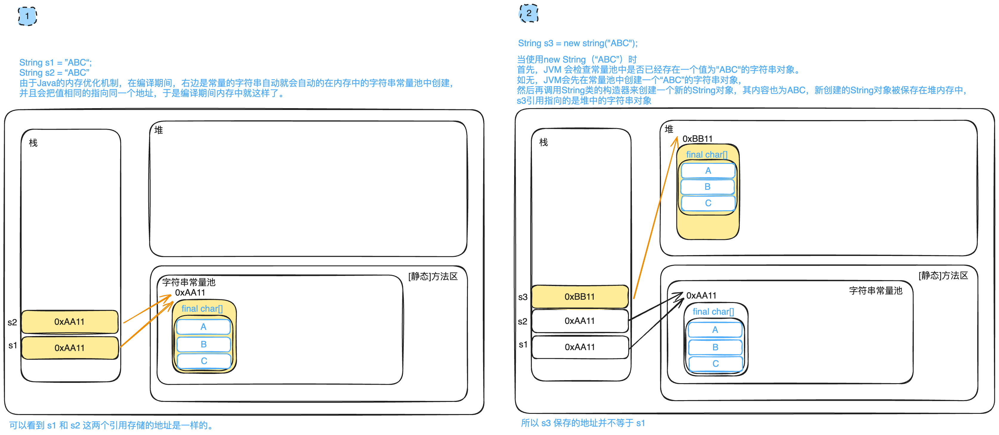

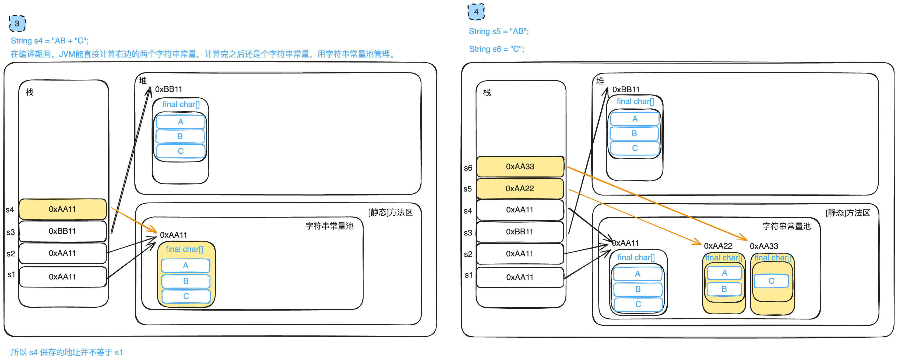

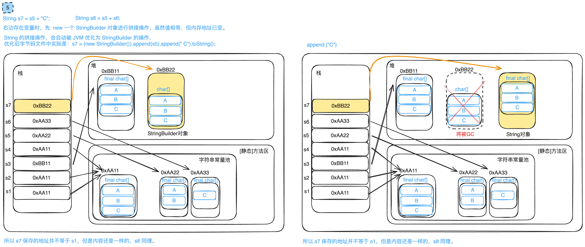
#### 可变字符串
##### StringBuffer
>解决了 String 用字符串做拼接，既费时又耗内存的问题。
* 使用场景：字符串频繁拼接场合

```java
String sbf = new StringBuffer("hello");
sbf.append(" world");
sbf.append(" .....");
str = sbf.toString();//StringBuffer 对象 -- > String 对象
System.out.println(str);
```
##### StringBuilder


### Math 类
- `java.lang`
- 两个常量:
	- `PI`
	- `E`
```java
public class MathTest {  
    public static void main(String[] args) {  
        //[0.0 - 1.0)  
        System.out.println(Math.random());  
  
        System.out.println("------------------");  
        // 1- 10  
        for (int i = 0; i < 10; i++) {  
            System.out.println((int)(Math.random() * 10 + 1));  
        }  
        // 1 -5  
        System.out.println("---------");  
        for (int i = 0; i < 30; i++) {  
            System.out.println((int)(Math.random() * 5 + 1));  
        }  
  
  
    }  
}
```

### BigDecimal 类
>double 存在精度缺失的问题，BigDecimal 类可以控制小数的精度，设定舍入运算规则，适用于金融和科学运算场景下的应用。

`BigDecimalTest.java`
```java
import java.math.BigDecimal;  
  
public class BigDecimalTest {  
    public static void main(String[] args) {  
        double d = 10;  
        System.out.println(d/3);// = 3.3333333333333335  
  
        BigDecimal d1 = new BigDecimal("10");  
        BigDecimal d2 = new BigDecimal("3");  
  
        //加  
        System.out.println(d1.add(d2));  
        System.out.println(d1.subtract(d2));  
        System.out.println(d1.multiply(d2));  
        System.out.println(d1.divide(d2,5,BigDecimal.ROUND_HALF_UP));  
    }  
}
```

### 日期和时间类
#### Date
```java
import java.util.Date;  
  
public class DateTest {  
    public static void main(String[] args) {  
        Date date = new Date();//当前时间的对象  
        System.out.println(date);  
        System.out.println(date.getTime());//获取时间戳 (从1970.1.1 00:00:00到现在的毫秒值)  
        Date date1 = new Date(1700330018452L);//使用时间戳创建对象  
        System.out.println(date1);  
    }  
}
```

#### SimpleDateFormat
>线程不安全

 - 创建 `simpleDateformat` 对象
 - 使用该对象的 `format` 方法进行格式化

`SimpleDateFormatTest.java`
```java
package com.situ.commonlyusedclass.dateclass;  
  
import java.text.ParseException;  
import java.text.SimpleDateFormat;  
import java.util.Date;  
  
public class SimpleDateFormatTest {  
    public static void main(String[] args) throws ParseException {  
        Date date = new Date();//当前时间的对象  
        //System.out.println(date);  
  
        SimpleDateFormat sdf = new SimpleDateFormat("yyyy年MM月dd日 HH:mm:ss");  
        String dateStr = sdf.format(date);//将date对象格式化为特定的字符串。  
        System.out.println(dateStr);  
  
        SimpleDateFormat sdf2 = new SimpleDateFormat("yyyy年MM月dd日 KK:mm:ss a");  
        String dateStr2 = sdf2.format(date);//将date对象格式化为特定的字符串。  
        System.out.println(dateStr2);  
  
        SimpleDateFormat sdf3 = new SimpleDateFormat(" KK:mm:ss a");  
        String dateStr3 = sdf3.format(date);//将date对象格式化为特定的字符串。  
        System.out.println(dateStr3);  
  
        //将特定格式的表示时间日期的字符串 转换成 Date对象  
        String dateStr4 = "2024年01月27日 14:41:08";  
        Date date1 = sdf.parse(dateStr4);  
  
    }  
}
```

#### Calendar
`CalendarClassTest.java`
```java
import java.util.Calendar;  
  
public class CalendarClassTest {  
    public static void main(String[] args) {  
        Calendar c = Calendar.getInstance();  
        System.out.println(c.get(Calendar.YEAR));  
        System.out.println(c.get(Calendar.MONTH) + 1);  
        System.out.println(c.get(Calendar.DATE ));  
        System.out.println(c.get(Calendar.DAY_OF_MONTH));  
        System.out.println(c.get(Calendar.DAY_OF_WEEK));  
  
        System.out.println("-----------------");  
        //set  
        c.set(Calendar.YEAR, 2024);  
        c.set(Calendar.MONTH, 4);//月是从 0 开始，设定的是4 + 1 = 5 月  
        c.set(Calendar.DAY_OF_MONTH, 1); // 1日  
        System.out.println(c.get(Calendar.DAY_OF_WEEK));//4  从星期天开始，就是一周的第四天  
        System.out.println("-----------------");  
        //set  
        c.set(Calendar.YEAR, 2024);  
        c.set(Calendar.MONTH, 4);//月是从 0 开始，设定的是4 + 1 = 5 月  
        c.set(Calendar.DAY_OF_MONTH, 31); // 1日  
        System.out.println(c.get(Calendar.DAY_OF_WEEK));// 6  
  
        c.set(Calendar.YEAR, 2024);  
        c.set(Calendar.MONTH, 4);//月是从 0 开始，设定的是4 + 1 = 5 月  
        c.set(Calendar.DAY_OF_MONTH, 32);  
        System.out.println(c.get(Calendar.DAY_OF_WEEK));//7  
  
        c.set(Calendar.YEAR, 2024);  
        c.set(Calendar.MONTH, 4);//月是从 0 开始，设定的是4 + 1 = 5 月  
        c.set(Calendar.DAY_OF_MONTH, 33);  
        System.out.println(c.get(Calendar.DAY_OF_WEEK));//1  
    }  
}
```
`PrintCalendar.java`
打印万年历
```java  
import java.util.Calendar;  
import java.util.Scanner;  
  
public class PrintCalendar {  
    public static void main(String[] args) {  
        Scanner scanner = new Scanner(System.in);  
        System.out.println("年:?");  
        int year = scanner.nextInt();  
        System.out.println("月:?");  
        int month = scanner.nextInt();  
        //计算该月的总天数  
        int days = 0; //存储每个月的总天数  
        switch (month) {  
            case 1:  
            case 3:  
            case 5:  
            case 7:  
            case 8:  
            case 10:  
            case 12:  
                days = 31;  
                break;  
            case 4:  
            case 6:  
            case 9:  
            case 11:  
                days = 30;  
                break;  
            case 2:  
                if((year % 4 == 0 && year % 100 != 0) || (year % 400 == 0)) {  
                    days = 29;  
                    break;  
                } else {  
                    days = 28;  
                    break;  
                }  
  
        }  
  
        Calendar c = Calendar.getInstance();//获取一个Calendar对象  
        c.set(Calendar.YEAR,year);//设置哪一年年  
        c.set(Calendar.MONTH,month - 1 );//设置哪一个月  
  
        c.set(Calendar.DAY_OF_MONTH,1);//设置月的第一天  
        int dayOfWeek = c.get(Calendar.DAY_OF_WEEK);//获取这年这月第一天是星期几  
  
        int count = 0;//控制换行计数器  
        System.out.println("日\t一\t二\t三\t四\t五\t六\t");  
        for (int i = 0; i < dayOfWeek - 1; i++) {  
            System.out.print("\t");  
            count++;  
        }  
        for (int i = 1; i <= days; i++) {  
            System.out.print(i + "\t");  
            count++;  
            if (count % 7 == 0) {  
                System.out.println();  
            }  
        }  
    }  
}
```

#### LocalDateTime 类
`LocalDateTimeTest.java`
```java
import java.time.LocalDateTime;  
import java.time.format.DateTimeFormatter;  
  
public class LocalDateTimeTest {  
    public static void main(String[] args) {  
        LocalDateTime dateTime = LocalDateTime.now();  
        System.out.println(dateTime);  
        DateTimeFormatter fmt = DateTimeFormatter.ofPattern("yyyy年MM月dd日 HH:mm:ss");  
        String dateTimeStr = dateTime.format(fmt);  
        System.out.println(dateTimeStr);  
  
        String dateTimeStr2 = dateTime.format(DateTimeFormatter.BASIC_ISO_DATE);  
        System.out.println(dateTimeStr2);  
  
        String dateTimeStr3 = dateTime.format(DateTimeFormatter.ISO_DATE_TIME);  
        System.out.println(dateTimeStr3);  
  
        LocalDateTime localDateTime = LocalDateTime.parse("2024年01月27日 19:08:08",fmt);  
        LocalDateTime localDateTime1 = LocalDateTime.parse("2024-01-27T19:08:08.374");  
        System.out.println(localDateTime);  
        System.out.println(localDateTime1);  
  
    }  
}
```
`DateTimeFormatterTest.java`
使用 DateTimeFormatter 格式化/解析日期
```java
import java.time.LocalDateTime;  
import java.time.format.DateTimeFormatter;  
import java.time.temporal.TemporalAccessor;  
  
public class DateTimeFormatterTest {  
    public static void main(String[] args) {  
        LocalDateTime dateTime = LocalDateTime.now();  
        //LocalDateTime --> 特定格式的字符  
        DateTimeFormatter dtf = DateTimeFormatter.ofPattern("yyyy年MM月dd日 HH:mm:ss");  
        String str = dtf.format(dateTime);  
        System.out.println(str);  
        //特定格式的字符串 ==> LocalDateTim        TemporalAccessor temporalAccessor = dtf.parse("2024年01月27日 19:15:12");  
        LocalDateTime dateTime1 = LocalDateTime.from(temporalAccessor);  
        System.out.println(dateTime1);  
    }  
}
```

## 集合的体系结构
>解决数组初始化后不能动态修改长度，以及空间闲置浪费的问题。
集合只能存储引用数据类型(基本数据类型可以使用包装类)

- Collection
	- [List](#List) (接口)元素有下标，且可以重复，元素有序
		- [[#ArrayList]] (实现类)
			- 数组，查询快，增删慢。
		- Vector (实现类)
			- 数组，查询比较快，增删比较慢，线程安全
		- LinkedList (实现类)
			- 链表，增删快，查询慢
	- [[#Set]] (接口) 元素无下标，不可以重复
		- HashSet (实现类)
		- LinkedHashSet (实现类)
		- TreeSet (实现类)

- [[#Map]] (接口)每个元素可以分成 key 和 value 两个部分
	- HashMap
	- LinkedHashMap
	- TreeMap
	- Properties
	- Hashtable

`Hashtable` 不允许 `null` 键或值，`Hashtable` 在实现 `Map` 接口时保证了<font color="#de7802">线程安全性</font>，而 `HashMap` 则是<font color="#de7802">非线程安全</font>的。所以，`Hashtable` 的性能不如 `HashMap`，因为为了保证线程安全它牺牲了一些性能。


## Collection
Collection 中常用的方法：
- `boolean add(Object obj)` 添加一个对象
- `boolean addAll(Collection c)`将一共集合中的所有对象添加到此集合中
- `void clear()`清空此集合中的所有对象
- `boolean contains(Object o)`检查此集合中是否包含`o`对象
- `boolean equals(Object o)`比较此集合是否与指定对象相等
- `boolean isEmpty`判断此集合是否为空
- `boolean remove(Object o)`在此集合中移除`o`对象
- `int size()`返回此集合中的元素个数
- `Object[] toArray()`将此集合转换成数组

### List
>元素<font color="#de7802">有序</font>，且<font color="#de7802">可重复</font>的集合，有下标
默认按照元素的添加顺序设置元素的索引

#### ArrayList
>基于数组结构，多用在查询多的场景。
##### 基本操作
```java
package com.situ.listlearning.arraylistlearn;  
  
import java.util.ArrayList;  
  
public class BasicOperate {  
    public static void main(String[] args) {  
        ArrayList list = new ArrayList();//创建 ArrayList类型的对象  
        list.add("JavaSE");  
        list.add("MySql");  
        list.add("Web");  
        list.add("JavaWeb");  
  
        System.out.println("--------获取list中元素的个数---------");  
        //获取list中元素的个数  
        System.out.println("长度" + list.size());  
        System.out.println("----------获取指定位置的元素-----------");  
        //获取指定位置的元素  
        System.out.println(list.get(3));  
        System.out.println(list.get(2));  
        System.out.println(list.get(1));  
        System.out.println(list.get(0));  
  
        System.out.println("-----------返回元素所在的索引---------");  
  
        //返回元素所在的索引  
        System.out.println("Mysql at:" + list.indexOf("MySql"));  
        System.out.println("----------在特定位置添加元素-----------");  
        //在特定位置添加元素  
        list.add(4,"SSM");  
        System.out.println(list.get(4));  
        System.out.println("---------------------");  
  
        //创建list2  
        ArrayList list2 = new ArrayList<>();  
        list2.add("SpringBoot");  
        list2.add("Vue");  
        System.out.println("----------------在集合中添加另一个集合--------------");  
        //在集合中添加另一个集合  
        list.add(list2);  
        System.out.println(list);  
        System.out.println(list.get(5));  
        System.out.println("----------修改集合中的某个位置-------------");  
        //修改集合中的某个位置  
        list.set(4,"SSM框架");  
        System.out.println(list.get(4));  
        System.out.println("----------删除特定位置的元素-----------");  
        //删除特定位置的元素  
        list.remove(4);  
        System.out.println(list);  
        System.out.println(list.get(4));//后面的往前移动了  
  
        System.out.println("-----------清空集合--------------");  
        //清空集合  
        list.clear();  
        System.out.println("清空后的长度为：" + list.size());  
    }  
}
```
```java
package com.situ.listlearning.arraylistlearn;  
  
import java.util.ArrayList;  
  
public class BasicOperate2 {  
    public static void main(String[] args) {  
        ArrayList list = new ArrayList();//创建 ArrayList类型的对象  
        list.add("JavaSE");  
        list.add("MySql");  
        list.add("Web");  
        list.add("JavaWeb");  
        System.out.print("设置某个位置的元素,设置 0 为 Java。结果：");  
        list.set(0,"Java");  
        System.out.println(list);  
        System.out.print("判断集合中是否有某个元素，删除后结果：");  
        System.out.println(list.contains("Web"));  
  
        System.out.print("删除指定位置的元素,删除 0 元素，删除 \"web\"，结果为：");  
        list.remove(0);  
        list.remove("Web");  
        System.out.println(list);  
  
        System.out.println("JavaWeb首次出现的下标为：" + list.indexOf("JavaWeb"));  
  
  
    }  
}
```
```java
package com.situ.listlearning.arraylistlearn;  
  
import java.util.ArrayList;  
  
public class BasicOperate3 {  
    public static void main(String[] args) {  
        System.out.print("------------创建个装自定义对象的list，结果：");  
        //创建个装对象的list  
        ArrayList<Person> list3 = new ArrayList();  
  
        Person p1 = new Person("001", "Tom", 18);  
        Person p2 = new Person("002", "Bob", 19);  
  
  
        list3.add(p1);  
        list3.add(p2);  
        list3.add(new Person("003", "Steve", 20));//使用匿名内部类创建一个对象。  
        System.out.println(list3);  
  
        System.out.print("------------使用根据值相同的方式，实现删除对象,删除结果：");  
        Person delP = new Person("001", "Tom", 18);  
        /*  
        * 需要重写 Person 类的equals()，调用过程：remove() --> 在 else 分支中，参数中的对象调用 equals 和集合中的元素逐个比对,  
        * 比对成功后进入 fastMove() 在这里面用数组拷贝的方法，实现删除。  
        * */       
        list3.remove(delP);  
        System.out.println(list3);  
  
        System.out.print("------------使用根据值相同的方式，实现查询是否包含这个对象，比对结果：");  
        System.out.print(list3.contains(new Person("002", "Bob", 19)));
        //contains()在 运行时也使用类equals方法，路径 contains() --> indexOf() --> else 分支中  
  
    }  
}
```

##### 遍历

- 普遍 for 遍历
- 增强 for 遍历
- 使用迭代器遍历
- 使用 forEach 遍历
- 使用 [Stream](javaEnhance.md#Stream) 流

```java
pimport java.util.ListIterator;  
  
public class TraverseArrayList {  
    public static void main(String[] args) {  
        //创建ArrayList对象  
        ArrayList list = new ArrayList();  
        //添加元素  
        list.add("JavaSE");  
        list.add("MySQL");  
        list.add("前端");  
        list.add("JavaWeb");  
        System.out.println("-----------使用普通 for 遍历---------");  
        //使用普通 for 遍历  
        //size = 4 , index = 0 1 2 3  
        for (int i = 0; i < list.size(); i++) {  
            System.out.println(list.get(i));  
        }  
        System.out.println("------------使用增强 for-----------");  
        //使用增强 for        
        for (Object o : list) {//TODO  
            //String str = (String)o;  
            System.out.println(o);//为什么不用向下转型就  
            //System.out.println(str);  
        }  
        System.out.println("---------------使用迭代器iterator-------------");  
        //使用迭代器  
        Iterator<String> it = list.iterator();//创建一个的迭代器，并且使用泛型约束某些内容。  
        while (it.hasNext()) {//如果迭代器it中还有下一个元素  
            String str = it.next();//首先指到下一个元素，然后取出其值赋给 str           
            System.out.println(str);  
        }  
        //迭代完之后，迭代器 it 就不能用了。必须重新生成一个新的迭代qi  
        it = list.iterator();  
        while (it.hasNext()) {//如果迭代器it中还有下一个元素  
            String str = it.next();//首先指到下一个元素，然后取出其值赋给 str            
            System.out.println(str);  
        }  
  
        //迭代完之后，迭代器 it 就不能用了。必须重新生成一个新的迭代qi  
        it = list.iterator();  
        while (it.hasNext()) {//如果迭代器it中还有下一个元素  
            String str = it.next();//首先指到下一个元素，然后取出其值赋给 str            
            if (str.equals("MySQL")) {  
                //list.remove("MySQL"); //迭代器是使用原来的集合创建的，使用集合的方法删除，迭代器就不知情了  
                it.remove();//得用迭代器的方法才行。  
            }  
        }  
  控制反转的是对象的创建权，实现了对象不由我们手动创建，而是由 Spring 提供的 IOC 容易统一管理和创建对象。
        System.out.println("---------------使用迭代器list iterator-------------");  
        //listIterator是iterator的子接口，具有 iterator的所有方法。  
        ListIterator<String> listIterator = list.listIterator();//创建了一个迭代器，这个迭代器使用了泛型约束。  
        System.out.println("---------------//从前往后遍历---------------");  
        //从前往后遍历  
        while (listIterator.hasNext()) {  
            String s = listIterator.next();  
            System.out.println(s);  
        }  
        System.out.println("---------------//从后往前遍历---------------");  
        //从后往前遍历  
        while (listIterator.hasPrevious()) {  
            String s = listIterator.previous();  
            System.out.println(s);  
        }  
        System.out.println("-------------------直接上来就从后往前遍历---------------");  
        //直接上来就从后往前遍历  
        /*  
        * 解析：list.listIterator(list.size())  
        * listIterator(4) --> new ListItr(4)这是用了内部类ListItr的构造方法 --> cursor = 4，  
        * 理解为现在光标指向的是 下标为 4 的地方，也就是最后一个元素（下标为 3 ）的下一个元素。  
        * 0 1   2   3   4        *               ^        * 很明显 4 的前面是有元素的  
        * */        
        listIterator  = list.listIterator(list.size());//创建了一个指向list集合的最后一个元素的下一个元素的迭代器  
        while (listIterator.hasPrevious()) { // 3 是有元素的  
            String s = listIterator.previous(); //首先 指向 3 位置，然后获取其值，赋值给 s            
            System.out.println(s);  
        }  
    }  
}
```
`ArrayListExample.java`
使用 forEach
```java
import java.util.ArrayList;

public class ArrayListExample {
    public static void main(String[] args) {
        // 创建一个ArrayList并添加一些元素
        ArrayList<String> list = new ArrayList<>();
        list.add("Apple");
        list.add("Banana");
        list.add("Orange");
        list.add("Grapes");

        // 使用forEach遍历ArrayList并打印每个元素
        list.forEach(item -> System.out.println(item));
    }
}

```

##### 泛型
>类型参数化，实现对类型的约束

- 能够兼容多多种类型
	- 单纯只是使用 `Object` 类也可以实现这种目的
- 能够对类型进行约束
	- 这是泛型的主要优势
##### 什么是泛型
- \<T\> 表示泛型，所有使用到 T 的位置，都会受到 T 代表的类型的约束(简单理解为把那个类型替换到有 T 的位置)
- 尖括号中不一定叫 T ，可以是任何字母，字符仅仅是占位置，用来标识的。
- \<\> 中可以定义多个泛型。

##### 泛型的两种应用
###### 在现有类中使用泛型
>例如官方写的很多类中，均是使用到了泛型

集合中使用了泛型
```java
public class ArrayList<E> extends AbstractList<E>  
        implements List<E>, RandomAccess, Cloneable, java.io.Serializable  
{
....
}
```

###### 在自定义类中使用泛型
泛型类
`GenericsClass.java`
泛型类
```java
public class GenericsClass<T, A> {  
    private T t;  
    private A a;  
  
    public void test(T t) {  
        this.t = t;  
    }  
    public void test1(A a) {  
        this.a = a;  
    }  
}
```
`GenericsInterface.java`
泛型接口
```java
public interface GenericsInterface<A, B> {
	A test1(A a);
	void test2(B b);
	void test3(A a, B b);
}
```
`GenericsInterface2.java`
泛型接口
```java

public interface GenericsInterface2<C> {
	void test4(C c);

}
```
`MyClass.java`
可以实现多个泛型接口，注意当前类也要写上对应数量的泛型。
```java
public class MyClass<A, B, C> implements GenericsInterface<A, B>,GenericsInterface2<C> {
	public A test1(A a) {
		return null;
	}
	public void test2(B b) {
	
	}
	public void test3(A a, B b) {
	
	}
	public void test4(C c) {
	
	}	
}
```
`MyClass2.java`
继承泛型类，子类也要写上一致的泛型
```java
public class MyClass2<T, A> extends GenericsClass<T, A> {


}
```
###### 泛型方法
>泛型方法的泛型参数不受类的泛型影响。

- 泛型方法可以存在于普通类当中，不止于泛型类中。
- 泛型方法可以被 static 修饰

泛型方法的参数列表位置的泛型的类型，会决定方法中泛型的类型。可以轻松简洁的实现方法重载的效果
```java
public class GenericsFunction<T> {  
    public void m1(T t) {  
        System.out.println(t.getClass());  
    }  
      
    //泛型方法  
    public <T> void m2(T t) {//泛型方法中的泛型参数是可以和泛型类中的参数同名的，但是这样会容易混淆，不推荐。  
        System.out.println(t.getClass());  
    }  
  
    //如果没有泛型，要实现不同类型的加法，每种类型都需要重载一个add方法；通过泛型，我们可以复用为一个方法  
    public <T extends Number> double add(T a, T b) {    // T extends Number 意思是 T 的类型只能是 Number类型中的，Number中包括 15 个和数字运算相关的类型。  
        System.out.println(a + "+" + b + "=" + (a.doubleValue() + b.doubleValue()));  
        return a.doubleValue() + b.doubleValue();  
    }  
}
```

###### 通配符
-  `<?>` 代表任意类型数据
-  `<? extends 类型>` 使用时指定的类型必须是继承某个类，或者实现某个接口，即 `<=`
-  `<? super 类型>` 使用时指定的类型不能小于操作的类，即 `>=`

举例：
- `<? extends Person>` (无穷小 ,Person\]只允许泛型为 `Person` 及 `Person` 子类的引用调用；
- `<? super Person>` \[Person, 无穷大)只允许泛型为 `Person` 及 `Person` 父类的引用调用。


##### Collections 工具类
>简单理解为类似 Arrays 类，是一种工具类。

###### 基本操作
```java
package com.situ.listlearning.arraylistlearn;  
  
import java.util.ArrayList;  
import java.util.Collections;  
import java.util.Comparator;  
  
public class CollectionsTest {  
    public static void main(String[] args) {  
        ArrayList<String> list = new ArrayList<>();  
        list.add("abc");  
        list.add("AA");  
        list.add("ABC");  
        list.add("EE");  
  
        System.out.println("原集合是这样的：" + list);  
        System.out.println("-------------进行一下反转------------");  
        Collections.reverse(list);  
        System.out.println(list);  
        System.out.println("-------------反转结束------------");  
  
        System.out.println("-------------进行一下随机排序------------");  
        Collections.reverse(list);  
        System.out.println(list);  
        System.out.println("-------------随机排序结束---------------");  
  
        System.out.println("-------------进行一下自然排序------------");  
        Collections.sort(list);  
        System.out.println(list);  
        System.out.println("-------------自然排序结束---------------");  
  
        System.out.println("-------------进行一下定制排序------------");  
        /*  
        实现一个匿名内部类，这个类实时 Comparator的实现类，其中重写类 Compare()        
        用来自定义两个字符串如何比较，在sort()运行过程中会用到。  
         */        
	    Collections.sort(list, new Comparator<String>() {  
            @Override  
            public int compare(String o1, String o2) {  
                return -o1.compareTo(o2);//编码表的反顺序排序规则  
            }  
        });  
        System.out.println(list);  
        System.out.println("-------------定制排序结束---------------");  
        System.out.println("-------------交换特定位置的元素---------------");  
        //交换特定位置的元素  
        Collections.swap(list, 0, list.size() - 1);  
        System.out.println(list);  
        System.out.println("-------------交换特定位置结束---------------");  
        System.out.println();  
        System.out.println("-------------拷贝数组开始---------------");  
        ArrayList<String> listCopy = new ArrayList<>();  
        //把listCopy中的元素的数量增加到和 list1 的数量一样，这样 listCopy.size()才有值。仅仅初始化的话size还是0  
        for (int i = 0; i < list.size(); i++) {  
            listCopy.add(null);  
        }  
        Collections.copy(listCopy, list);  
        System.out.println(listCopy);  
        System.out.println("-------------拷贝数组结束---------------");  
    }  
}
```
`MyTest13.java`
使用 Collectons 中自带的方法求最大值和最小值
```java
public class MyTest13 {
    public static void main(String[] args) {
        ArrayList<String> list = new ArrayList<>();
        list.add("abc");
        list.add("AA");
        list.add("ABC");
        list.add("EE");
        //最大值 最小值
        System.out.println(Collections.max(list));
        System.out.println(Collections.min(list));
        System.out.println(Collections.max(list, new Comparator<String>() {
            @Override
            public int compare(String o1, String o2) {
                return -o1.compareTo(o2);
            }
        }));

        System.out.println(Collections.min(list, new Comparator<String>() {
            @Override
            public int compare(String o1, String o2) {
                return -o1.compareTo(o2);
            }
        }));
        //出现次数
        System.out.println(Collections.frequency(list, "AA"));

        //复制
        List<String> list1 = Arrays.asList(new String[list.size()]);
        Collections.copy(list1, list);
        System.out.println(list1);

        //替换
        Collections.replaceAll(list, "AA", "******");
        System.out.println(list);
    }
}
```
###### Java 比较器
####### Comparable 自然排序
>实现 Comparable 接口，重写 CompareTo()

`Student.java`
```java
public class Student implements Comparable<Student> {  //可以理解为 Student这个类实现了一个专门用于处理特定类型(Student类型)的接口
    String no;  
    String name;  
    int age;  
    String gender;  
    int height;  
  
    //重写compareTo方法，实现对自定义对象的比较  
    @Override  
    public int compareTo(Student o) {  //因为在实现接口的时候就用了泛型接口，使用了参数Student，定义Student类的时候就从接口继承过来那个填好参数的方法了。Comparable接口中的CompareTo方法：public int compareTo(T o); Student会把这个 T 替换。
        /*  
        this 比 o 大，返回正数  
        this 比 o 小，返回负数  
        this 和 o 相等，返回 0        按照这个规则，实现的是 从小到大的排序  
         */  
          /*
        我想定义的规则1：先比较年龄，小的在前，年龄相同时再根据身高的小大排序。
        if(this.age > s.age) {
            return 1;
        }else if(this.age < s.age) {
            return -1;
        }else {//判断身高的大小
            if(this.height > s.height) {
                return 1;
            }else if(this.height < s.height) {
                return -1;
            }
            return 0;
        }

        我想定义的另一个规则2：先比较年龄，小的在前，年龄相同时再根据名字大小排序。
        if (this.age > o.age) {
            return 1;
        } else if (this.age < o.age) {
            return -1;
        } else {//判断名字的大小，加个服号就是从大到小排序了。this 比 o 大 负数，this 比 o 小，返回正数，this 和 o 相等，返回 0
            return -this.name.compareTo(o.name);
        }
        */
        //2规则另一种写法：  
        return Integer.compare(this.age,o.age) != 0 ? Integer.compare(this.age,o.age) : -this.name.compareTo(o.name);  
  
    }  
  
  
    //重写 Student 类的toString方法，实现打印属性  
    @Override  
    public String toString() {  
        return "Student{" +  
                "no='" + no + '\'' +  
                ", name='" + name + '\'' +  
                ", age=" + age +  
                ", gender='" + gender + '\'' +  
                ", height=" + height +  
                '}';  
    }  
  
    public Student() {  
    }  
  
    public Student(String no, String name, int age, String gender, int height) {  
        this.no = no;  
        this.name = name;  
        this.age = age;  
        this.gender = gender;  
        this.height = height;  
    }  
}
```
`NatureCompareTest.java`
```java
import java.util.Arrays;  
  
public class NatureCompareTest {  
    public static void main(String[] args) {  
        int arr[] = new int[]{5, 4, 3, 2, 1, -9};//整数数组  
        //调用JAVA官方的排序算法进行排序。  
        Arrays.sort(arr);//默认从小到大排序  
        System.out.println(Arrays.toString(arr));  
  
        String[] strArr = new String[]{"addd", "abc", "xyz", "def", "123"};//字符串数组  
        Arrays.sort(strArr);//默认按照编码表进行排序，数字在前，从第一个位置比，字母在前的排前，相同时比较次一个字母的大小。  
        System.out.println(Arrays.toString(strArr));  
  
        Student s1 = new Student("A001","zs",20,"m",190);  
        Student s2 = new Student("A002","ls",22,"f",180);  
        Student s3 = new Student("A003","ww",19,"m",170);  
        Student s4 = new Student("A004","ww",22,"m",190);  
  
        Student[] studentArr = new Student[]{s1, s2, s3, s4};//对象数组  
        Arrays.sort(studentArr);//如果要想实现对自定义类型的对象排序，需要在Student类中实现comparable接口,重写compareTo方法，要不然报错。  
        System.out.println(Arrays.toString(studentArr));  
    }  
}
```
注意：我们这里重写的 `comparaTo()` 写完之后并没有调用，可能有的童鞋会很奇怪，其实是我们写好了，然后在运行 `Arrays.sort(studentArr);` 的过程中就会被调用，可以一步一步进入方法查看 `Arrays.sort()` --> `ComparableTimSort.sort()` --> `binarySort()` 这里面就有调用。

`String` 类中重写的 `CompareTo()`
```java
public final class String  
    implements java.io.Serializable, Comparable<String>, CharSequence {//String实现了Comparable接口
//省略一大坨...
public int compareTo(String anotherString) {  
    int len1 = value.length;  
    int len2 = anotherString.value.length;  
    int lim = Math.min(len1, len2);  
    char v1[] = value;  
    char v2[] = anotherString.value;  
  
    int k = 0;  
    while (k < lim) {  
        char c1 = v1[k];  
        char c2 = v2[k];  
        if (c1 != c2) {  
            return c1 - c2;  
        }  
        k++;  
    }  
    return len1 - len2;  
}
}
```

####### Comparator 定制排序
###### 解决的痛点
- 某些类没有实现 `java.lang.Comparable` 接口，但是又不方便修改源码时
	- 场景 1：官方提供的类不满足排序的需要，但是官方提供的类只能以只读模式打开，同时类又被 `final` 修饰不能继承时。
	- 场景 2:类实现了 `java.lang.Comparable` 接口, 重写了 `Comparable()`, 但是在某些地方这个重写方法并不适合, 直接修改 Comparable()又会使得本来适用的地方不能用了。

###### 重写规则
- 返回正整数，则表示 `o1` 大于 `o2`；
- 返回`0`，表示相等；
- 返回负整数，表示`o1`小于`o2`。

```java

import java.util.Arrays;
import java.util.Comparator;

public class EnforceCompare {
    public static void main(String[] args) {

        String[] strArr = new String[]{"addd", "abc", "xyz", "def", "123"};//字符串数组
        Arrays.sort(strArr);//默认按照编码表进行排序，数字在前，从第一个位置比，字母在前的排前，相同时比较次一个字母的大小。
        System.out.println(Arrays.toString(strArr));


        /*
        * 写了一个 Comparator 接口的一个匿名内部类类，也是实现类，并且这个类还是重写了这个接口下的 Compare()方法
        *
        * int compare(T o1, T o2); 是 Comparator 接口下的一个抽象方法。
        *
        * 调用过程：
        * Arrays.sort() --> legacyMergeSort() --> else 分支下的 mergeSort() --> c.compare()
        *
        * */
        Arrays.sort(strArr, new Comparator<String>() {//理解：sort()方法使用 Comparator对象中的排序规则，进行排序。
            @Override
            public int compare(String o1, String o2) {//堆String数组，根据编码表降序排序。
                return -o1.compareTo(o2);   //调用的 String 重写 Comparable 接口的 CompareTo()方法，然后加了个负号，就是从大到小排序了。
            }
        });
        System.out.println(Arrays.toString(strArr));
    }
}
```

### Set
>基于 Map,<font color="#de7802">不允许包含相同的元素</font>。如果试图把两个相同的元素加入同一个 `Set` 集合中，则添加操作失败。

Set 判断两个对象是否相同不是使用\=\=运算符，而是根据 `equals()` 方法。

线程不安全的，可以存储 `null` 值；

遍历方式：
- 使用增强 for 遍历
- 使用迭代器遍历
- 使用 forEach 遍历
- 使用 [Stream](javaEnhance.md#Stream) 流的 `forEach()`
#### HashSet
>每次遍历的顺序是一致的但是<font color="#de7802">和添加的顺序不一致</font>。

`HashSet` 按 `Hash` 算法来存储集合中的元素，因此具有很好的存取、查找、删除性能

`HashSet` 具有以下特点：
- 不能保证元素的排列顺序；
- 元素不能重复；
- `HashSet`不是线程安全的；
- 集合元素可以是 `null`。

`HashSet` 集合判断两个元素相等的标准：两个对象通过 `hashCode()` 方法比较相等，并且两个对象的 `equals()` 方法返回值也相等。

`HashSet` 中添加元素的过程：
- 当向 HashSet 集合中存入一个元素时，HashSet 会调用该对象的 `HashCode()` 方法，计算出散列值，并且据此确定在 HashSet 底层数组中存储的位置
	- 如果这里没有元素，直接添加成功
	- 如果这里有元素了，那就比较两个元素的 hahsCode()值
		- 如果不等，添加成功
		- 如果相等，则调用 `equals()` 方法，判断两者的内容是否相同
			- 如果相同，则添加失败
			- 如果不同，则添加成功(数组上有元素了，会以链表的形式挂在后面)

HashSet 的底层：
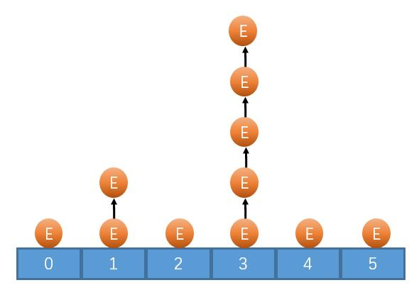

##### 基本操作
`HashSetBasicOperate.java`
```java
import java.util.HashSet;  
import java.util.Iterator;  
  
public class HashSetBasicOperate {  
    public static void main(String[] args) {  
        HashSet<String> set = new HashSet();  
  
        set.add("001");  
        set.add("王文鹏");  
        set.add("男");  
        set.add("山东");  
		//使用增强for
        for (String s : set) {  
            System.out.println(s);  
        }  
        System.out.println("------------------");  
        //使用迭代器
        Iterator<String> it = set.iterator();  
        while (it.hasNext()){  
            String s = it.next();  
            System.out.println(s);  
        }  
    }  
}
```

```java
import java.util.HashSet;

public class HashSetTraversalExample {
    public static void main(String[] args) {
        HashSet<String> set = new HashSet<>();
        set.add("Apple");
        set.add("Banana");
        set.add("Orange");

        set.forEach(item -> System.out.println(item));
    }
}

```

```java
import java.util.HashSet;

public class HashSetTraversalExample {
    public static void main(String[] args) {
        HashSet<String> set = new HashSet<>();
        set.add("Apple");
        set.add("Banana");
        set.add("Orange");

        set.stream().forEach(item -> System.out.println(item));
    }
}

```

#### LinkedHashSet
>添加顺序和遍历顺序是一致的(使用双向链表维护的顺序)

`LinkedHashSet` 作为 `HashSet` 的子类，遍历其内部数据时，可以按照添加的顺序遍历，对于频繁的遍历操作，`LinkedHashSet` 效率高于 `HashSet`；
##### 基本操作
`LinkedHashSetTest.java`
```java
import java.util.LinkedHashSet;  
  
public class LinkedHashSetTest {  
    public static void main(String[] args) {  
        LinkedHashSet<String> set = new LinkedHashSet<>();//创建了一个专门用于处理 String类型的集合。  
  
        set.add("001");  
        set.add("hello");  
        set.add("Java");  
        set.add(null);  
        set.add("hello minecraft");  
  
        for (String s : set) {  
            System.out.println(s);  
        }  
    }  
}
```

#### TreeSet
>可以按照对象大小顺序排序。
##### 基本操作
`Car.java`
```java
package com.situ.listlearning.setlearning;  
  
public class Car implements Comparable<Car> {  
    //继承了一个接口，继承时使用泛型参数了，可以理解为实现了一个专门处理Car类型的 Comparable接口  
    private String brand;  
    private String num;  
    private String color;  
  
    public Car() {  
    }  
  
    public Car(String brand, String num, String color) {  
        this.brand = brand;  
        this.num = num;  
        this.color = color;  
    }  
  
    public String getBrand() {  
        return brand;  
    }  
  
    public void setBrand(String brand) {  
        this.brand = brand;  
    }  
  
    public String getNum() {  
        return num;  
    }  
  
    public void setNum(String num) {  
        this.num = num;  
    }  
  
    public String getColor() {  
        return color;  
    }  
  
    public void setColor(String color) {  
        this.color = color;  
    }  
  
    @Override  
    public String toString() {  
        return "Car{" +  
                "brand='" + brand + '\'' +  
                ", num='" + num + '\'' +  
                ", color='" + color + '\'' +  
                '}';  
    }  
  
    @Override  
    public int compareTo(Car o) {//根据车牌号进行排序，从小到大  
        return this.num.compareTo(o.num);  
    }  
}
```
`TreeSetTest.java`
```java
package com.situ.listlearning.setlearning;  
  
import java.util.Comparator;  
import java.util.TreeSet;  
  
public class TreeSetTest {  
    public static void main(String[] args) {  
        TreeSet<String> set = new TreeSet<>();  
        set.add("A");  
        set.add("abc");  
        set.add("ab");  
        set.add("0001qqq");  
  
        for (String s : set) {  
            System.out.println(s);  
        }  
        System.out.println("=====================================");  
  
        /*comparator – the comparator that will be used to order this set.  
        If null, the natural ordering of the elements will be used.        
        如果在初始化TreeSet时，参数里放一个 Comparator实现类，创建出来的set1对象排序时用 Comparator实现类的定制排序方法  
        不放的话 TreeSet创建出来的set1对象在排序时默认就是用的是自然排序。  
        */        
        TreeSet<String> set1 = new TreeSet<>(new Comparator<String>() {  
            @Override  
            public int compare(String o1, String o2) {//根据字符串长度进行排序  
                return Integer.compare(o1.length(), o2.length());  
            }  
        });  
        set1.add("A");  
        set1.add("abc");  
        set1.add("ab");  
        set1.add("0001qqq");  
        System.out.println(set1);//[A, ab, abc, 0001qqq]  
  
        TreeSet<Car> carSet = new TreeSet<>();//创建了一个只能存储 Car 类型的 TreeSet 集合  
        carSet.add(new Car("BMW", "666", "red"));  
        carSet.add(new Car("H", "333", "green"));  
        carSet.add(new Car("BenChi", "555", "blue"));  
  
        for (Car car : carSet) {  
            System.out.println(car);  
        }  
  
    }  
}
```

## Map
>存储的是一对数据，key 不可重复，值可以重复。

- `key` 和 `value` 都可以是任何引用类型的数据。
- `key` 所对应的类需要重写 `equals()` 和 `hashCode()`，常用 String 类作为 key(String 类官方重写好了)
- `key` 和 `value` 时单向一对一关系，一个 `key` 对应一个 `value`，反之可能不然。

常用方法：
- `V put(K key, V value)` 将对象存入到集合中，关联键值。`key` 重复则覆盖原值
- `Object get(Object key)`根据键获取对应的值。
- `Set<K> keySet()`返回所有`key`
- `Collection<V> values()`返回包含所有值的`Collection`集合
- `Set<Map.Entry<K,V>>`键值匹配的`Set`集合

### HashMap
>添加顺序和遍历顺序不一样。继承 `AbstractMap`

- `Map` 的主要实现类，线程不安全，效率高，可以存放为 `null` 的 `key` 和 `value`；
- `key` 对构成是继承，`key` 是无序的，不可重复的。

### LinkedHashMap
>保证添加的顺序和遍历的顺序一样(在 `HashMap` 对底层上加了一层指针维护顺序)

```java
package com.situ.maplearning;  
  
import java.util.HashMap;  
import java.util.Iterator;  
import java.util.Map;  
import java.util.Set;  
  
public class HashMapTest {  
    public static void main(String[] args) {  
        HashMap<String, Object> map = new HashMap<>();  
  
        map.put("num","101");  
        map.put("name","王文鹏");  
        map.put("age",24);//实际上有两个操作，基本数据类型 --> 包装类，然后在用多态  
        map.put("addr","山东");  
  
        Set<String> keys = map.keySet();//获取所有的 key，返回的是个 set 类型，因为 ke y不可重复，set 特点也是不可重复。  
        for (String key : keys) {//取出集合中的每个 key 放到 key变量  
            Object value  = map.get(key);//因为 value 中有各种类型，所以用 Object 类型的对象接住  
            System.out.println(key + ":" + value);  
        }  
        System.out.println("----------------------------------");  
  
        Iterator<String> it  = keys.iterator();//因为 keys 是个 set 集合，我们自然也可以用迭代器遍历集合。  
        while (it.hasNext()) {//如果迭代器中有下一个元素  
            String key = it.next();//指针指到下一个元素的位置，并且返回其值，返回的类型就是 初始化多态的时候泛型参数中填入的类型。  
            Object value = map.get(key);  
            System.out.println(key + ":" + value);  
        }  
        System.out.println("-----------------------------------");  
        //接口中的泛型接口  
        Set<Map.Entry<String, Object>> entrySet = map.entrySet();//返回的是一个集合，这个entrySet集合中存放的是Map.Entry<String, Object>类型的元素  
        for (Map.Entry<String, Object> entry : entrySet) {//entry中存着很多Map.Entry<String, Object>类型的对象。  
            String key  = entry.getKey();  
            Object value = entry.getValue();  
            System.out.println(key + ":" + value);  
        }  
  
        System.out.println("======================");  
        Iterator<Map.Entry<String, Object>> iterator = entrySet.iterator();  
        while (iterator.hasNext()) {  
            Map.Entry<String, Object> entry = iterator.next();  
            String key = entry.getKey();  
            Object value = entry.getValue();  
            System.out.println(key + ":" + value);  
        }  
  
        map.forEach((k,v) -> System.out.println(k + ": " + v));//理解：把map集合中的每个元素，也就是一个键值对，匹配 pattern (k,v)，取其值打印。  
  
    }  
}
```

### TreeMap
>可以实现对 `key` 的大小排序(底层使用红黑树)

TreeMap 使用比较器排序，不是 equals。如果在比较器中比较 key 时如果相同，则认为是相同的 key，则就会产生覆盖的情况。
```java
package com.situ.maplearning;  
  
import java.util.Comparator;  
import java.util.Set;  
import java.util.TreeMap;  
  
public class TreeMapTest {  
    public static void main(String[] args) {  
        TreeMap<String, String> map = new TreeMap<>();  
        map.put("a", "wang");  
        map.put("bb", "wen");  
        map.put("bb", "helloWoRld");//覆盖了 "wen"        map.put("bbbbbb", "wen");  
        map.put("dddd", "race you");  
        map.put("ccc", "peng");  
        map.put("a", "53");  
  
        //获取 map 的 key 的集合，因为 map 的 key 都是 String 类型的  
        //所以我们用的是用String 限制的 Set 集合。  
        Set<String> set = map.keySet();  
        for (String k : set) {  
            System.out.println(k + ":" + map.get(k));  
        }  
        System.out.println("=============================");  
        //创建了一个 TreeMap ，并且使用定制排序  
        TreeMap<String, String> map1 = new TreeMap<>(new Comparator<String>() {  
            @Override  
            public int compare(String o1, String o2) {  
                return -Integer.compare(o1.length(), o2.length());  
            }  
        });  
        map1.put("a", "wang");  
        map1.put("bb", "wen");  
        map1.put("ccc", "peng");  
        map1.put("dddd", "race you");  
  
        Set<String> set1 = map1.keySet();  
        for (String k : set1) {  
            System.out.println(k + ":" + map.get(k));  
        }  
  
    }  
}
```


### Properties
>用来处理配置文件，`key` 和 `value` 都是 `String` 类型

写配置文件的的好处：每次有新的需求直接在外边，不用打开代码就可以修改需求。

<font color=#646a73>*更新时间：2024-01-31 09:25:36*</font>

```
# 这是属性  
name = wangwenpng  
age = 24  
addr = shandong
```
`PropertiesTest.java`
```java
package com.situ.maplearning;  
  
import java.io.FileReader;  
import java.io.IOException;  
import java.util.Properties;  
  
public class PropertiesTest {  
    public static void main(String[] args) throws IOException {  
        Properties pp = new Properties();  
        pp.load(new FileReader("test.properties"));  
        System.out.println(pp.getProperty("name"));  
        System.out.println(pp.getProperty("age"));  
        System.out.println(pp.getProperty("addr"));  
    }  
}
```
## 异常
>程序执行中发生的不正常情况称为**异常**(开发过程中的**语法错误**和**逻辑错误**不是异常)。

异常类的结构：
- `Trowable`
	- `Exception` (可以使用针对性的代码进行处理)
		- 运行时异常 `RuntimeException`
			- `ArithmeticException` (子类)
			- `NullPointerException` (子类)
			- `ArrayIndexOutOfBoundsException` (子类)
			- `ClassCastException` (子类)
			- ......(子类)
		- 编译时异常
	- `Error` (Java 虚拟机无法解决的严重问题，一般情况下不针对进行处理)
		- `StackOverflowError`
		- `OutOfMemoryError`
			- ......

运行时异常和编译时异常：
1. **运行时异常**
    - 编译器不要求强制处置的异常；
    - 一般是由程序逻辑错误引起的，程序应该从逻辑角度尽可能避免这类异常的发生；
    - `java.lang.RuntimeException`类及它的子类都是运行时异常；
    - 对于这类异常，可以不作处理，因为这类异常很普遍，若全处理可能会对程序的可读性和运行效率产生影响。
2. **编译时异常**
    - 编译器要求必须处置的异常；
    - 除了`RuntimeException`及其子类以外，其他的`Exception`类及其子类都属于编译时异常；
    - 编译器要求Java程序必须捕获或声明所有编译时异常；
    - 对于这类异常，如果程序不处理，可能会带来意想不到的结果。
3. 
	- 编译时异常一定需要要处理。
	- 可能出现运行时异常的方法，在编译时并不会报红。
`Commonly.java`
常见的异常
```java
package com.situ.exceptionanderror;

public class Commonly {

    public static void test1() {//Exception in thread "main" java.lang.OutOfMemoryError
        int[] arr = new int[999999999];
        System.out.println("****************************");
    }

    public static void test2() {//xception in thread "main" java.lang.StackOverflowError
        test2();
    }
    public static void test3() {//Exception in thread "main" java.lang.ArithmeticException
        int a = 10/0;
    }
    public static void test4() {//Exception in thread "main" java.lang.NullPointerException
        String str = null;
        System.out.println(str.length());
    }
    public static void test5() {//Exception in thread "main" java.lang.ArrayIndexOutOfBoundsException
        int[] arr = new int[5];
        arr[5] = 1100;
    }
    public static void test6() {//Exception in thread "main" java.lang.ClassCastException
        Object obj = new Object();
        String str = (String)obj;
    }

    public static void main(String[] args) {
        //test1();
        //test2();
        //test3();
        //test4();
        //test5();
        //test6();

    }
}
```
### 两种处理方式
#### 使用 TryCath 进行处理
>使用 `try-catch-finally` 处理异常 --"由程序员自己处理异常"
```java
try {
//可能出现异常的代码
} catch (异常类型1 e) {
//如何处理当前异常的代码，只能处理异常类型 1 的对象
} catch (异常类型2 e) {
//如何处理当前异常的代码，只能处理异常类型 2 的对象
} finally {
//无论是丑出现异常，都会被运行到的地方，通常用于最终处理。
}
```
`TryCatchTest.java`
```java
package com.situ.exceptionanderror;  
  
public class TryCatchTest {  
  
    public static void test1() {//Exception in thread "main" java.lang.OutOfMemoryError  
        int[] arr = new int[999999999];  
        System.out.println("****************************");  
    }  
  
    public static void test2() {//Exception in thread "main" java.lang.StackOverflowError  
        test2();  
    }  
    public static void test3() {//Exception in thread "main" java.lang.ArithmeticException  
        int a = 10/0;  
    }  
  
    public static void main(String[] args) {  
        try {  
            test1();  //在这里异常之后，后面的代码就不运行了。
            test2();  
            test3();  
        } catch (OutOfMemoryError e) {  
            System.out.println("占用内存太大了...");  
  
        } catch (StackOverflowError e) {  
            System.out.println("算数都不会算吗");  
        } catch (ArithmeticException e) {  
            System.out.println("不会用指针吗你");  
        }  
        finally {  
            System.out.println(" i always be...");  
  
        }  
    }  
}
```
```shell
占用内存太大了...
I have always been there anyway.

进程已结束，退出代码为 0
```

注意事项
- `try` 代码块包裹的可能出现异常的代码，出现异常之后就会抛出异常类的对象"
- `catch` 代码块用来对出现的异常进行处理，捕获 `try` 代码块抛出的异常类对象，这个异常类对象就会赋值给()中的引用
- `catch` 代码块可以有多个，分别处理不同类型的异常，异常类型代表的是哪种类型，`catch` 代码块就只能处理对应类型的异常
- 异常类型如果存在父类和子类的情况，子类一定要写在上面，父类要写在下面
- `finally` 代码块不管是否出现异常都会被运行，`finally` 代码块不是必须的

#### 使用抛出 throw 进行处理
```java
package com.situ.exceptionanderror;  
  
public class ThrowTest {  
  
  
  
    public static void test3() throws ArithmeticException {//Exception in thread "main" java.lang.ArithmeticException  
        int a = 10 / 0;  
    }  
  
    public static void main(String[] args)  {  
        //接受方法抛出来的异常进行处理  
        try {  
            test3();  
        } catch (Exception e) {  
            System.out.println("异常了...");  
        }  
    }  
  
  
  
}
```
如果一直抛出，抛到调用者没处理异常，再抛出抛到 `main` 方法，`main` 又没处理，直接抛出道了 `JVM` ，那么就直接崩溃了。

### 自定义异常
本质：自定义 Java 类
要求：要继承 Exception 类，或者 Exception 的子类

`CustomizedException.java`
```java
package com.situ.exceptionanderror;  
  
public class CustomizedException extends Exception {  
    public CustomizedException() {  
  
    }  
    public CustomizedException (String errMsg) {  
        super(errMsg);  
    }  
}
```
`CustomizedExceptionTest.java`
```java
package com.situ.exceptionanderror;  
  
public class CustomizedExceptionTest extends Exception {  
    public static void main(String[] args) {  
  
        try {  
            div(6,0);  
        } catch (CustomizedException e) {  
            System.out.println("---");  
            e.printStackTrace();  
  
        }  
    }  
  
    public static int div(int a, int b) throws CustomizedException {  
        if (b == 0) {  
            throw new CustomizedException("除数为了0了！！！");  
        }  
        return a / b;  
    }  
}
```


