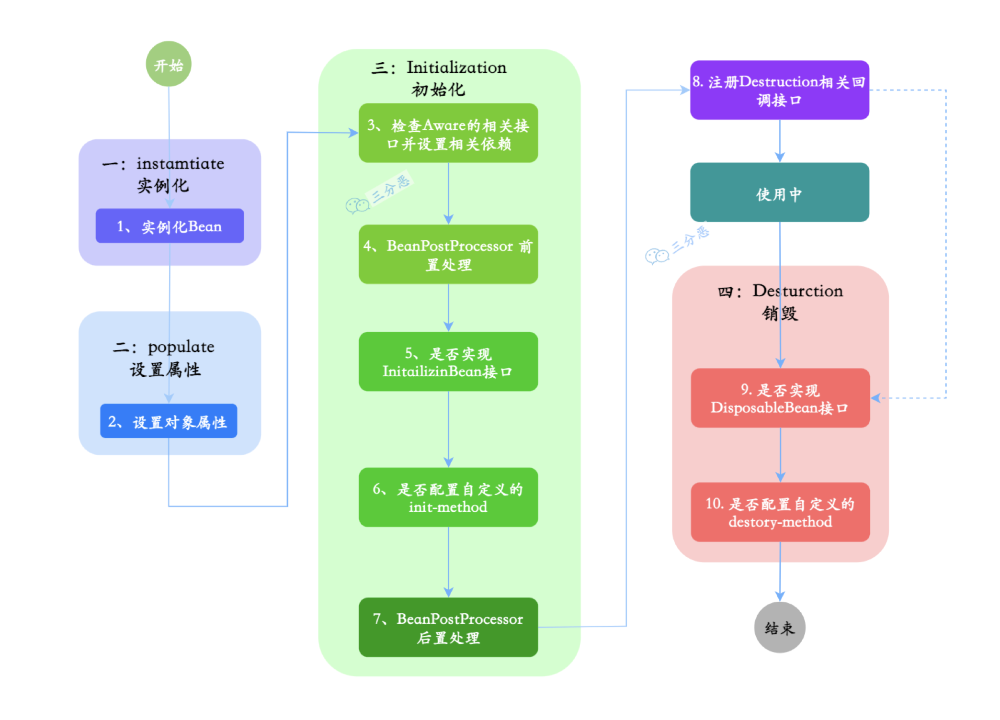

## Part 0: 引入

在实际的开开发项目中，我们可能只需要某些属性是注入的，新建一个属性类显得又有点多余了。在一般情况下我们都会使用 Spring 的 @Value 注解，以实现配置注入的效果。虽然很好用，但是它是项目启动时一次性注入的，而不能随配置的变化而变化。

这篇文章我们将从 Spring 源码开始梳理，一步一步实现一个简单的动态配置刷新。

## Part 1: Spring 源码梳理与解析 (Spring Source Code Analyse)

### 一张图看懂体系
```mermaid
flowchart TD
    A[Spring容器启动] --> B[扫描Bean定义]
    B --> C[注册BeanPostProcessor]
    C --> D[AutowiredAnnotationBeanPostProcessor被注册]
    
    D --> E[开始创建Bean实例]
    E --> F[Bean实例化完成]
    F --> G[属性注入阶段]
    
    G --> H[AutowiredAnnotationBeanPostProcessor执行]
    
    H --> I[扫描Bean中的@Value字段]
    I --> J{发现@Value注解?}
    
    J -->|是| K[创建DependencyDescriptor]
    J -->|否| L[处理其他注解或完成]
    
    K --> M[设置field和required=true]
    M --> N[调用beanFactory.resolveDependency]
    
    N --> O[解析表达式]
    O --> P{表达式类型?}
    
    P -->|配置属性| Q[PropertySourcesPlaceholderConfigurer解析]
    P -->|SpEL表达式| R[SpEL表达式解析]
    P -->|直接值| S[直接使用字面值]
    
    Q --> T[从Environment获取属性值]
    R --> U[执行SpEL表达式]
    S --> V[使用字面值]
    
    T --> W[类型转换]
    U --> W
    V --> W
    
    W --> X[通过反射设置字段值]
    X --> Y[字段注入完成]
    
    Y --> Z[继续处理下一个字段]
    Z --> J
    
    L --> AA[Bean属性注入完成]
    AA --> BB[Bean初始化完成]
```


### 相关类
```java
AccessibleObject (父类)
    ├── Field (字段)
    ├── Method (方法)  
    └── Constructor (构造函数)
```
#### DependencyDescriptor
> 一个描述依赖注入点的数据结构，就像一张数据卡片，包含了 Spring 进行依赖注入所需的所有信息。

包含的信息有很多，比如注入点的信息（什么类的什么位置），以及**注解信息**。
#### InjectionMetadata
> 一个容器，方便管理。

```java
class InjectionMetadata {
    private final Class<?> targetClass;           // 目标类
    private final Collection<InjectedElement> injectedElements;  // 所有需要注入的元素
    
    // 核心方法：执行注入
    public void inject(Object target, String beanName) throws Throwable {
		Collection<InjectedElement> checkedElements = this.checkedElements;
		Collection<InjectedElement> elementsToIterate =
				(checkedElements != null ? checkedElements : this.injectedElements);
		if (!elementsToIterate.isEmpty()) {
			 // 关键：遍历所有 injectedElements，逐个调用 InjectedElement 的 inject()
			for (InjectedElement element : elementsToIterate) {
				element.inject(target, beanName);
			}
		}
	}	
    
    /*
	* 判断是否需要刷新 
	**/
    public static boolean needsRefresh(InjectionMetadata metadata, Class<?> clazz) {  
    	return (metadata == null || this.targetClass != clazz;  
	}
	
	public static InjectionMetadata forElements(Collection<InjectedElement> elements, Class<?> clazz) {
		return (elements.isEmpty() ? new InjectionMetadata(clazz, Collections.emptyList()) :
				new InjectionMetadata(clazz, elements));
	}
}
```

#### InjectedElement
> 一个抽象类，定义了注入元素的基本模板。关键的有 Member（一个接口，Field 是实现之一），以及需要被子类重写的 inject 方法 / getResourceToInject

```java
InjectedElement (抽象父类)
    ├── AutowiredFieldElement (处理字段注入)
    └── AutowiredMethodElement (处理方法注入)
```

```java
public abstract static class InjectedElement {

	protected final Member member;

	protected final boolean isField;

	protected InjectedElement(Member member) {
		this.member = member;
		this.isField = (member instanceof Field);
	}

	protected void inject(Object target, String requestingBeanName)
			throws Throwable {

		if (this.isField) {
			Field field = (Field) this.member;
			ReflectionUtils.makeAccessible(field); // 设置可访问
			field.set(target, getResourceToInject(target, requestingBeanName));  // 设值
		}
	}
	
	/**
	 * 解析
	 */		
	@Nullable
	protected Object getResourceToInject(Object target, String requestingBeanName) {
		return null;
	}

}

```

##### AutowiredFieldElement
> 针对 `InjectionMetadata.InjectedElement` 的具体实现。存储有注解字段的注入信息

```java
/**
 * Class representing injection information about an annotated field.
 */
private class AutowiredFieldElement extends InjectionMetadata.InjectedElement {

	private final boolean required;

	private volatile boolean cached;

	public AutowiredFieldElement(Field field, boolean required) {
		super(field, null);
		this.required = required;
	}

	@Override
	protected void inject(Object bean, String beanName) throws Throwable {
		Field field = (Field) this.member;
		Object value;
	
		value = resolveFieldValue(field, bean, beanName);  // 关键：解析要注入的值

		if (value != null) {
			ReflectionUtils.makeAccessible(field); // 关键：设置为可访问
			field.set(bean, value); // 关键：真正设置值的操作
		}
	}

	@Nullable
	private Object resolveFieldValue(Field field, Object bean, String beanName) {
		// DependencyDescriptor 包含了 @Value("${XXX.XXX}") 的注解信息
		DependencyDescriptor desc = new DependencyDescriptor(field, this.required); 
		desc.setContainingClass(bean.getClass());
		
		// Spring会把解析过程中用到的Bean名称放进去，解析完成后，autowiredBeanNames 就包含了所有相关的Bean名称
		Set<String> autowiredBeanNames = new LinkedHashSet<>(1);
		
		// Spring 的类型转换器，用于处理依赖注入时的类型转换。能根据从配置文件中解析到的值进行合适的类型转换
		TypeConverter typeConverter = beanFactory.getTypeConverter(); 
		
		Object value;

		// 关键：解析依赖 - 处理 @Autowired、@Value、@Resource 等注解
		value = beanFactory.resolveDependency(desc, beanName, autowiredBeanNames, typeConverter); 
		
		return value;
	}
}
```

### 主要流程方法
#### 查找和构建元信息
##### findAutowiringMetadata

```java
InjectionMetadata findMetadata(String beanName, Class clazz) {
	// 有 beanName就用，没有就用类名
    String key = beanName != null ? beanName : clazz.getName();
    
    /*
    * 先查缓存
    * 如果命中缓存，且缓存不需要刷新时，直接返回
    **/
    InjectionMetadata cached = cache.get(key);
    if (cached != null && !cached.needsRefresh()) {
        return cached;
    }
    
    // 缓存失效，重新构建
    synchronized (cache) {
        // 双重检查，避免加锁之前的一瞬间有其它线程刚好对这个key构建好，导致重复构建
        cached = cache.get(key);
        if (cached == null || cached.needsRefresh()) {
            cached = buildMetadata(clazz);  // 这里是真正的扫描逻辑
            cache.put(key, cached);
        }
    }
    return cached;
}


protected boolean needsRefresh(Class<?> clazz) {  
    return this.targetClass != clazz;  
}
```
##### buildAutowiringMetadata

```java
private InjectionMetadata buildAutowiringMetadata(Class<?> clazz) {
	/*
	* 真正构建之前，判断这个类是否是目标类：查找 一下这个类上是否有相关注解
	* autowiredAnnotationTypes 在 AutowiredAnnotationBeanPostProcessor 当构造方法中被初始化
	* 两个值：Autowired.class 、 Value.class
	**/
	if (!AnnotationUtils.isCandidateClass(clazz, this.autowiredAnnotationTypes)) {
		return InjectionMetadata.EMPTY;
	}

	List<InjectionMetadata.InjectedElement> elements = new ArrayList<>();
	Class<?> targetClass = clazz;

	do {
		final List<InjectionMetadata.InjectedElement> currElements = new ArrayList<>();

		/*
		* 遍历当前类的每个字段，收集需要处理的字段信息，不包括使用 static 修饰掉 field
		**/
		ReflectionUtils.doWithLocalFields(targetClass, field -> {
			MergedAnnotation<?> ann = findAutowiredAnnotation(field);
			if (ann != null) {
				if (Modifier.isStatic(field.getModifiers())) {
					return;
				}
				boolean required = determineRequiredStatus(ann); // 确定是否是 required
				currElements.add(new AutowiredFieldElement(field, required));
			}
		});
		
		/*
		* Spring的注入遵循从父类到子类的顺序，这样可以：
		* - 确保父类的依赖先被满足
		* - 子类可能依赖父类已注入的字段
		* - 符合对象初始化的自然顺序
		**/
		elements.addAll(0, currElements);
		targetClass = targetClass.getSuperclass(); // 递归处理父类中的信息
	}
	while (targetClass != null && targetClass != Object.class);

	return InjectionMetadata.forElements(elements, clazz);
}
```

#### findAutowiredAnnotation
> 检查一个字段或方法上是否有指定的注解。

```java
private MergedAnnotation<?> findAutowiredAnnotation(AccessibleObject ao) {
    // 获取这个字段/方法上的所有注解
    MergedAnnotations annotations = MergedAnnotations.from(ao);
    
    // 遍历我们关心的注解类型 (比如 @Value)
    for (Class<? extends Annotation> type : this.autowiredAnnotationTypes) {
       MergedAnnotation<?> annotation = annotations.get(type);
       if (annotation.isPresent()) {
          return annotation;  // 找到了就返回
       }
    }
    return null;  // 没找到任何相关注解
}
```

#### 解析和注入

##### 自动注入Bean后置处理器
> @Autowired 注入 bean, @Value injects 属性

```java
public class AutowiredAnnotationBeanPostProcessor implements SmartInstantiationAwareBeanPostProcessor,
		MergedBeanDefinitionPostProcessor, PriorityOrdered, BeanFactoryAware {

	/*
	* 处理注入
	**/
	public void processInjection(Object bean) throws BeanCreationException {
		Class<?> clazz = bean.getClass();
		InjectionMetadata metadata = findAutowiringMetadata(clazz.getName(), clazz);
		
		metadata.inject(bean, null);
	}
}
```
##### resolveDependency
> 处理 @Autowired、@Value、@Resource 等注解。这里可以先简单一看，后续我们再学习是如何实现的，我们届时会直接用现成的方法。

这个方法在 `DefaultListableBeanFactory` 有实现

```java
public class DefaultListableBeanFactory extends AbstractAutowireCapableBeanFactory  
       implements ConfigurableListableBeanFactory, BeanDefinitionRegistry, Serializable {
       
	public Object resolveDependency(DependencyDescriptor descriptor, @Nullable String requestingBeanName,
				@Nullable Set<String> autowiredBeanNames, @Nullable TypeConverter typeConverter) {
	
		......
		
		result = doResolveDependency(descriptor, requestingBeanName, autowiredBeanNames, typeConverter);  // 最关键的一步
		
	}
	
	public Object doResolveDependency(DependencyDescriptor descriptor, @Nullable String beanName,  
       @Nullable Set<String> autowiredBeanNames, @Nullable TypeConverter typeConverter) {
       
		Object value = getAutowireCandidateResolver().getSuggestedValue(descriptor);  
		if (value != null) {  
			if (value instanceof String) {  
				// 解析占位符 ${...}
			   String strVal = resolveEmbeddedValue((String) value);  
			   // 评估 SpEL 表达式 #{...}
			   BeanDefinition bd = (beanName != null && containsBean(beanName) ?  
					 getMergedBeanDefinition(beanName) : null);  
			   value = evaluateBeanDefinitionString(strVal, bd);  
			}  
			
			TypeConverter converter = (typeConverter != null ? typeConverter : getTypeConverter());  
		   	return converter.convertIfNecessary(value, type, descriptor.getTypeDescriptor());  
		}
		
   	}
}
```

```java
/*
* 读取和处理字段上的注解信息
**/
public class QualifierAnnotationAutowireCandidateResolver extends GenericTypeAwareAutowireCandidateResolver {

	/**
	 * Determine whether the given dependency declares a value annotation.
	 * @see Value
	 */
	@Override
	@Nullable
	public Object getSuggestedValue(DependencyDescriptor descriptor) {
		Object value = findValue(descriptor.getAnnotations());
		if (value == null) {
			MethodParameter methodParam = descriptor.getMethodParameter();
			if (methodParam != null) {
				value = findValue(methodParam.getMethodAnnotations());
			}
		}
		return value;
	}
	
	/**
	 * Determine a suggested value from any of the given candidate annotations.
	 */
	@Nullable
	protected Object findValue(Annotation[] annotationsToSearch) {
		if (annotationsToSearch.length > 0) {   // qualifier annotations have to be local
			AnnotationAttributes attr = AnnotatedElementUtils.getMergedAnnotationAttributes(
					AnnotatedElementUtils.forAnnotations(annotationsToSearch), this.valueAnnotationType);
			if (attr != null) {
				return extractValue(attr);
			}
		}
		return null;
	}
	
	/**
	 * Extract the value attribute from the given annotation.
	 * @since 4.3
	 */
	protected Object extractValue(AnnotationAttributes attr) {
		Object value = attr.get(AnnotationUtils.VALUE);
		if (value == null) {
			throw new IllegalStateException("Value annotation must have a value attribute");
		}
		return value;
	}

}
```


## Part 2: 渐进式实现篇 (Progressive Implementation)


> [!Info] 提示
> 为了保持文章精简，我已取出了一些不重要的代码。仅保留核心的实现
>
> 详情请查看 ([GITHUB 仓库](https://github.com/hachinekooo/demo-lab))

### 容器类
> 保存某个类上所有需要进行值注入的信息

```java
public class ValueMetadata {
    private final Class<?> targetClass; // 目标类

    private final Collection<ValueElement> valueElements; // 所有需要注入的元素

    // 处理注入
    public void processInject(Object target, String beanName) throws Throwable {
        // 遍历 valueElements 、逐个调用 inject()
        if (!valueElements.isEmpty()) {
            for (ValueElement valueElement : valueElements) {
                valueElement.inject(target,beanName);
            }
        }
    }

    // 用来表示需要‘值注入元素’信息的抽象类
    public abstract static class ValueElement {

        protected final Field field;

		// 执行真正注入的方法
        protected void inject(Object target, String requestingBeanName) {
        }

        // 解析将要注入的目标值
        protected Object resolveFieldValue(Field field, Object bean, String beanName) {
            return null;
        }
    }
}
```

在这里我们参考了 `Spring` 的结构，使用 `ValueElement` 封装针对单个 Field 的处理逻辑，这相比使用 

```java
public class ValueMetadata {
    private final Class<?> targetClass;

    private final Collection<Field> fields;

    // 处理注入
    public void processInject(Object target, String beanName) throws Throwable {
        // 遍历 valueElements 、逐个调用 inject()
        if (!valueElements.isEmpty()) {
            for (Field field : fields) {
                inject(target,beanName);
            }
        }
    }

	// 执行真正注入的方法
	protected void inject(Object target, String requestingBeanName) {
	}

	// 解析将要注入的目标值
	protected Object resolveFieldValue(Field field, Object bean, String beanName) {
		return null;
	}
}
```

结构上要更加清晰一些。职责更加分明且拓展性更强，我们可以有不同的实现，自定义不同的解析注入逻辑，以适配更多场景。

### ValueElement 的实现
> 一个具体的实现，用于属性值。

```java
public class PropertyValueElement extends ValueMetadata.ValueElement {

    private ConfigurableListableBeanFactory beanFactory;

    @Override
    // 实现具体的注入逻辑
    protected void inject(Object target, String requestingBeanName) {
        // 将 field 设置为可以访问，避免 private 的问题
        ReflectionUtils.makeAccessible(field);

        // 解析想要对 field 设置的目标值
        Object value = resolveFieldValue(field, target, requestingBeanName);

        // 赋值
		field.set(target, value);
    }

    @Override
    protected Object resolveFieldValue(Field field, Object bean, String beanName) {
        /*
        * 1.创建依赖描述符，包装字段信息，描述这个字段的依赖关系
        * */
        DependencyDescriptor desc = new DependencyDescriptor(field, true);

        // 2.告诉Spring这个字段属于哪个类
        desc.setContainingClass(bean.getClass());

        // 3.获取类型转换器，用于转换值的类型
        TypeConverter converter = beanFactory.getTypeConverter();

        /*
         * 4.用于检测循环依赖的 Set
         * Spring会把解析过程中用到的Bean名称放进去，
         * 解析完成后，autowiredBeanNames 就包含了所有相关的Bean名称
         * */
        Set<String> autowiredBeanNames = new LinkedHashSet<>(1);

        // 5.使用 beanFactory 解析依赖
        Object valueObj;
        valueObj = beanFactory.resolveDependency(desc, beanName, autowiredBeanNames, converter);

        return valueObj;
    }
}
```

值得注意的是 `new DependencyDescriptor(field, true)` 这一行，对于 @Value 来说，第二个参数（required）必须设置为 true，

```java
@Target({ElementType.FIELD, ElementType.METHOD, ElementType.PARAMETER, ElementType.ANNOTATION_TYPE})
@Retention(RetentionPolicy.RUNTIME)
@Documented
public @interface Value {
    String value();
}
```

在 Spring 中使用 @Value 注解时，我们无法使用 required 控制，它必须要有对应的配置以进行值注入，否则会报错，它是必须的。  
对于其它的，比如 `@Autowired` 注解：

```java
@Target({ElementType.CONSTRUCTOR, ElementType.METHOD, ElementType.PARAMETER, ElementType.FIELD, ElementType.ANNOTATION_TYPE})
@Retention(RetentionPolicy.RUNTIME)
@Documented
public @interface Autowired {
    boolean required() default true;  // 可以控制是否必需
}
```

区别：

- `@Autowired(required = false)` 👉 找不到bean时注入 `null`，不报错
- `@Autowired(required = true)` 👉 找不到bean时抛出异常（默认行为）

所以：

- `@Value`: 天生就是required，无法设置为 optional
- `@Autowired`: 可以通过 `required` 属性控制是否必需

这就是为什么我们直接在代码中直接写死为 true 的原因了。

### Value 注解处理器

```java
@Slf4j
@Component
@Order(Ordered.HIGHEST_PRECEDENCE)  // 添加这行确保最高优先级
public class ValueAnnotationProcessor implements ApplicationContextAware, BeanFactoryAware, InitializingBean, EnvironmentAware {

    private ConfigurableListableBeanFactory beanFactory;

    private ApplicationContext applicationContext;

    private final Set<Class<? extends Annotation>> autowiredAnnotationTypes = new LinkedHashSet<>(4);

    public ValueAnnotationProcessor() {
        this.autowiredAnnotationTypes.add(Value.class);
    }

    // 构建元信息
    private ValueMetadata buildMetadata(Class<?> clazz) {
        Class<?> targetClass = clazz;

        // 创建一个 list ，以收集所有的 @ValueElement，也包括父类中的
        List<ValueMetadata.ValueElement> elements = new ArrayList<>();

        do {
            List<ValueMetadata.ValueElement> currElements = new ArrayList<>();

            // 使用 ReflectionUtils.doWithLocalFields() 遍历字
            ReflectionUtils.doWithLocalFields(targetClass, field -> {
                MergedAnnotation<?> annotation = findAutowiredAnnotation(field);
                if (annotation != null) {
                    boolean isStatic = Modifier.isStatic(field.getModifiers());
                    if (isStatic) { // 静态变量不做处理
                        return;
                    }

                    // 如果有 @Value 注解，包装 成 ValueElement 放入 list
                    PropertyValueElement propertyValueElement = new PropertyValueElement(field, beanFactory);
                    currElements.add(propertyValueElement);
                }

            });

            // Spring的注入遵循从父类到子类的顺序，确保父类的依赖先被满足
            elements.addAll(0, currElements);
            targetClass = targetClass.getSuperclass();
        } while (targetClass != null && targetClass != Object.class);

        return ValueMetadata.forElements(elements, clazz);
    }

	// 处理 Value 值注入
    public void processValueInject(String targetBean) {
        if (targetBean == null) { // 对所有 bean 都执行
            // 从 ApplicationContext 获取所有 beans
            String[] allBeansName = applicationContext.getBeanDefinitionNames();
            for (String beanName : allBeansName) {
                Object bean = applicationContext.getBean(beanName);

				// 循环构建元信息
				ValueMetadata valueMetadata = buildMetadata(bean.getClass());
				// 调用处理注入的方法
				valueMetadata.processInject(bean, beanName);
            }
        } else { // 对目标 bean 执行
            Object targetBeanObj = applicationContext.getBean(targetBean);
            
			// 构建目标 bean 的元信息 ValueMetadata
			ValueMetadata valueMetadata = buildMetadata(targetBeanObj.getClass());
			// 调用 ValueMetadata 中处理注入的方法
			valueMetadata.processInject(targetBeanObj, targetBean);
        }
    }

    private MergedAnnotation<?> findAutowiredAnnotation(AccessibleObject ao) {
        // 收集这个字段上的所有注解
        MergedAnnotations an = MergedAnnotations.from(ao);

        for (Class<? extends Annotation> autowiredAnnotationType : autowiredAnnotationTypes) {
            MergedAnnotation<? extends Annotation> mergedAnnotation = an.get(autowiredAnnotationType);
            if (mergedAnnotation.isPresent()) {
                return mergedAnnotation;
            }
        }

        return null;  // 没找到任何相关注解
    }

    // ============================= 拉取配置，添加配置源，后期抽离出来做成单独的工具 ====================

    private ConfigurableEnvironment environment;

    private Map<String, Object> dynamicConfigs = new HashMap<>(); // 配置信息缓存

    private static final String DYNAMIC_CONFIG_PROPERTY_SOURCE_NAME = "dynamic-config";

    @Autowired
    private GlobalConfMapper globalConfMapper;

    public boolean loadConfigFromDb(String targetGroup) {
		// 和属性类的动态刷新中的一样
    }

    public void addPropertySource() {
       // 和属性类的动态刷新中的一样
    }
}
```

我们在实现处理器的时候，没有使用这种 [dynamic-config-configuration](dynamic-config-configuration.md) 一样的初始化方式：

> [!quote] 引用
> @Override
>     public void run(String... args) throws Exception {
>         reloadConfig(null);
>     }

在之前在实现实现属性类的动态刷新时，我们使用了 `Spring` `CommandLineRunner#run` 以实现程序启动后拉取配置的操作，其实即使没有这步拉取，`Spring` 也帮我们自动配置好了配置文件中的默认值了，所以没有问题。  

本次我没有在配置文件中配置默认值，所以我们在这里使用同样的方式，则会报错，这是因为 `@Value` 的值是会在 Spring 生命周期中初始化阶段的 `AutowiredAnnotationBeanPostProcessor` 被处理。在这个阶段没有在配置文件中读取到对应值时，就报错了。

为了避免这种问题，我们使用的是 `@Order(Ordered.HIGHEST_PRECEDENCE)` + `InitializingBean` 的方式。  
`@Order(Ordered.HIGHEST_PRECEDENCE)` 确保这个 Bean 在实例化的时候可以被优先实例化，然后调用 `InitializingBean#afterPropertiesSet` 方法，在方法中从数据库拉取，设置数据源。这样在后续其他 Bean 实例化（包括 Bean 后置处理器，它本质也是 Bean）时，就能从配置类中获取配置信息了，从而保证后续 Spring Bean 后置处理器进行 Value 值注入时正确。   



当然你也可以采用直接在配置文件中配置默认值的方式，这样更简单。

ValueAnnotationProcessor 实例化完毕之后，我们在后续调用 API 接口，修改配置信息时，调用 ValueAnnotationProcessor 中的相关方法进行刷新即可，当然，你也可以使用线程池来实现定时刷新，JUST BE LIKE：

```java
/**
 * 注册db的动态配置变更
 */
private void registerConfRefreshTask() {
    Executors.newScheduledThreadPool(1).scheduleAtFixedRate(() -> {
        try {
            reloadConfig();
        } catch (Exception e) {
            log.warn("自动更新db配置信息异常!", e);
        }
    }, 5, 5, TimeUnit.MINUTES);
}
```

## Part 3: 性能优化（Performance Optimization）
### 引入缓存机制

我们可以通过引入缓存，来避免每次都要构建元信息造成的性能浪费。


## Part 4: 总结与扩展 (Summary & Extensions)