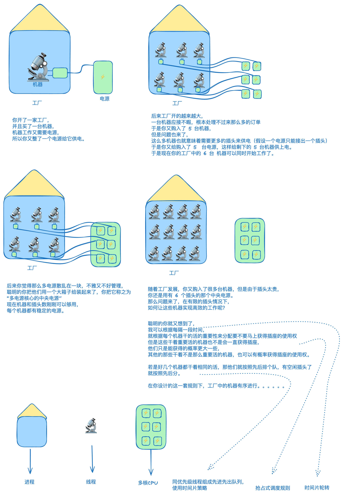
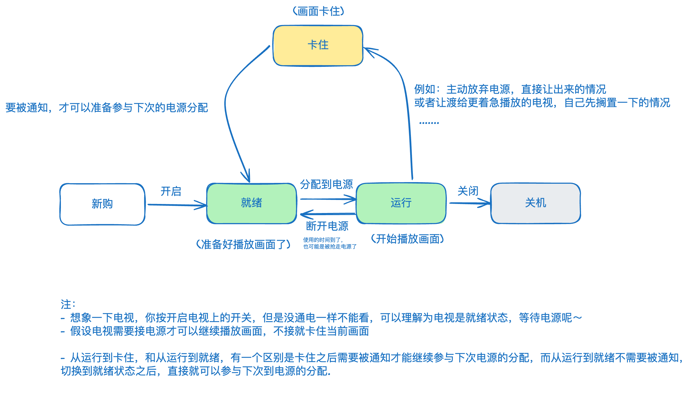
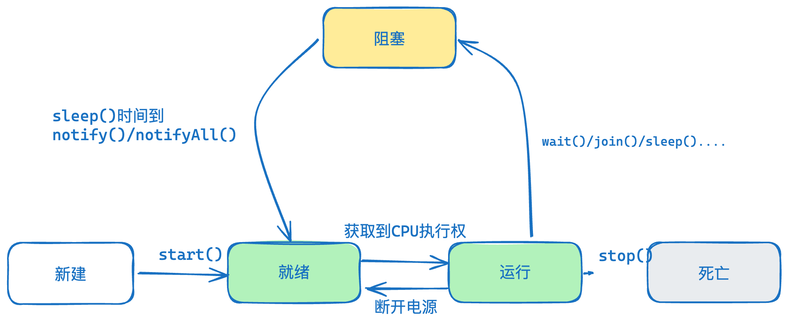
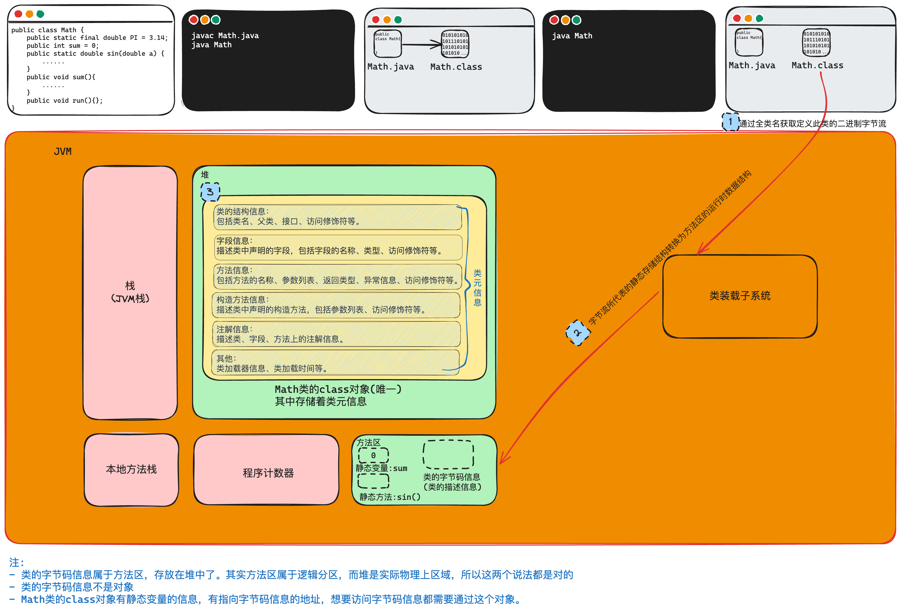
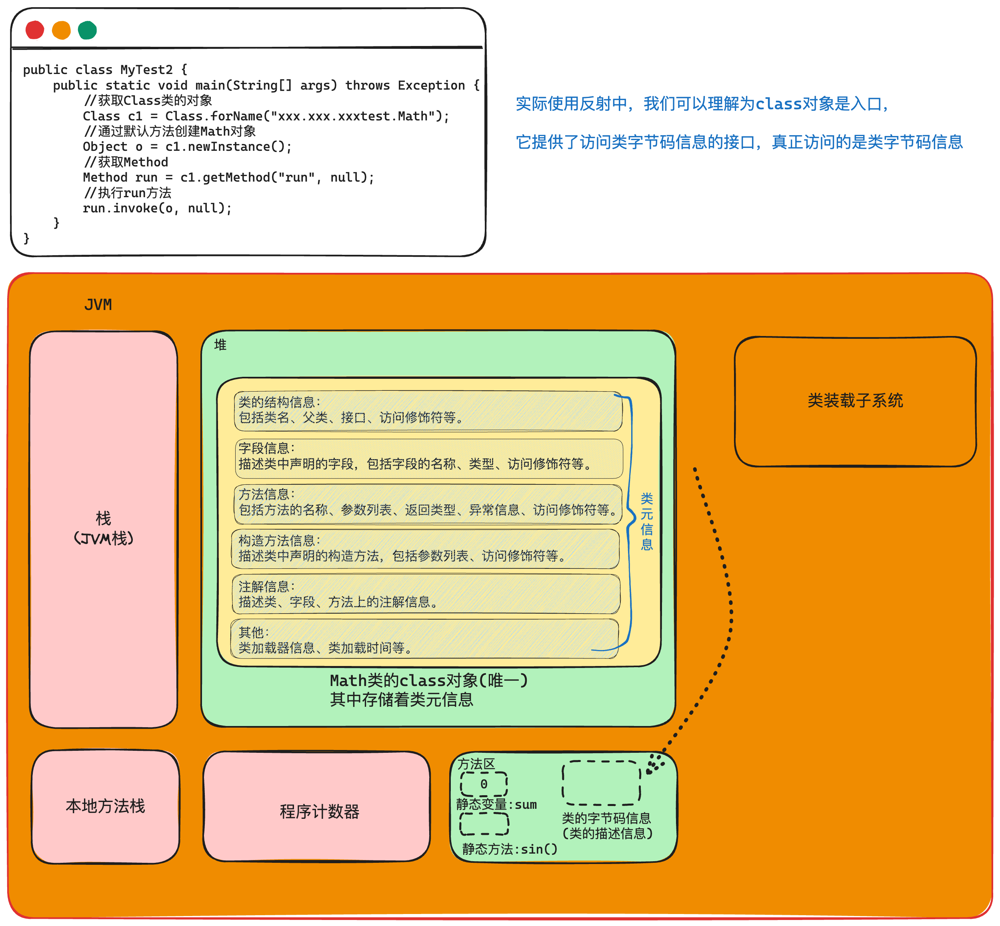

## IO
`I/O`技术用于处理设备之间的数据传输
>`IO流`是一组有序的，有起点和终点的数据集合，是对数据传输的总称和抽象。
<font color=#646a73>*更新时间：2024-01-31 17:23:52*</font>

`IO` 流的源和目的地：
- 内存
- 控制台
- 磁盘文件
- 网络端点

关于 `Input` 和 `Output`：
- `Input` 读取外部数据(磁盘、光盘等存储设备的数据)到程序(<font color="#de7802">内存</font>)中；
- `Output` 将程序(<font color="#de7802">内存</font>)数据输出到磁盘、光盘等存储设备中。
### IO 的分类
- 按照处理的数据单元不同：
	- 字节流：操作的数据单元是 `8` 位字节，`InputStream`、`OutputStream`。二进制文件(声音、图片、视频)、文本文件；
	- 字符流：操作的数据单元是 `16` 位字符，`Reader`、`Writer`，通常用于处理文本文件。
- 按照数据流流向不同：
	- 输入流：只能从中读取数据，而不能向其写入数据。`InputStream`、`Reader`；
	- 输出流：只能向其写入数据，而不能从中读取数据。`OutputStream`、`Writer`；

输入、输出都是从内存的角度进行划分，内存-->硬盘，输出流；硬盘-->内存，输入流。

| 流类型 | 字节流               | 字符流               |
|--------|----------------------|----------------------|
| 输入流 | `InputStream`        | `Reader`             |
| 输出流 | `OutputStream`       | `Writer`             |


Java 的 IO 流共涉及 40 多个类，实际上非常规则，都是从上面 4 个抽象基类派生的。

由这四个类派生出来的子类名称都是以其父类名作为子类名后缀。


`FileTest.java`
### FILE 类的基本操作
> `File` 类被定义为**文件和目录路径名的抽象表示形式**，这是因为 `File` 类既可以表示**文件**也可以表示**目录**，他们都通过对应的路径来描述。

`FileTest.java`
```java
package com.situ.iolearning;

import java.io.File;
import java.text.SimpleDateFormat;
import java.util.Date;

public class FileTest {
    public static void main(String[] args) {
        File file1 = new File("/Users/wangwenpeng/Code/JavaDeveloper/basic/HelloWorld.java");
        System.out.println(file1.isFile());
        System.out.println(file1.canRead());
        System.out.println(file1.canWrite());
        System.out.println(file1.length());
        System.out.println(file1.getAbsoluteFile());
        System.out.println(file1.getName());
        System.out.println(file1.isDirectory());
        System.out.println(file1.isFile());
        System.out.println(file1.isHidden());
        System.out.println(file1.lastModified());
        Date date = new Date(file1.lastModified());
        SimpleDateFormat sft = new SimpleDateFormat("yyyy年MM月dd日 HH:mm:ss");
        String str = sft.format(date);
        System.out.println(str);

        //File file2 = new File("/Users/wangwenpeng/Code/JavaDeveloper/basic/fileclasstest");
        //if (!file2.exists()) {
        //    file2.mkdir();
        //}

        //file2.delete();//删除文件夹

        //不可以列出下下一级文件夹中的内容。
        File file3 = new File("/Users/wangwenpeng/Code/JavaDeveloper/basic/山东");
        File[] files = file3.listFiles();
        //for (File file : files) {
        //    System.out.println(file);
        //}

        listAll("|--", file3);


    }

    //可以列出子文件夹中内容的方法
    public static  void listAll(String head, File file) {
        File[] files = file.listFiles();//列出第一层级的内容，返回一个文件类型的数组，这个数组中有的是文件夹，有的是文件
        for (File f : files) {//遍历数组
            System.out.println(head + f.getName());//打印
            if (f.isDirectory()) {//判断当前这个file类型的对象 f 是否是文件夹，如果是文件夹就再调用一次 自身。并且调用之前传一个 tab，这样这一次的调用打印时头部就是 tab + 文件名了
                listAll("\t" + head , f);
            }
        }
    }
}
```
### 字节流
>操作的数据单元是**8位字节**，主要涉及两个抽象类：`InputStream`、`OutputStream`。

`InputStreamTest.java`
```java
package com.situ.iolearning;

import java.io.FileInputStream;
import java.io.IOException;

public class InputStreamTest {
    public static void main(String[] args) throws IOException {
        FileInputStream in = new FileInputStream("/Users/wangwenpeng/Code/JavaDeveloper/basic/山东/666.txt");

        byte[] arr = new byte[16];

        //这个处理方式可能会最后一次读取的字节不够16，导致覆盖数组的时候会覆盖不全，所以最有一次打印有概率出现之前的字符串
        //while (in.read(arr) != -1) {
        //    //System.out.println(Arrays.toString(arr));
        //    String s = new String(arr);
        //    System.out.println(s);
        //}

        //处理方法：
        //第1种表达形式：：
        //int len = 0;
        //while ((len = in.read(arr,0,arr.length)) != -1) {
        //    String s = new String(arr, 0, len);
        //    System.out.println(s);
        //}

        //第2种表达形式：：
        int len = 0;
        while ((len = in.read(arr)) != -1) {
            String s = new String(arr, 0, len);
            System.out.println(s);
        }

        in.close();

    }
}
```
`OutputStreamTest.java`
```java
package com.situ.iolearning;  
  
import java.io.FileOutputStream;  
import java.io.IOException;  
  
public class OutputStreamTest {  
    public static void main(String[] args) throws IOException {  
        FileOutputStream out = new FileOutputStream("/Users/wangwenpeng/Code/JavaDeveloper/basic/山东/out.txt");  
        String str = "helloJava";  
  
        byte[] arr = str.getBytes();    //String --> byte[] 要先换成 byte  
  
        out.write(arr,0,arr.length);    //把数组 arr 中的，从 0开始，数组有多长就写入多长  
        out.close();    //关闭流  
    }  
}
```
`CopyFile.java`
通过输入流输出流实现复制文件功能
```java
package com.situ.iolearning;  
  
import java.io.FileInputStream;  
import java.io.FileOutputStream;  
import java.io.IOException;  
  
public class CopyFile {  
    public static void main(String[] args) throws IOException {  
        FileInputStream in = new FileInputStream("/Users/wangwenpeng/Code/JavaDeveloper/basic/山东/google.txt");  
        FileOutputStream out = new FileOutputStream("/Users/wangwenpeng/Code/JavaDeveloper/basic/山东/google_new.txt");  
  
        int len = 0;  
        byte[] arr = new byte[128]; //用于存储的缓冲数组  
        while ((len = in.read(arr)) != -1) {    //只要没读到末尾就读  
            out.write(arr,0,len);   //把arr数组，从0 开始，把 len 个长度写入  
        }  
  
        //先打开的后关闭  
        out.close();  
        in.close();  
  
    }  
}
```
### 字符流
> 操作的数据单元是**16位字符**，主要涉及两个抽象类：`Reader`、`Writer`，通常用于处理文本文件。

`InputReaderTest.java`
```java
package com.situ.iolearning;  
  
import java.io.FileReader;  
  
public class InputReaderTest {  
    public static void main(String[] args) throws Exception {  
        //创建流  
        FileReader in = new FileReader("/Users/wangwenpeng/Code/JavaDeveloper/basic/山东/google.txt");  
  
        //使用流  
  
        int len; //用于存储每次读取之后返回的长度  
        char[] arr = new char[128]; //创建一个用于暂存的数组  
  
        //read() 方法的返回值是这次读取的长度，如果读到末尾，则返回 -1        
        //从输入流中每次读取128个字符，放入到数组中，并且返回每次读取的长度(注意，最后一次读取的长度可能不是128)  
  
        while ((len = in.read(arr)) != -1) {    //  首先用 len 把这次读取的长度存储，并且判断是否到文件尾  
            //刚刚读了多少的东西，就把多少的东西从数组的0号位置开始取出来放到字符串中  
            String str = new String(arr,0,len); //字符数组 -> 字符串  
            System.out.print(str);  
        }  
        //关闭流  
        in.close();  
    }  
}
```
`FileWriter.java`
```java
package com.situ.iolearning;  
  
import java.io.FileWriter;  
  
public class OutputWriteTest {  
    public static void main(String[] args) throws Exception {  
        //创建流  
        FileWriter out = new FileWriter("/Users/wangwenpeng/Code/JavaDeveloper/basic/山东/out2.txt");  
  
  
        //使用流  
        String str = "what the fork say?";  
        out.write(str);  
  
        //还有一种使用先把字符串转换成字符数组的方式  
        //char[] arr = new char[128];  
        //out.write(arr,0,arr.length);  
  
        //关闭流  
        out.close();  
    }  
}
```
`CopyFile_CharStream.java`
实现复制文件功能
```java
package com.situ.iolearning;  
  
import java.io.FileReader;  
import java.io.FileWriter;  
  
public class CopyFile_CharStream {  
    public static void main(String[] args) throws Exception {  
        //创建流  
        FileReader in = new FileReader("/Users/wangwenpeng/Code/JavaDeveloper/basic/山东/google.txt");  
        FileWriter out = new FileWriter("/Users/wangwenpeng/Code/JavaDeveloper/basic/山东/google_new2.txt");  
  
        //使用流  
        int len;  
        char[] arr = new char[128];  
        while ((len = in.read(arr)) != -1) {  
            out.write(arr,0,len); //刚刚读了多少长度(len)的的东西，就从数组的 0 号位置拿出多少东西写  
        }  
        //关闭流  
        in.close();  
        out.close();  
    }  
}
```

### 缓冲流
>为了提高数据读写的速度，Java API 提供了带缓冲功能的流类，在使用这些流类时，会创建一个内部缓冲区数组，默认使用**8192**个字节或字符的缓冲区。缓冲流要**套接**在相应的节点流之上。

| 分类 |  |
| ---- | ---- |
| `BufferedInputStream` | `BufferedOutputStream` |
| `BufferedReader` | `BufferedWriter` |

当使用 `BufferedInputStream` 读取字节文件时，`BufferedInputStream` 会一次性从文件中读取 `8192个(8Kb)`，存在缓冲区中，直到缓冲区装满了，才重新从文件中读取下一个8192个字节数组。


向流中写入字节时，不会直接写到文件，先写到缓冲区中直到缓冲区写满，`BufferedOutputStream` 才会把缓冲区中的数据一次性写到文件里。使用方法 `flush()` 可以强制将缓冲区的内容全部写入输出流。

**关闭流的顺序和打开流的顺序相反**。**只要关闭最外层流即可**，关闭最外层流也会相应关闭内层节点流。

#### 使用缓冲流实现文件拷贝
`CopyFile_CacheStream.java`
```java
package com.situ.iolearning;  
  
import java.io.*;  
  
public class CopyFile_CacheStream {  
    public static void main(String[] args) throws Exception {  
        BufferedReader in = new BufferedReader(new FileReader("/Users/wangwenpeng/Code/JavaDeveloper/basic/山东/google.txt"));  
        BufferedWriter out = new BufferedWriter(new FileWriter("/Users/wangwenpeng/Code/JavaDeveloper/basic/山东/google_new3.txt"));  
  
        int len;  
        char[] arr = new char[128];  
        while ((len = in.read(arr)) != -1){  
            out.write(arr,0,len);  
        }  
  
        in.close();  
        out.close();  
    }  
}
```

#### 按行读取
`ReadLineTest.java`
```java
package com.situ.iolearning;  
  
import java.io.BufferedReader;  
import java.io.FileReader;  
  
public class ReadLineTest {  
    public static void main(String[] args) throws Exception {  
        BufferedReader in = new BufferedReader(new FileReader("/Users/wangwenpeng/Code/JavaDeveloper/basic/山东/readbyline.txt"));  
  
        int len;  
        String line = null;  
        while ((line = in.readLine()) != null) {  
            System.out.println(line);  
        }  
  
        in.close();  
    }  
}
```


## 多线程

### 基本概念
- 程序
	- 是为完成特定任务、用某种语言编写的一组<font color="#de7802">指令的集合</font>。即指一段<font color="#de7802">静态</font>的代码，静态对象。
- 进程
	- 程序的一次执行过程，或是正在运行的一个程序。
	- 进程是动态的,进程作为资源分配的单位，系统在运行时会为每个进程分配不同的内存区域。
- 线程
	- 线程是进程的最小执行单位，是 CPU 的最小调度单位
	- 进程的进一步细化
	- 若一个进程同一时间并行执行多个线程，那它就是支持多线程的
	- 线程的切换开销更小
	- 一个进程中的多个线程<font color="#de7802">共享</font>相同的内存单元/内存地址空间，它们从同一堆中分配对象，可以访问相同的变量和对象。但是这也会带来访问的一些问题
	- 每个 Java 程序都有一个隐含的主线程：`main` 方法。

### 线程的调度和生命周期
调度策略:

- 基于时间片轮转；
- 抢占式：高优先级的线程抢占 CPU。

调度方法：
- 同优先级线程组成先进先出队列，使用时间片策略
- 对高优先级，使用优先调度的抢占式策略
- Java中线程优先级的范围是1~10，默认的优先级是5
    - `MAX_PRIORITY(10)`
    - `MIN_PRIORITY(1)`
    - `NORM_PRIORITY(5)`

涉及到的方法：
- `setPriority(int newPriority)`：设置线程的优先级
- `getPriority()`：获取线程的优先级
- `yield()`：线程让步
    - 暂停当前正在执行的线程，把执行机会让给优先级相同或更高的线程
    - 若队列中没有同优先级的线程，忽略此方法
- `join()`：
    - 当某个程序执行流中调用其他线程的`join()`方法时，**调用线程将被阻塞**，直到`join()`方法加入的`join`线程执行完为止
    - 低优先级的线程也可以获得执行
- `sleep(long millis)`：令当前活动线程在指定时间段内放弃对CPU控制,使其他线程有机会被执行,时间到后重排队
- `stop()`：强制线程生命期结束
- `isAlive()`：判断线程是否还活着



- **新建**： 当一个 `Thread` 类或其子类的对象被声明并创建时，新生的线程对象处于新建状态；
- **就绪**：处于新建状态的线程被 `start()` 后，将进入线程队列**等待 CPU 时间片**，此时它已具备了运行的条件；
- **运行**：当就绪的线程被调度并获得处理器资源时，便进入运行状态， `run()` 方法定义了线程的操作和功能；
- **阻塞**：在某种特殊情况下，被人为挂起或执行输入输出操作时，让出 CPU 并临时中止自己的执行，进入阻塞状态；
- **死亡**：线程完成了它的全部工作或线程被提前强制性地中止。



### 线程的创建和使用
>在同一时间需要处理多个任务时就可以使用多线程。
#### 继承 Thread 类
>继承 `Thread` 类，重写 `run` 方法

- 编写继承 `Thread ` 类，重写 `run()` 方法的 <font color="#de7802">Thread 子类</font> （定义任务）
- 根据此 <font color="#de7802">Thread 子类</font> 创建线程对象 （创建执行任务的线程）
- 调用线程对象 `start` 方法 （线程开始）

`EatThread.java`
```java
package com.situ.threadlearning.basic;  
  //吃饭线程的定义
public class EatThread extends Thread{  
    @Override  
    public void run() {  
        for (int i = 0; i < 100; i++) {  
            System.out.println("吃饭");  
            //现代处理器运行速度太快了，处理简单的for直接完成了，不睡眠一下都来不及且换下个线程  
            try {  
                Thread.currentThread().sleep(100);  
            } catch (InterruptedException e) {  
                throw new RuntimeException(e);  
            }  
        }  
    }  
}
```
`DrinkThread.java`
```java
package com.situ.threadlearning.basic;  
  //喝酒线程的定义
public class DrinkThread extends Thread{  
    public void run() {  
        for (int i = 0; i < 100; i++) {  
            System.out.println("喝酒");  
            //现代处理器运行速度太快了，处理简单的for直接完成了，不睡眠一下都来不及且换下个线程  
            try {  
                Thread.currentThread().sleep(100);  
            } catch (InterruptedException e) {  
                throw new RuntimeException(e);  
            }  
        }  
    }  
}
```
`ChatThread.java`
```java
package com.situ.threadlearning.basic;  
//吃饭线程的定义
public class ChatThread extends Thread{  
    public void run() {  
        for (int i = 0; i < 100; i++) {  
            System.out.println("聊天");  
            //现代处理器运行速度太快了，处理简单的for直接完成了，不睡眠一下都来不及且换下个线程  
            try {  
                Thread.currentThread().sleep(100);  
            } catch (InterruptedException e) {  
                throw new RuntimeException(e);  
            }  
        }  
    }  
}
```
`Test.java`
```java
package com.situ.threadlearning.basic1;  
  
public class Test {  
    public static void main(String[] args) {  
        //分别创建了三个线程的对象  
        ChatThread chat = new ChatThread();  
        DrinkThread drink = new DrinkThread();  
        EatThread eat = new EatThread();  
        //启动这三个线程  
        chat.start();  
        drink.start();  
        eat.start();  
    }  
}
```

```shell
结果是在控制台中没有规律的打印 吃饭 喝酒 聊天

在 main 这个主线程按顺序运行完三个 start() 之后，就启动这三个子线程，这三个线程就有获得CPU时间片的资格了，待他们获得时间片后就会运行自己的 run方法体 中的东西。
实际上的情况是这三个字线程同时在运行，如果控制台支持的话，打印的情况应该是这样的：
｜----------------------------｜--------------------------｜---------------------------------｜
｜聊天                          吃饭                         喝酒
｜聊天                          吃饭                         喝酒
｜聊天                          吃饭                         喝酒
｜聊天                          吃饭                         喝酒
｜聊天                          吃饭                         喝酒
｜聊天                          吃饭                         喝酒

但是实际上在控制台中同时只能被 一个线程占用，所以还是按着顺序来的。
```

`chat`、`drink`、`eat` 是三个独立的对象。这三个线程对象之间没有共享的公共数据（实例变量），它们是相互独立的。

##### Thread 的相关方法
相关方法：
- `start()`：启动线程，并执行对象的`run()`方法；
- `run()`：线程在被调用时执行的操作；
- `getName()`：返回线程的名称；
- `setName()`：设置线程的名称；
- `currentThread()`：返回当前线程。

`ThreadClass.java`
```java
package com.situ.threadlearning.basic3;  
  
public class ThreadClass extends Thread{  
    public void run() {  
        for (int i = 0; i < 10; i++) {  
            System.out.println(Thread.currentThread().getName() + "\t第" + i + "次");  
            try {  
                Thread.currentThread().sleep(100);  
            } catch (InterruptedException e) {  
                throw new RuntimeException(e);  
            }  
        }  
    }  
}
```
`ThreadClass2.java`
```java
package com.situ.threadlearning.basic3;

public class ThreadClass2 extends Thread{
    private Thread thread;
    public ThreadClass2() {
    }

    public ThreadClass2(Thread thread) {
        this.thread = thread;
    }

    public void run() {
        for (int i = 0; i < 10; i++) {
            System.out.println(Thread.currentThread().getName() + "\t第" + i + "次");


            /*
             * 当运行到 第 5 次时，当前线程(thread222)会执行thread111.join()方法，
             * 这会阻塞 thread111.join() 的调用线程(thread222)，
             * thread222 线程阻塞，然后转而去把 thread111线程 进行完，然后再执行线程 thread222
             *
             * */
            try {
                if (i == 4) {
                    thread.join();
                }
                Thread.currentThread().sleep(3);
            }catch (InterruptedException e) {
                throw new RuntimeException();
            }
        }
    }
}
```
`ThreadClassTest.java`
```java
package com.situ.threadlearning.basic3;  
  
public class ThreadClassTest {  
    public static void main(String[] args) throws Exception {  
        Thread.currentThread().setName("主线程");  
  
        ThreadClass thread111 = new ThreadClass();//创建线程对象 thread111        
        thread111.setName("thread111线程");//给thread111线程设置名字  
  
        /*  
        * 创建线程对象 thread222，创建时传入了线程对象 thread111的引用(地址)  
        * 这意味着 在thread222中，有了找到 thread111的 能力  
        * */        
        ThreadClass2 thread222 = new ThreadClass2(thread111);  
        thread222.setName("thread222线程");//给thread222设置名字  
  
        thread111.start();//启动thread111线程  
        thread222.start();//启动thread222线程  
  
    }  
}
```

#### 实现 Runnable 接口
>实现 `Runnable` 接口，重写 `run()`

- 编写实现 `Runnable` 接口，重写 `run` 方法的实现类（定义任务）
- 根据此实现类创建<u>接口实现类对象</u> （定义任务）
- 将<u>接口实现类的对象</u>作为实际参数传递给 `Thread` 类的构造方法中，创建出线程对象 （创建执行任务的线程）
- 调用线程对象的 `start` 方法：开启线程 （线程开始）

优点：
- 避免了单继承的局限性；
- 多个线程可以共享同一个接口实现类的对象，**非常适合多个相同线程来处理同一份资源**。

`Eat.java`
```java
package com.situ.threadlearning.basic2;  
  
public class Eat implements Runnable{  
    @Override  
	    public void run() {  
        for (int i = 0; i < 100; i++) {  
            System.out.println("吃饭");  
            //现代处理器运行速度太快了，处理简单的for直接完成了，不睡眠一下都来不及且换下个线程  
            try {  
                Thread.currentThread().sleep(100);  
            } catch (InterruptedException e) {  
                throw new RuntimeException(e);  
            }  
        }  
    }  
}

```
```java
package com.situ.threadlearning.basic2;  
  
public class Chat implements Runnable{  
    @Override  
    public void run() {  
        for (int i = 0; i < 100; i++) {  
            System.out.println("聊天");  
            //现代处理器运行速度太快了，处理简单的for直接完成了，不睡眠一下都来不及且换下个线程  
            try {  
                Thread.currentThread().sleep(100);  
            } catch (InterruptedException e) {  
                throw new RuntimeException(e);  
            }  
        }  
    }  
}
```
`Drink.java`
```java
package com.situ.threadlearning.basic2;  
  
public class Drink implements Runnable{  
    @Override  
    public void run() {  
        for (int i = 0; i < 100; i++) {  
            System.out.println("喝酒");  
            //现代处理器运行速度太快了，处理简单的for直接完成了，不睡眠一下都来不及且换下个线程  
            try {  
                Thread.currentThread().sleep(100);  
            } catch (InterruptedException e) {  
                throw new RuntimeException(e);  
            }  
        }  
    }  
}
```
`Test.java`
```java
package com.situ.threadlearning.basic2;  
  
public class Test {  
    public static void main(String[] args) {  
        //创建 Runnable 接口实现类的对象  
        Eat eat = new Eat();  
        Drink drink = new Drink();  
        Chat chat = new Chat();  
        //使用传入Runnable接口实现类对象的方式 创建线程对象  
        Thread t1 = new Thread(eat);  
        Thread t2 = new Thread(drink);  
        Thread t3 = new Thread(chat);  
        Thread t4 = new Thread(new Runnable() {//使用匿名内部类创建一个实现 Runnable接口重写run的接口实现类  
            @Override  
            public void run() {  
                for (int i = 0; i < 5; i++) {  
                    System.out.println(Thread.currentThread().getName() + "\t唱歌");  
                    //现代处理器运行速度太快了，处理简单的for直接完成了，不睡眠一下都来不及且换下个线程  
                    try {  
                        Thread.currentThread().sleep(100);  
                    } catch (InterruptedException e) {  
                        throw new RuntimeException(e);  
                    }  
                }  
            }  
        });  
          
        t1.start();  
        t2.start();  
        t3.start();  
        t4.start();  
        System.out.println(Thread.currentThread().getName());  
  
    }  
}
```

```shell
main
Thread-0	吃饭
Thread-2	聊天
Thread-3	唱歌
Thread-1	喝酒
Thread-0	吃饭
Thread-2	聊天
Thread-1	喝酒
Thread-3	唱歌
Thread-2	聊天
Thread-0	吃饭
Thread-1	喝酒
Thread-3	唱歌
Thread-2	聊天
Thread-0	吃饭
Thread-1	喝酒
Thread-3	唱歌
Thread-3	唱歌
Thread-2	聊天
Thread-0	吃饭
Thread-1	喝酒

进程已结束，退出代码为 0

```
`main` 方法运行在主线程中，而主线程与其他线程是并发执行的。
"main"并不是一定会出现在第一行，多试几次就发现了。

这个例子并没有体现出使用 runnable 接口创建线程时，多个线程处理同一份资源的优势，在后续的 [synchronized 代码块](#synchronized%20代码块) 我们可以看到使用 Runnable 接口和 Thread 类创建多线程卖票小程序的不同实现。

#### 实现 Callable 接口
>JDK 5.0 新增创建方式

- 相比 `run()` 方法，call()方法可以有返回值；
- 方法可以抛出异常；
- 支持泛型的返回值；
- 需要借助 `FutureTask` 类，比如获取返回结果。

`SumNum.java`
```java
package com.situ.threadlearning.basic4;  
  
import java.util.concurrent.Callable;  
  
  
  
/*  
* 定义实现 Callable接口，重写 call()方法的线程定义类  
* 使用类泛型接口，泛型参数会影响这个接口中的返回值  
* 我们要定义的是求和的方法，泛型参数中写 Integer*  
* public interface Callable<V> {  
*  
*    V call() throws Exception;  
* }  
*  
* 方法中我们使用的是 int 类型，其实在返回的时候还包含  
* 一个自动装箱的操作。  
* */  
public class SumNum implements Callable<Integer> {  
    @Override  
    public Integer call() throws Exception {  
        int sum = 0;  
        for (int i = 0; i < 101; i++) {  
            sum = sum + i;  
        }  
        return sum;  
    }  
}
```
`CallableTest.java`
```java
package com.situ.threadlearning.basic4;  
  
import java.util.concurrent.ExecutionException;  
import java.util.concurrent.FutureTask;  
  
public class CallableTest {  
    public static void main(String[] args) {  
        SumNum sumNum = new SumNum();  
        FutureTask<Integer> task = new FutureTask<>(sumNum);  
        Thread thread = new Thread(task);//创建线程对象  
        thread.start();//启动线程对象  
  
        try {  
            Integer sum = task.get();//借助task类对象获取返回结果  
            System.out.println(sum);  
        } catch (InterruptedException e) {  
            throw new RuntimeException(e);  
        } catch (ExecutionException e) {  
            throw new RuntimeException(e);  
        }  
    }  
}
```

#### 区别
callable 和 runnable 都是 Java 中用于实现多线程的接口，但它们的用途有所不同:

1. Runnable接口:
    - 只包含一个无参数的run()方法
    - run()方法代表线程需要执行的操作 
    - 通过实现 Runnable 接口创建的类实例，可以传递给 Thread 类的构造函数,用于创建新线程
1. Callable接口:
    - 包含一个带泛型返回值的 call()方法，可以抛出异常
    - call()方法代表线程需要执行的有返回值的操作任务 
    - 需要借助Future对象来获取call()方法的返回值 

总的来说，Runnable 更适合无返回值的较简单的并发操作，而 Callable 则可以用于有返回值的复杂操作，并且支持抛出异常。

#### 使用线程池
>线程池中有多个已经提前创建好的线程，使用时直接获取，用完放回，避免频繁创建销毁线程带来的性能影响。

`SumNum.java`
```java
package com.situ.threadlearning.basic5;  
  
public class SumNum implements Runnable {  
    @Override  
    public void run() {  
        int sum = 0;  
        for (int i = 0; i < 101; i++) {  
            if (i % 2 == 0) {  
                System.out.println(Thread.currentThread().getName() + ":" + i);  
            }  
        }  
    }  
}
```
`SumNum2.java`
```java
package com.situ.threadlearning.basic5;  
  
public class SumNum2 implements Runnable {  
    @Override  
    public void run() {  
        int sum = 0;  
        for (int i = 0; i < 101; i++) {  
            if (i % 2 == 0) {  
                System.out.println(Thread.currentThread().getName() + ":" + i);  
            }  
        }  
    }  
}
```
`Test.java`
```java
package com.situ.threadlearning.basic5;  
  
import java.util.concurrent.ExecutorService;  
import java.util.concurrent.Executors;  
  
public class Test {  
    public static void main(String[] args) {  
        //创建有10个线程的可以重复利用的线程池  
        ExecutorService service = Executors.newFixedThreadPool(10);  
        //创建了两个线程对象  
        SumNum SumNum = new SumNum();  
        SumNum2 SumNum2 = new SumNum2();  
  
        //执行这两个线程对象  
        service.execute(SumNum);  
        service.execute(SumNum2);  
        //关闭线程  
        service.shutdown();  
    }  
}
```


### 线程同步
<font color=#646a73>*更新时间：2024-02-01 22:06:16*</font>

希望哪段代码被一个线程执行完才允许其他线程执行，就使用 `synchronized` 代码块将代码圈起来

- ()中要填写唯一的对象，“钥匙”，这个对象必须是唯一的
* 字节码文件 --- 唯一的
* 类名-class --- 唯一的


#### synchronized 代码块
```java
package com.situ.threadlearning.threadsync.sellticket_runnable;  
  
public class Window implements Runnable{  
    private int count = 100; //100张票  
  
    @Override  
    public void run() {  
        while (true) {  
            //使用 syncchronized代码块使得代码块中的内容是作为一个整体运行的  
            //一旦运行到这个块，就不允许其他的线程对这个块操作  
            synchronized (this) {  
                if (count > 0) {  
                    System.out.println(Thread.currentThread().getName() + "第" + count + "张票");  
                    count--;  
                }else {  
                    break;  
                }  
            }  
  
            try {  
                Thread.sleep(3);  
            } catch (InterruptedException e) {  
                throw new RuntimeException(e);  
            }  
  
        }  
    }  
}
```

```java
package com.situ.threadlearning.threadsync.sellticket_runnable;  
  
public class Test {  
    public static void main(String[] args) {  
        Window window = new Window();  
        Thread window1 = new Thread(window);  
        Thread window2 = new Thread(window);  
        Thread window3 = new Thread(window);  
  
        window1.setName("窗口1");  
        window2.setName("窗口2");  
        window3.setName("窗口3");  
  
        window1.start();  
        window2.start();  
        window3.start();  
    }  
}
```

理解：通过 `Thread` 创建了三个线程对象，此时堆内存空间中有四个对象，window 和三个线程对象 `window1 ` `window2 ` `window3`。但是注意，这三个线程在创建时都传入了一个对象，这意味着这三个线程共享一个对象实例。可以理解为这三个对象都是对这个引用指向的空间进行操作。这个 `window` 实例只有一份 `count`，这样就实现了三个线程对 `count` 对操作和共享。


```java
package com.situ.threadlearning.threadsync.sellticket_thread;  
  
public class Window1 extends Thread{  
    private static int count = 100; //100张票  
  
    @Override  
    public void run() {  
        while (true) {  
            synchronized (Object.class) {  
                if (count > 0) {  
                    System.out.println(Thread.currentThread().getName() + "第" + count + "张票");  
                    count--;  
                }else {  
                    break;  
                }  
            }  
  
            try {  
                Thread.sleep(3);  
            } catch (InterruptedException e) {  
                throw new RuntimeException(e);  
            }  
  
        }  
    }  
}
```

```java
package com.situ.threadlearning.threadsync.sellticket_thread;  
  
public class Test {  
    public static void main(String[] args) {  
        //创建了三个线程  
        Window1 window1 = new Window1();  
        Window1 window2 = new Window1();  
        Window1 window3 = new Window1();  
        //设置线程名  
        window1.setName("窗口1");  
        window2.setName("窗口2");  
        window3.setName("窗口3");  
        //启动  
        window1.start();  
        window2.start();  
        window3.start();  
    }  
}
```

通过 `Window1 windowx = new Window1();` 这样的语句为每个线程分别创建了一个 `Window1` 对象实例，这些实例在堆内存中独立存在。每个线程对象都有自己的线程栈，用于执行 `run` 方法。因此，创建的三个线程对象分别占据堆内存中的不同位置。所以每个线程在 `run` 方法中执行到 `synchorized` 代码块时，这个 `this` 所指代的都是当前对象，哪个线程运行到这，这个 `this` 就指代谁，这样的话三个线程三个 this `不同`，无法实现锁的效果。

如果使用的是唯一锁，例如 `Object.class`，同时又是对内存中同一块的 `run` 方法区操作的时候，就可以锁了。

#### synchronized 方法
```java
//所有窗口共用100张票
public class Window2 implements Runnable {
	private int count = 100;
	@Override
	public void run() {
		while(true) {
			sale();
			if(count <= 0) {
				break;
			}
			try {
				Thread.currentThread().sleep(100);
			} catch (InterruptedException e) {
				// TODO Auto-generated catch block
				e.printStackTrace();
			}
		}
	}
	
	//同步方法  该方法运行完毕之后，其他的线程才会运行
	public synchronized void sale() {
		if(count > 0) {
			System.out.println(Thread.currentThread().getName() + "卖第" + (count--) + "张票");
		}
	}
}
```

`Thread` 和 `Runnable`
-  `Thead` 每次都是创建新的线程对象
- 通过一个 `Runnable` 实现类来创建线程，他们共享这个 `Runnable` 实现类的空间。


#### Lock 锁
```java
package com.situ.threadlearning.threadsync.locklocker;  
  
import java.util.concurrent.locks.ReentrantLock;  
  
//线程任务的定义类  
public class LockLocker implements Runnable{  
    private int count = 100;  
  
    //使用给定的公平策略创建ReentrantLock的实例  
    private ReentrantLock lock = new ReentrantLock(true);  
  
    @Override  
    public void run() {  
        while (true) {  
            try {  
                //被锁框起来的这段代码每次只能有一个线程对资源进行访问  
                lock.lock();//运行这段代码时要先加锁  
                if (count > 0) {  
                    System.out.println(Thread.currentThread().getName() + "第" + count + "次");  
                    count--;  
                }else {  
                    break;  
                }  
                Thread.sleep(3);//睡眠一下，防止运行速度过快看不清  
            } catch (InterruptedException e) {  
                throw new RuntimeException(e);  
            }finally {  
                lock.unlock();//无论如何，finally中的内容都会运行，肯定会释放锁  
            }  
        }  
    }  
}
```
```java
package com.situ.threadlearning.threadsync.locklocker;  
  
public class Test {  
    public static void main(String[] args) {  
        LockLocker locker = new LockLocker();//线程任务定义类的对象  
        //根据线程任务对象创建3个线程  
        Thread t1 = new Thread(locker);  
        Thread t2 = new Thread(locker);  
        Thread t3 = new Thread(locker);  
  
        Thread.currentThread().setName("主线程");  
        t1.setName("t1:");  
        t2.setName("t2:");  
        t3.setName("t3:");  
  
        t1.start();  
        t2.start();  
        t3.start();  
    }  
}
```

使用线程同步实现线程安全的单例模式
>懒汉式

```java
package com.situ.threadlearning.threadsync.singleobject;  
  
public class SingleObject {  
    private static SingleObject obj = null;//创建一个静态的，类型为 SingleObject类型的引用  
  
    private SingleObject() {  
  
    }  
      
    //使用synchronized方法，实现线程在调用这个方法的时候，排他性。  
    //要不然就可能出现 当线程1运行就要运行到 new的时候，结果线程切换到线程2，  
    //线程2一看现在 obj还是null，直接new出来一个对象，  
    //时间片回到线程1，然后它又new一下。  
    public static synchronized SingleObject getInstance() {  
        //如果obj是空的话，就可以创建对象(创建一次对象之后obj肯定不会空)  
        if (SingleObject.obj == null) {  
            obj = new SingleObject();  
        }  
        return obj;//把创建号的对象返回出去  
    }  
}
```

因为默认构造方法是 `private` 的，直接 `new` 对象 `new` 不出来，想要调用只能 `static`

### 线程死锁
>不同的线程分别占用对方需要的同步资源不放弃，都在等待对方放弃自己需要的同步资源，就形成了线程的死锁。
```java
public class Lock {  
    static Object objA = new  Object();  
    static Object objB = new  Object();  
}
```
```java
package com.situ.threadlearning.threadsync.deadlocker;  
  
public class AThread extends Thread{  
    public void run() {  
        while (true) {  
            synchronized (Lock.objA) {  
                synchronized (Lock.objB) {  
                    System.out.println("Athread.......");  
                }  
            }  
        }  
    }  
}
```
```java
package com.situ.threadlearning.threadsync.deadlocker;  
  
public class BThread extends Thread{  
    public void run() {  
        while (true) {  
            synchronized (Lock.objB) {  
                synchronized (Lock.objA) {  
                    System.out.println("Bthread.......");  
                }  
            }  
        }  
    }  
}
```
```java
package com.situ.threadlearning.threadsync.deadlocker;  
  
public class Test {  
    public static void main(String[] args) {  
        AThread a = new AThread();  
        BThread b = new BThread();  
        a.start();  
        b.start();  
    }  
}
```
```shell
打印几行之后就会卡死
```

当这两个线程都在第一个 `synchronized` 的时候，他们分别有了 `Lock.objA` 钥匙和 `Lock.objB` 钥匙，但是下一步他们都开始期待着对放释放自己的钥匙，结果最后就是谁都没让谁...就僵持在那里。

### 线程通信
`PrintNum.java`
```java
package com.situ.threadlearning.threadcommunication;  
  
  
//用于定义这个线程的任务："打印数字"  
public class PrintNum implements Runnable{  
    private int num = 1;  
  
    @Override  
    public void run() {  
        while (true) {  
              
            /**  
             * 使用synchronized代码块，使得代码块中的内容成为一个整体，  
             * 当一个线程运行到这里的时候，其他线程不容侵犯！  
             *   
             * Object的字节码文件是唯一的.可以用来当唯一的"钥匙"  
             */            
             synchronized (Object.class) {  
                  
                //通知其他线程进入唤醒状态(通知他们可以等着我用完CPU之后来抢)  
                Object.class.notify();        
                  
                //打印数组的操作  
                if (num <= 100) {  
                    System.out.println(Thread.currentThread().getName() + "第" + num + "次");  
                    num++;  
                }else {  
                    break;  
                }  
  
                /*  
                * 正常打印完成之后要到这里来调用 wait()，  
                * 使之当前进程挂起并放弃CPU，  
                * 等待其他线程使用notify方法唤醒  
                * */                
                try {  
                    //打印完一次数字之后让当前进程进去等待状态，释放了公共资源和Object.clas  
                    Object.class.wait();  
                } catch (InterruptedException e) {  
                    throw new RuntimeException(e);  
                }  
  
            }  
        }  
    }  
}
```
`PrintNumTest.java`
```java
package com.situ.threadlearning.threadcommunication;  
  
public class PrintNumTest {  
        public static void main(String[] args) {  
                //创建线程任务对象  
                PrintNum printNum= new PrintNum ();  
                //根据线程任务对象创建两个线程  
                Thread t1= new Thread (printNum);  
                Thread t2= new Thread (printNum);  
                //分别给这两个线程设置线程的名字  
                t1.setName("线程1");  
                t2.setName("线程2");  
                //分别启动两个线程  
                t1.start();  
                t2.start();  
        }  
}
```


### 线程内/线程间的通信方式

**线程内通信：**
线程内的通信主要指的是同一个线程内不同代码块或方法之间的数据传递：

1. 方法参数传递
   - 通过方法的参数和返回值传递数据
   ```java
   public String processData(String input) {
       return "Processed: " + input;
   }
   ```

2. 共享变量
   - 使用类的成员变量或局部变量
   ```java
   private String sharedData;
   public void setData(String data) {
       this.sharedData = data;
   }
   ```

3. 方法调用链
   - 通过连续的方法调用传递数据
   ```java
   result = methodA().methodB().methodC();
   ```

**线程间通信：**
线程间通信涉及不同线程之间的数据交换和同步：

1. 共享内存
   - `volatile` 变量
   ```java
   private volatile boolean flag = false;
   ```
   - `synchronized` 同步块
   ```java
   synchronized(object) {
       // 共享数据操作
   }
   ```

2. `wait/notify` 机制
   ```java
   synchronized(lock) {
       while(!condition) {
           lock.wait();
       }
       // 处理数据
       lock.notify();
   }
   ```

3. 阻塞队列
   ```java
   BlockingQueue<String> queue = new LinkedBlockingQueue<>();
   // 生产者
   queue.put("data");
   // 消费者
   String data = queue.take();
   ```

4. ThreadLocal
   - 虽然不是严格意义上的通信，但可以让每个线程维护自己的数据副本
   ```java
   ThreadLocal<String> threadLocal = new ThreadLocal<>();
   threadLocal.set("thread specific data");
   ```

5. Pipe 管道
   ```java
   PipedWriter writer = new PipedWriter();
   PipedReader reader = new PipedReader(writer);
   ```

6. `CountDownLatch`
   ```java
   CountDownLatch latch = new CountDownLatch(1);
   latch.countDown(); // 一个线程通知
   latch.await();     // 另一个线程等待
   ```

7. Future/CompletableFuture
   ```java
   CompletableFuture<String> future = CompletableFuture.supplyAsync(() -> "result");
   future.thenAccept(result -> System.out.println(result));
   ```

8. 信号量 `Semaphore`
   ```java
   Semaphore semaphore = new Semaphore(1);
   semaphore.acquire();
   // 临界区操作
   semaphore.release();
   ```

这些通信方式各有特点：
- 共享内存方式简单直接但需要注意同步问题
- 消息传递方式（如阻塞队列）更安全但可能有性能开销
- CountDownLatch 等工具类提供了更高层的抽象，使用更方便
- CompletableFuture 适合异步编程场景

## 网络编程
>用 Java 语言实现计算机间数据的信息传递和资源共享；

### 网络参考模型
#### OSI 参考模型
>理论上的标准

| 应用层 |
| ---- |
| 表示层 |
| 会话层 |
| 传输层 |
| 网络层 |
| 数据链路层 |
| 物理层 |

#### TCP/TP 协议族
>事实上的标准

| 应用层 |
| ---- |
| 传输层 |
| 网络层 |
| 数据链路层 |

### 网络套接字
>套接字可以简单理解为"IP:Port"，网络上具有唯一标识的套接字是网络通信中的唯一标识符。

### 基于 TCP 协议的网络编程
`Server.java`
```java
package com.situ.netcoding.socket1;  
  
import java.io.InputStream;  
import java.net.InetAddress;  
import java.net.ServerSocket;  
import java.net.Socket;  
  
public class Server {  
    public static void main(String[] args) throws Exception {  
        //创建监听套接字，监听本地的60000端口  
        ServerSocket serverSocket = new ServerSocket(60000);  
  
        System.out.println("服务器已上线...");  
  
        while (true) {  
            //获取已连接的套接字---调用 accept的程序会一只卡在这里，直到有连接才返回  
            Socket socket = serverSocket.accept();  
  
            //获取连接上套接字的主机的地址  
            InetAddress inetAddress = socket.getInetAddress();//Returns the address to which the socket is connected.  
            String ip = inetAddress.getHostAddress();//返回IP地址的字符串形式  
  
            //获取连接上套接字的主机的端口号  
            int port = socket.getPort();  
            System.out.println(ip + ":" + port + "已连接");  
  
            int len = 0;  
            byte[] arr = new byte[128];//用于做输入流的一个缓冲暂存数组  
            InputStream in = socket.getInputStream();//从套接字中获取输入流  
  
            //只要没有读到末尾，就一直打印  
            while ((len = in.read(arr)) != -1) {//把流中的内容读带arr中，并且返回本次读到的长度  
                String str = new String(arr,0,len);//读到多少个就把多少个转换成字符串，  
                System.out.println(str);//并且打印  
            }  
  
            //关闭套接字  
            socket.close();  
        }  
    }  
}
```
`Client.java`
```java
package com.situ.netcoding.socket1;  
  
import java.io.OutputStream;  
import java.net.Socket;  
import java.util.Scanner;  
  
public class Client {  
    public static void main(String[] args) throws Exception {  
        //创建套接字，只要和服务器连接成功，就会返回  
        Socket socket = new Socket("127.0.0.1", 60000);  
  
        byte[] arr = null;  
        //获取IO流  
        //创建了一个输出流，客户端是处理完用户输入后，从客户端输出的  
        OutputStream out = socket.getOutputStream();  
  
        while (true) {  
            //获取用户输入  
            Scanner scanner = new Scanner(System.in);  
            String str = scanner.next();  
            //如果输入的是 exit，则直接 跳出了循环  
            if (str.equals("exit")) {  
                break;//跳出while循环  
            }  
  
            //把用户输入的内容转化成字节，然后把这些内容写到输出流中  
            //如果是 break跳出了while循环，本次就没有向输出流中写入任何数据，服务器那边就可以读到文件末尾返回-1了  
            out.write(str.getBytes());  
        }  
  
        //关闭套接字  
        socket.close();  
    }  
}
```
---
`ServerThread_Version.java`
```java
package com.situ.netcoding.socket1;  
  
import java.io.InputStream;  
import java.net.InetAddress;  
import java.net.Socket;  
  
public class ServerThread_Version extends Thread{  
    private Socket socket;  
    public ServerThread_Version(Socket socket) {  
        this.socket = socket;  
    }  
  
    @Override  
    public void run() {  
        try {  
            //获取连接上套接字的主机的地址  
            InetAddress inetAddress = socket.getInetAddress();//Returns the address to which the socket is connected.  
            String ip = inetAddress.getHostAddress();//返回IP地址的字符串形式  
  
            //获取连接上套接字的主机的端口号  
            int port = socket.getPort();  
            System.out.println(ip + ":" + port + "已连接");  
  
            int len = 0;  
            byte[] arr = new byte[128];//用于做输入流的一个缓冲暂存数组  
            InputStream in = socket.getInputStream();//从套接字中获取输入流  
  
            //只要没有读到末尾，就一直打印  
            while ((len = in.read(arr)) != -1) {//把流中的内容读带arr中，并且返回本次读到的长度  
                String str = new String(arr, 0, len);//读到多少个就把多少个转换成字符串，  
                System.out.println(str);//并且打印  
            }  
  
            //关闭套接字  
            socket.close();  
        } catch (Exception e) {  
            e.printStackTrace();  
        }  
    }  
}
```
```java
package com.situ.netcoding.socket1;  
  
import java.net.ServerSocket;  
import java.net.Socket;  
  
public class Test {  
    public static void main(String[] args) throws Exception {  
        //创建监听套接字  
        ServerSocket serverSocket = new ServerSocket(60000);  
        System.out.println("服务器已上线...");  
  
        while (true) {  
            //获取已连接的套接字---调用 accept的程序会一只卡在这里，直到有连接才返回  
            Socket socket = serverSocket.accept();//监听连接到此套接字的连接，并且接受  
            ServerThread_Version serverThread = new ServerThread_Version(socket);//创建一个线程对象，专门用于处理本次连接  
            serverThread.start();//启动线程对象  
        }  
  
  
    }  
}
```

## 反射




像不像通过镜子(Class对象)，反射看到了那边的东西(字节码信息)
### 初见反射
`Student.java`
```java
package reflection;  
  
public class Student {  
    public void study() {  
        System.out.println("i am learning amazing java...");  
    }  
}
```
`Teacher.java`
```java
package reflection;  
  
public class Teacher {  
    public void teach() {  
        System.out.println("i am teaching amazing java..!");  
    }  
}
```
`Test.java`
```java
package reflection;  
  
import java.io.FileReader;  
import java.lang.reflect.Method;  
import java.util.Properties;  
  
public class Test {  
    public static void main(String[] args) throws Exception{  
        //获取配置文件  
        Properties properties = new Properties();  
        properties.load(new FileReader("ReflectionTest.properties"));  
        String myClass = properties.getProperty("myClass");  
        String myMethod = properties.getProperty("myMethod");  
        System.out.println(myClass + ":" + myMethod);  
  
  
  
        //获取字节码信息  
        Class c = Class.forName(myClass);  
        //创建一个对象,调用一个默认构造方法  
        Object o = c.newInstance();  
        System.out.println(o instanceof Student);  
  
        //获取方法  
        Method method = c.getMethod(myMethod, null);  
        method.invoke(o, null);  
  
  
    }  
}
```
`ReflectionTest.properties`
```Properties
myClass = reflection.Student  
myMethod = study
```
运行结果：
```
reflection.Student:study
true
i am learning amazing java...

进程已结束，退出代码为 0
```
`ReflectionTest.properties`
```Properties
myClass = reflection.Teacher  
myMethod = teach
```
现在可以通过修改 `Properties` 文件，实现动态的创建对象，调用方法。
运行结果：
```
reflection.Teacher:teach
false
i am teaching amazing java..!

进程已结束，退出代码为 0
```
### 使用反射创建对象
`Student.java`
```java
package reflection.initobject;  
  
public class Student {  
    String name;  
    Integer age;  
    String gender;  
  
    public Student() {  
  
    }  
  
    public Student(String name, Integer age, String gender) {  
        this.name = name;  
        this.age = age;  
        this.gender = gender;  
    }  
  
    @Override  
    public String toString() {  
        return "Student{" +  
                "name='" + name + '\'' +  
                ", age=" + age +  
                ", gender='" + gender + '\'' +  
                '}';  
    }  
  
    public void study() {  
        System.out.println("i am learning amazing java...");  
    }  
  
    //get/setter
}
```
`Test.java`
```java
package reflection.initobject;  
  
import java.lang.reflect.Constructor;  
  
public class Test {  
    public static void main(String[] args) throws Exception {  
        //获取代表字节码文件的Class对象  
        Class c = Class.forName("reflection.initobject.Student");  
        //使用无参的构造方法创建对象  
        Object o = c.newInstance();  
        System.out.println(o instanceof Student);  
  
        //使用有参的构造方法创建对象  
        //获取constructor对象  
        Constructor constructor = c.getConstructor(String.class, Integer.class, String.class);  
        //调用constructor对象中的newInstance()创建对象  
        Object s = constructor.newInstance("王文鹏", 24, "男");  
        System.out.println(s instanceof Student);  
        System.out.println(s.toString());  
    }  
}
```

### 通过反射调用属性
`Student.java`
```java
package reflection.fieldoperate;  
  
public class Student {  
    String name;  
    Integer age;  
    String gender;  
  
    public Student() {  
  
    }  
  
    public Student(String name, Integer age, String gender) {  
        this.name = name;  
        this.age = age;  
        this.gender = gender;  
    }  
  
    @Override  
    public String toString() {  
        return "Student{" +  
                "name='" + name + '\'' +  
                ", age=" + age +  
                ", gender='" + gender + '\'' +  
                '}';  
    }  
  
    public void study() {  
        System.out.println("i am learning amazing java...");  
    }  
  
    public String getName() {  
        return name;  
    }  
  
    public void setName(String name) {  
        this.name = name;  
    }  
  
    public Integer getAge() {  
        return age;  
    }  
  
    public void setAge(Integer age) {  
        this.age = age;  
    }  
  
    public String getGender() {  
        return gender;  
    }  
  
    public void setGender(String gender) {  
        this.gender = gender;  
    }  
}
```
`Test.java`
```java
package reflection.fieldoperate;  
  
import java.lang.reflect.Field;  
  
public class Test {  
    public static void main(String[] args) throws Exception {  
        //获取代表字节码文件的Class对象  
        Class c = Class.forName("reflection.fieldoperate.Student");  
        //使用无参构造方法创建对象  
        Object stu = c.newInstance();  
        //设置属性  
        //获取到字节码文件中声明name那块的代码  
        //getDeclaredField可以也可以获取到私有的属性  
        Field name = c.getDeclaredField("name");  
        //设置 stu 的 name 属性  
        name.set(stu, "王文鹏");  
        System.out.println(stu);  
        //获取 stu 的 name 属性  
        System.out.println(name.get(stu));  
    }  
}
```

### 通过反射调用方法
`Student.java`
```java
package reflection.functionoperate;  
  
public class Student {  
    String name;  
    Integer age;  
    String gender;  
  
    public Student() {  
  
    }  
  
    public Student(String name, Integer age, String gender) {  
        this.name = name;  
        this.age = age;  
        this.gender = gender;  
    }  
  
    @Override  
    public String toString() {  
        return "Student{" +  
                "name='" + name + '\'' +  
                ", age=" + age +  
                ", gender='" + gender + '\'' +  
                '}';  
    }  
  
    public void study() {  
        System.out.println("i am learning amazing java...");  
    }  
    public void study(String subject) {  
        System.out.println("i am learning amazing " + subject + "...");  
    }  

	// get/setter
}
```
`Test.java`
```java
package reflection.functionoperate;  
  
import java.lang.reflect.Constructor;  
import java.lang.reflect.Method;  
  
public class Test {  
    public static void main(String[] args) throws Exception {  
        //获取代表字节码文件的Class对象  
        Class c = Class.forName("reflection.functionoperate.Student");  
        //使用有参构造方法创建对象  
        Constructor constructor = c.getConstructor(String.class, Integer.class, String.class);  
        Object o = constructor.newInstance("王文鹏", 24, "男");  
        //获取方法  
        Method study0 = c.getMethod("study", null);  
        Method study = c.getMethod("study", String.class);  
        //使用方法  
        study0.invoke(o,null);  
        study.invoke(o, "java developing");  
    }  
}
```
`FieldandFunction.java`
通过反射获取到 set 和 get 方法，然后对属性进行设置
```java
package reflection;  
  
import java.lang.reflect.Method;  
  
public class FieldandFunction {  
    public static void main(String[] args) throws Exception {  
        // 获取字节码文件  
        Class<?> c = Class.forName("reflection.fieldoperate.Student");  
  
        // 创建Student类的对象  
        Object stu = c.newInstance();  
  
        // 获取set和get方法对应的Method类的对象  
        Method setName = c.getMethod("setName", String.class);  
        Method getName = c.getMethod("getName");  
  
        // 调用方法  
        setName.invoke(stu, "Bob");  
        System.out.println(stu);  
        System.out.println(getName.invoke(stu));  
    }  
}
```


参考链接：
[JVM基础（三）一个对象的创建过程 - 知乎](https://zhuanlan.zhihu.com/p/142614439)


## Java 8 新特性
### Lambda 表达式
>行为作为方法的参数传递 --- 行为参数化；本质是匿名内部类

使用场景：[[#函数式接口]] 上可以使用更为简洁的 Lambda 表达式

语法：
```java
(参数列表) -> {
	Lambda 体;
}
```


书写 Lambda 表达式的规则：
- 括号：
	- 参数列表没有参数时，括号不能省略
	- 参数列表只有一个参数时，括号可以省略
	- 参数列表有多个参数时，括号不能省略
- 参数：
	- 参数列表中的参数类型可以省略
- 花括号
	- Lambda 体中只有一条语句时，花括号可以省略
	- Lambda 体中中有多条语句时，花括号不可以省略
- Lambda 体中只有一条语句，并且这条语句有返回值(return)，return 可以省略,花括号可以省略，分号也可以省略。

初学者建议首先写出实现接口的匿名内部类，然后对照实现的抽象方法的参数列表和方法体进行书写。


`LambdaExpressionTest.java`
```java
import java.util.ArrayList;  
import java.util.Collections;  
import java.util.Comparator;  
import java.util.function.Consumer;  
  
public class LambdaExpressionTest {  
    public static void main(String[] args) {  
        //使用匿名内部类创建线程  
        Thread thread = new Thread(new Runnable() {  
            @Override  
            public void run() {  
                System.out.println("hello minecraft");  
            }  
        });  
        thread.start();  
  
        //使用lambda重构  
        System.out.println("使用lambda重构");  
        new Thread(() -> {  
            System.out.println("hello minecraft new");  
        }).start();  
  
  
  
        //对ArrayList中的元素进行排序  
        ArrayList<String> list = new ArrayList<>();  
        list.add("a");  
        list.add("ab");  
        list.add("abc");  
        list.add("abcd");  
  
        Collections.sort(list, new Comparator<String>() {  
            @Override  
            public int compare(String o1, String o2) {  
                return o1.length() - o2.length();  
            }  
        });  
        System.out.println(list);  
  
        //使用 lambda 重构  
        System.out.println("使用lambda重构");  
        Collections.sort(list,(String o1, String o2) -> {  
            return o1.length() - o2.length();  
        });  
        System.out.println(list);  
  
        //使用forEach遍历  
        list.forEach(new Consumer<String>() {  
            @Override  
            public void accept(String s) {  
                System.out.println(s);  
            }  
        });  
  
        //使用lambda重构  
        System.out.println("使用lambda重构");  
        list.forEach((String s) -> {  
            System.out.println(s);  
        });  
    }  
}
```


### 函数式接口
>只有一个抽象方法的接口，称为 `函数式接口` (可以包含默认方法、静态方法、常量、抽象方法，但是**只能有一个**抽象方法)。

我们可以在一个接口上使用 `@FunctionalInterface` 注解，这样做可以检查它是否是一个函数式接口。

简单的说，在 `Java 8` 中，`Lambda` 表达式就是一个函数式接口的实例。这就是 `Lambda` 表达式和函数式接口的关系。

应用处：有函数式接口实例的地方。所以以前用**匿名内部类**表示的现在**多数**都可以用`Lambda`表达式来写。

之前用过的那些函数式接口：
`Runnable` `Comparator` `Consumer`

如果再函数式接口中有重写了父类的方法，三要素相同，那它不是抽象方法。

Java 常用内置函数式接口

| 函数式接口                    | 参数类型  | 返回值类型     | 用途                      |
| ------------------------ | ----- | --------- | ----------------------- |
| `Consumer<T>`消费型接口       | `T`   | `void`    | 接收一个参数，没有返回值            |
| `BiConsumer`消费型接口        | `T,U` | `void`    | 接收两个参数，没有返回值            |
| `Supplier<T>`供给型接口       | 无     | `T`       | 没有参数，返回一个`T`            |
| `Function<T,R>`函数型接口     | `T`   | `R`       | 接收一个参数`T`，返回一个值`R`      |
| `BiFunction<T,U,R>`函数型接口 | `T,U` | `R`       | 接收两个参数`T、U`，返回一个值`R`    |
| `BinaryOperator`函数型接口    | `T,T` | `T`       | 接收两个参数`T、T`，返回一个值`T`    |
| `Predicate<T>`断定型接口      | `T`   | `boolean` | 接口一个值`T`, 返回一个`boolean` |
| `Comparator<T>`          | `T,T` | `int`     | 接收两个值`T`, 返回一个整数        |
`FunctionInterfaceTest.java`
```java
import java.util.ArrayList;  
import java.util.HashMap;  
  
public class FunctionInterfaceTest {  
    public static void main(String[] args) {  
        HashMap<String, Object> map = new HashMap<>();  
        map.put("name", "王文鹏");  
        map.put("age", 24);  
        map.put("gender","男");  
  
        map.forEach((k, v) -> System.out.println(k + ":" + v));  
  
        ArrayList<String> list = new ArrayList<>();  
        list.add("1");  
        list.add("22");  
        list.add("333");  
        list.add("4444");  
        list.add("55555");  
        list.add("666666");  
  
        list.removeIf((String item) -> item.length() < 5);  
        System.out.println(list);  
  
    }  
}
```
map 的 `forEach` 中使用了 `BiConsumer` 函数型接口
```java
public void forEach(BiConsumer<? super K, ? super V> action) {  
    Node<K,V>[] tab;  
    if (action == null)  
        throw new NullPointerException();  
    if (size > 0 && (tab = table) != null) {  
        int mc = modCount;  
        for (int i = 0; i < tab.length; ++i) {  
            for (Node<K,V> e = tab[i]; e != null; e = e.next)  
                action.accept(e.key, e.value);  
        }  
        if (modCount != mc)  
            throw new ConcurrentModificationException();  
    }  
}
```
list 的 `removeIf` 中使用了 `Predicate` 接口
```java
public boolean removeIf(Predicate<? super E> filter) {

}
```


### 方法引用
>方法引用就是 `Lambda` 表达式，也就是函数式接口的一个实例，通过方法的名字来指向一个方法，可以认为是`Lambda`表达式的一个语法糖。


**语法糖**（Syntactic Sugar）指的是编程语言中的一种语法结构，它不会引入新的功能，只是提供了更简洁、更易读的语法形式。


Lambda 表达式 -> 方法引用的情况：
- Lambda 体只能有一行代码
- 这一行代码只能调用一个方法
- Lambda 体除了 Lambda 表达式之外不能引入其他任何内容
	- 减号❌
	- 方法中嵌套方法❌

**格式**：使用操作符`::`将类(或对象)与方法名分隔开来。

**三种使用情况**：

- `对象::实例方法名`
- `类::静态方法名`
- `类::实例方法名`

`FunctionQuoteTest.java`
```java
import java.util.ArrayList;  
import java.util.Collections;  
  
public class FunctionQuoteTest {  
    public static void main(String[] args) {  
        ArrayList<String> list = new ArrayList<>();  
        list.add("1");  
        list.add("22");  
        list.add("333");  
        list.add("4444");  
        list.add("55555");  
        list.add("666666");  
        //在forEach使用 lambda表达式  
        list.forEach(s -> System.out.println(s));  
        System.out.println("^^^^^^^^^^^^^^^^^^^^^^^");  
        //在forEach中使用方法引用  
        list.forEach(System.out::println);  
  
        System.out.println("----------------------");  
  
  
        //使用lambda表达式进行排序  
        Collections.sort(list,(o1,o2) -> o1.compareTo(o2));  
        System.out.println(list);  
  
        System.out.println("***************************");  
        ArrayList<String> list3 = new ArrayList<>();  
        list3.add("1");  
        list3.add("22");  
        list3.add("333");  
        list3.add("4444");  
        list3.add("55555");  
        list3.add("666666");  
        System.out.println("***************************");  
  
        //使用方法引用进行排序  
        Collections.sort(list3, String::compareTo);  
        System.out.println(list3);  
  
        System.out.println("$$$$$$$$$$$$$$$$$$$$$$$$$$$$$");  
  
        ArrayList<Integer> list2 = new ArrayList<>();  
        list2.add(1);  
        list2.add(-4);  
        list2.add(6);  
        list2.add(5);  
        list2.add(10);  
        list2.add(100);  
  
        //Collections.sort(list2,(o1, o2) -> Integer.compare(o1, o2));  
        //System.out.println(list2);        
        //使用方法引用实现从小到大排序，如果从大到小排序的话加负号就不行了，这属于加入了其他东西。  
        Collections.sort(list2, Integer::compare);  
        System.out.println(list2);  
    }  
}
```


### 综合训练
`Apple.java`
```java
package practice;  
  
public class Apple {  
    private Integer weight;  
    private String color;  
      
    //无参构造方法  
  
    public Apple() {  
    }  
  
    //有参构造方法  
  
    public Apple(Integer weight, String color) {  
        this.weight = weight;  
        this.color = color;  
    }  
  
  
    //get和set方法  
  
    public Integer getWeight() {  
        return weight;  
    }  
  
    public void setWeight(Integer weight) {  
        this.weight = weight;  
    }  
  
    public String getColor() {  
        return color;  
    }  
  
    public void setColor(String color) {  
        this.color = color;  
    }  
  
    //toString方法  
  
    @Override  
    public String toString() {  
        return "Apple{" +  
                "weight=" + weight +  
                ", color='" + color + '\'' +  
                '}';  
    }  
}
```
`MyTest13.java`
```java
package practice;

import java.util.ArrayList;
import java.util.Comparator;

public class MyTest13 {
    public static void main(String[] args) {
        ArrayList<Apple> list = new ArrayList<>();
        list.add(new Apple(150,"red"));
        list.add(new Apple(210,"red"));
        list.add(new Apple(300,"yellow"));
        list.add(new Apple(90,"green"));
        list.add(new Apple(90,"yellow"));
        list.add(new Apple(100,"green"));
        list.add(new Apple(123,"red"));

        //用匿名类实现排序
        //list.sort(new Comparator<Apple>() {
        //    @Override
        //    public int compare(Apple o1, Apple o2) {
        //        return o1.getWeight().compareTo(o2.getWeight());
        //    }
        //});
        //System.out.println(list);

        //使用lambda实现排序
        //list.sort((o1, o2) -> o1.getWeight().compareTo(o2.getWeight()));
        //System.out.println(list);

        //使用方法引用
        //不可以使用方法引用，这是面使用的方法数量超过了一个

        //使用匿名内部类
        //list.sort(new Comparator<Apple>() {
        //    @Override
        //    public int compare(Apple o1, Apple o2) {
        //        return Integer.compare(o1.getWeight(), o2.getWeight());
        //    }
        //});
        //System.out.println(list);

        //使用Comparator.comparing
        //list.sort(Comparator.comparing(o -> o.getWeight()));
        //System.out.println(list);

        //使用Comparator.comparing + 方法引用
        //Comparator.comparing()方法会返回一个 Comparator接口的实现类对象
        //其中参数中的内容就是这个接口实现类的方法体中实现的排序方法
        list.sort(Comparator.comparing(Apple::getWeight));//根据苹果的重量排序
        System.out.println(list);
    }
}
```

### 比较器复合
`ComparatorCompund.java`
```java
import practice.Apple;

import java.util.ArrayList;
import java.util.Comparator;

public class ComparatorCompund {
    public static void main(String[] args) {
        ArrayList<Apple> list = new ArrayList<>();
        list.add(new Apple(150,"red"));
        list.add(new Apple(210,"red"));
        list.add(new Apple(300,"yellow"));
        list.add(new Apple(90,"green"));
        list.add(new Apple(90,"yellow"));
        list.add(new Apple(100,"green"));
        list.add(new Apple(123,"red"));

        //比较器复合的使用
        //按照苹果的重量从小到大进行排序,然后在用颜色进行生序排序
        /*
        list.sort(Comparator.comparing(Apple::getWeight)
                .reversed()
                .thenComparing(Apple::getColor));
        System.out.println(list);
        */

        //按照苹果的重量逆序进行排序,然后再用颜色进行降序排序
        // A B C D E F G H I G K L M N O P Q R S T U V  W X Y  Z
        list.sort(Comparator.comparing(Apple::getWeight)
                .reversed()
                .thenComparing(Comparator.comparing(Apple::getColor)
                        .reversed()));
        list.forEach(System.out::println);
    }
}
```
Comparator.comparing()的总结:
- 简化作用：可以把两个参数的 lambda 表达式转换成一个参数的，进而有可能使用方法引用
- 比较器复合作用，可以在一个比较器的基础上再进行更为复杂的比较。


### 谓词复合
`PredicateCompund.java`
```java
import practice.Apple;  
  
import java.util.ArrayList;  
import java.util.function.Predicate;  
  
public class PredicateCompund {  
    public static void main(String[] args) {  
        ArrayList<Apple> list = new ArrayList<>();  
        list.add(new Apple(150,"red"));  
        list.add(new Apple(210,"red"));  
        list.add(new Apple(300,"yellow"));  
        list.add(new Apple(90,"green"));  
        list.add(new Apple(90,"yellow"));  
        list.add(new Apple(100,"green"));  
        list.add(new Apple(123,"red"));  
  
        Predicate<Apple> redApple = item -> item.getColor().equals("red");  
        //删除非红苹果  
        list.removeIf(redApple.negate());  
        list.forEach(System.out::println);  
        //删除红色并且重量大于150的苹果  
        list.removeIf(redApple.and(o -> o.getWeight() > 150));  
        //去除红色并且重量大于150的苹果或绿苹果  
        //有结合顺序,前面两个会先结合，也就是 ( and ) or        list.removeIf(redApple  
                .and(apple -> apple.getWeight() > 150)  
                .or(apple -> apple.getColor().equals("green")));  
    }  
}
```


### Stream
#### 简介
>`Stream`是`Java 8`中处理集合的关键抽象概念，它可以指定你希望对集合进行的操作，可以执行非常复杂的查找、过滤和映射数据等操作。
>简单的说 Stream 拿来用来计算，进行一系列操作的东西，用它来比较方便的实现一些复杂的操作。

- `Stream` 和 `Collection` 集合的区别：`Collection` 是一种静态的内存数据结构，而 `Stream` 是有关计算的。前者是主要面向内存，存储在内存中，后者主要是面向 `CPU`，通过 `CPU` 实现计算。
- `Stream` 自己不会存储元素；
- `Stream` 不会改变源对象。相反，他们会返回一个持有结果的新 `Stream`；
- `Stream` 操作是延迟执行的。这意味着他们会等到需要结果的时候才执行。
	
#### 创建流
#### 使用流
`CreateAndUse.java`
```java
import java.util.ArrayList;  
import java.util.Arrays;  
import java.util.HashSet;  
import java.util.stream.Stream;  
  
public class CreateAndUse {  
    public static void main(String[] args) {  
        ArrayList<String> list = new ArrayList<>();  
        list.add("stay");  
        list.add(" hungry");  
        list.add(" ,");  
        list.add(" stay");  
        list.add(" foolish");  
  
        //使用普通for  
  
        //使用增强for  
  
        //使用迭代器  
  
        //使用 forEach        
        list.stream().forEach(item -> System.out.print(item));  
        System.out.println("******************************");  
  
  
        HashSet<String> set = new HashSet<>();  
        set.add("Java");  
        set.add("web");  
        set.add("Mysql");  
        set.stream().forEach(System.out::println);  
        System.out.println("------------------------------");  
  
        Integer[] arr = new Integer[]{1, 2, 3};  
        //数组 --> Stream流  
        Arrays.stream(arr).forEach(System.out::println);  
        System.out.println("^^^^^^^^^^^^^^^^^^^^^^^^^^^^^^");  
        //可变参数的本质是数组  
        Stream.of("aaaa", "2222", "djaofja").forEach(System.out::println);  
        System.out.println("&&&&&&&&&&&&&&&&&&&&&&&&&&&&&&");  
  
        //创建无限流  
        //limit是用来限制数量的，要不然就会无限打印  
  
        //从0开始，打印10个偶数  
        Stream.iterate(0, i -> i + 2).limit(10).forEach(System.out::println);  
        System.out.println("$$$$$$$$$$$$$$$$$$$$$$$$$$$$$$");  
        //生成10个 0-9的随机数  
        Stream.generate(() -> (int) (Math.random() * 10)).limit(10).forEach(System.out::println);  
    }  
}
```

### 常用的操作
`CommonOperate.java`
```java
import java.util.ArrayList;  
  
public class CommonOperate {  
    public static void main(String[] args) {  
        ArrayList<String> list = new ArrayList<>();  
        list.add("Hello");  
        list.add("World");  
        list.add("aaa");  
        list.add("aaa");  
        list.add("bbb");  
  
  
        //使用 distinct函数进行去重  
        //把 list去重，保存到 newlist中  
        ArrayList<String> newlist = new ArrayList<>();  
        list.stream()  
                .distinct()//去重函数  
                .forEach(item -> newlist.add(item));  
        newlist.forEach(System.out::println);  
        System.out.println("-------------------------");  
        //使用 filter函数进行过滤  
        list.stream()  
                .filter(item -> !item.startsWith("a"))  
                .forEach(System.out::println);  
        System.out.println("*************************");  
        //打印长度大于 4 的字符串  
        list.stream()  
                .filter(item -> item.length() > 4)  
                .forEach(System.out::println);  
        System.out.println("&&&&&&&&&&&&&&&&&&&&&&&&&");  
        //limit() 截断流，限制数量  
        list.stream()  
                .limit(1)  
                .forEach(System.out::println);  
        System.out.println("^^^^^^^^^^^^^^^^^^^^^^^^^");  
        //跳过  
        list.stream()  
                .skip(2)  
                .forEach(System.out::println);  
        System.out.println("$$$$$$$$$$$$$$$$$$$$$$$$$$");  
        //对 stream流的操作不会影响 原集合  
        list.forEach(System.out::println);  
    }  
}
```
`CommonOperate2.java`
```java
package basicuse;

import java.util.ArrayList;
import java.util.Arrays;

public class CommonOperate2 {
    public static void main(String[] args) {
        ArrayList<String> list = new ArrayList<>();
        list.add("Hello");
        list.add("World");
        list.add("aaa");
        list.add("aaa");
        list.add("bbb");
        //打印字符串长度
        //使用 lambda 表达式
        list.stream()
                .map(s -> s.length())//把流中元素映射成字符串的长度
                .forEach(s -> System.out.println(s));
        System.out.println("------------------------");
        //使用方法引用
        list.stream()
                .map(String::length)
                .forEach(System.out::println);

        System.out.println("$$$$$$$$$$$$$$$$$$$$$$$$$");
        list.stream()
                //把流中的每个元素(每个元素都是String类型)进行切割
                //切割完了之后流中的每个元素都变成了 String[] 类型
                //流开始: String[],String[],String[],String[],String[] : 流结束
                //流开始: ["h","e","l","l","o"], [...], [...], [...], [...] : 流结束
                .map(str -> str.split(""))

                //把流中的 String[] 类型的元素都变成流，并且合并
                //合并之后是一个流，且流中的元素都是 String 类型的 单个字符串
                //流开始: "h","e","l","l","o","w","o","r","l","d"...... : 流结束
                .flatMap(strArr -> Arrays.stream(strArr))
                
                //把流中的每个元素拿出来。返回第 n个元素（字符串类型）的第0号位置的 char value
                .map(str -> str.charAt(0))
                .forEach(System.out::println);
    }
}
```
`CommonOperate3.java`
```java
package basicuse;  
  
import java.util.ArrayList;  
  
public class CommonOperate3 {  
    public static void main(String[] args) {  
        ArrayList<Student> list = new ArrayList<>();  
        list.add(new Student("wwp",24,"男"));  
        list.add(new Student("ls",24, "女"));  
        list.add(new Student("ww",24, "男"));  
  
        //使用 lambda 表达式  
        list.stream()  
                .map(item -> item.getName())  
                .forEach(item -> System.out.println(item));  
  
        //使用方法引用  
        list.stream()  
                .map(Student::getName)  
                .forEach(System.out::println);  
    }  
}
```
`CommonOperate4.java`
```java
package basicuse;

import java.util.ArrayList;
import java.util.Optional;

public class CommonOperate4 {
    public static void main(String[] args) {
        ArrayList<String> list = new ArrayList<>();
        list.add("Hello");
        list.add("World");
        list.add("aaa");
        list.add("aaa");
        list.add("bbb");

        //判断集合中所有字符串的长度是否都>=5--传统方式
        boolean flag = true; //设置标识位，默认是所有字符串长度 >=5 的
        for (int i = 0; i < list.size(); i++) {
            if (list.get(i).length() < 5) {
                flag = false;
                break;
            }
        }
        System.out.println(flag);

        System.out.println("????????????????????????");

        //这些操作方法均为终端操作
        //流中是否存在元素的长度 >= 5 的元素
        System.out.println(list.stream().anyMatch(s -> s.length() >= 5));
        //流中的元素是否都长度 >= 5
        System.out.println(list.stream().allMatch(s -> s.length() >= 5));
        //流中的元素长度是否都不满足长度 >= 5
        System.out.println(list.stream().noneMatch(s -> s.length() >= 5));
        //返回流中的第一个元素
        Optional optional = list.stream().findFirst();
        System.out.println(optional.get());
        //findAny()    返回当前流中的任意元素
    }
}
```
`CommonOperate5.java`
```java
package basicuse;

import java.util.ArrayList;
import java.util.Optional;

public class CommonOperate5 {
    public static void main(String[] args) {
        ArrayList<Integer> list = new ArrayList<>();
        list.add(500);
        list.add(10);
        list.add(5);
        list.add(5);

        //0:设置初始值为 0
        Integer sum = list.stream().reduce(0, (a,b) -> a + b);
        System.out.println(sum);

        //0:设置初始值为 0
        Integer sum1 = list.stream().reduce(0, (a,b) -> Integer.sum(a, b));
        System.out.println(sum);

        //0:设置初始值为 0
        Integer sum2 = list.stream().reduce(0, Integer::sum);
        System.out.println(sum2);

        //使用 Optional 考虑到流中没有元素的情况
        Optional optional = list.stream().reduce((a, b) -> a + b);
        System.out.println(optional.get());

        //拼接首字母
        ArrayList<String> list2 = new ArrayList<>();
        list2.add("who am i");
        list2.add("who are you");
        list2.add("pengpeng");

        String finalStr = list2.stream()
                .map(str -> str.substring(0, 1))
                .reduce("", (s1, s2) -> s1 + s2);
        System.out.println(finalStr);

    }
}
```
`CommonOperate6.java`
```java
package basicuse;

import java.util.ArrayList;

public class CommonOperate6 {
    public static void main(String[] args) {
        ArrayList<Integer> list = new ArrayList<>();
        list.add(500);
        list.add(10);
        list.add(5);
        list.add(5);

        //求最大值
        //使用三元运算符实现,list.get(0)的意思是默认设置 0 号元素是最大值
        Integer max0 = list.stream()
                .reduce(list.get(0), (a, b) -> a >= b ? a : b);
        System.out.println(max0);

        System.out.println("$$$$$$$$$$$$$$$$$$$$$$$$$$$$");
        //使用 Integer max方法实现
        Integer max = list.stream()
                .reduce(list.get(0), Integer::max);
        System.out.println(max);

        System.out.println("-----------------------------");

        //求最小值
        Integer min = list.stream()
                .reduce(list.get(0), Integer::min);
        System.out.println(min);

        System.out.println("***************************");

        //统计 list 中元素的数量
        Integer count = list.stream()
                .map(str -> 1)
                .reduce(0, Integer::sum);
        System.out.println(count);

    }
}
```
`CommonOperate7.java`
```java
package basicuse;  
  
import java.util.ArrayList;  
import java.util.Comparator;  
  
public class CommonOperate7 {  
    public static void main(String[] args) {  
        ArrayList<String> list = new ArrayList<>();  
        list.add("Hello");  
        list.add("World");  
        list.add("aaa");  
        list.add("aaaa");  
        list.add("bbb");  
        //使用stream流对list中的元素排序并在控制台打印  
        list.stream()  
                .sorted() //自然排序  
                .forEach(System.out::println);  
  
        System.out.println("------------1-------------");  
  
        //使用stream流对list中的元素长度排序并在控制台打印  
        //使用匿名内部类实现Comparator接口的方式  
        list.stream()  
                .sorted(new Comparator<String>() { //定制排序  
                    @Override  
                    public int compare(String o1, String o2) {  
                        return o1.length() - o2.length();  
                    }  
                })  
                .forEach(System.out::println);  
  
        System.out.println("------------2------------");  
        //使用 lambda 表达式简化，lambda表达式实际上就是 Comparator 接口的实现对象  
        list.stream()  
                .sorted((o1, o2) -> o1.length() - o2.length())  
                .forEach(System.out::println);  
        System.out.println("-----------3-------------");  
        //使用Comparator.comparing方法，这个方法返回的就是一个 Comparator接口的实现对象  
        list.stream()  
                .sorted(Comparator.comparing(o1 -> o1.length()))  
                .forEach(System.out::println);  
        System.out.println("-----------4-------------");  
        list.stream()  
                .sorted(Comparator.comparing(o1 -> -o1.length()))  
                .forEach(System.out::println);  
        System.out.println("-----------5-------------");  
        //简化，还颠倒了一下顺序  
        list.stream()  
                .sorted(Comparator.comparing(String::length).reversed())  
                .forEach(System.out::println);  
  
    }  
}
```
`CommonOperate8.java`
```java
package basicuse;

import java.util.ArrayList;
import java.util.Comparator;
import java.util.stream.Collectors;

public class CommonOperate8 {
    public static void main(String[] args) {
        ArrayList<String> list = new ArrayList<>();
        list.add("Hello");
        list.add("World~");
        list.add("aaa");
        list.add("aaaa");
        list.add("bb");
        //获取字符串的最大长度
        //写法0
        Integer max = list.stream()
                .map(item -> item.length()) //把流中元素映射成长度
                .collect(Collectors.maxBy((o1, o2) -> o1.compareTo(o2))).get();
        System.out.println(max);
        //写法1
        Integer max1 = list.stream()
                .map(item -> item.length())
                .collect(Collectors.maxBy((o1, o2) -> o1 - o2)).get();
        System.out.println(max1);
        //写法2
        Integer max2 = list.stream()
                .map(item -> item.length())
                .collect(Collectors.maxBy((o1, o2) -> Integer.compare(o1, o2))).get();
        System.out.println(max2);
        //写法3
        Integer max3 = list.stream()
                .map(item -> item.length())
                .collect(Collectors.maxBy(Integer::compare)).get();
        System.out.println(max3);
        //写法4
        Integer max4 = list.stream()
                .map(item -> item.length())
                .collect(Collectors.maxBy(Comparator.comparing(len -> len))).get();
        System.out.println(max4);
        //获取字符串的最小长度
        Integer min = list.stream()
                .map(item -> item.length())
                .collect(Collectors.minBy(Integer::compare)).get();
        System.out.println(min);
        //求所有字符串长度的总和
        //写法1:
        Integer sumLength = list.stream()
                .map(item -> item.length())
                .collect(Collectors.summingInt(len -> len));
        System.out.println("所有字符串长度的总和:" + sumLength);
        //写法2
        Integer sumLength2 = list.stream()
                .collect(Collectors.summingInt(s -> s.length()));
        System.out.println("所有字符串长度的总和:" + sumLength2);
        //写法3
        Integer sumLength3 = list.stream()
                .collect(Collectors.summingInt(String::length));
        System.out.println("所有字符串长度的总和:" + sumLength3);
    }
}
```
`CommonOperate10.`
使用 Collectors.groupingBy 进行分组
```java
package basicuse;  
  
import java.util.ArrayList;  
import java.util.List;  
import java.util.Map;  
import java.util.stream.Collectors;  
  
public class CommonOperate10 {  
    public static void main(String[] args) {  
        ArrayList<Student> list = new ArrayList<>();  
        list.add(new Student("wwp",24,"男"));  
        list.add(new Student("ls",24, "女"));  
        list.add(new Student("ww",24, "男"));  
  
        Map<String, List<Student>> set = list.stream()  
                .collect(Collectors.groupingBy(s -> s.getGender()));  
  
        set.forEach((k,v) -> System.out.println(k + "\t" + v));  
  
  
  
    }  
}
```
#### 练习
`Trader.java`
```java
package Exercises;  
  
import java.util.Objects;  
  
public class Trader {  
    private final String name;  
    private final String city;  
      
    public Trader(String n, String c){  
        this.name = n;  
        this.city = c;  
    }  
    //get set toString  
  
    public String getName() {  
        return name;  
    }  
  
    public String getCity() {  
        return city;  
    }  
  
    @Override  
    public String toString() {  
        return "Trader{" +  
                "name='" + name + '\'' +  
                ", city='" + city + '\'' +  
                '}';  
    }  
  
    @Override  
    public boolean equals(Object o) {  
        if (this == o) return true;  
        if (o == null || getClass() != o.getClass()) return false;  
        Trader trader = (Trader) o;  
        return Objects.equals(name, trader.name) && Objects.equals(city, trader.city);  
    }  
  
    @Override  
    public int hashCode() {  
        return Objects.hash(name, city);  
    }  
}
```
`Transaction.java`
```java
package Exercises;  
  
public class Transaction {  
    private final Trader trader;  
    private final Integer year;  
    private final Integer value;  
      
    public Transaction(Trader trader, int year, int value){  
        this.trader = trader;  
        this.year = year;  
        this.value = value;  
    }  
    //get set toString  
  
    public Trader getTrader() {  
        return trader;  
    }  
  
    public Integer getYear() {  
        return year;  
    }  
  
    public Integer getValue() {  
        return value;  
    }  
  
    @Override  
    public String toString() {  
        return "Transaction{" +  
                "trader=" + trader +  
                ", year=" + year +  
                ", value=" + value +  
                '}';  
    }  
}
```
`Test.java`
```java
package Exercises;  
  
import java.util.Arrays;  
import java.util.Comparator;  
import java.util.HashSet;  
import java.util.List;  
  
public class Test {  
    public static void main(String[] args) {  
        Trader raoul = new Trader("Raoul", "Cambridge");  
        Trader mario = new Trader("Mario","Milan");  
        Trader alan = new Trader("Alan","Cambridge");  
        Trader brian = new Trader("Brian","Cambridge");  
        List<Transaction> transactions = Arrays.asList(  
                new Transaction(brian, 2011, 300),  
                new Transaction(raoul, 2012, 1000),  
                new Transaction(raoul, 2011, 400),  
                new Transaction(mario, 2012, 710),  
                new Transaction(mario, 2012, 700),  
                new Transaction(alan, 2012, 950)  
        );  
        /**  
         * (1) 找出2011年发生的所有交易，并按交易额排序（从低到高）。  
         * (2) 交易员都在哪些不同的城市工作过？  
         * (3) 查找所有来自于剑桥的交易员，并按姓名排序。  
         * (4) 返回所有交易员的姓名字符串，按字母顺序排序。  
         * (5) 有没有交易员是在米兰工作的？  
         * (6) 打印生活在剑桥的交易员的所有交易额。  
         * (7) 所有交易中，最高的交易额是多少？  
         * (8) 找到交易额最小的交易。  
         */  
        System.out.println("找出2011年发生的所有交易，并按交易额排序（从低到高）");  
        System.out.println("----------从小到大排序---------------");  
        //写法1  
        transactions.stream()  
                .filter(item -> item.getYear().equals(2011))  
                .sorted((item1, item2) -> item1.getValue() - item2.getValue())//Transcation类没有写过自然排序，所以这里我们得用定制排序  
                .forEach(System.out::println);  
        //写法2  
        transactions.stream()  
                .filter(item -> item.getYear().equals(2011))  
                .sorted(Comparator.comparing(transaction -> transaction.getValue()))  
                .forEach(System.out::println);  
        //写法3  
        transactions.stream()  
                .filter(item -> item.getYear().equals(2011))  
                .sorted(Comparator.comparing(Transaction::getValue))  
                .forEach(System.out::println);  
        System.out.println("----------从大到小排序---------------");  
        //写法1  
        transactions.stream()  
                .filter(item -> item.getYear().equals(2011))  
                .sorted((item1, item2) -> -(item1.getValue() - item2.getValue()))//从大到小排序  
                .forEach(System.out::println);  
        //写法2  
        transactions.stream()  
                .filter(item -> item.getYear().equals(2011))  
                .sorted(Comparator.comparing(Transaction::getValue).reversed())//从大到小排序  
                .forEach(System.out::println);  
        //写法3  
        transactions.stream()  
                .filter(item -> item.getYear().equals(2011))  
                .sorted(Comparator.comparing((Transaction transaction) -> transaction.getValue()).reversed())//TODO  
                .forEach(System.out::println);  
        //  
        System.out.println("交易员都在哪些不同的城市工作过？");  
        //写法1  
        transactions.stream()  
                .map(item -> item.getTrader())//把流中的元素映射成 Trader 对象  
                .map(item -> item.getCity())//把流中元素映射成 city 字符串  
                .distinct()//对 String 类对象去重时，调用的是 String类的equals和hashcode方法判断的  
                .forEach(System.out::println);  
        //写法2--传统方法  
        HashSet<String> citys = new HashSet<>();  
        for (int i = 0; i < transactions.size(); i++) {  
            citys.add(transactions.get(i).getTrader().getCity());  
        }  
        System.out.println("写法2" + citys);  
        System.out.println("查找所有来自于剑桥的交易员，并按姓名排序。");  
        //写法1(打印名字)  
        transactions.stream()  
                .map(item -> item.getTrader())//把流中元素映射成 交易员  
                .filter(item -> item.getCity().equals("Cambridge"))//筛选出只是剑桥的交易员  
                .distinct()  
                .map(item -> item.getName())  
                .sorted()  
                .forEach(System.out::println);  
        //写法2(打印对象)  
        transactions.stream()  
                .map(Transaction::getTrader)  
                .filter(item -> item.getCity().equals("Cambridge"))//筛选出只是剑桥的交易员  
                .distinct()//对 Trader 类对象去重时，调用的是 Trader的equals和hashCode方法判断的对象是否相等  
                .sorted((o1, o2) -> o1.getName().compareTo(o2.getName()))  
                .forEach(System.out::println);  
        //写法3(打印对象)  
        transactions.stream()  
                .map(Transaction::getTrader)  
                .filter(item -> item.getCity().equals("Cambridge"))//筛选出只是剑桥的交易员  
                .distinct()//对 Trader 类对象去重时，调用的是 Trader的equals和hashCode方法判断的对象是否相等  
                .sorted(Comparator.comparing(o1 -> o1.getName()))  
                .forEach(System.out::println);  
        //写法4(打印对象)  
        transactions.stream()  
                .map(Transaction::getTrader)  
                .filter(item -> item.getCity().equals("Cambridge"))//筛选出只是剑桥的交易员  
                .distinct()//对 Trader 类对象去重时，调用的是 Trader的equals和hashCode方法判断的对象是否相等  
                .sorted(Comparator.comparing(Trader::getName))  
                .forEach(System.out::println);  
        System.out.println("返回所有交易员的姓名字符串，按字母顺序排序。");  
        transactions.stream()  
                .map(item -> item.getTrader().getName())//把流中元素映射成 交易员的姓名  
                .distinct()  
                .sorted()  
                .forEach(System.out::println);  
        System.out.println("有没有交易员是在米兰工作的？");  
        System.out.println(transactions.stream()  
                .map(item -> item.getTrader().getCity())//把流中元素映射成 交易员的城市  
                .anyMatch(str -> str.equals("Milan")));  
        System.out.println("打印生活在剑桥的交易员的所有交易额。");  
        Integer sum = transactions.stream()  
                .filter(item -> item.getTrader().getCity().equals("Cambridge"))  
                .map(item -> item.getValue())  
                .reduce(0, (v1, v2) -> v1 + v2);  
        System.out.println(sum);  
        System.out.println("所有交易中，最高的交易额是多少？");  
        Integer max = transactions.stream()  
                .map(item -> item.getValue())  
                .reduce((a, b) -> Integer.max(a, b)).get();  
        System.out.println(max);  
        System.out.println("所有交易中，最小的交易额是多少？");  
  
        Integer min = transactions.stream()  
                .map(item -> item.getValue())  
                .reduce(Integer::min).get();  
        System.out.println(min);  
    }  
}
```
`CommonOperate9.java`
```java
package Exercises;  
  
import java.util.Arrays;  
import java.util.Comparator;  
import java.util.List;  
import java.util.Set;  
import java.util.stream.Collectors;  
  
public class CommonOperate9 {  
    public static void main(String[] args) {  
  
        Trader raoul = new Trader("Raoul", "Cambridge");  
        Trader mario = new Trader("Mario","Milan");  
        Trader alan = new Trader("Alan","Cambridge");  
        Trader brian = new Trader("Brian","Cambridge");  
        List<Transaction> transactions = Arrays.asList(  
                new Transaction(brian, 2011, 300),  
                new Transaction(raoul, 2012, 1000),  
                new Transaction(raoul, 2011, 400),  
                new Transaction(mario, 2012, 710),  
                new Transaction(mario, 2012, 700),  
                new Transaction(alan, 2012, 950)  
        );  
        long count = transactions.stream().count();  
        System.out.println("交易的数量" + count);  
  
        System.out.println("交易最大额");  
        //写法1  
        Transaction max = transactions.stream()  
                .max((o1, o2) -> o1.getValue() - o2.getValue())  
                .get();  
        System.out.println("最大额:" + max);  
        //写法2  
        Transaction max2 = transactions.stream()  
                .max(Comparator.comparing(o1 -> o1.getValue()))  
                .get();  
        System.out.println("最大额" + max2);  
        //写法3  
        Transaction max3 = transactions.stream()  
                .max(Comparator.comparing(Transaction::getValue))  
                .get();  
        System.out.println("最大额" + max3);  
        System.out.println("最小额");  
        Transaction min = transactions.stream()  
                .min(Comparator.comparing(Transaction::getValue))  
                .get();  
        System.out.println("最小额" + min);  
  
        transactions.stream()  
                .forEach(item -> System.out.println(item.getTrader().getName() + "-" + item.getValue()));  
  
        //将获取所有的交易员姓名并存放在一个新的集合中  
        List<String> list = transactions.stream()  
                .map(item -> item.getTrader().getName())  
                .distinct()  
                .collect(Collectors.toList());  
        System.out.println(list);  
        Set<String> Set = transactions.stream()  
                .map(item -> item.getTrader().getName())  
                .distinct()  
                .collect(Collectors.toSet());  
        System.out.println(Set);  
  
    }  
}
```

## 枚举类型
### 模拟构造一个枚举类型
```java
pubLic final class Season ｛

	/**春*/
	
	/** 夏*/
	
	/** 秋*/
	
	/**冬
	
	*/
	
	public static final Season SPRING = new SeasonO；
	
	public static final Season SUMMER = new SeasonO；
	
	public static final Season AUTUMN = new SeasonO；
	
	public static final Season WINTER = new SeasonO；
	
	private Season() {}

｝
```

我现在的理解，使用 final 修饰 Season 类保证了 Season 类不能被继承，从而保证了不会被子类继承属性，导致 Season 中的 4 个属性在内存中产生多份而不唯一。构造方法私有化保证了 Season 类无法被创建对象，同样保证了 4 个属性的唯一性。使用这两种方式，达成了一种结果：Season 类型在内存中只有四个，分别是 SPRING、SUMMER、AUTUMN、WINTER。如果你想使用 Season 类型的对象，只能使用这四个对象，并且只能通过 `类.属性` 的方式拿到，并且拿到的 Season 对象是不可重新赋值修改的。

### Java 枚举类型
```java
public enum Season ｛
	/**春
	*/
	SPRING，
	/**夏
	*/
	SUMMER，
	/**秋*/
	AUTUMN，
	/**
	冬
	*/
	WINTER
}
```

枚举类型的使用，模拟枚举类型的使用和下面一样：

```java
public static void f(Season season) {
    switch (season) {
        case SPRING:
            break;
        case SUMMER:
            break;
        case AUTUMN:
            break;
        case WINTER:
            break;
    }
}

public static void main(String[] args) {
    f(Season.SPRING);
    f(Season.WINTER);
    f("SUMMER"); // 编译出错
    f(1); // 编译出错
}
```
