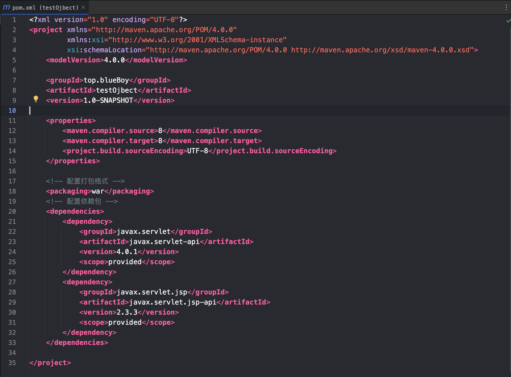

## Web 服务器
>Ps:基于 `macos` 搭建
### Tomcat
#### 下载
[tomcat-v8.5.94](https://archive.apache.org/dist/tomcat/tomcat-8/v8.5.94/bin/)
`macos/linux` 下载 `apache-tomcat-8.5.94.tar.gz`     
#### 在系统环境下配置和使用
 - 第一步解压缩，并且放在合适的目录中
![[../../../../appends/img/tomcatContent.png]]
如果需要制定 `tomcat` 的 `jdk` 版本，可以修改 `catalina.sh` 和 `setclasspath.sh` ，复制好 `jdk` 路径，在最后都加上

```
export JAVA_HOME=/Library/Java/JavaVirtualMachines/jdk-1.8.jdk/Contents/Home/
export JRE_HOME=/Library/Java/JavaVirtualMachines/jdk-1.8.jdk/Contents/Home/jre
```
- 查看相关信息
```
wangwenpeng@AppleBook bin % ./version.sh
Using CATALINA_BASE:   /Users/wangwenpeng/Code/Server/apache-tomcat-8.5.94
Using CATALINA_HOME:   /Users/wangwenpeng/Code/Server/apache-tomcat-8.5.94
Using CATALINA_TMPDIR: /Users/wangwenpeng/Code/Server/apache-tomcat-8.5.94/temp
Using JRE_HOME:        /Library/Java/JavaVirtualMachines/jdk-1.8.jdk/Contents/Home/jre
Using CLASSPATH:       /Users/wangwenpeng/Code/Server/apache-tomcat-8.5.94/bin/bootstrap.jar:/Users/wangwenpeng/Code/Server/apache-tomcat-8.5.94/bin/tomcat-juli.jar
Using CATALINA_OPTS:
NOTE: Picked up JDK_JAVA_OPTIONS:  --add-opens=java.base/java.lang=ALL-UNNAMED --add-opens=java.base/java.io=ALL-UNNAMED --add-opens=java.base/java.util=ALL-UNNAMED --add-opens=java.base/java.util.concurrent=ALL-UNNAMED --add-opens=java.rmi/sun.rmi.transport=ALL-UNNAMED
Server version: Apache Tomcat/8.5.94
Server built:   Oct 9 2023 21:16:48 UTC
Server number:  8.5.94.0
OS Name:        Mac OS X
OS Version:     14.3.1
Architecture:   aarch64
JVM Version:    21.0.2+13-LTS-58
JVM Vendor:     Oracle Corporation
```

- 打开关闭
```
wangwenpeng@AppleBook bin % ./startup.sh
Using CATALINA_BASE:   /Users/wangwenpeng/Code/Server/apache-tomcat-8.5.94
Using CATALINA_HOME:   /Users/wangwenpeng/Code/Server/apache-tomcat-8.5.94
Using CATALINA_TMPDIR: /Users/wangwenpeng/Code/Server/apache-tomcat-8.5.94/temp
Using JRE_HOME:        /Library/Java/JavaVirtualMachines/jdk-1.8.jdk/Contents/Home/jre
Using CLASSPATH:       /Users/wangwenpeng/Code/Server/apache-tomcat-8.5.94/bin/bootstrap.jar:/Users/wangwenpeng/Code/Server/apache-tomcat-8.5.94/bin/tomcat-juli.jar
Using CATALINA_OPTS:
Tomcat started.
```

访问 `localhost:8080`


```
wangwenpeng@AppleBook bin % ./shutdown.sh
Using CATALINA_BASE:   /Users/wangwenpeng/Code/Server/apache-tomcat-8.5.94
Using CATALINA_HOME:   /Users/wangwenpeng/Code/Server/apache-tomcat-8.5.94
Using CATALINA_TMPDIR: /Users/wangwenpeng/Code/Server/apache-tomcat-8.5.94/temp
Using JRE_HOME:        /Library/Java/JavaVirtualMachines/jdk-1.8.jdk/Contents/Home/jre
Using CLASSPATH:       /Users/wangwenpeng/Code/Server/apache-tomcat-8.5.94/bin/bootstrap.jar:/Users/wangwenpeng/Code/Server/apache-tomcat-8.5.94/bin/tomcat-juli.jar
Using CATALINA_OPTS:
NOTE: Picked up JDK_JAVA_OPTIONS:  --add-opens=java.base/java.lang=ALL-UNNAMED --add-opens=java.base/java.io=ALL-UNNAMED --add-opens=java.base/java.util=ALL-UNNAMED --add-opens=java.base/java.util.concurrent=ALL-UNNAMED --add-opens=java.rmi/sun.rmi.transport=ALL-UNNAMED
```
#### 在 IDE 中配置和使用
- 在 `idea` 设置中设置 `tomcat`


配置好之后就可以在后续使用 `Maven` 创建部署项目时使用了。

## Maven 创建及部署 Web 项目
- 创建普通 `Maven` 项目

补充：`IntelliJ` 构建的项目只能在 `IDEA` 中打开，换个 `IDE` 就不行了，使用 `Maven` 系统构建的项目具有良好的通用性。

- 配置 `pom.xml` 并且点击右上角的 `加载Maven变更` 按钮，使其生效


注：在配置两个依赖时使用了 `<scope>provided</scope>`，意思为这两个依赖包是 `已提供`。在编译、测试时有效，但是在运行时无效。`provided` 意味着打包的时候可以不用包进去，别的设施(`Web Container`)会提供。

在 `tomcat` 的 `lib` 目录中已经提供：


- 配置`项目结构`
>点击右上角的小齿轮-项目结构

创建 `web资源目录`


创建 `web.xml`
注意，在创建 `web.xml` 时要看准最终创建哪个文件夹中了！要创建在 `src/main/webapp` 下才可以


- 配置 `tomcat`


配置服务器选项卡


配置部署选项卡


点击确定，部署选项卡部署配置完成。

- 写测试代码
`DServlet.java`
```java
package com.blueboy.servlet;  
  
import javax.servlet.ServletException;  
import javax.servlet.annotation.WebServlet;  
import javax.servlet.http.HttpServlet;  
import javax.servlet.http.HttpServletRequest;  
import javax.servlet.http.HttpServletResponse;  
import java.io.IOException;  
  
@WebServlet(name = "dServlet", value = "/dServlet")  
public class DServlet extends HttpServlet {  
    @Override  
    protected void doGet(HttpServletRequest req, HttpServletResponse resp) throws ServletException, IOException {  
        System.out.println("使用注解达到配置web.xml一样的效果");  
    }  
  
    @Override  
    protected void doPost(HttpServletRequest req, HttpServletResponse resp) throws ServletException, IOException {  
  
    }  
}
```
- 运行 `tomcat`，并且查看结果。


## Servlet
>接收请求、处理请求、响应请求.

> `Servlet`是单例的，一个类型的`Servlet`只有一个实例对象，那么就有可能会出现一个`Servlet`同时处理多个请求，`Servlet`不是线程安全的，不应该在`Servlet`中创建成员变量，因为可能会存在一个线程对这个成员变量进行写操作，另一个线程对这个成员变量进行读操作。

- 不要在`Servlet`中创建成员，创建局部变量即可；
- 可以创建无状态成员；
- 可以创建有状态的成员，但状态必须为只读的。


`Servlet` 中的大多数方法不由我们来调用，而是由 `Tomcat` 来调用，并且 `Servlet` 的对象也不由我们来创建，由 `Tomcat` 来创建！我们只需要编写 `Servlet`。

### Servlet 的生命周期
- `init()`
    - 服务器会在`Servlet`第一次被访问时创建`Servlet`，在`Servlet`被创建后，服务器会马上调用`Servlet`的`void init(ServletConfig)`方法；
    - 在整个 `Servlet` 的生命周期中，该方法**只被调用一次。**
- `service()`
    - 当服务器每次接收到请求时，都会去调用`Servlet`的`service()`方法来处理请求；
    - 每次处理请求都会被调用。
- `destroy()`
    - 在服务器被关闭时，在销毁`Servlet`之前服务器会先去调用`Servlet`的`destroy()`方法；
    - 在整个`Servlet`的生命周期中，该方法只被调用一次。


### 常见问题及解决方法
- 遇到 `404`
	- 可能是你写地址的时候写错了，检查和地址有关的地方。
	- 可能是编译器 bug，我重启了一下电脑就又行了。当然也可以试试清除缓存并重启。
- 遇到 `500`
	- 可能是服务器中代码写错了。

### 实现 Servlet 的三种方式
#### 实现 Servlet 接口
>实现 Servlet , 重写五个方法

`AServlet.java`
```java
package com.blueboy.servlet;  
  
import javax.servlet.*;  
import java.io.IOException;  
  
public class AServlet implements Servlet {  
  
    @Override  
    public void init(ServletConfig servletConfig) throws ServletException {  
  
    }  
  
    @Override  
    public ServletConfig getServletConfig() {  
        return null;  
    }  
  
    @Override  
    public void service(ServletRequest servletRequest, ServletResponse servletResponse) throws ServletException, IOException {  
        System.out.println("第一种方式...");  
    }  
  
    @Override  
    public String getServletInfo() {  
        return null;  
    }  
  
    @Override  
    public void destroy() {  
  
    }  
}
```

访问 `http://localhost:8080/应用名/aServlet` 查看结果，需要做好 [Servlet配置](javaWeb.md#配置%20Servlet%20的两种方式) 才能访问。

#### 继承 GenericServlet 类
>实现 `Servlet` 接口，`GenericServlet` 已经实现了其他相关方法，我们只需要实现 `service` 方法，

`BServlet.java`
```java
package com.blueboy.servlet;  
  
import javax.servlet.GenericServlet;  
import javax.servlet.ServletException;  
import javax.servlet.ServletRequest;  
import javax.servlet.ServletResponse;  
import java.io.IOException;  
  
public class BServlet extends GenericServlet {  
    @Override  
    public void service(ServletRequest servletRequest, ServletResponse servletResponse) throws ServletException, IOException {  
        System.out.println("第二种方式实现servlet");  
    }  
}
```
访问 `http://localhost:8080/应用名/bServlet` 查看结果
#### 继承 HttpServlet 类
>继承自 `GenericServlet` 类，实现了对 `Get` 或者 `Post` 请求的判断处理，我们只需要实现 `doGet` 和 `doPost` 方法。

为什么我们只需要实现 `doGet` 和 `doPost` 而不需要写 `service()`了呢？让我们看一下 `HttpServlet` 的实现：
这是 `HttpServlet` 对 `service` 的重写，可以看到这个 `service` 的内部在进行各种判断，判断请求方法是否是 `get/post...`，然后再执行 `doGet` 或者 `doPost`....

```java
protected void service(HttpServletRequest req, HttpServletResponse resp) throws ServletException, IOException {  
    String method = req.getMethod();  
    long lastModified;  
    if (method.equals("GET")) {  
        lastModified = this.getLastModified(req);  
        if (lastModified == -1L) {  
            this.doGet(req, resp);  
        } else {  
            long ifModifiedSince = req.getDateHeader("If-Modified-Since");  
            if (ifModifiedSince < lastModified) {  
                this.maybeSetLastModified(resp, lastModified);  
                this.doGet(req, resp);  
            } else {  
                resp.setStatus(304);  
            }  
        }  
    } else if (method.equals("HEAD")) {  
        lastModified = this.getLastModified(req);  
        this.maybeSetLastModified(resp, lastModified);  
        this.doHead(req, resp);  
    } else if (method.equals("POST")) {  
        this.doPost(req, resp);  
    } else if (method.equals("PUT")) {  
        this.doPut(req, resp);  
    } else if (method.equals("DELETE")) {  
        this.doDelete(req, resp);  
    } else if (method.equals("OPTIONS")) {  
        this.doOptions(req, resp);  
    } else if (method.equals("TRACE")) {  
        this.doTrace(req, resp);  
    } else {  
        String errMsg = lStrings.getString("http.method_not_implemented");  
        Object[] errArgs = new Object[]{method};  
        errMsg = MessageFormat.format(errMsg, errArgs);  
        resp.sendError(501, errMsg);  
    }  
  
}
```

继承 HttpServlet 的实现举例：
`CServlet.java`
```java
package com.blueboy.servlet;  
  
import javax.servlet.ServletException;  
import javax.servlet.http.HttpServlet;  
import javax.servlet.http.HttpServletRequest;  
import javax.servlet.http.HttpServletResponse;  
import java.io.IOException;  
  
public class CServlet extends HttpServlet {  
    protected void doGet(HttpServletRequest req, HttpServletResponse resp) throws ServletException, IOException {  
        System.out.println("继承HttpServlet实现Servlet。。。。");  
        System.out.println("继承HttpServlet实现Servlet。。。。");  
        System.out.println("继承HttpServlet实现Servlet。。。。");  
        System.out.println("6666");  
    }  
  
    @Override  
    protected void doPost(HttpServletRequest req, HttpServletResponse resp) throws ServletException, IOException {  
  
    }  
}
```

访问 `http://localhost:8080/应用名/cServlet` 查看结果

#### 配置 Servlet 的两种方式
>当我们选择我们喜欢的方法实现 Servlet 之后，我们就要进行进一步的配置，主要是定义 `匹配规则` `优先级`。有两种可供选择的方式。
##### web.xml
>配置 `Servlet` 的第一种方式，通过配置 `web.xml` ，这种方式比较古老且繁琐。
```xml
<?xml version="1.0" encoding="UTF-8"?>  
<web-app xmlns="http://xmlns.jcp.org/xml/ns/javaee"  
         xmlns:xsi="http://www.w3.org/2001/XMLSchema-instance"  
         xsi:schemaLocation="http://xmlns.jcp.org/xml/ns/javaee http://xmlns.jcp.org/xml/ns/javaee/web-app_4_0.xsd"  
         version="4.0">  
    <servlet>  
        <servlet-name>aServlet</servlet-name>  
        <servlet-class>com.blueboy.servlet.AServlet</servlet-class>  
    </servlet>  
    <servlet-mapping>  
        <servlet-name>aServlet</servlet-name>  
        <url-pattern>/aServlet</url-pattern>  
    </servlet-mapping>  
<!---->  
    <servlet>  
        <servlet-name>bServlet</servlet-name>  
        <servlet-class>com.blueboy.servlet.BServlet</servlet-class>  
    </servlet>  
    <servlet-mapping>  
        <servlet-name>bServlet</servlet-name>  
        <url-pattern>/bServlet</url-pattern>  
    </servlet-mapping>  
<!---->  
    <servlet>  
        <servlet-name>cServlet</servlet-name>  
        <servlet-class>com.blueboy.servlet.CServlet</servlet-class>  
    </servlet>  
    <servlet-mapping>  
        <servlet-name>cServlet</servlet-name>  
        <url-pattern>/cServlet</url-pattern>  
    </servlet-mapping>  
</web-app>
```

##### 注解(推荐)
>配置 Servlet 的第二种方式，通过直接在相关方法上注解，从而配置相关参数(Servlet 3.0 新增方式)。使用注解配置之后，就不用再在 `web.xml` 中进行繁琐的配置了。

`@WebServlet`常用属性：
- `name`：`Servlet`名字，可选
- `value`：配置`url`路径，可以配置多个
- `urlPatterns`：配置`url`路径 ，和`value`作用一样，不能同时和`value`使用
- `loadOnStartup`：配置 `Servlet` 的创建的时机，如果是0或者正数，启动程序时创建，如果是负数，则访问时创建。数字 越小优先级越高。

```java
package com.blueboy.servlet;  
  
import javax.servlet.ServletException;  
import javax.servlet.annotation.WebServlet;  
import javax.servlet.http.HttpServlet;  
import javax.servlet.http.HttpServletRequest;  
import javax.servlet.http.HttpServletResponse;  
import java.io.IOException;  
  
@WebServlet(name = "dServlet", value = "/dServlet")  
public class DServlet extends HttpServlet {  
    @Override  
    protected void doGet(HttpServletRequest req, HttpServletResponse resp) throws ServletException, IOException {  
        System.out.println("使用注解达到配置web.xml一样的效果");  
    }  
  
    @Override  
    protected void doPost(HttpServletRequest req, HttpServletResponse resp) throws ServletException, IOException {  
  
    }  
}
```

PS：当 `@WebServlet()` 只填一个值时，默认是给 `value` 设置

### Jrebel 热部署插件
>修改增添代码文件之后，不必再重启 `tomcat` 服务器。使用这个插件启动 `web` 项目之后，可以实现即改即生效。

### RequestAndResponse
>基本流程：浏览器向服务器每发出一次请求，服务器就会创建一个封装有浏览器请求数据的 `request对象` ，以及一个 `response对象`。然后会把这两个对象传递给合适的 `Servlet`，在 `Servlet` 中调用 `service()` 完成相关处理，最终响应给浏览器。
#### response
- `response`是响应对象，向客户端输出响应正文（响应体）可以使用`response`的响应流，常用方法：
	- `PrintWriter out = response.getWriter()`：获取字符流---16 字节
    - `ServletOutputStream out = response.getOutputStream()`：获取字节流---8 字节
- 如果响应正文内容为字符，那么使用`response.getWriter()`，如果响应内容是字节，例如下载时，那么可以使用`response.getOutputStream()`；

**注意**：在一个请求中，不能同时使用这两个流，也就是说，要么你使用`repsonse.getWriter()`，要么使用`response.getOutputStream()`，但不能同时使用这两个流。不然会抛出`IllegalStateException`异常。
##### 编码以及正文
`ResponseServletTest.java`
```java
package com.blueboy.servlet;  
  
import javax.servlet.ServletException;  
import javax.servlet.annotation.WebServlet;  
import javax.servlet.http.HttpServlet;  
import javax.servlet.http.HttpServletRequest;  
import javax.servlet.http.HttpServletResponse;  
import java.io.IOException;  
import java.io.PrintWriter;  
  
@WebServlet("/responseServletTest")  
public class ResponseServletTest extends HttpServlet {  
    @Override  
    protected void doGet(HttpServletRequest req, HttpServletResponse resp) throws ServletException, IOException {  
        /*  
        * setContentType的两个功能：  
        * 1.给浏览器做回应时是以UTF-8编码输出的。  
        * 2.告诉浏览器应该以什么编码进行解析这个回应  
        *
        * 注意：这个操作要在 获取输出流out之前进行。  
        * */        
        resp.setContentType("text/html;charset=utf-8");  
  
        PrintWriter out = resp.getWriter();  
        out.println("<p style='color:red;'>Hello World</p>");  
        out.println("<p style='color:red;'>你好世界</p>");  
    }  
  
    @Override  
    protected void doPost(HttpServletRequest req, HttpServletResponse resp) throws ServletException, IOException {  
  
    }  
}
```

查看结果：


##### 重定向
>服务器通知浏览器你要去访问另外一个地址，发出另外一个请求。
```java
package com.blueboy.servlet;  
  
import javax.servlet.ServletException;  
import javax.servlet.annotation.WebServlet;  
import javax.servlet.http.HttpServlet;  
import javax.servlet.http.HttpServletRequest;  
import javax.servlet.http.HttpServletResponse;  
import java.io.IOException;  
@WebServlet("/redirectServletTest")  
public class RedirectServletTest extends HttpServlet {  
    protected void doGet(HttpServletRequest req, HttpServletResponse resp) throws ServletException, IOException {  
        //重定向地址必须以 “/项目名” 开始  
        //resp.sendRedirect("/testObject_war_exploded/responseServletTest");  
        resp.sendRedirect("https://www.baidu.com");  
    }  
  
    @Override  
    protected void doPost(HttpServletRequest req, HttpServletResponse resp) throws ServletException, IOException {  
  
    }  
}
```

相关参考： [请求转发和重定向的区别](javaWeb.md#请求转发和重定向的区别)

#### request
##### 获取请求头以及请求参数
`getParaServletTest.html`
```html
<!DOCTYPE html>  
<html lang="en">  
<head>  
    <meta charset="UTF-8">  
    <title>获取参数例子</title>  
</head>  
<body>  
  
<a href="/testObject_war_exploded/getParaServletTest?sname=zs&hobby=123&hobby=456">使用get方式</a>  
  
<form action="/testObject_war_exploded/getParaServletTest" method="post">  
  
    学生姓名<input type="text" name="sname">  
    爱好  
    <input type="checkbox" name="hobby" value="123">学习  
    <input type="checkbox" name="hobby" value="456">看书  
    <input type="checkbox" name="hobby" value="789">撸代码  
  
    <div>  
        <button type="submit">提交</button>  
    </div>  
  
</form>  
  
</body>  
</html>
```
`GetParaServletTest.java`
```java
package com.blueboy.servlet;  
  
import javax.servlet.ServletException;  
import javax.servlet.annotation.WebServlet;  
import javax.servlet.http.HttpServlet;  
import javax.servlet.http.HttpServletRequest;  
import javax.servlet.http.HttpServletResponse;  
import java.io.IOException;  
import java.io.PrintWriter;  
import java.util.Arrays;  
  
@WebServlet("/getParaServletTest") 
public class GetParaServletTest extends HttpServlet {  
    protected void doGet(HttpServletRequest req, HttpServletResponse resp) throws ServletException, IOException {  
        String method = req.getMethod();//获取请求方法  
        int serverPort = req.getServerPort();//获取服务器端口号  
  
        String sname = req.getParameter("sname");//获取姓名参数  
        String[] hobbies = req.getParameterValues("hobby");//获取有多个key的value  
  
        PrintWriter out = resp.getWriter();//获取输出流  
        out.write("<h1>" + sname +"</h1>");  
        out.write("<h1>" + Arrays.toString(hobbies) +"</h1>");  
  
    }  
  
    @Override  
    protected void doPost(HttpServletRequest req, HttpServletResponse resp) throws ServletException, IOException {  
        doGet(req, resp);//使用get进行统一处理  
    }  
}
```

建在 `webapp` 下的 `html` 文件是可以直接访问到的，而如果在 `WEB-INF` 中就无法直接访问到。`webapp` 目录相当于 `http://localhost:8080:/testObject_war_exploded/`，所以访问地址应该是 `http://localhost:8080:/testObject_war_exploded/GetParaServletTest.html`


`html` 提交表单到服务器中对应的 `Servlet` 后，在 `Servlet` 中处理完毕后用 `out.write` 显示在网页上。

##### 乱码问题
>`html` 中给服务器传输数据，在提交表单时 `value` 有中文时，则可能出现 `Servlet` 获取参数时获取不到正常的数据，从而产生乱码等问题。

在获取参数值之前，先设置编码。
```java
		//设置请求编码
        request.setCharacterEncoding("utf-8");

        //获取请求参数
        String username = request.getParameter("username");
        System.out.println(username);
        //当多个参数名称相同时，可以使用方法来获取
        String[] hobbies = request.getParameterValues("hobby");
        System.out.println(Arrays.toString(hobbies));
``````

##### 请求转发
>转发的作用在服务器端，将请求发送给服务器上的其他资源，以共同完成一次请求的处理，多个`Servlet`或`JSP`共同来处理一个请求。


实现步骤：
1. 创建调度器`RequestDispatcher rd = request.getRequestDispatcher("/BServlet");`
2. 转发`rd.forward(request, response);`

###### 请求转发和重定向的区别
- 请求转发是一个请求，而重定向是两个请求
- 请求转发后浏览器地址栏不会有变化，而重定向会有变化，因为重定向是两个请求
- 请求转发的目标只能是本应用中的资源，重定向的目标可以是其他应用
- 请求转发对`AServlet`和`BServlet`的请求方法是相同的，即要么都是`GET`，要么都是`POST`，因为请求转发是一个请求
- 重定向的第二个请求一定是`GET`

##### 域对象
>`request` 最为域对象可以在一个请求中共享数据，一个请求会创建一个 `request` 对象。如果在一个请求中要经过多个 `servlet` 对象，那么就可以使用 `request` 对象来进行分享数据。

- 域方法
    - 存`void setAttribute(String name, Object value)`
    - 取`Object getAttribute(String name)`
    - 删除`void removeAttribute(String name)`
- 一个请求可以通过转发、包含跨越多个`Servlet`，在这个请求链之上的`Servlet`可以通过`request`共享数据

`DomainServletTest.java`
```java
package com.blueboy.servlet;  
  
import javax.servlet.ServletException;  
import javax.servlet.annotation.WebServlet;  
import javax.servlet.http.HttpServlet;  
import javax.servlet.http.HttpServletRequest;  
import javax.servlet.http.HttpServletResponse;  
import java.io.IOException;  
  
@WebServlet("/domainServletTest")  
public class DomainServletTest extends HttpServlet {  
    @Override  
    protected void doGet(HttpServletRequest req, HttpServletResponse resp) throws ServletException, IOException {  
        req.setAttribute("name", "wangWenPeng");//设置域属性  
        req.getRequestDispatcher("/domainServletTest2").forward(req, resp);//请求转发到 domainServletTest2    }  
  
    @Override  
    protected void doPost(HttpServletRequest req, HttpServletResponse resp) throws ServletException, IOException {  
        doGet(req, resp);  
    }  
}
```
`DomainServletTest2.java`
```java
package com.blueboy.servlet;  
  
import javax.servlet.ServletException;  
import javax.servlet.annotation.WebServlet;  
import javax.servlet.http.HttpServlet;  
import javax.servlet.http.HttpServletRequest;  
import javax.servlet.http.HttpServletResponse;  
import java.io.IOException;  
  
@WebServlet("/domainServletTest2")  
public class DomainServletTest2 extends HttpServlet {  
    @Override  
    protected void doGet(HttpServletRequest req, HttpServletResponse resp) throws ServletException, IOException {  
        Object name = req.getAttribute("name");  
        System.out.println("我在domainServletTest2中打印出了这个name属性：" + name);  
    }  
  
    @Override  
    protected void doPost(HttpServletRequest req, HttpServletResponse resp) throws ServletException, IOException {  
        doGet(req, resp);  
    }  
}
```

### 路径写法总结

- 由浏览器 `浏览器` 发起的操作，需要使用 `tomcat` 中 `部署选项卡` 的 `应用程序上下文`  +  `资源名`

例 1，这段代码中中，使用了重定向操作。重定向的过程就是 `浏览器` 第一次访问服务器时，服务器让 `浏览器` 再进行一次跳转，然后 `浏览器` 会准备第二次跳转。从第一次服务器的回应中，找到服务器告诉要跳转的地址。

因为第二次跳转最终的执行者还是 `浏览器`，但是 `浏览器` 其实并不知道服务器有什么应用。所以服务器在告诉浏览器地址时， sendRedirect 参数中的内容要填 `/testObject_war_exploded/responseServletTest` (应用+资源地址)。

浏览器会把这个地址与 `http://localhost:8080` 进行拼接从而形成完整的访问地址 `http://localhost:8080/testObject_war_exploded/responseServletTest`
```java
	public class RedirectServletTest extends HttpServlet {  
    protected void doGet(HttpServletRequest req, HttpServletResponse resp) throws ServletException, IOException {  
        //重定向地址必须以 “/项目名” 开始  
        resp.sendRedirect("/testObject_war_exploded/responseServletTest");  
    }  
  
    @Override  
    protected void doPost(HttpServletRequest req, HttpServletResponse resp) throws ServletException, IOException {  
  
    }  
}
```

例 2，这段前段代码的执行人也是 `浏览器`，所以分析类似例 1，也是 `http://localhost:8080` 与 `应用+资源地址` 进行拼接。
```html
<a href="/testObject_war_exploded/getParaServletTest?sname=zs&hobby=123&hobby=456">使用get方式</a>  
  
<form action="/testObject_war_exploded/getParaServletTest" method="post">  
  
    学生姓名<input type="text" name="sname">  
    爱好  
    <input type="checkbox" name="hobby" value="123">学习  
    <input type="checkbox" name="hobby" value="456">看书  
    <input type="checkbox" name="hobby" value="789">撸代码  
  
    <div>  
        <button type="submit">提交</button>  
    </div>  
  
</form>
```


### 登入例子
```java
package com.blueboy.servlet;  
  
import javax.servlet.ServletException;  
import javax.servlet.annotation.WebServlet;  
import javax.servlet.http.HttpServlet;  
import javax.servlet.http.HttpServletRequest;  
import javax.servlet.http.HttpServletResponse;  
import java.io.IOException;  
@WebServlet("/login")  
public class LoginServlet extends HttpServlet {  
    @Override  
    protected void doGet(HttpServletRequest req, HttpServletResponse resp) throws ServletException, IOException {  
        String username = req.getParameter("username");  
        String password = req.getParameter("password");  
        System.out.println(username + " " + password);  
  
        if (username.equals("root") && password.equals("root")) {  
            req.getRequestDispatcher("/loginSuccess.html").forward(req, resp);  
        } else {  
            req.getRequestDispatcher("/loginFailed.html").forward(req,resp);  
        }  
    }  
  
    @Override  
    protected void doPost(HttpServletRequest req, HttpServletResponse resp) throws ServletException, IOException {  
        doGet(req, resp);  
    }  
}
```

```html
<!DOCTYPE html>  
<html>  
<head>  
  <meta charset="utf-8" />  
  <title>登录</title>  
</head>  
<body>  
<form action="/testObject_war_exploded/login" method="post">  
    <legend>用户登录</legend>  
    <p>  
      <label>账号</label>  
      <input type="text" name="username" placeholder="请输入用户名" />  
    </p>  
    <p>  
      <label>密码</label>  
      <input type="password" name="password" placeholder="请输入密码" />  
    </p>  
    <p>  
      <button type="submit">登录</button>  
    </p>  
</form>  
</body>  
</html>


<!DOCTYPE html>  
<html lang="en">  
<head>  
    <meta charset="UTF-8">  
    <title>登入失败</title>  
</head>  
<body>  
  <h1>Login Failed!</h1>  
</body>  
</html>


<!DOCTYPE html>  
<html lang="en">  
<head>  
    <meta charset="UTF-8">  
    <title>登入成功</title>  
</head>  
<body>  
  <h1>Login Success!</h1>  
</body>  
</html>

```

### ServletContext
> 一个项目只有一个`ServletContext`对象，使用它可以给多个`Servlet`传递数据，与天地同寿，这个对象在`Tomcat`启动时就创建，在`Tomcat`关闭时才会消失。

#### 特点 
- 唯一性：一个应用对应一个 `ServletContext`。
- 生命周期：只要容器不关闭或者应用不卸载，`ServletContext` 就一直存在。

#### 获取方式
- `GenericServlet`提供了`getServletContext()`方法；
- `HttpServletRequest`提供了`getServletContext()`方法；
- `HttpSession`提供了`getServletContext()`方法。

#### 作用
##### 作为域对象
>是范围最大的一个域对象，可作用于整个项目。

`ServletContextDomainTest1.java`
```java
package com.blueboy.servlet;  
  
import javax.servlet.ServletContext;  
import javax.servlet.ServletException;  
import javax.servlet.annotation.WebServlet;  
import javax.servlet.http.HttpServlet;  
import javax.servlet.http.HttpServletRequest;  
import javax.servlet.http.HttpServletResponse;  
import java.io.IOException;  
  
@WebServlet("/servletContextDomainTest1")  
public class ServletContextDomainTest extends HttpServlet {  
    @Override  
    protected void doGet(HttpServletRequest req, HttpServletResponse resp) throws ServletException, IOException {  
        ServletContext servletContext1 = this.getServletContext();//获取 ServletContext方式1  
        ServletContext servletContext2 = req.getServletContext();//获取 ServletContext方式2  
        System.out.println(servletContext1 == servletContext2);//true，获取到的是同一个对象（在一个项目中只能有一个 ServletContext对象）  
  
        servletContext1.setAttribute("myPath", "code/area/java");//设置一个属性  
  
        Object myPath = servletContext1.getAttribute("myPath");  
        System.out.println("在servletContextTest1中获取我设置好的这个项目都会共享的数据:" + myPath);//打印刚刚设置的属性  
  
  
    }  
  
    @Override  
    protected void doPost(HttpServletRequest req, HttpServletResponse resp) throws ServletException, IOException {  
        doGet(req, resp);  
    }  
}
```

编写如上代码，首先访问 `http://localhost:8080/testObject_war_exploded/servletContextDomainTest1` 以对 `ServletContext` 对象设置一个属性


`ServletContextDomainTest2.java`
```java
package com.blueboy.servlet;  
  
import javax.servlet.ServletContext;  
import javax.servlet.ServletException;  
import javax.servlet.annotation.WebServlet;  
import javax.servlet.http.HttpServlet;  
import javax.servlet.http.HttpServletRequest;  
import javax.servlet.http.HttpServletResponse;  
import java.io.IOException;  
  
@WebServlet("/servletContextDomainTest2")  
public class ServletContextDomainTest2 extends HttpServlet {  
    @Override  
    protected void doGet(HttpServletRequest req, HttpServletResponse resp) throws ServletException, IOException {  
        ServletContext servletContext = this.getServletContext();//获取 ServletContext对象  
        Object myPath = servletContext.getAttribute("myPath");  
        System.out.println("在servletContextTest2中获取:" + myPath);//打印别人设置好的属性  
  
    }  
  
    @Override  
    protected void doPost(HttpServletRequest req, HttpServletResponse resp) throws ServletException, IOException {  
        doGet(req, resp);  
    }  
}
```

其次访问 `http://localhost:8080/testObject_war_exploded/servletContextDomainTest2` 来测试是否可以在另一个类中获取之前设置的属性

上面操作后的执行结果：
```
true
在servletContextTest1中获取我设置好的这个项目都会共享的数据:code/area/java
在servletContextTest2中获取:code/area/java
```

案例 2:统计网站访问人数
```java
@WebServlet(name = "NServlet", value = "/NServlet")
public class NServlet extends HttpServlet {
    @Override
    protected void doGet(HttpServletRequest request, HttpServletResponse response) throws ServletException, IOException {
        ServletContext sctx = this.getServletContext();

        Integer count = (Integer) sctx.getAttribute("count");

        if(count == null) {
            count = 1; //自动装箱
        } else {
            count++;
        }
        sctx.setAttribute("count", count);
        PrintWriter out = response.getWriter();
        out.println("<h1>" + count + "</h1>");
    }

    @Override
    protected void doPost(HttpServletRequest request, HttpServletResponse response) throws ServletException, IOException {

    }
}
``````
每次访问 `NServlet`，就会调用 `Nservlet` 的 `service()`，然后在 `service()` 中执行 `doGet()`，从而实现了 `count++`

相关参考： [Servlet的生命周期](javaWeb.md#Servlet%20的生命周期)    

##### 获取真实路径和上下文路径
`ServletContextTest3.java`
```java
package com.blueboy.servlet;  
  
import javax.servlet.ServletContext;  
import javax.servlet.ServletException;  
import javax.servlet.annotation.WebServlet;  
import javax.servlet.http.HttpServlet;  
import javax.servlet.http.HttpServletRequest;  
import javax.servlet.http.HttpServletResponse;  
import java.io.IOException;  
  
@WebServlet("/servletContextTest3")  
public class ServletContextTest3 extends HttpServlet {  
    @Override  
    protected void doGet(HttpServletRequest req, HttpServletResponse resp) throws ServletException, IOException {  
        ServletContext servletContext = this.getServletContext();//获取 ServletContext对象  
        String realPath = servletContext.getRealPath("/");  
        System.out.println("项目在服务器上的磁盘路径：" + realPath);  
        String contextPath = servletContext.getContextPath();  
        System.out.println("项目名字(contextPath、应用程序上下文)：" + contextPath);  
  
  
    }  
  
    @Override  
    protected void doPost(HttpServletRequest req, HttpServletResponse resp) throws ServletException, IOException {  
        doGet(req, resp);  
    }  
}
```
输出结果：
```
项目在服务器上的磁盘路径：/Users/wangwenpeng/Code/JavaDev/basic/JavaWeb/testObject/src/main/webapp/
项目名字(contextPath、应用程序上下文)：/testObject_war_exploded
```

## JSP
>简单来说就是在 html 中写 java 代码，实现了在 html 中用 java 代码填空的感觉。我们可以利用在 html 中嵌入的代码进行更为灵活的操作，例如：调用某些方法获取到的输入嵌入到标签中进行显示。
### JSP 脚本
>本质上就是 `Java` 代码片段

分类：
- `<%...%>`：Java语句
- `<%=…%>`：Java表达式`out.print(...);`
- `<%!...%>`：Java 定义类成员(了解)

内置对象（无需创建就可以使用的对象）：
- `out`对象在`JSP`页面中无需创建就可以使用，它的作用是用来向客户端输出；
- `<%=…%>`与`out.print()`功能是相同的，它们都是向客户端输出。

### JSP 原理


`JSP` 生成的 `Servlet` 存放在 `tomcat` 的 `work` 目录下，它是 `JSP` 的“真身”。我们打开看看其中的内容，了解一下 `JSP` 的“真身”。

在控制台中找到这一行：
`07-Mar-2024 21:01:26.544 信息 [main] org.apache.catalina.startup.VersionLoggerListener.log CATALINA_BASE:     /Users/wangwenpeng/Library/Caches/JetBrains/IntelliJIdea2023.2/tomcat/fbd22db7-5626-4d82-91a8-5a1c1f38c69e`
这个路径就是在 Idea 中编译后的 jsp class 文件位置


打开看看：你会发现，在 `JSP` 中的静态信息（例如各种标签等），在“真身”中都是使用 `out.write()` 完成打印！这些静态信息都是作为字符串输出给了客户端。


### JSP 注释
- `<%-- ... --%>`，在 JSP 编译成 `.java` 时会被忽略的，即 JSP 注释。
- `<!-- … -->`，但这个注释在 JSP 编译成的`.java` 中是存在的，它不会被忽略，而且会被发送到客户端浏览器。可以使用 F12 看到这些注释的存在。


### Cookie
>在浏览器的内存或者硬盘中保存一些数据，以提供给后续相关操作使用。

`Cookie` 是在浏览器访问 `Web` 服务器的某个资源时，由 `Web` 服务器在 `HTTP` 响应消息头中附带传送给浏览器的一小段数据。一旦 `Web` 浏览器保存了某个 `Cookie`，那么它在以后每次访问该 `Web` 服务器时，都应在 `HTTP` 请求头中将这个 `Cookie` 回传给 `Web` 服务器。一个 `Cookie` 主要由标识该信息的名称（`name`）和值（`value`）组成。

#### 作用原理


#### 基本操作
`CookieServletTest.java`
```java
package com.blueboy.servlet;  
  
import javax.servlet.ServletException;  
import javax.servlet.annotation.WebServlet;  
import javax.servlet.http.Cookie;  
import javax.servlet.http.HttpServlet;  
import javax.servlet.http.HttpServletRequest;  
import javax.servlet.http.HttpServletResponse;  
import java.io.IOException;  
  
@WebServlet("/cookieServletTest")  
public class CookieServletTest extends HttpServlet {  
    @Override  
    protected void doGet(HttpServletRequest req, HttpServletResponse resp) throws ServletException, IOException {  
        //创建一个 cookie        Cookie cookie = new Cookie("name", "wangwenpeng");  
  
        /*  
        * 设置这个cookie的生命  
        * setMaxAge(-1) 表示这个cookie会在浏览器关闭时作废  
        * setMaxAge(0)  表示这个cookie被作废  
        * setMaxAge(大于0的数)      表示这个cookie会被存储在硬盘上对应的时间(单位秒)，  
        * 只有到了时间点之后它才会过期，在此之前你关闭浏览器、重启电脑都没用(setMaxAge(0)除外)  
        * */        
        //在客户端浏览器中对应的那块内存中存储，浏览器一旦关闭，浏览器的那块所占内存也释放，cookie也就没了。  
        cookie.setMaxAge(-1);  
        //磁盘中存储cookie，存储 1000秒  
        //cookie.setMaxAge(1000);  
  
        //在响应中添加 cookie，并且发送给浏览器  
        //执行这行代码结束之后，浏览器中就有对应的 cookie了  
        resp.addCookie(cookie);  
    }  
  
    @Override  
    protected void doPost(HttpServletRequest req, HttpServletResponse resp) throws ServletException, IOException {  
        doGet(req, resp);  
    }  
}
```
`CookieServletTest2.java`
```java
package com.blueboy.servlet;  
  
import javax.servlet.ServletException;  
import javax.servlet.annotation.WebServlet;  
import javax.servlet.http.Cookie;  
import javax.servlet.http.HttpServlet;  
import javax.servlet.http.HttpServletRequest;  
import javax.servlet.http.HttpServletResponse;  
import java.io.IOException;  
  
@WebServlet("/cookieServletTest2")  
public class CookieServletTest2 extends HttpServlet {  
    @Override  
    protected void doGet(HttpServletRequest req, HttpServletResponse resp) throws ServletException, IOException {  
        Cookie[] cks = req.getCookies();//cookie可以有多个，所以用数组接受  
        for (Cookie ck : cks) {  
            String name = ck.getName();  
            String value = ck.getValue();  
            System.out.println(name + "\t" + value);  
        }  
    }  
  
    @Override  
    protected void doPost(HttpServletRequest req, HttpServletResponse resp) throws ServletException, IOException {  
        doGet(req, resp);  
    }  
}
```

`CookieServletTest3.java`
```java
package com.blueboy.servlet;  
  
import javax.servlet.ServletException;  
import javax.servlet.annotation.WebServlet;  
import javax.servlet.http.Cookie;  
import javax.servlet.http.HttpServlet;  
import javax.servlet.http.HttpServletRequest;  
import javax.servlet.http.HttpServletResponse;  
import java.io.IOException;  
  
@WebServlet("/cookieServletTest3")  
public class CookieServletTest3 extends HttpServlet {  
    @Override  
    protected void doGet(HttpServletRequest req, HttpServletResponse resp) throws ServletException, IOException {  
        //修改cookie只需要新new一个cookie，key一样就可以达到覆盖修改的效果。  
        Cookie cookie = new Cookie("name", "wwp");  
        cookie.setMaxAge(1000);//磁盘中存储cookie，存储 1000秒  
        resp.addCookie(cookie);//在响应中添加 cookie，发送给浏览器  
    }  
  
    @Override  
    protected void doPost(HttpServletRequest req, HttpServletResponse resp) throws ServletException, IOException {  
        doGet(req, resp);  
    }  
}
```

访问 
-  `http://localhost:8080/jspLearningWarExploded/cookieServletTest` 现在 `cookie` 已经被浏览器下载当内存中了，可以使用 `检查工具-应用选项卡` 中查看

- `http://localhost:8080/jspLearningWarExploded/cookieServletTest2` 访问并且查看 idea 中的控制台
```
name	wangwenpeng
```
- `http://localhost:8080/jspLearningWarExploded/cookieServletTest3` 访问并且打开 `检查工具` 查看修改结果


### Session
>基于 `cookie` 技术实现的更为安全的信息存储和分享机制。

#### 引子
在某一天，你的心情非常不错，于是你想给多年未联系的前女友打个电话联系联系，促进促进感情。于是你打开你的 iPhone，然后拨给了前女友。你们旧火复燃，相谈甚欢，聊完之后你非常熟练的按了一下电源键挂断了电话....

#### 什么是会话
>简单来说，打开浏览器，访问到服务器地址时，这时就是会话开始之时。关闭浏览器时，就是本次会话关闭之时。在此之间，无论什么操作都是在一个会话中。
>就如引子说的，打开手机拨号接通这就是本次会话的开始，按电源键挂了电话就是本次会话的结束。

#### Session 域对象功能
>Session 对象的作用域是在一次会话中。也就是说，只要自浏览器访问服务器的那一刻开始，关闭浏览器之前，这些请求都可共享 Session 对象中的数据。

`SessionServletTest.java`
```java
@WebServlet("/sessionServletTest")  
public class SessionServletTest extends HttpServlet {  
    @Override  
    protected void doGet(HttpServletRequest req, HttpServletResponse resp) throws ServletException, IOException {  
        //首先获取本次会话的session对象，如果为空则新建，如果不为空就是获取到本次会话的对象。  
        HttpSession session = req.getSession();  
        //设置session对象的属性  
        session.setAttribute("addr", "/usr/local/....");  
    }  
  
    @Override  
    protected void doPost(HttpServletRequest req, HttpServletResponse resp) throws ServletException, IOException {  
        doGet(req, resp);  
    }  
}
```
`SessionServletTest2.java`
访问 `SessionServletTest2.java` 获取 `SessionServletTest.java` 给本次会话设置的 session 对象的属性值。
```java
@WebServlet("/sessionServletTest2")  
public class SessionServletTest2 extends HttpServlet {  
    @Override  
    protected void doGet(HttpServletRequest req, HttpServletResponse resp) throws ServletException, IOException {  
        HttpSession session = req.getSession();//获取本次会话的对象  
        Object addr = session.getAttribute("addr");//获取addr属性  
        System.out.println("addr" + addr);  
    }  
  
    @Override  
    protected void doPost(HttpServletRequest req, HttpServletResponse resp) throws ServletException, IOException {  
        doGet(req, resp);  
    }  
}
```

#### session 具体例子

1. 首次请求（用户访问登录页）：
```http
GET /login.html HTTP/1.1
Host: example.com
```

服务器响应：
```http
HTTP/1.1 200 OK
Set-Cookie: JSESSIONID=A2H3K4J5L6M7N8P9; Path=/
Content-Type: text/html
```
此时服务器创建了一个新的 Session，并通过 Cookie 返回了 SessionID

2. 用户提交登录表单：
```http
POST /login HTTP/1.1
Host: example.com
Cookie: JSESSIONID=A2H3K4J5L6M7N8P9
Content-Type: application/x-www-form-urlencoded

username=alice&password=123456
```

服务器端处理：
```java
@PostMapping("/login")
public String login(String username, String password, HttpSession session) {
    User user = userService.login(username, password);
    if (user != null) {
        // 登录成功，将用户信息存入 Session
        session.setAttribute("user", user);
        return "redirect:/dashboard";
    }
    return "login";
}
```

1. 后续访问其他页面：
```http
GET /dashboard HTTP/1.1
Host: example.com
Cookie: JSESSIONID=A2H3K4J5L6M7N8P9
```

服务器端验证：
```java
@GetMapping("/dashboard")
public String dashboard(HttpSession session) {
    User user = (User) session.getAttribute("user");
    if (user == null) {
        // Session中没有用户信息，说明未登录
        return "redirect:/login";
    }
    // 已登录，显示仪表盘
    return "dashboard";
}
```

关键点：
2. 浏览器会自动保存和发送 Cookie 中的 JSESSIONID
3. 服务器通过 JSESSIONID 找到对应服务器中存储的 Session 数据
4. Session 数据存在服务器内存中，包含了用户的状态信息
5. 如果用户关闭浏览器，Cookie 会消失，再次访问时会得到新的 Session
6. Session 通常有过期时间，例如 `session.setMaxInactiveInterval(1800); // 30分钟，单位是秒`
7. `session.invalidate()` 会销毁服务器中的 Session 数据

这就是为什么你登录一个网站后，在不同页面间跳转都能保持登录状态的原理。

#### SessionAPI
<font color=#646a73 size=1px>*更新时间：2024-03-08 17点40点23*</font>
`String getId()`：获取`sessionId`；

`int getMaxInactiveInterval()`：获取 `session` 可以的最大不活动时间（秒），默认为30分钟。
若果打电话的时候对面等你 30 分钟你还没动静，对面就直接挂掉了。

`void setMaxInactiveInterval(int interval)`：设置 `session` 允许的最大不活动时间（秒），如果设置为1秒，那么只要 `session` 在1秒内不被使用，那么 `session` 就会被移除；

`long getCreationTime()`：返回`session`的创建时间，返回值为当前时间的毫秒值；

`long getLastAccessedTime()`：返回`session`的最后活动时间，返回值为当前时间的毫秒值；

`void invalidate()`：让`session`失效！调用这个方法会被`session`失效，当`session`失效后，客户端再次请求，服务器会给客户端创建一个新的`session`，并在响应中给客户端新`session`的`sessionId`；

`boolean isNew()`：查看`session`是否为新。当客户端第一次请求时，服务器为客户端创建`session`，但这时服务器还没有响应客户端，也就是还没有把`sessionId`响应给客户端时，这时`session`的状态为新。

#### 登入案例
`login.jsp`
```jsp
<%--  
  Created by IntelliJ IDEA.  User: wangwenpeng  Date: 2024/3/8  Time: 11:42  To change this template use File | Settings | File Templates.--%>  
<%@ page contentType="text/html;charset=UTF-8" language="java" %>  
<html>  
<head>  
    <title>登入</title>  
</head>  
<body>  
  
<%  
    /*  
    获取 request对象中的 属性msg，  
    若之前没有设置过，则msg=null，  
    根据msg是否为空判断是否要打印 <h1>    
    */    
    String msg = (String)request.getAttribute("msg");  
    if (msg != null) {  
%>  
<h1 style="color: red"><%=msg%></h1>  
<% } %>  
  
  
  
<form action="/jspLearningWarExploded/loginServlet" method="post">  
    <legend>用户登录</legend>  
    <p>  
        <label>账号</label>  
        <input type="text" name="username" placeholder="请输入用户名" />  
    </p>  
    <p>  
        <label>密码</label>  
        <input type="password" name="password" placeholder="请输入密码" />  
    </p>  
    <p>  
        <button type="submit">登录</button>  
    </p>  
</form>  
</body>  
</html>
```
`success_welcome.jsp
```jsp
<%--  
  Created by IntelliJ IDEA.  
  User: wangwenpeng  
  Date: 2024/3/8  Time: 11:43  
  To change this template use File | Settings | File Templates.
--%>  
<%@ page contentType="text/html;charset=UTF-8" language="java" %>  
<html>  
<head>  
    <title>欢迎页面</title>  
</head>  
<body>  
<%  
    /*从当前会话的session对象中获取 username 属性*/  
    String username = (String)session.getAttribute("username");  
    if (username != null) { //如果username 不为空，则打印<h1>欢迎信息  
%>  
<h1 style="color: red">欢迎<%=username%></h1>  
<a href="/jspLearningWarExploded/logoutServlet">退出</a>  
<% } else {  
    /*  
    * //否则利用request的域对象功能，设置一个属性 msg    
    * (满足刚好能用原则，一直都在一次访问中，使用request作为共享数据的域对象。而使用session作为域对象就过大了。)  
    * */    
    request.setAttribute("msg", "请输入正确的信息！");  
    request.getRequestDispatcher("/login.jsp").forward(request, response);//转发到login.jsp  
}  
%>  
  
  
</body>  
</html>
```
`LoginServlet.java`
```java
package com.blueboy.servlet;  
  
import javax.servlet.ServletException;  
import javax.servlet.annotation.WebServlet;  
import javax.servlet.http.HttpServlet;  
import javax.servlet.http.HttpServletRequest;  
import javax.servlet.http.HttpServletResponse;  
import javax.servlet.http.HttpSession;  
import java.io.IOException;  
@WebServlet("/loginServlet")  
public class LoginServlet extends HttpServlet {  
    protected void doGet(HttpServletRequest req, HttpServletResponse resp) throws ServletException, IOException {  
        String username = (String)req.getParameter("username"); //从浏览器发送的请求中获取参数 username        
        String password = (String)req.getParameter("password"); //从浏览器发送的请求中获取参数 password  
        if ((username.equals("wwp") && password.equals("wwp"))  
                || (username.equals("wwp") && password.equals("wwp"))) {    //判断  
            HttpSession session = req.getSession(); //如真，则获取当前会话的的session，  
            session.setAttribute("username", username);//并且设置属性  
            req.getRequestDispatcher("/success_welcome.jsp").forward(req, resp);    //转发到success_welcome页面  
        } else {  
            req.setAttribute("msg", "请输入正确的信息！");  
            req.getRequestDispatcher("/login.jsp").forward(req, resp);  
        }  
    }  
  
    @Override  
    protected void doPost(HttpServletRequest req, HttpServletResponse resp) throws ServletException, IOException {  
        doGet(req, resp);  
    }  
}
```
`LogoutServlet.java`
```java
package com.blueboy.servlet;  
  
import javax.servlet.ServletException;  
import javax.servlet.annotation.WebServlet;  
import javax.servlet.http.HttpServlet;  
import javax.servlet.http.HttpServletRequest;  
import javax.servlet.http.HttpServletResponse;  
import javax.servlet.http.HttpSession;  
import java.io.IOException;  
@WebServlet("/logoutServlet")  
public class LogoutServlet extends HttpServlet {  
    protected void doGet(HttpServletRequest req, HttpServletResponse resp) throws ServletException, IOException {  
        HttpSession session = req.getSession();//获取当前会话的 session对象  
        session.invalidate();//使得当前会话的session失效  
        req.getRequestDispatcher("/login.jsp").forward(req, resp);//转发到login页面  
    }  
  
    @Override  
    protected void doPost(HttpServletRequest req, HttpServletResponse resp) throws ServletException, IOException {  
        doGet(req, resp);  
    }  
}
```

#### 登入案例验证码版本
>只贴了有变动的文件。

注意要现在在 `pom.xml` 中配置好依赖包。
使用的插件：[Hutool](https://doc.hutool.cn/)
```xml
<dependency>  
    <groupId>cn.hutool</groupId>  
    <artifactId>hutool-all</artifactId>  
    <version>5.8.26</version>  
</dependency>
```

并且在 `webapp/js` 下导入`jquery-3.4.1.min.js`

`login.jsp`
```jsp
<%--  
  Created by IntelliJ IDEA.  User: wangwenpeng  Date: 2024/3/8  Time: 11:42  To change this template use File | Settings | File Templates.--%>  
<%@ page contentType="text/html;charset=UTF-8" language="java" %>  
<html>  
<head>  
    <title>登入</title>  
</head>  
<body>  
  
<%  
    /*  
    获取 request对象中的 属性msg，  
    若之前没有设置过，则msg=null，  
    根据msg是否为空判断是否要打印 <h1>    
    */    
    String msg = (String)request.getAttribute("msg");  
    if (msg != null) {  
%>  
<h1 style="color: red"><%=msg%></h1>  
<% } %>  
  
<form action="/jspLearningWarExploded/loginServlet" method="post">  
    <legend>用户登录</legend>  
    <p>  
        <label>账号</label>  
        <input type="text" name="username" placeholder="请输入用户名" />  
    </p>  
    <p>  
        <label>密码</label>  
        <input type="password" name="password" placeholder="请输入密码" />  
    </p>  
    <p>  
        <label>验证码</label>  
        <input type="text" name="codeInput" placeholder="请输入验证码" />  
        <!-- 当请求这地地址时，其实返回的是一个流信息，img可以使用此流显示图片 -->  
          
    </p>  
    <p>  
        <button type="submit">登录</button>  
    </p>  
</form>  
<script src="js/jquery-3.4.1.min.js"></script>  
<script>  
    $("#codeImg").click(function () {  
        //设定img的src属性为一个拼接时间而形成的新值，防止浏览器认为是同一个地址而使用缓存图片  
        $(this).prop("src", "/jspLearningWarExploded/codeServlet?" + new Date().toLocaleString());  
    });  
</script>  
</body>  
</html>
```
`LoginServlet.java`
```java
package com.blueboy.servlet;  
  
import javax.servlet.ServletException;  
import javax.servlet.annotation.WebServlet;  
import javax.servlet.http.HttpServlet;  
import javax.servlet.http.HttpServletRequest;  
import javax.servlet.http.HttpServletResponse;  
import javax.servlet.http.HttpSession;  
import java.io.IOException;  
@WebServlet("/loginServlet")  
public class LoginServlet extends HttpServlet {  
    protected void doGet(HttpServletRequest req, HttpServletResponse resp) throws ServletException, IOException {  
        String username = (String)req.getParameter("username"); //从浏览器发送的请求中获取参数 username        
        String password = (String)req.getParameter("password"); //从浏览器发送的请求中获取参数 password        
        String codeInput = (String)req.getParameter("codeInput"); //从浏览器发送的请求中获取参数 codeInput  
        HttpSession session = req.getSession(); //获取本地会话的cession  
        String codeGenerate = (String)session.getAttribute("codeGenerate"); //获取本次会话时session中的 codeGenerate 值  
        //首先进行验证码判断，因为以后判断用户名密码时要链接数据库，如果先判断用户名和密码，就可能被坏人频繁请求造成数据库压力。
        if (codeInput.equalsIgnoreCase(codeGenerate)) {  
            if ((username.equals("wwp") && password.equals("wwp"))  
                    || (username.equals("root") && password.equals("root"))) {    //判断账号密码是否是wwp或者root这其中的两个  
                session = req.getSession(); //如真，则获取当前会话的session，  
                session.setAttribute("username", username);//并且设置一个属性 username，且值为 username变量  
                req.getRequestDispatcher("/success_welcome.jsp").forward(req, resp);    //转发到success_welcome页面  
            } else {  
                req.setAttribute("msg", "请输入正确的信息！");  
                req.getRequestDispatcher("/login.jsp").forward(req, resp);  
            }  
        } else {  
            req.setAttribute("msg", "请输入正确的验证码！");  
            req.getRequestDispatcher("/login.jsp").forward(req, resp);  
        }  
    }  
  
    @Override  
    protected void doPost(HttpServletRequest req, HttpServletResponse resp) throws ServletException, IOException {  
        doGet(req, resp);  
    }  
}
```
`CodeServlet.java`
```java
package com.blueboy.servlet;  
  
import cn.hutool.captcha.CaptchaUtil;  
import cn.hutool.captcha.LineCaptcha;  
  
import javax.servlet.ServletException;  
import javax.servlet.annotation.WebServlet;  
import javax.servlet.http.HttpServlet;  
import javax.servlet.http.HttpServletRequest;  
import javax.servlet.http.HttpServletResponse;  
import java.io.IOException;  
  
@WebServlet("/codeServlet")  
public class CodeServlet extends HttpServlet {  
    @Override  
    protected void doGet(HttpServletRequest req, HttpServletResponse resp) throws ServletException, IOException {  
        //定义图形验证码的长和宽，并且生成验证码对象  
        LineCaptcha lineCaptcha = CaptchaUtil.createLineCaptcha(200, 100);  
        //获取验证码对象的验证码值  
        String codeGenerate = lineCaptcha.getCode();  
        //把验证码值存入当前会话的 session 中，用于在判断用户输入是否正确时取出使用  
        req.getSession().setAttribute("codeGenerate", codeGenerate);  
        //把图形验证码变成流格式(一堆字)，然后写入到向浏览器的输出流中.  
        lineCaptcha.write(resp.getOutputStream());  
  
    }  
  
    @Override  
    protected void doPost(HttpServletRequest req, HttpServletResponse resp) throws ServletException, IOException {  
        doGet(req, resp);  
    }  
}
```

`jsp` 中是内置 `request` 对象，`session` 对象的。


### JSP 指令
>JSP指令用来设置与整个JSP页面相关的属性。

语法格式：`指令格式：<%@指令名 attr1="" attr2="" %>`。
一般都会把JSP指令放到JSP文件的最上方，但这不是必须的。

常用指令：
- `page` ：定义页面的依赖属性，比如脚本语言、error页面、缓存需求等等；   
- `include`：包含其他文件；
- `taglib` ：引入标签库的定义，可以是自定义标签。

#### page 指令
> page指令是最为常用的指令，也是属性最多的指令，page指令没有必须属性，都是可选属性，例如`<%@page %>`，没有给出任何属性也是可以的。
 
 关于`pageEncoding`和`contentType`：
 
 - `pageEncoding`
     - 指定当前JSP页面的编码
     - 这个编码是给服务器看的，服务器需要知道当前JSP使用的编码，不然服务器无法正确把JSP编译成java文件
     - 这个编码只需要与真实的页面编码一致即可
 - `contentType`
     - 设置响应字符流的编码
     - 设置content-type响应头
 - 无论是page指令的pageEncoding还是contentType，它们的默认值都是ISO-8859-1，ISO-8859-1是无法显示中文的，所以JSP页面中存在中文的话，一定要设置这两个属性
 - 两者关系
     - 当pageEncoding和contentType只出现一个时，那么另一个的值与出现的值相同。
     - 如果两个都不出现，那么两个属性的值都是ISO-8859-1。
 
 import属性：对应java代码中的import语句，用来导入包。

#### include 指令
- include指令表示静态包含，即目的是把多个JSP合并成一个JSP文件。
- include指令只有一个属性：file，指定要包含的页面
- a.jsp页面中使用include指令包含了b.jsp，那么在编译a.jsp时，会把两个文件合并成一个文件再编译成.java。


### JSP 内置对象(9)
>在JSP中无需创建就可以使用的9个对象。

九大内置对象如下：
- `pageContext(PageContext)`：页面上下文对象，它是最后一个没讲的域对象
- `request(HttpServletRequest)`：即`HttpServletRequest`类的对象（注意）
- `response(HttpServletResponse)`：即`HttpServletResponse`类的对象（注意）
- `session(HttpSession)`：`即HttpSession类的对象`，不是每个`JSP`页面中都可以使用，如果在某个`JSP`页面中设置`<%@page session=”false”%>`，`说明这个页面不能使用session`
- `application(ServletContext)`：即ServletContext类的对象（注意）
- `out(JspWriter)`：等同与r`esponse.getWriter()`，用来向客户端发送文本数据
- `exception(Throwable)`：只有在错误页面中可以使用这个对象（很少使用）
- `page(当前JSP的真身类型)`：当前 JSP 页面的 `this`，即当前对象（很少使用）
- `config(ServletConfig)`：对应”真身”中的 S `ervletConfig`（很少使用）

#### pageContext
>作用范围最小：只在当前页面中作用  
##### 域对象以及代理域对象功能
- `void setAttribute(String name, Object value, int scope)`：在指定范围中添加数据
- `Object getAttribute(String name, int scope)`：获取指定范围的数据
- `void removeAttribute(String name, int scope)`：移除指定范围的数据

`ProxyDomainTest.jsp`
```jsp
<%--  
  Created by IntelliJ IDEA.  User: wangwenpeng  Date: 2024/3/11  Time: 12:00  To change this template use File | Settings | File Templates.--%>  
<%@ page contentType="text/html;charset=UTF-8" language="java" %>  
<html>  
<head>  
    <title>Title</title>  
</head>  
<body>  
<%  
//pageContext域对象功能，它的作用范围最小：只在当前页面中作用  
pageContext.setAttribute("name", "wwp");  
%>  
<p>获取<%=pageContext.getAttribute("name")%></p>  
  
<%  
    //pageContext代理域对象功能，分别代理request域、session域、Servlet域  
    pageContext.setAttribute("name", "wwp", pageContext.REQUEST_SCOPE);  
    pageContext.setAttribute("name", "wwp", pageContext.SESSION_SCOPE);  
    pageContext.setAttribute("name", "wwp", pageContext.APPLICATION_SCOPE);  
%>  
  
</body>  
</html>

```
`ProxyDomainTest.java`
```java
package com.blueboy.servlet;  
  
import javax.servlet.ServletException;  
import javax.servlet.annotation.WebServlet;  
import javax.servlet.http.HttpServlet;  
import javax.servlet.http.HttpServletRequest;  
import javax.servlet.http.HttpServletResponse;  
import javax.servlet.http.HttpSession;  
import java.io.IOException;  
  
@WebServlet("/proxyDomainTest")  
public class ProxyDomainTest extends HttpServlet {  
    @Override  
    protected void doGet(HttpServletRequest req, HttpServletResponse resp) throws ServletException, IOException {  
        HttpSession session = req.getSession(); //获取session对象  
        String name = (String)session.getAttribute("name");//获取在jsp中使用PageContext设置的session域中的属性  
        System.out.println(name);  
    }  
  
    @Override  
    protected void doPost(HttpServletRequest req, HttpServletResponse resp) throws ServletException, IOException {  
        doGet(req, resp);  
    }  
}
```

-  `Object findAttribute(String name)`：依次在 `page、request、session、application` 范围查找名称为 name 的数据，如果找到就停止查找。这说明在这个范围内有相同名称的数据，那么 page 范围的优先级最高

```jsp
<%@ page language="java" contentType="text/html; charset=UTF-8"
    pageEncoding="UTF-8"%>
<html>
<head>
<title>Insert title here</title>
</head>
<body>
	<%
	
		pageContext.setAttribute("key", "page_value");
		request.setAttribute("key", "request_value");
		session.setAttribute("key", "session_value");
		application.setAttribute("key", "app_value");
	%>
	
	<%
    	//全域查找
		String value = (String)pageContext.findAttribute("key");
		out.print(value);
	%>
</body>
</html>
```


##### 获取其他内置对象
>使用 pageContext 可以获取其他 8 个内置对象.

`JspWriter getOut()`：获取out内置对象

`ServletConfig getServletConfig()`：获取config内置对象

`Object getPage()`：获取page内置对象

`ServletRequest getRequest()`：获取request内置对象

`ServletResponse getResponse()`：获取response内置对象

`HttpSession getSession()`：获取session内置对象

`ServletContext getServletContext()`：获取application内置对象

`Exception getException()`：获取 exception 内置对象

```jsp
<%@ page contentType="text/html;charset=UTF-8" language="java" %>
<html>
<head>
    <title>Title</title>
</head>
<body>
    <%
    	//获取application对象，并且获取应用上下文（项目名）（在jsp内置中叫这个名字，其实就是等同于ServletContext）
        System.out.println(pageContext.getServletContext().getContextPath());
    %>
</body>
</html>
```

##### 获取应用上下文(项目名)的方法
###### 在 jsp 中：
```jsp
pageContext.request.getContextPath()
pageContext.request.getServletContext().getContextPath()
request.getContextPath().getContextPath()
pageContext.session.getServletContext().getContextPath()
```
###### 在 servlet 中
```java
String contextPath = req.getContextPath();  
System.out.println(contextPath);  
  
String contextPath1 = req.getServletContext().getContextPath();  
System.out.println(contextPath1);  
  
String contextPath2 = this.getServletContext().getContextPath();  
System.out.println(contextPath2);  
  
String contextPath3 = req.getSession().getServletContext().getContsendRedirectextPath();  
System.out.println(contextPath3);
```


### JSP 动作标签(了解)
> 动作标签的作用是用来简化Java脚本的，JSP动作标签是JavaWeb内置的动作标签，它们是已经定义好的动作标签，我们可以拿来直接使用。

#### include 标签
语法：`<jsp:include page="相对URL地址" />`

作用：包含其它JSP页面

与include指令区别：
- include指令是在编译级别完成的包含，即把当前JSP和被包含的JSP合并成一个JSP，然后再编译成一个Servlet；
- include动作标签是在运行级别完成的包含，即当前JSP和被包含的JSP都会各自生成Servlet，然后在执行当前JSP的Servlet时完成包含另一个JSP的Servlet。它与RequestDispatcher的include()方法是相同的。
```jsp
<%@ page contentType="text/html;charset=UTF-8" language="java" %>
<html>
<head>
    <title>Title</title>
</head>
<body>
    <p>11111111111</p>
</body>
</html>
```

```jsp
<%@ page contentType="text/html;charset=UTF-8" language="java" %>
<html>
<head>
    <title>Title</title>
</head>
<body>
    <jsp:include page="a.jsp" />
    <p>222222222222</p>
</body>
</html>
```

#### forward


### EL 表达式
>EL：Expression Language，表达式语言。在 JSP 页面中可以直接使用，从 JSP2.0开始，代替 JSP 脚本，一般用于展示的地方。

#### 基本使用
- 用于替换作用域对象`.getAttribute("name")`, 并将从域中获取的数据进行显示；
- EL用来代替`<%=...%>`，`<%=...%>`代表输出。

`${scope.name}`获取具体某个作用域中的数据；

`${name}`获取作用域中的数据，逐级查找（pageContext、request、session、application）

EL 和 JSP 脚本的区别：
- `<%=request.getAttribute() %>` 没有找到返回`null`
- `${requestScope.name}`没找到返回""

[lombook的介绍](javaWeb.md#lombook)
```java
package com.blueboy.servlet;  
  
import lombok.AllArgsConstructor;  
import lombok.Data;  
import lombok.NoArgsConstructor;  
  
@Data  
@AllArgsConstructor  
@NoArgsConstructor  
public class Student {  
    String id;  
    String name;  
    Integer age;  
    String gender;  
}
```

```jsp
<%@ page import="com.blueboy.servlet.Student" %>  
<%@ page import="java.util.ArrayList" %>  
<%@ page import="java.util.HashMap" %><%--  
User: wangwenpeng  Date: 2024/3/11  Time: 15:37 --%>  
<%@ page contentType="text/html;charset=UTF-8" language="java" %>  
<html>  
<head>  
    <title>EL表达式的使用</title>  
</head>  
<body>  
  
<h4>page域就是指的 pageContext域</h4>  
<%  
    pageContext.setAttribute("name", "wwp");    //在page域中设置一个属性  
    session.setAttribute("age", 24);  //在session域中设置一个属性  
%>  
  
<hr>  
  
<h4>EL表达式的几个点：</h4>  
<h5>代替<\%%>，显示域中内容</h5>  
<p>${pageScope.name}</p>  
  
<h5>实现全域查找(不写域即全域查找，顺序为：pageScope、request、session、Application)</h5>  
<p>${name}</p>  
  
<h5>el表达式和java代码的不同</h5>  
<h6>用java代码获取值时可能出现null的情况</h6>  
<p><%=pageContext.getAttribute("gender")%></p>  
<h6>使用el表达式若遇到没有相关属性值的时候则返回空</h6>  
<p>${pageScope.gender}</p>  
  
  
<h4>使用el表达式获取域中简单类型（8中数据类型+String)</h4>  
<p>姓名${name}</p>  
<p>年龄${age}</p>  
  
<hr>  
  
<h4>使用el表达式获取域中引用类型</h4>  
<h5>域中存储的是对象时</h5>  
<%  
    Student student1 = new Student("1", "王文鹏", 24, "男");//创建对象1  
    Student student2 = new Student("2", "墨小菊", 18, "女");//创建对象2  
  
    pageContext.setAttribute("stu1", student1);//给page域设置一个属性 stu1，类型时是自定义引用类型  
    pageContext.setAttribute("stu2", student2);//给page域设置一个属性 stu2%>  
  
<p>${pageScope.stu1.id}</p>  
<p>${pageScope.stu1.name}</p>  
<p>${pageScope.stu1.age}</p>  
<p>${pageScope.stu1.gender}</p>  
<p>${pageScope.stu2.id}</p>  
<p>${pageScope.stu2.name}</p>  
<p>${pageScope.stu2.age}</p>  
<p>${pageScope.stu2.gender}</p>  
<h5>域中存储集合，并且集合中存储的是简单类型</h5>  
<%  
    ArrayList list = new ArrayList();  
    list.add(1);  
    list.add("泰勒");  
    list.add("时代巡演");  
  
    pageContext.setAttribute("arraylist", list);  
%>  
<p>${pageScope.arraylist[0]}</p>  
<p>${pageScope.arraylist[1]}</p>  
<p>${pageScope.arraylist[2]}</p>  
<h5>域中存储集合，并且集合中存储的是引用类型</h5>  
<%  
    ArrayList<Student> list2 = new ArrayList();//创建集合  
    Student taylor = new Student("1", "泰勒", 30, "女");//创建对象  
    list2.add(taylor);//添加  
    pageContext.setAttribute("arraylist2", list2);//给page域中添加一个属性  
%>  
<p>${pageScope.arraylist2[0].id}</p>  
<p>${pageScope.arraylist2[0].name}</p>  
<p>${pageScope.arraylist2[0].age}</p>  
<p>${pageScope.arraylist2[0].gender}</p>  
<h5>域中存储数组</h5>  
<%  
    int[] arr = new int[]{1,2,3,5};  
    pageContext.setAttribute("array", arr);//给page域中添加一个属性  
%>  
<p>${pageScope.array[0]}</p>  
<p>${pageScope.array[1]}</p>  
<p>${pageScope.array[2]}</p>  
<p>${pageScope.array[3]}</p>  
  
  
<h5>域中存储Map</h5>  
<%  
    HashMap<String, Student> stuMap = new HashMap<>();  
  
    Student s1 = new Student("1", "赵本山", 30, "男");//创建对象  
    Student s2 = new Student("2", "宋丹丹", 30, "女");//创建对象  
    stuMap.put("s1", s1);//向Map中存储对象  
    stuMap.put("s2", s2);  
    pageContext.setAttribute("stuMap", stuMap);//给page域中添加一个属性  
%>  
<!--  域空间.域属性.map中的对象.对象属性 -->  
<p>${pageScope.stuMap.s1.id}</p>  
<p>${pageScope.stuMap.s1.name}</p>  
<p>${pageScope.stuMap.s1.age}</p>  
<p>${pageScope.stuMap.s1.gender}</p>  
<p>${pageScope.stuMap.s2.id}</p>  
<p>${pageScope.stuMap.s2.name}</p>  
<p>${pageScope.stuMap.s2.age}</p>  
<p>${pageScope.stuMap.s2.gender}</p>  
  
</body>  
</html>
```

#### EL 表达式运算符
| 操作符       | 描述                 |
| --------- | ------------------ |
| .         | 访问一个Bean属性或者一个映射条目 |
| []        | 访问一个数组或者集合的元素      |
| +         | 加                  |
| -         | 减或负                |
| *         | 乘                  |
| / or div  | 除                  |
| % or mod  | 取模                 |
| == or eq  | 测试是否相等             |
| != or ne  | 测试是否不等             |
| < or lt   | 测试是否小于             |
| > or gt   | 测试是否大于             |
| <= or le  | 测试是否小于等于           |
| >= or ge  | 测试是否大于等于           |
| && or and | 测试逻辑与              |
| \|或or     | 测试逻辑或              |
| ! or not  | 测试取反               |
| empty     | 测试是否空值             |

```jsp
<%@ page contentType="text/html;charset=UTF-8" language="java" %>
<html>
<head>
    <title>el_运算符</title>
</head>
<body>
    <%
        request.setAttribute("num", 15);
        request.setAttribute("name", "");
    %>

    <%-- el运算符 --%>
    <p>${num + 1}</p>
    <p>${num - 1}</p>
    <p>${num * 10}</p>
    <p>${num / 10}</p>
    <p>${num div 10}</p>
    <p>${num % 3}</p>
    <p>${num mod 3}</p>
    <hr/>
    <p>${num == 15}</p>
    <p>${num eq 15}</p> <%-- eq equals --%>
    <p>${num != 15}</p>
    <p>${num ne 15}</p><%-- ne not equals --%>
    <p>${num lt 20}</p><%-- lt less than --%>
    <p>${num gt 20}</p><%-- gt great than --%>
    <hr/>
    <p>${true or false}</p>
    <hr/>
    <p>${empty name}</p>
</body>
</html>
```
`empty` 关键字判断条件
```jsp
<% 
	String s1="";
    pageContext.setAttribute("s1", s1);
    String s2=null;
    pageContext.setAttribute("s2", s2);
    String s3="abcdefg";
    pageContext.setAttribute("s3", s3);
    List list1 = new ArrayList();
    pageContext.setAttribute("list1", list1);
%>
<!-- empty关键只要内容是"空"就返回true -->
${empty s1}<br>
${empty s2}<br>
${empty s3}<br>
${empty list1}<br>
```

#### EL 的隐式对象

| 隐含对象             | 描述                  |                                                  |
| ---------------- | ------------------- | ------------------------------------------------ |
| pageScope        | page作用域             | 指定域空间然后获取值                                       |
| requestScope     | request 作用域         | 指定域空间然后获取值                                       |
| sessionScope     | session作用域          | 指定域空间然后获取值                                       |
| applicationScope | application作用域      | 指定域空间然后获取值                                       |
| param            | request对象的参数,字符串    |                                                  |
| paramValues      | request对象的参数,字符串集合  |                                                  |
| header           | HTTP信息头,字符串         |                                                  |
| headerValues     | HTTP信息头,字符串集合       |                                                  |
| initParam        | 上下文初始化参数            |                                                  |
| cookie           | Cookie值             |                                                  |
| pageContext      | 当前页面的pageContext域对象 | 也就是 jsp 转成 servlet，就是 this，<br>就是当前 servlet 的对象。 |

```jsp
<%@ page contentType="text/html;charset=UTF-8" language="java" %>
<html>
<head>
    <title>Title</title>
</head>
<body>
    <%--
        访问服务器某个位置的时候
        协议://主机名:端口  http://localhost:8080
        项目名：在实际开发中不能写死 - “动”
        资源的位置
    --%>
    <%--<a href="/el_jstl/loginServlet?username=bob">登录</a>--%>
    <a href="${pageContext.request.contextPath}/loginServlet?username=bob">登录</a>
</body>
</html>
```

### JSTL
>解决再不用 java 代码的前提下，EL 无法做逻辑处理的问题。 JSTL 是 apache 对 EL 表达式的扩展（也就是说 JSTL 依赖 EL），JSTL 是标签语言;不是 JSP 的内置标签，使用时需要导包.

作用：
- 可对 EL 获取到的数据进行逻辑操作；
- 与 EL 合作完成数据的展示。

#### JSTL 的使用
- 导入 jar 包（手动导入 standard.jar 和 jstl.jar 或者使用 maven 配置 jstl.jar）
- 使用

```xml
<!-- https://mvnrepository.com/artifact/javax.servlet/jstl -->
<dependency>
    <groupId>javax.servlet</groupId>
    <artifactId>jstl</artifactId>
    <version>1.2</version>
</dependency>

```


##### 输入输出
`jstlOperate1_InOut.jsp`
```jsp
<%--  
  User: wangwenpeng  Date: 2024/3/11  Time: 19:04--%>  
<%@ page contentType="text/html;charset=UTF-8" language="java" %>  
<%@ taglib prefix="c" uri="http://java.sun.com/jsp/jstl/core"  %>  
  
<html>  
<head>  
    <title>JSTL OUT</title>  
</head>  
<body>  
  
<p><c:out value="hello" /></p>  
  
<%--创建一个变量，然后输出--%>  
<%-- 创建的变量默认是在 page域中 --%>
<c:set var="aaa" value="啦啦啦"/>  
<p><c:out value="${aaa}" /></p>  
  
<%-- 也可设定制定域  --%>
<c:set var="2024" value="chong" scope="session"/>  
  
<%-- 若域中没有这个key，则返回空"" --%>  
<p><c:out value="${bbb}" /></p>  
<%-- 还可以设定一个默认值 --%>
<p><c:out value="${bbb}" default="木有值～" /></p>  
  
<c:remove var="aaa"/> <%-- 删除域中属性叫aaa的 --%>
<p>打印：${aaa}</p> <%-- 已经从域中删除了就没了。 --%></body>  
</html>
```

##### 分支结构
`jstlOperate2_if.jsp`
```jsp
<%--  
  User: wangwenpeng  Date: 2024/3/11  Time: 19:04--%>  
<%@ page contentType="text/html;charset=UTF-8" language="java" %>  
<%@ taglib prefix="c" uri="http://java.sun.com/jsp/jstl/core"  %>  
  
<html>  
<head>  
    <title>JSTL的分支结构</title>  
</head>  
<body>  
  
<%-- 使用jstl实现 if --%>
<c:set var="number" value="10"/> <%-- number = 10 --%>  
<c:if test="${number gt 9}"> <%-- if(number > 9) --%>  
    <p>成立！</p>  
</c:if>  
  
<%-- 使用jstl实现 if-else --%>
<c:set var="num" value="10"/>   <%-- number = 10 --%>  
<c:choose>  <%-- if --%>  
    <c:when test="${num eq 11}"><p>正确</p></c:when>  <%-- (num = 11){"正确"} --%>  
    <c:otherwise><p>不正确</p></c:otherwise>   <%-- else{不正确} --%>  
</c:choose>  
  
<%-- 使用jstl实现 if-elseif-elseif-else --%>
<c:set var="score" value="90"/> <%-- score = 90 --%>  
<c:choose>  
    <c:when test="${score >=90 and score <100}"><p>EXCELLENT!</p></c:when>  
    <c:when test="${score >=80 and score <90}"><p>good!</p></c:when>  
    <c:otherwise><p>doWell~</p></c:otherwise>  
</c:choose>  
  
</body>  
</html>
```
##### 循环结构
`jstlOperate3_while.jsp`
```jsp
<%@ page import="java.util.ArrayList" %>
<%@ page import="com.blueboy.servlet.Student" %><%--
<%@ page contentType="text/html;charset=UTF-8" language="java" %>
<%@ taglib prefix="c" uri="http://java.sun.com/jsp/jstl/core"  %>

<html>
<head>
    <title>JSTL的循环</title>
</head>
<body>

<!-- 打印1-10 -->
<h4>打印1-10</h4>
<c:forEach var="i" begin="1" end="10" step="1">
    <p>${i}</p>
</c:forEach>

<hr>

<!-- 打印1-100的和 -->
<h4>打印1-100的和</h4>
<c:set var="sum" value="0"/> <%--定义了一个变量 sum = 0--%>
<c:forEach var="i" begin="1" end="100" step="1">    <%-- int i=1;i<=100;i++ --%>
    <c:set var="sum" value="${sum + i}"/><%-- sum = sum + i --%>
</c:forEach>
<p>结果为：<c:out value="${sum}" /></p>
<p>结果为：${sum}</p>

<hr>

<%-- 模拟遍历数组 --%>
<%-- 这里写一些模拟数据进行模拟，实际上后面我们会用其他servlet把数据放到域中传回来 --%>
<h4>模拟遍历数组</h4>
<%
    int[] arr = new int[]{1, 2, 34, 5};
    pageContext.setAttribute("array", arr);
%>
<c:forEach var="item" items="${array}">
    <p>${item}</p>
</c:forEach>

<%-- 模拟遍历集合 --%>
<h4>模拟遍历集合</h4>
<%
    ArrayList<Student> list = new ArrayList<>();
    list.add(new Student("1", "wwp", 24, "男"));
    list.add(new Student("2", "泰勒", 30, "女"));
    pageContext.setAttribute("arraylist", list);
%>
<c:forEach var="item" items="${arraylist}"> <%-- for(item:items)  --%>
    <p>${item.id}</p>
    <p>${item.name}</p>
    <p>${item.age}</p>
    <p>${item.gender}</p>
</c:forEach>

</body>
</html>
```

### 登入案例升级版


## MVC 设计模式

`MVC` 是软件工程中的一种架构模式，是一种软件设计思想，将数据操作、页面展示、业务逻辑分为三个层级（模块），独立完成，相互调用，`MVC` 并不是 `Java` 独有的，现在几乎所有的 `B/S `的架构都采用了 `MVC` 模式，三个层级如下：

- 视图 `View`：视图即是用户看到并与之交互的界面，比如 `HTML`（静态资源），`JSP`（动态资源）等等；
- 控制器 `Controller`：控制器即是控制请求的处理逻辑，对请求进行处理，负责流程跳转(转发和重定向)；
- 模型 `Model`：对客观世界的一种代表和模拟(业务模拟、对象模拟)。

优点：
- 低耦合性：模块与模块之间的关联性不强，不与某一种具体实现产生密不可分的关联性；
- 高维护性：基于低耦合性，可做到不同层级的功能模块灵活更换、插拔；
- 高重用性：相同的数据库操作，可以服务于不同的业务处理。将数据作为独立模块，提高重用性。
## JavaWeb 三层架构
>是由 MVC 发展演变发展而来。

- `WEB` 层：包含 `JSP` 和 `Servlet` 等与 `WEB` 相关的内容。
- 业务层：业务层中不包含 `JavaWeb API`(例如 `jsp` 中的那些东西 `request`、`pageContext` 等)，不能出现 `JDBC` 的相关 `API`，它只关心业务逻辑，是对 `DAO` 层方法的组合。
- 数据层：封装了对数据库的访问细节，进行最细粒度的增删改查的操作。


新建数据库和建表
```sql
CREATE DATABASE webtest;
USE webtest;

DROP TABLE IF EXISTS user;
CREATE TABLE user  (
  id int(11) NOT NULL AUTO_INCREMENT,
  username varchar(20),
  password varchar(20),
  PRIMARY KEY (id)
);

INSERT INTO user VALUES (1, 'zhangsan', '123456');
INSERT INTO user VALUES (2, 'lisi', '123456');
INSERT INTO user VALUES (3, 'wwp', '123456');
```


在使用别人的的项目时或者复制新项目时，建议删除 `web.xml`

### JavaWeb 三层架构的登入案例


## Filter
### 入门案例
>xml 配置和注解配置同时只能用一个，要不然可能会出现多次过滤的情况。
#### 使用 xml 配置
`TestServlet1.java`
```java
package com.blueboy.servlet;  
  
import javax.servlet.*;  
import javax.servlet.http.*;  
import javax.servlet.annotation.*;  
import java.io.IOException;  
  
@WebServlet(name = "testServlet1", value = "/testServlet1")  
public class TestServlet1 extends HttpServlet {  
    @Override  
    protected void doGet(HttpServletRequest req, HttpServletResponse resp) throws ServletException, IOException {  
        System.out.println("这是TestServlet1打印出来的....");  
    }  
  
    @Override  
    protected void doPost(HttpServletRequest req, HttpServletResponse resp) throws ServletException, IOException {  
        doGet(req, resp);  
    }  
}
```
`FilterTest1.java`
```java
package com.blueboy.filter;  
  
import javax.servlet.*;  
import java.io.IOException;  
  
public class FilterTest1 implements Filter {  
  
    @Override  
    public void init(FilterConfig filterConfig) throws ServletException {  
    }  
  
    @Override  
    public void doFilter(ServletRequest servletRequest, ServletResponse servletResponse, FilterChain filterChain) throws IOException, ServletException {  
        System.out.println("FilterTest1...");  
        System.out.println("执行了一系列处理...");  
        filterChain.doFilter(servletRequest, servletResponse);//从filter中放行  
        System.out.println("FilterTest11。。。放行之后对应资源执行完之后是我打印...");  
    }  
  
    @Override  
    public void destroy() {  
    }  
}
```
`web.xml`
```xml
<filter>  
    <!-- filter名字 -->  
    <filter-name>filterTest1</filter-name>  
    <!-- filter对应的类在哪里 -->  
    <filter-class>com.blueboy.filter.FilterTest1</filter-class>  
</filter>  
<filter-mapping>  
    <!-- filter名字 -->  
    <filter-name>filterTest1</filter-name>  
    <!-- 拦截的资源的那个url -->  
    <url-pattern>/testServlet1</url-pattern>  
</filter-mapping>
```

```
FilterTest1...
执行了一系列处理...
这是TestServlet1打印出来的....
FilterTest11。。。放行之后对应资源执行完之后是我打印...
```
#### 使用注解配置
>配置依赖包，并且启用注解。

`FilterTest2.java`
```java
package com.blueboy.filter;  
  
import javax.servlet.*;  
import javax.servlet.annotation.WebFilter;  
import java.io.IOException;  
  
/*默认是配置要过滤的资源url*/  
@WebFilter("/testServlet2")  
public class FilterTest2 implements Filter {  
  
    @Override  
    public void init(FilterConfig filterConfig) throws ServletException {  
    }  
  
    @Override  
    public void doFilter(ServletRequest servletRequest, ServletResponse servletResponse, FilterChain filterChain) throws IOException, ServletException {  
        System.out.println("FilterTest2...");  
        System.out.println("执行了一系列处理...");  
        filterChain.doFilter(servletRequest, servletResponse);//从filter中放行  
        System.out.println("FilterTest22。。。放行之后对应资源执行完之后是我打印...");  
    }  
  
    @Override  
    public void destroy() {  
    }  
}
```
`TestServlet2.java`
```java
package com.blueboy.servlet;  
  
import javax.servlet.ServletException;  
import javax.servlet.annotation.WebServlet;  
import javax.servlet.http.HttpServlet;  
import javax.servlet.http.HttpServletRequest;  
import javax.servlet.http.HttpServletResponse;  
import java.io.IOException;  
  
@WebServlet(name = "testServlet2", value = "/testServlet2")  
public class TestServlet2 extends HttpServlet {  
    @Override  
    protected void doGet(HttpServletRequest req, HttpServletResponse resp) throws ServletException, IOException {  
        System.out.println("这是TestServlet2打印出来的....");  
    }  
  
    @Override  
    protected void doPost(HttpServletRequest req, HttpServletResponse resp) throws ServletException, IOException {  
        doGet(req, resp);  
    }  
}
```

```
FilterTest2...
执行了一系列处理...
这是TestServlet2打印出来的....
FilterTest22。。。放行之后对应资源执行完之后是我打印...

```
### Filter 的生命周期
- init：在服务器启动时会创建 Filter 对象，并且每个类型的对象只创建一个对象，从此不再创建。在创建完 Filter 实例后，会马上调用 init()方法完成初始化工作，这个方法只会被执行一次；
- doFilter：这个方法会在用户每次访问目标资源（web.xml文件配置Filter的url-pattern中的路径）时执行，如果需要“放行”，那么需要调用FilterChain的doFilter(ServletRequest,ServletResponse)方法，如果不调用FilterChain的doFilter()方法，那么目标资源将无法执行；
- destory：服务器会在创建Filter对象之后，把Filter放到缓存中一直使用，通常不会销毁它。一般会在服务器关闭时销毁Filter对象，在销毁Filter对象之前，服务器会调用Filter对象的destory()方法。

### 过滤器路径
过滤器的过滤路径通常有三种形式:

- 精确过滤匹配，比如`/index.jsp`、`/myservlet1`；
- 后缀过滤匹配，比如`*.jsp`、*`.html`、*.jpg；
- 通配符过滤匹配`/*`，表示拦截所有。注意过滤器不能使用/匹配，`/aaa/bbb/*`允许。

### 过滤器链和优先级

- 根据全类名确定执行顺序


- 根据 xml 中配置顺序确定顺序
	
### Filter 的应用
#### 统一权限验证


#### 统一编码设置


### 使用 Filter 统一拦截的登入案例


## Ajax

```js
$.ajax({  
    url: "bookController?action=findByNo",  
    type: "GET",  
    dataType: "JSON",  
    data: {bno: $("#bnoAdd").val()},  
    success: function (resp) {  //成功接收到服务器的返回后会执行这里
        //向添加订单模态框中填写查询到的信息  
        $("#bName").val(resp.data.bname);  
        $("#bAuthor").val(resp.data.bauthor);  
    }  
});
```

上面的 data 中的东西看起来像，但是不是 JSON 类型
给后端发送纯 JSON 类型的数据时，需要：

```jsp
<script>
    $.ajax({
        url : "${pageContext.request.contextPath}/stu1/jsonProperty",
        type : "POST",  //请求方式是POST
        data : JSON.stringify({id : 1, name  : "superMan", address : "newYork", birthday : "1969-10-25 10:10:10"}), //stu转成JSON
        contentType: "application/json;charset=utf-8",  //发送的数据是JSON类型
        dataType : "JSON",   //返回的数据类型是JSON
        success: function (resp) {//请求成功返回后的回掉函数
            console.log(resp);  //打印返回的数据
        }
    });
</script>
```

- date 中的 `JSON.stringify()`
- contentType : `application/json;charset=utf-8`

这样才能配合 `@RequestBody` 注解，从而实现形参接收并且解析 JSON，自动封装到形参中。

## 配置模板类

- 设置 
	- 编辑器
		- 文件代码和模板
			- 其他选项卡
				- Web
					- Java 代码模板
						- Servlet Annotated Class.java
						- Filter Annotated Class.java
			- 文件选项卡
				- 加号
				- 粘贴
				- 应用


## 如何复制 MAVEN 项目


## 工具类
### lombook
在 `pom.xml` 中配置依赖包，并且加载，并且启用注解
```xml
<dependency>  
    <groupId>org.projectlombok</groupId>  
    <artifactId>lombok</artifactId>  
    <version>1.18.30</version>  
</dependency>
```
使用
- `@Data`  生成默认构造方法+ setter+getter+ tostring + equals + hashcode
- `@AllArgsConstructor`  生存全参构造方法
- `@NoArgsConstructor`  上一步会导致默认的构造方法消失，这里再补一下
```java
package com.blueboy.servlet;  
  
import lombok.AllArgsConstructor;  
import lombok.Data;  
import lombok.NoArgsConstructor;  
  
@Data  
@AllArgsConstructor  
@NoArgsConstructor  
public class Student {  
    String id;  
    String name;  
    Integer age;  
    String gender;  
}
```


