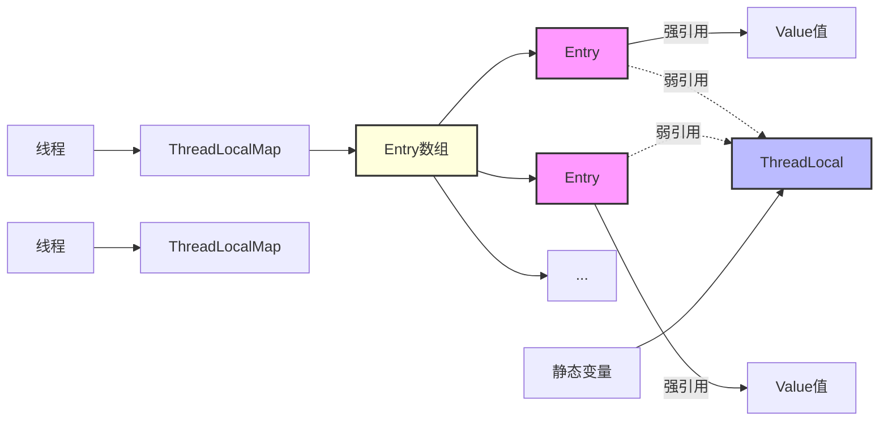

## ThreadLocal
### ThreadLocal 的实现原理

ThreadLocal 本质上是一个线程隔离的变量存储机制，它的核心实现主要依赖以下几个关键部分：

1. ThreadLocal 对象本身不存储值，而是作为一个 key 来访问`线程中的ThreadLocalMap`

2. Thread 类中有一个 ThreadLocalMap 类型的成员变量 threadLocals:
```java
class Thread {
    ThreadLocalMap threadLocals = null;
    //...
}
```

3. ThreadLocalMap 的实现是类似 HashMap 的结构:
```java
static class ThreadLocalMap {
    // Entry 继承自 WeakReference
    static class Entry extends WeakReference<ThreadLocal<?>> {
        Object value;
        Entry(ThreadLocal<?> k, Object v) {
            super(k);
            value = v;
        }
    }
    private Entry[] table;
    //...
}
```

工作原理如下：

1. 当调用 `ThreadLocal.set(value)` 时：
- 首先获取当前线程对象
- 从线程对象中获取 ThreadLocalMap
- 如果 map 不存在则创建一个
- 将 ThreadLocal 对象作为 key，值作为 value 存储到 map 中
```java
public void set(T value) {
    // 获取当前线程对象
    Thread t = Thread.currentThread();
    
    // 根据当前线程对象，获取当前线程对象中的ThreadLocalMap类型的 threadlocals变量
    ThreadLocalMap map = getMap(t);
    
    // 如果map存在
    if (map != null) {
        // 执行map中的set方法，进行数据存储
        map.set(this, value);
    } else {
        // 如果map不存在，则当前线程就创建ThreadLocalMap并存值
        createMap(t, value);
    }
}
```

```java
void createMap(Thread t, T firstValue) {
	// 给当前线程的 threadlocals变量赋值
    t.threadLocals = new ThreadLocalMap(this, firstValue);
}

ThreadLocalMap(ThreadLocal<?> firstKey, Object firstValue) {
    // 内部成员数组，INITIAL_CAPACITY值为16的常量
    table = new Entry[INITIAL_CAPACITY];
    
    // 位运算，结果与取模相同，计算出需要存放的位置
    int i = firstKey.threadLocalHashCode & (INITIAL_CAPACITY - 1);
	// 以 ThreadLocalMap 自身为Key
    table[i] = new Entry(firstKey, firstValue);
    size = 1;
    setThreshold(INITIAL_CAPACITY);
}
```


2. 当调用 ThreadLocal.get() 时：
- 同样获取当前线程的 ThreadLocalMap
- 以 ThreadLocal 对象为 key 查找对应的 Entry
- 返回 Entry 中存储的 value

3. 内存泄露问题：
- ThreadLocalMap 的 Entry 继承自 WeakReference
- ThreadLocal 作为 key 被弱引用持有,可以被垃圾回收
- 但 value 仍然被 Entry 强引用持有
- 因此使用完 ThreadLocal 后需要主动调用 remove() 方法清理

代码示例：
```java
public class ThreadLocal<T> {
    public void set(T value) {
        Thread t = Thread.currentThread();
        ThreadLocalMap map = getMap(t);
        if (map != null)
            map.set(this, value);
        else
            createMap(t, value);
    }
    
    public T get() {
        Thread t = Thread.currentThread();
        ThreadLocalMap map = getMap(t);
        if (map != null) {
            ThreadLocalMap.Entry e = map.getEntry(this);
            if (e != null) {
                @SuppressWarnings("unchecked")
                T result = (T)e.value;
                return result;
            }
        }
        return setInitialValue();
    }
}
```

这种实现方式的优点是：
1. 实现了线程隔离，每个线程都拥有自己的变量副本
2. 避免了同步操作，提高了性能
3. 数据互不干扰，简化了并发编程

注意点：
1. 及时调用 remove() 方法避免内存泄露
2. 注意线程池场景下的变量清理
3. ThreadLocal 对象的生命周期管理

### ThreadLocal 内存泄漏



内存泄漏的原因：
1. 强引用没有正确解除
   - 当我们让静态变量 = null 时,ThreadLocal 对象失去了强引用
   - 此时 ThreadLocal 仅剩 Entry 对象的弱引用
   - ThreadLocal 对象在下次 GC 时就会被回收
   - 但关键问题在于: Entry 对象仍然被 ThreadLocalMap 的 table 数组强引用着
   - Entry 中的 value 也依然被 Entry 强引用着
   - 这导致 value 无法被回收,造成内存泄漏

2. 为什么我们不能依赖 set 方法解决:
   - 虽然ThreadLocal 的 set 方法确实会清理 key 为 null 的 Entry
   - 但这种清理是不可靠的,因为依赖于下次调用 set 时否能碰巧命中这个位置
   - 如果后续没有 set 操作,或 set 的 hash 没有命中该位置，内存泄漏就会持续存在

最佳实践:
- 明确调用 ThreadLocal 的 remove() 方法,主动清理 Entry
- remove 会断开 table 数组对 Entry 的强引用
- 然后再解除外部对 ThreadLocal 的强引用
- 这样可以确保整个引用链都被安全地清理
- 
- 养成使用完 ThreadLocal 后必须调用 remove 的习惯
- 最好把 ThreadLocal 的清理放在 finally 块中
- 如果是线程池场景,清理显得尤为重要,因为线程会被重用

  
##  ReentrantLock 

|**功能**|**使用场景**|
|---|---|
|**基本用法 (`lock()`)**|需要显式控制锁的场景，比如复杂的并发逻辑。|
|**尝试获取锁 (`tryLock()`)**|不希望线程阻塞的场景，比如任务可以稍后重试或直接放弃。|
|**超时获取锁 (`tryLock(timeout, unit)`)**|需要控制任务执行时间的场景，比如避免死锁或任务堆积。|
|**可中断获取锁 (`lockInterruptibly()`)**|需要响应中断的场景，比如任务取消或线程池关闭。|