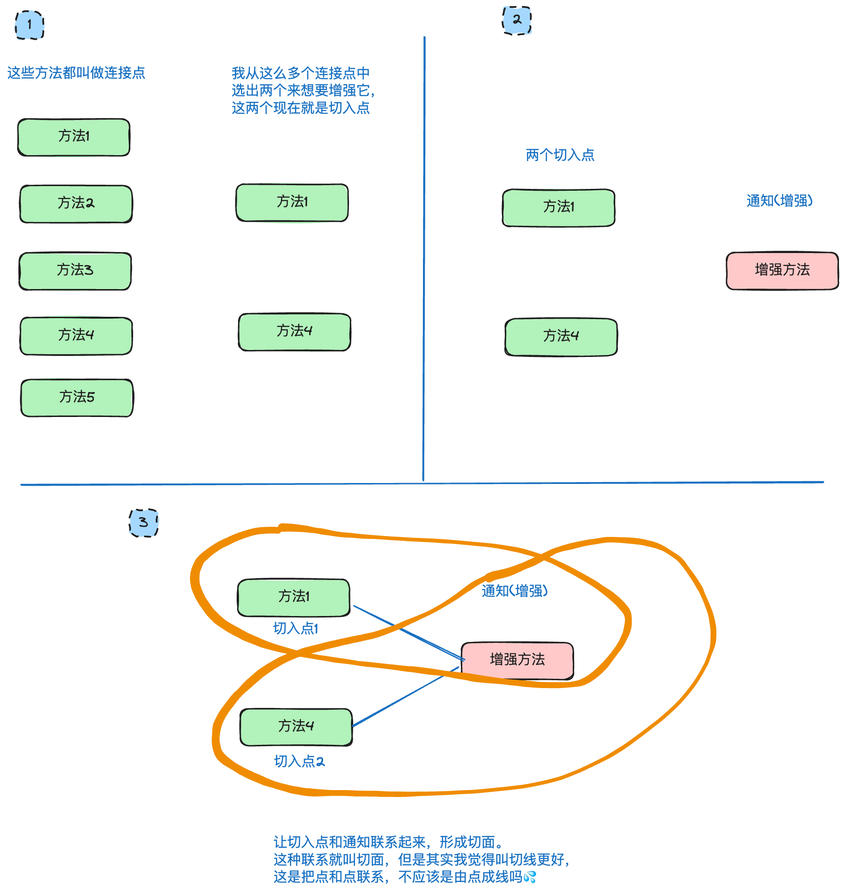
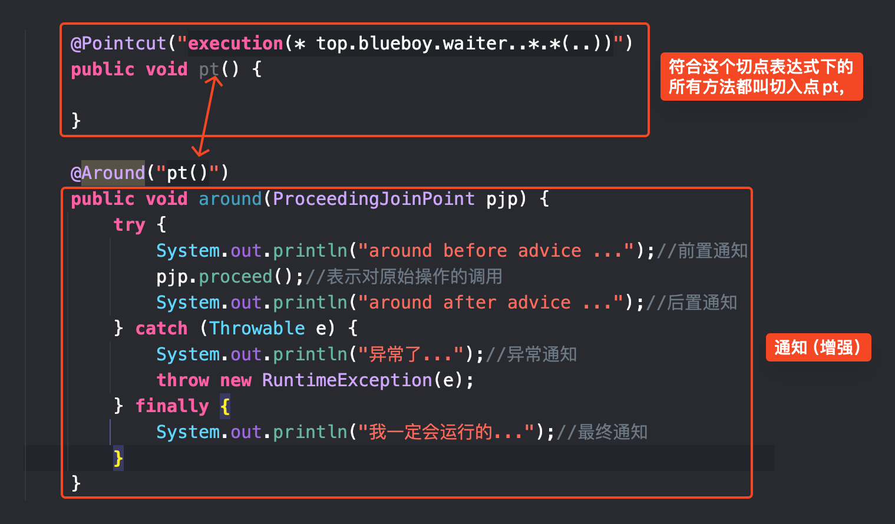

## 简介
- Spring 是分层的 Java SE/EE 应用 full-stack 轻量级开源框架，以 [IOC](#控制反转) 和 [AOP](#AOP) 为内核。
- Spring 底层用的是反射。
- Spring在创建Bean时，会优先选择使用无参构造方法来实例化对象。
## 快速入门
### 在 Maven 工程中导入相关依赖
`pom.xml`
```xml
<dependencies>  
    <dependency>  
        <groupId>org.springframework</groupId>  
        <artifactId>spring-context</artifactId>  
        <version>5.2.6.RELEASE</version>  
    </dependency>  
    <dependency>  
        <groupId>junit</groupId>  
        <artifactId>junit</artifactId>  
        <version>4.13</version>  
        <scope>test</scope>  
    </dependency>  
</dependencies>
```
### 编写接口和实现类
<font color="#00b050">UserDao.java</font>
```java
public interface UserDao {
    void add();
}
```
<font color="#00b0f0">UserDaoImpl.java</font>
```java
public class UserDaoImpl implements UserDao {
    @Override
    public void add() {
        System.out.println("UserDao saving ....");
    }
}
```
<font color="#00b050">UserService.java</font>
```java
public interface UserService {
    void save();
}
```
<font color="#00b0f0">UserServiceImpl.java</font>
```java
public class UserServiceImpl implements UserService {
    @Override
    public void save() {
        System.out.println("UserService saving....");
    }
}
```
### 编写 Spring 核心配置文件
`applicationContext.xml`
```xml
<?xml version="1.0" encoding="UTF-8"?>
<beans xmlns="http://www.springframework.org/schema/beans"
       xmlns:xsi="http://www.w3.org/2001/XMLSchema-instance"
       xsi:schemaLocation="http://www.springframework.org/schema/beans 
       http://www.springframework.org/schema/beans/spring-beans.xsd">

	<!-- 配置两个由spring容器管理的bean -->
    <bean id="userDao" class="top.blueboy.Dao.impl.UserDaoImpl" />
    <bean id="userService" class="top.blueboy.service.impl.UserServiceImpl" />
    
</beans>
```
### 编写测试类
<font color="#00b0f0">Test1.java</font>
```java
public class Test1 {
    @Test
    public void test1() {
        ApplicationContext ctx = new ClassPathXmlApplicationContext("applicationContext.xml");
        //从容器中获取bean
        UserDao userDao = (UserDao) ctx.getBean("userDao");
        userDao.add();

        UserService userService = (UserService) ctx.getBean("userService");
        userService.save();

    }
}
```

运行结果：
```
UserDao saving ....
UserService saving....

进程已结束，退出代码为 0
```

## 控制反转
>控制反转的是对象的创建权，实现了对象不由我们手动创建，而是由 Spring 提供的 IOC 容易统一管理和创建对象。

做完如上案例我们就已经体会过了对象由容器提供的过程。

### bean
#### 基础属性
| 属性    |     |   取值范围   |     | 说明                    | 备注                             |
| ----- | :-: | :------: | --- | --------------------- | ------------------------------ |
| id    |     | 符合标识符的取名 |     | 标注该 bean 的唯一标识，不可重复   |                                |
| class |     | 实现类的全类名  |     | 该 bean 是从哪里加载的，也就是它的根 | 不可以写接口，要写实现类，实现类才可以造对象然后返还给我们。 |
#### 作用范围

| 属性    |     |   取值范围    |     | 说明                                   | 备注                                                                                                                      |
| ----- | :-: | :-------: | --- | ------------------------------------ | ----------------------------------------------------------------------------------------------------------------------- |
| scope |     | singleton |     | 标注该 bean 是单例的，在 IOC 容器中存在一份，重复使用。    | - 如果不写 scope，默认 scope="singleton"，<br>- 该 bean 是伴随着容器创建和销毁而创建和销毁。容器在它就在。<br>- bean 对象只有一个就避免了对象的频繁创建与销毁，达到了 bean 对象的复用. |
|       |     | prototype |     | 标注该 bean 是非单例的，getBean 一次就会造出一个新的对象。 | - 使用对象时(getBean)创建，一直在在使用它就一直存在，<br>- 该对象会在长时间不使用后被回收。                                                                  |

#### 生命周期

| 属性             |     | 取值范围 |     | 说明           | 备注  |
| -------------- | :-: | :--: | --- | ------------ | --- |
| init-method    |     |      |     | 指定类中的初始化方法名称 |     |
| destroy-method |     |      |     | 指定类中销毁方法名称   |     |

#### 初始化时机
| 属性        |     | 取值范围  |     | 说明                   | 备注  |
| --------- | :-: | :---: | --- | -------------------- | --- |
| lazy-init |     | true  |     | 配置为只有在第一次被请求时才会被实例化。 |     |
|           |     | false |     | 默认值，即非延迟加载，而是立即加载实例化 |     |

## 如何理解 bean？
>bean 是如何被创建出来的？

- 配置好 bean 中的相关属性配置
- spring 加载 `applicationContext.xml`
	- 默认情况(lazy-init=false)下，在加载配置文件时直接根据 bean 标签中 class 值生成实现类的对象放在容器中供后续使用。
- 使用 getBean 即可从容器中获取对象。

#### Bean实例化的三种方式
##### 无参构造方法实例化
```xml
<bean id="userDao" class="top.blueboy.dao.impl.UserDaoImpl">
```
`id + class ——> 直接根据无参构造方法 new 一个对象出来`

##### 静态工厂实例化
<font color="#00b0f0">OrderDaoFactory.java</font>
```java
public class OrderDaoFactory {
	public static OrderDao getOrderDao(){ 
		System.out.println("factory setup....");//模拟必要的业务操作 
		return new OrderDaoImpl(); 
	} 
}
```
`applicationContext.xml`
```xml
<bean id="orderDao" class="top.blueboy.factory.OrderDaoFactory" factorymethod="getOrderDao"/>
```

`id + class + factory method ——> 调用 factory-method 方法获取某实现类对象`
`spring能理解这句话，就是配置了个静态工厂，把静态工厂中的静态方法返回的值，也就是返回的对象放到容器中，以便后续使用。`
##### 实例工厂实例化
<font color="#00b0f0">UserDaoFactory.java</font>
```java
public class UserDaoFactory { 
	public UserDao getUserDao(){
		return new UserDaoImpl(); 
	}
}
```

`applicationContext.xml`
```xml
<bean id="userFactory" class="top.blueboy.factory.UserDaoFactory"/> 
<bean id="userDao" factory-bean="userFactory" factory-method="getUserDao" />
```

`先把工厂类的对象，给容器接管造出来，然后才能根据这个对象中的方法造 userDao`
## 依赖注入
>绑定对象与对象之间的依赖关系。获取到对象时，对该对象中的依赖对象的进行赋值。
### 依赖注入的方式
#### 构造方法注入
`applicationContext.xml`
```xml
<?xml version="1.0" encoding="UTF-8"?>  
<beans xmlns="http://www.springframework.org/schema/beans"  
       xmlns:xsi="http://www.w3.org/2001/XMLSchema-instance"  
       xsi:schemaLocation="http://www.springframework.org/schema/beans 
       http://www.springframework.org/schema/beans/spring-beans.xsd">  
  
    <bean id="userDao" class="top.blueboy.Dao.impl.UserDaoImpl" />  
    <bean id="userService" class="top.blueboy.service.impl.UserServiceImpl" >
	    <!--  
		    构造器注入
		    name 要赋值的属性名
		    ref  引用赋值
		  -->  
        <constructor-arg name="userDao" ref="userDao" />  
    </bean>  
      
</beans>
```

#### set 方法注入
`applicationContext.xml`
```xml
<?xml version="1.0" encoding="UTF-8"?>
<beans xmlns="http://www.springframework.org/schema/beans"  
       xmlns:xsi="http://www.w3.org/2001/XMLSchema-instance"  
       xsi:schemaLocation="http://www.springframework.org/schema/beans
       http://www.springframework.org/schema/beans/spring-beans.xsd">
  
    <bean id="userDao" class="top.blueboy.Dao.impl.UserDaoImpl" />  
    <bean id="userService" class="top.blueboy.service.impl.UserServiceImpl" >
	    <!--  set注入  -->
        <!--  name指的是setXXX的XXX，但是因为我们都是标准命名，所以也可以认为就是属性的名字  -->
        <property name="userDao" ref="userDao"/>
    </bean>  
</beans>
```

#### 名称空间注入
`applicationContext.xml`
```xml
<?xml version="1.0" encoding="UTF-8"?>  
<beans xmlns="http://www.springframework.org/schema/beans"  
       xmlns:xsi="http://www.w3.org/2001/XMLSchema-instance"  
       xmlns:p="http://www.springframework.org/schema/p"  
       xsi:schemaLocation="http://www.springframework.org/schema/beans 
       http://www.springframework.org/schema/beans/spring-beans.xsd">  
  
    <bean id="userDao" class="top.blueboy.Dao.impl.UserDaoImpl" />  
    <bean id="userService" class="top.blueboy.service.impl.UserServiceImpl" p:userDao-ref="userDao" />
    <!--  userDao还是指的是setXXX中的XXX的名字 --><!--  等号后是bean id -->  
</beans>
```

测试程序，以上三种注入方式达成的效果均一致。
<font color="#00b0f0">Test1.java</font>
```java
public class Test1 {  
    @Test  
    public void test1() {  
        ApplicationContext ctx = new ClassPathXmlApplicationContext("applicationContext.xml");  
        UserService userService = (UserService) ctx.getBean("userService");  
        userService.save();  
  
    }  
}
```
### 不同类型的注入
#### 简单类型的注入
<font color="#00b0f0">Department.java</font>
```java
@Data  
@AllArgsConstructor  
@NoArgsConstructor  
public class Department {  
    private Integer id;//部门编号  
    private String name;//部门名称  
    private String desc;//部门描述  
}
```
`applicationContext.xml`
```xml
<?xml version="1.0" encoding="UTF-8"?>  
<beans xmlns="http://www.springframework.org/schema/beans"  
       xmlns:xsi="http://www.w3.org/2001/XMLSchema-instance"  
       xmlns:p="http://www.springframework.org/schema/p"  
       xsi:schemaLocation="http://www.springframework.org/schema/beans http://www.springframework.org/schema/beans/spring-beans.xsd">  

    <!-- 简单类型的注入 -->  
    <bean id="department" class="top.blueboy.bean.Department">  
        <property name="id" value="1"/>  
        <property name="name" value="研发部"/>  
        <property name="desc" value="研发超级牛逼的产品"/>  
    </bean>  
  
</beans>
```
<font color="#00b0f0">Test1.java</font>
```java
@Test  
public void test2() {  
    ApplicationContext ctx = new ClassPathXmlApplicationContext("applicationContext.xml");  
    Department dp = (Department) ctx.getBean("department");  
    System.out.println(dp);  
  
}
```

```
Department(id=1, name=研发部, desc=研发超级牛逼的产品)

进程已结束，退出代码为 0
```

#### 引用类型的注入
<font color="#00b0f0">Department.java</font>
```java
@Data  
@AllArgsConstructor  
@NoArgsConstructor  
public class Department {  
    private Integer id;//部门编号  
    private String name;//部门名称  
    private String desc;//部门描述  
    private Address address;  
}
```

`applicationContext.xml`
```xml
<!-- 引用类型的注入 -->  
<bean id="address" class="top.blueboy.bean.Address" >  
    <property name="province" value="山东省" />  
    <property name="city" value="青岛市" />  
    <property name="county" value="市北区" />  
    <property name="street" value="龙城路" />  
    <property name="no" value="31号" />  
</bean>  
<bean id="department" class="top.blueboy.bean.Department">  
    <property name="id" value="1"/>  
    <property name="name" value="研发部"/>  
    <property name="desc" value="研发超级牛逼的产品"/>  
    <!-- ref=某beanid -->
    <property name="address" ref="address" />  
</bean>
```

<font color="#00b0f0">Test1.java</font>
```java
@Test  
public void test3() {  
    ApplicationContext ctx = new ClassPathXmlApplicationContext("applicationContext.xml");  
    Department dp = (Department) ctx.getBean("department");  
    System.out.println(dp);  
  
}
```

```
Department(id=1, name=研发部, desc=研发超级牛逼的产品, address=Address(province=山东省, city=青岛市, county=市北区, street=龙城路, no=31号))

进程已结束，退出代码为 0
```


#### 数组的注入
```xml
<property name="array"> 
	<array>
		<value>100</value> 
		<value>200</value> 
		<value>300</value> 
	</array> 
</property>
```


#### 集合类型的注入
##### List
<font color="#00b0f0">Employee.java</font>
```java
@Data  
@AllArgsConstructor  
@NoArgsConstructor  
public class Employee {  
    private Integer id;//员工编号  
    private String name;//姓名  
    private Integer age;//年龄  
    private String gender;//性别  
    private List<String> hobby;//爱好  
}
```

`applicationContext.xml`
```xml
<!-- list注入 -->  
<bean id="employee" class="top.blueboy.bean.Employee">  
    <property name="id" value="1"/>  
    <property name="name" value="初音未来"/>  
    <property name="age" value="18"/>  
    <property name="gender" value="女"/>  
    <property name="hobby">  
        <list>  
            <value>唱歌</value>  
            <value>跳舞</value>  
            <value>Coser</value>  
        </list>  
    </property>  
</bean>
```

<font color="#00b0f0">Test1.java</font>
```java
@Test  
public void test4() {  
    ApplicationContext ctx = new ClassPathXmlApplicationContext("applicationContext.xml");  
    Employee dp = (Employee) ctx.getBean("employee");  
    System.out.println(dp);  
  
}
```

```
Employee(id=1, name=初音未来, age=18, gender=女, hobby=[唱歌, 跳舞, Coser])

进程已结束，退出代码为 0
```

list\<引用类型\>
<font color="#00b0f0">Department.java</font>
```java
@Data  
@AllArgsConstructor  
@NoArgsConstructor  
public class Department {  
    private Integer id;//部门编号  
    private String name;//部门名称  
    private String desc;//部门描述  
    private Address address;  
    private List<Employee> employees;  
}
```

`applicationContext.xml`
```xml
<!-- list注入 -->  
<bean id="e1" class="top.blueboy.bean.Employee">  
    <property name="id" value="1"/>  
    <property name="name" value="初音未来"/>  
    <property name="age" value="18"/>  
    <property name="gender" value="女"/>  
    <property name="hobby">  
        <list>  
            <value>唱歌</value>  
            <value>跳舞</value>  
            <value>Coser</value>  
        </list>  
    </property>  
</bean>  
  
<bean id="e2" class="top.blueboy.bean.Employee">  
    <property name="id" value="2"/>  
    <property name="name" value="洛天依"/>  
    <property name="age" value="18"/>  
    <property name="gender" value="女"/>  
    <property name="hobby">  
        <list>  
            <value>唱歌</value>  
            <value>跳舞</value>  
            <value>Coser</value>  
        </list>  
    </property>  
</bean>  
  
<bean id="address1" class="top.blueboy.bean.Address" >  
    <property name="province" value="山东省" />  
    <property name="city" value="青岛市" />  
    <property name="county" value="市北区" />  
    <property name="street" value="龙城路" />  
    <property name="no" value="31号" />  
</bean>  
<bean id="department1"  class="top.blueboy.bean.Department">  
    <property name="id" value="1"/>  
    <property name="name" value="宣发部"/>  
    <property name="desc" value="宣发牛逼的产品"/>  
    <property name="address" ref="address1"/>  
    <property name="employees">  
        <list>  
            <ref bean="e1"/>  
            <ref bean="e2"/>  
        </list>  
    </property>  
</bean>
```

<font color="#00b0f0">Test1.java</font>
```java
@Test  
public void test5() {  
    ApplicationContext ctx = new ClassPathXmlApplicationContext("applicationContext.xml");  
    Department dp = (Department) ctx.getBean("department1");  
    System.out.println(dp);  
  
}
```

```
Department(id=1, name=宣发部, desc=宣发牛逼的产品, address=Address(province=山东省, city=青岛市, county=市北区, street=龙城路, no=31号), employees=[Employee(id=1, name=初音未来, age=18, gender=女, hobby=[唱歌, 跳舞, Coser]), Employee(id=2, name=洛天依, age=18, gender=女, hobby=[唱歌, 跳舞, Coser])])

进程已结束，退出代码为 0
```
##### Map
<font color="#00b0f0">Department.java</font>
```java
@Data  
@AllArgsConstructor  
@NoArgsConstructor  
public class Department {  
    private Integer id;//部门编号  
    private String name;//部门名称  
    private String desc;//部门描述  
    private Address address;  
    private Map<String, Employee> leader;//部门主管  
    private List<Employee> employees;  
}
```

`applicationContext.xml`
```xml
<!-- map注入 -->  
<bean id="e1" class="top.blueboy.bean.Employee">  
    <property name="id" value="1"/>  
    <property name="name" value="初音未来"/>  
    <property name="age" value="18"/>  
    <property name="gender" value="女"/>  
    <property name="hobby">  
        <list>  
            <value>唱歌</value>  
            <value>跳舞</value>  
            <value>Coser</value>  
        </list>  
    </property>  
</bean>  
  
<bean id="e2" class="top.blueboy.bean.Employee">  
    <property name="id" value="2"/>  
    <property name="name" value="宫崎骏"/>  
    <property name="age" value="55"/>  
    <property name="gender" value="男"/>  
    <property name="hobby">  
        <list>  
            <value>画画</value>  
            <value>动漫</value>  
            <value>拍摄</value>  
        </list>  
    </property>  
</bean>  
  
<bean id="address2" class="top.blueboy.bean.Address" >  
    <property name="province" value="山东省" />  
    <property name="city" value="青岛市" />  
    <property name="county" value="市北区" />  
    <property name="street" value="龙城路" />  
    <property name="no" value="31号" />  
</bean>  
<bean id="department2"  class="top.blueboy.bean.Department">  
    <property name="id" value="1"/>  
    <property name="name" value="宣发部"/>  
    <property name="desc" value="宣发牛逼的产品"/>  
    <property name="address" ref="address2"/>  
    <property name="leader">  
        <map>  
            <entry key="CEO" value-ref="e2" />  
        </map>  
    </property>  
    <property name="employees">  
        <list>  
            <ref bean="e1"/>  
        </list>  
    </property>  
</bean>
```

<font color="#00b0f0">Test1.java</font>
```java
    @Test
    public void test6() {
        ApplicationContext ctx = new ClassPathXmlApplicationContext("applicationContext.xml");
        Department dp = (Department) ctx.getBean("department2");
        System.out.println(dp);

    }
```

```
Department(id=1, name=宣发部, desc=宣发牛逼的产品, address=Address(province=山东省, city=青岛市, county=市北区, street=龙城路, no=31号), leader={CEO=Employee(id=2, name=宫崎骏, age=55, gender=男, hobby=[画画, 动漫, 拍摄])}, employees=[Employee(id=1, name=初音未来, age=18, gender=女, hobby=[唱歌, 跳舞, Coser])])

进程已结束，退出代码为 0

```


##### Properties

<font color="#00b0f0">JdbcConfig.java</font>
```java
@Data  
@AllArgsConstructor  
@NoArgsConstructor  
public class JdbcConfig {  
    private Properties config;  
}
```

`applicationContext.xml`
```xml
<!-- properties注入 -->  
<bean id="jdbcConfig" class="top.blueboy.bean.JdbcConfig">  
    <!-- Properties类型的注入 -->  
    <property name="config">  
        <props>  
            <prop key="driverName">com.mysql.jdbc.Driver</prop>  
            <prop key="url">jdbc:mysql://localhost:3306/test</prop>  
            <prop key="username">root</prop>  
            <prop key="password">root</prop>  
        </props>  
    </property>  
</bean>
```

<font color="#00b0f0">Test1.java</font>
```java
@Test  
public void test7() {  
    ApplicationContext ctx = new ClassPathXmlApplicationContext("applicationContext.xml");  
    JdbcConfig jc = (JdbcConfig) ctx.getBean("jdbcConfig");  
    System.out.println(jc);  
  
}
```

```
JdbcConfig(config={password=root, url=jdbc:mysql://localhost:3306/test, driverName=com.mysql.jdbc.Driver, username=root})

进程已结束，退出代码为 0
```


## 拆分配置并引入
>简洁核心配置文件中的配置数量。
## 案例配置数据源

`applicationContext.xml`
```xml
<?xml version="1.0" encoding="UTF-8"?>  
<beans xmlns="http://www.springframework.org/schema/beans"  
       xmlns:xsi="http://www.w3.org/2001/XMLSchema-instance"  
       xmlns:p="http://www.springframework.org/schema/p"  
       xsi:schemaLocation="http://www.springframework.org/schema/beans 
       http://www.springframework.org/schema/beans/spring-beans.xsd">  
  
    <import resource="classpath:applicationContext-dataSource.xml"/>  
</beans>
```

`applicationContext-dataSource.xml`
```xml
<?xml version="1.0" encoding="UTF-8"?>  
<beans xmlns="http://www.springframework.org/schema/beans"  
       xmlns:xsi="http://www.w3.org/2001/XMLSchema-instance"  
       xmlns:context="http://www.springframework.org/schema/context"  
       xsi:schemaLocation="http://www.springframework.org/schema/beans  
        http://www.springframework.org/schema/beans/spring-beans.xsd        
        http://www.springframework.org/schema/context        
        http://www.springframework.org/schema/context/spring-context.xsd">  
  
    <context:property-placeholder location="jdbc.properties"/>  
  
    <bean id="dataSource" class="com.alibaba.druid.pool.DruidDataSource">  
        <property name="driverClassName" value="${jdbc.driver}"/>  
        <property name="url" value="${jdbc.url}"/>  
        <property name="username" value="${jdbc.username}"/>  
        <property name="password" value="${jdbc.password}"/>  
        <property name="initialSize" value="${jdbc.initialSize}"/>  
        <property name="maxActive" value="${jdbc.maxActive}"/>  
        <property name="minIdle" value="${jdbc.minIdle}"/>  
    </bean>  
  
</beans>
```

`jdbc.properties`
```properties
jdbc.driver=com.mysql.jdbc.Driver  
jdbc.url=jdbc:mysql://localhost:3306/webtest?useSSL=false&useUnicode=true&characterEncoding=utf-8  
jdbc.username=root  
jdbc.password=root  
##初始化连接数量  
jdbc.initialSize=10  
##最大连接数量  
jdbc.maxActive=50  
##最小空闲连接  
jdbc.minIdle=5
```

<font color="#00b0f0">Test.java</font>
```java
@Test  
public void test1() throws SQLException {  
    ApplicationContext ctx = new ClassPathXmlApplicationContext("applicationContext.xml");  
    DataSource dataSource = (DruidDataSource)ctx.getBean("dataSource");  
    Connection connection = dataSource.getConnection();  
    System.out.println(connection);  
}
```

## 动态代理
### 什么是动态代理
>动态代理是一种在不修改源码的情况下对方法进行增强的技术。

```
代理对象 = 目标对象 + 增强（也叫通知）
```

目标对象：被增强的对象，被代理的对象。

代理对象：需要目标对象，然后在目标对象上添加了增强后的对象。

目标方法：被增强的方法。


到现在为止，我们需要知道有一种方式可以在不改变目标对象方法的前提下，对方法进行增强，这个方式就是动态代理。使用它，我们需要提供目标对象和增强生成代理对象。

得到了代理对象就相当于有了一个强化版的目标对象，运行相关方法，除了运行方法本身，增强的内容也会被运行，从而实现了在不改变源码的前提下，对方法进行增强。

### JDK 的动态代理

<font color="#00b050">IWaiter.java</font>
```java
//表示服务员的接口
public interface IWaiter {
    //提供服务的方法
    void serve();
}
```

<font color="#00b0f0">ManWaiter.java</font>
```java
//目标类
public class ManWaiter implements IWaiter {
	//目标方法
    @Override
    public void serve() {
        System.out.println("服务...");
    }
}
```

<font color="#00b0f0">Advice.java</font>
```java
//增强
public class Advice {
	/*
		前置增强，在目标方法之前运行
	*/
    public void before() {
        System.out.println("您好...");
    }

    /*
		后置增强，在目标方法之后运行
	*/
    public void after() {
        System.out.println("再见...");
    }
}
```

<font color="#00b0f0">testJdkProxy.java</font>
```java
//测试基于JDK的动态代理，实现在不修改ManWaiter方法源码的情况下，对ManWaiter的的方法进行增强
@Test  
public void testJdkProxy() {  
    //目标对象  
    IWaiter manWaiter = new ManWaiter();  
    //通知对象  
    Advice advice = new Advice();  
  
    //代理对象  
    /**  
     * ClassLoader: 类加载器  
     *      用于加载代理对象字节码，和被代理对象使用相同的类加载器，写法固定  
     * Class<?>[]：字节码数组  
     *      用于让代理对象和被代理对象有相同方法，写法固定  
     * InvocationHandler：提供增强的代码  
     *      用于我们写如何代理，我们一般都行写这个接口的实现类，通常情况下是匿名内部类  
     *  
     */    
     //代理对象  
    IWaiter waiter = (IWaiter) Proxy.newProxyInstance(  
            //参数1  
            manWaiter.getClass().getClassLoader(),  
            //参数2  
            manWaiter.getClass().getInterfaces(),  
            //参数3  
            new InvocationHandler() {  
                @Override  
                /**  
                 * 作用：执行被代理对象的任何接口方法都会经过该方法  
                 * proxy：代理对象的引用  
                 * method：当前执行的方法  
                 * args：当前执行方法所需的参数  
                 * 返回值：和被代理对象方法有相同的返回值  
                 *  
                 */                
                 //配置一下方法运行顺序  
                public Object invoke(Object proxy, Method method, Object[] args) throws Throwable {  
                    //前置增强  
                    advice.before();  
                    //执行被增强方法  
                    Object result = method.invoke(manWaiter, args);  
                    //后置增强  
                    advice.after();  
                    //返回原方法执行结果  
                    return result;  
                }  
            }  
    );  
    //原目标对象（增强前）  
    manWaiter.serve();  
    System.out.println("------------");  
    //代理对象（增强后）  
    waiter.serve();  
}
```

### cglib 的动态代理

`pom.xml`
```xml
<dependency>
    <groupId>cglib</groupId>
    <artifactId>cglib</artifactId>
    <version>2.2</version>
</dependency>
```

<font color="#00b0f0">WomanWaiter.java</font>
```java
public class WomanWaiter {
    public void serve() {
        System.out.println("服务...");
    }
}
```

<font color="#00b0f0">Advice.java</font>
```java
//增强
public class Advice {

    public void before() {
        System.out.println("您好...");
    }

    public void after() {
        System.out.println("再见...");
    }

}
```

<font color="#00b0f0">Test.java</font>
```java
/**
  * 涉及的类：Enhancer
  * 提供者：第三方cglib库
  * 如何创建代理对象：使用Enhancer类中的create方法
  * 创建代理对象的要求：被代理类不能是final类
  * create方法的参数：
  *      Class：字节码
  *          用于指定被代理对象的字节码
  *      Callback：用于提供增强的代码
  *          它是让我们写如何代理，一般都是写一些该接口的实现类，通常情况下是匿名内部类。
  *          一般写的都是该接口的子接口实现类：MethodInterceptor
  *
  */
@Test
public void testCglib() {
    //目标对象
    WomanWaiter waiter = new WomanWaiter();
    //通知对象
    Advice advice = new Advice();

    //代理对象
    WomanWaiter proxyWaiter = (WomanWaiter)Enhancer.create(
	    //参数1
	    waiter.getClass(), 
	    //参数2
	    new MethodInterceptor() {

        /**
         * 执行被代理对象的任何方法都会经过该方法
         *
         * 前三个参数和基于接口的动态代理中invoke方法的参数是一样的
         */
         
         //绑定一个顺序关系
        @Override
        public Object intercept(Object o, Method method, Object[] objects, MethodProxy methodProxy) throws Throwable {
            advice.before();
            Object result = method.invoke(waiter, objects);
            advice.after();

            return result;
        }
    });

    //执行目标对象的方法
    proxyWaiter.serve();
}
```

### 代理工厂的动态代理

<font color="#00b0f0">ProxyFactory.java</font>
```java
@Data  
public class ProxyFactory {  
    private Object targetOjb;  
    private BeforeAdvice beforeAdvice;  
    private AfterAdvice afterAdvice;  
  
    public Object createProxyOjb() {  
        //参数1:：获取目标类的类加载器  
        ClassLoader classLoader = this.targetOjb.getClass().getClassLoader();  
        //参数2： 获取目标类的实现接口  
        Class[] interfaces = this.targetOjb.getClass().getInterfaces();  
        //参数3：创建一个 InvocationHandler接口的匿名内部类，并且重写invoke方法  
        //可以把参数3完成的内容理解为组织通知的调用时机  
        InvocationHandler invocationHandler = new InvocationHandler() {  
            @Override  
            public Object invoke(Object proxy, Method method, Object[] args) throws Throwable {  
                  
                Object resultOjb = null;  
  
                if (beforeAdvice != null) {  
                    beforeAdvice.before();  
                }  
  
                resultOjb = method.invoke(targetOjb, args);  
  
                if (afterAdvice != null) {  
                    afterAdvice.after();  
                }  
  
                //总不能增强完方法之后原来的返回值都没了吧？  
                return resultOjb;  
            }  
        };  
  
        //组织，得到代理对象  
        return Proxy.newProxyInstance(classLoader, interfaces, invocationHandler);  
  
    }  
}
```
<font color="#00b0f0">Test.java</font>
```java
@Test  
public void test2()  {  
    //创建代理工厂  
    ProxyFactory factory = new ProxyFactory();  
    //创建增强  
    BeforeAdvice beforeAdvice = new BeforeAdviceImpl();  
    AfterAdvice afterAdvice = new AfterAdviceImpl();  
    //设置目标对象  
    factory.setTargetOjb(new WaiterImpl());  
    //设置增强  
    factory.setBeforeAdvice(beforeAdvice);  
    factory.setAfterAdvice(afterAdvice);  
    //创建代理对象  
    Waiter proxyObject = (Waiter) factory.createProxyOjb();  
    //执行目标方法  
    proxyObject.service();  
}
```

### 代理工厂和 Spring 的动态代理
`applicationContext.xml`
```xml
<?xml version="1.0" encoding="UTF-8"?>  
<beans xmlns="http://www.springframework.org/schema/beans"  
       xmlns:xsi="http://www.w3.org/2001/XMLSchema-instance"  
       xmlns:p="http://www.springframework.org/schema/p"  
       xsi:schemaLocation="http://www.springframework.org/schema/beans 
       http://www.springframework.org/schema/beans/spring-beans.xsd">  
  
        <bean id="beforeAdvice" class="top.blueboy.advice.BeforeAdviceImpl"/>  
        <bean id="afterAdvice" class="top.blueboy.advice.AfterAdviceImpl" />  
        <bean id="manWaiter" class="top.blueboy.waiter.impl.WaiterImpl" />  
        <bean id="proxyFactory" class="top.blueboy.factory.ProxyFactory">  
            <property name="beforeAdvice" ref="beforeAdvice" />  
            <property name="afterAdvice" ref="afterAdvice" />  
            <property name="targetOjb" ref="manWaiter" />  
        </bean>  
    </beans>
```

<font color="#00b0f0">Test.java</font>
```java
@Test  
public void test1() {  
    ApplicationContext context = new ClassPathXmlApplicationContext("applicationContext.xml");  
    ProxyFactory facory = (ProxyFactory)context.getBean("proxyFactory");  
  
    Waiter manWaiter = (Waiter)facory.createProxyOjb();  
    manWaiter.service();  
}
```


## AOP
>两个应用：事务处理、日志处理。
### 什么是 AOP
>不修改源码的情况下做到给目标方法增强功能。

### AOP 相关概念
- Joinpoint（连接点）：有可能被增强的方法
- Pointcut（切入点）：实际被增强的方法
- Advice（通知/ 增强）：封装增强业务逻辑的方法
- Aspect（切面）：切点+通知
- Weaving（织入）：将切点与通知结合的过程



### AOP 快速入门(XML)
#### before/after 前置/后置通知
<font color="#00b050">AfterAdvice.java</font>
```java
public interface AfterAdvice {
    void after();
}
```

<font color="#00b0f0">AfterAdviceImpl.java</font>
```java
public class AfterAdviceImpl implements AfterAdvice {  
    @Override  
    public void after() {  
        System.out.println("欢迎下次光临...");  
    }  
}
```

<font color="#00b050">AfterAdvice.java</font>
```java
public interface AfterAdvice {
    void after();
}
```

<font color="#00b0f0">AfterAdviceImpl.java</font>
```java
public class AfterAdviceImpl implements AfterAdvice {
    @Override
    public void after() {
        System.out.println("欢迎下次光临...");
    }
}
```

<font color="#00b050">IWaiter.java</font>
```java
public interface IWaiter {  
    //上菜  
    void food();  
    //上酒  
    void wine();  
    //上烟  
    void smoke();  
}
```

<font color="#00b0f0">IWaiterImpl.java</font>
```java
public class IWaiterImpl implements IWaiter {  
  
    @Override  
    public void food() {  
        System.out.println("菜来了～");  
    }  
  
    @Override  
    public void wine() {  
        System.out.println("82年的拉菲给您准备好了");  
    }  
  
    @Override  
    public void smoke() {  
        System.out.println("铃铛smoke");  
    }  
}
```

`applicationContext.xml`
```xml
<?xml version="1.0" encoding="UTF-8"?>  
<beans xmlns="http://www.springframework.org/schema/beans"  
       xmlns:xsi="http://www.w3.org/2001/XMLSchema-instance"  
       xmlns:aop="http://www.springframework.org/schema/aop"  
       xsi:schemaLocation="http://www.springframework.org/schema/beans  
       http://www.springframework.org/schema/beans/spring-beans.xsd       
       http://www.springframework.org/schema/aop       
       http://www.springframework.org/schema/aop/spring-aop.xsd">  
  
    <bean id="beforeAdvice" class="top.blueboy.advice.BeforeAdviceImpl"/>  
    <bean id="afterAdvice" class="top.blueboy.advice.AfterAdviceImpl"/>  
    <bean id="manWaiter" class="top.blueboy.waiter.impl.IWaiterImpl"/>  
  
    <!-- aop配置标签开始 -->  
    <aop:config>  
        <!-- 定义了一个切面，指名了增强方法的来源（通知） -->  
        <aop:aspect ref="beforeAdvice">  
            <!--aop:运行时机：在目标方法执行之前 --> <!-- pointcut:指定目标方法在哪里（切入点） -->  
            <aop:before method="before" pointcut="execution(public void top.blueboy.waiter.impl.IWaiterImpl.food())"/>  
        </aop:aspect>  
        <aop:aspect ref="afterAdvice">  
            <!--aop:运行时机：在目标方法执行之前 --> <!-- pointcut:指定目标方法在哪里（切入点） -->  
            <aop:after method="after-returning" pointcut="execution(public void top.blueboy.waiter.impl.IWaiterImpl.food())"/>  
        </aop:aspect>  
    </aop:config>  
</beans>
```

<font color="#00b0f0">Test.java</font>
```java
@Test  
public void test1() throws SQLException {  
    ApplicationContext ctx = new ClassPathXmlApplicationContext("applicationContext.xml");  
    IWaiter manWaiter = (IWaiter)ctx.getBean("manWaiter");  
    manWaiter.food();  
}
```

```
您好！男仆为您服务！
菜来了～
欢迎下次光临...

进程已结束，退出代码为 0
```

#### around 环绕通知
`applicationContext.xml`
```xml
<!-- aop配置标签开始 -->  
<aop:config>  
    <!-- 定义了一个切面，指名了增强方法的来源（通知） -->  
    <aop:aspect ref="waiterAdvice">  
        <!--aop:运行时机：在目标方法执行之前 --> <!-- pointcut:指定目标方法在哪里（切入点） -->  
        <aop:around method="around" pointcut="execution(public void top.blueboy.waiter.impl.IWaiterImpl.food())"/>  
    </aop:aspect>  
</aop:config>
```

<font color="#00b0f0">WaiterAdvice.java</font>
```java
package top.blueboy.advice;  
  
import org.aspectj.lang.ProceedingJoinPoint;  
  
public class WaiterAdvice {  
    //前置通知  
    public void before() {  
        System.out.println("你好...");  
    }  
  
    //后置通知  
    public void afterReturning() {  
        System.out.println("吃好喝好...");  
    }  
  
  
    //环绕通知  
    public void around(ProceedingJoinPoint pjp) throws Throwable {  
        try {  
            System.out.println("你好！");  
            Object proceed = pjp.proceed();  
            System.out.println("吃好喝好！");  
        } catch (Exception e) {  
            System.out.println("....（呆若木鸡）");  
        } finally {  
            System.out.println("再见...");  
        }  
    }  
  
    //异常抛出通知  
    public void afterThrowing() {  
        System.out.println("........");  
    }  
  
    //最终通知  
    public void after() {  
        System.out.println("再见...");  
    }  
}
```
<font color="#00b0f0">Test.java</font>
```java
@Test  
public void test2() {  
    ApplicationContext ctx = new ClassPathXmlApplicationContext("applicationContext.xml");  
    IWaiter manWaiter = (IWaiter)ctx.getBean("manWaiter");  
    manWaiter.food();  
}
```

```
你好！
菜来了～
吃好喝好！
再见...

进程已结束，退出代码为 0
```

#### 异常后通知/最终通知
```xml
<aop:after-throwing method="afterThrowing" pointcut="execution(* *..*(..))" />
<aop:after method="after" pointcut="execution(* *..*(..))" />
```

#### 切点表达式
```
execution([修饰符] 返回值类型 包名.类名.方法名(参数))
```

注意：

访问修饰符可以省略

返回值类型、包名、类名、方法名可以使用星号*代表任意

包名与类名之间一个点 . 代表当前包下的类，两个点 .. 表示当前包及其子包下的类

参数列表可以使用两个点 .. 表示任意个数，任意类型的参数列表

案例：

```execution(public void tech.code2048.aop.ManWaiter.food())
execution(void tech.code2048.aop.ManWaiter.food())
execution(* tech.code2048.aop.ManWaiter.*(..))
execution(* tech.code2048.aop..*.*(..))
execution(* *..*.*(..))```
```


### AOP 快速入门(注解)
<font color="#00b0f0">SpringConfig.java</font>
```java
package top.blueboy.config;  
  
import org.springframework.context.annotation.ComponentScan;  
import org.springframework.context.annotation.Configuration;  
import org.springframework.context.annotation.EnableAspectJAutoProxy;  
  
//配置这个类是配置类  
@Configuration  
//配置扫描这个包下的注解  
@ComponentScan("top.blueboy")  
//开启AOP注解的使用  
@EnableAspectJAutoProxy  
public class SpringConfig {  
}
```
<font color="#00b0f0">IWaiterImpl.java</font>
```java
package top.blueboy.waiter.impl;  
  
import org.springframework.stereotype.Component;  
import top.blueboy.waiter.IWaiter;  
//表示交由Spring管理(来扫我啊！)  
@Component  
public class IWaiterImpl implements IWaiter {  
  
    @Override  
    public void food() {  
        System.out.println("菜来了～");  
    }  
  
    @Override  
    public void wine() {  
        System.out.println("82年的拉菲给您准备好了");  
    }  
  
    @Override  
    public void smoke() {  
        System.out.println("铃铛smoke");  
    }  
}
```
<font color="#00b0f0">MyAdvise.java</font>
```java
import org.aspectj.lang.ProceedingJoinPoint;  
import org.aspectj.lang.annotation.Around;  
import org.aspectj.lang.annotation.Aspect;  
import org.aspectj.lang.annotation.Pointcut;  
import org.springframework.stereotype.Component;  
  
//表示交由Spring管理(来扫我啊！)  
@Component  
//标识该类是一个切面类  
@Aspect  
public class MyAdvise {  
    //定义切入点  
    //任意返回值 impl包下的任意方法，任意参数的方法都给增强  
    @Pointcut("execution(* top.blueboy.waiter..*.*(..))")  
    public void pt() {  
  
    }  
  
    @Around("pt()")  
    public void around(ProceedingJoinPoint pjp) {  
        try {  
            System.out.println("around before advice ...");//前置通知  
            pjp.proceed();//表示对原始操作的调用  
            System.out.println("around after advice ...");//后置通知  
        } catch (Throwable e) {  
            System.out.println("异常了...");//异常通知  
            throw new RuntimeException(e);  
        } finally {  
            System.out.println("我一定会运行的...");//最终通知  
        }  
  
    }  
}
```
图示：



### AOP 中代理对象的两个阶段：

**阶段 1：Spring 启动时**
- **扫描和匹配**：
    - Spring 在启动时会扫描所有 Bean，检查是否有方法匹配切面的拦截规则（如 `@Around`、`@Before` 等）。
    - 如果发现某个 Bean 的方法匹配切面规则，Spring 会将该 Bean 标记为需要代理。
        
- **代理对象的创建准备**：
    - Spring 会为目标 Bean 准备好代理对象的创建逻辑，但此时**并不会立即创建代理对象**。
    - 这个阶段只是确定了哪些 Bean 需要代理，并为它们配置了代理工厂（`ProxyFactory`）。

**阶段 2：第一次调用目标方法时**
- **懒加载机制**： 
    - Spring 默认使用懒加载机制来创建代理对象。也就是说，代理对象只有在第一次被调用时才会真正创建。      
    - 当请求进入目标方法时，Spring 会检查是否需要代理。如果需要，则会动态生成代理对象。

## Spring 整合 Mybatis(XML)

`pom.xml`
```xml
<?xml version="1.0" encoding="UTF-8"?>  
<project xmlns="http://maven.apache.org/POM/4.0.0"  
         xmlns:xsi="http://www.w3.org/2001/XMLSchema-instance"  
         xsi:schemaLocation="http://maven.apache.org/POM/4.0.0 http://maven.apache.org/xsd/maven-4.0.0.xsd">  
    <modelVersion>4.0.0</modelVersion>  
  
    <groupId>top.blueboy</groupId>  
    <artifactId>spring_mybatis</artifactId>  
    <version>1.0-SNAPSHOT</version>  
  
    <properties>  
        <maven.compiler.source>8</maven.compiler.source>  
        <maven.compiler.target>8</maven.compiler.target>  
        <project.build.sourceEncoding>UTF-8</project.build.sourceEncoding>  
    </properties>  
  
    <dependencies>  
        <dependency>  
            <groupId>org.springframework</groupId>  
            <artifactId>spring-context</artifactId>  
            <version>5.2.6.RELEASE</version>  
        </dependency>  
        <dependency>  
            <groupId>org.springframework</groupId>  
            <artifactId>spring-jdbc</artifactId>  
            <version>5.2.6.RELEASE</version>  
        </dependency>  
        <dependency>  
            <groupId>org.mybatis</groupId>  
            <artifactId>mybatis-spring</artifactId>  
            <version>2.0.3</version>  
        </dependency>  
        <dependency>  
            <groupId>org.mybatis</groupId>  
            <artifactId>mybatis</artifactId>  
            <version>3.4.5</version>  
        </dependency>  
        <dependency>  
            <groupId>mysql</groupId>  
            <artifactId>mysql-connector-java</artifactId>  
            <version>5.1.47</version>  
        </dependency>  
        <dependency>  
            <groupId>com.alibaba</groupId>  
            <artifactId>druid</artifactId>  
            <version>1.1.5</version>  
        </dependency>  
        <dependency>  
            <groupId>log4j</groupId>  
            <artifactId>log4j</artifactId>  
            <version>1.2.17</version>  
        </dependency>  
        <dependency>  
            <groupId>junit</groupId>  
            <artifactId>junit</artifactId>  
            <version>4.13</version>  
            <scope>test</scope>  
        </dependency>  
        <dependency>  
            <groupId>org.projectlombok</groupId>  
            <artifactId>lombok</artifactId>  
            <version>1.18.30</version>  
        </dependency>  
        <dependency>  
            <groupId>org.springframework</groupId>  
            <artifactId>spring-aspects</artifactId>  
            <version>5.2.6.RELEASE</version>  
        </dependency>  
        <dependency>  
            <groupId>org.springframework</groupId>  
            <artifactId>spring-tx</artifactId>  
            <version>5.2.6.RELEASE</version>  
        </dependency>  
    </dependencies>  
  
</project>
```

`jdbc.properties`
```properties
jdbc.driver=com.mysql.jdbc.Driver
jdbc.url=jdbc:mysql://localhost:3306/springLearning1?useSSL=false&useUnicode=true&characterEncoding=utf8
jdbc.username=root
jdbc.password=root
```

`log4j.properties`
```properties
##  
## Hibernate, Relational Persistence for Idiomatic Java  
##  
## License: GNU Lesser General Public License (LGPL), version 2.1 or later.  
## See the lgpl.txt file in the root directory or <http://www.gnu.org/licenses/lgpl-2.1.html>.  
##  
  
#### direct log messages to stdout ###  
log4j.appender.stdout=org.apache.log4j.ConsoleAppender  
log4j.appender.stdout.Target=System.err  
log4j.appender.stdout.layout=org.apache.log4j.PatternLayout  
log4j.appender.stdout.layout.ConversionPattern=%d{ABSOLUTE} %5p %c{1}:%L - %m%n  
  
#### direct messages to file hibernate.log ###  
##log4j.appender.file=org.apache.log4j.FileAppender  
##log4j.appender.file.File=hibernate.log  
##log4j.appender.file.layout=org.apache.log4j.PatternLayout  
##log4j.appender.file.layout.ConversionPattern=%d{ABSOLUTE} %5p %c{1}:%L - %m%n  
  
#### set log levels - for more verbose logging change 'info' to 'debug' ###  
  
log4j.rootLogger=debug, stdout
```

`SqlMapConfig.xml`
```xml
<?xml version="1.0" encoding="UTF-8" ?>  
<!DOCTYPE configuration PUBLIC "-//mybatis.org//DTD Config 3.0//EN" "http://mybatis.org/dtd/mybatis-3-config.dtd">  
<configuration>  
    <settings>  
        <!-- 打印查询语句 -->  
        <setting name="logImpl" value="LOG4J" />  
    </settings>  
</configuration>
```

`department.sql`
```sql
DROP TABLE IF EXISTS `department`;

CREATE TABLE `department` (
  `did` int(11) NOT NULL AUTO_INCREMENT COMMENT '主键',
  `dname` varchar(50) DEFAULT NULL COMMENT '部门名称',
  `dlocation` varchar(50) DEFAULT NULL COMMENT '部门位置',
  PRIMARY KEY (`did`)
) ENGINE=InnoDB AUTO_INCREMENT=43 DEFAULT CHARSET=utf8mb4 COMMENT='部门表';

/*Data for the table `department` */
insert  into `department`(`did`,`dname`,`dlocation`) values 
(1,'研发部','北京'),
(2,'市场部','北京'),
(3,'行政部','北京'),
(4,'财务部','北京'),
(5,'法务部','北京'),
(6,'总裁办公室','北京');
```

<font color="#00b0f0">Department.java</font>
```java
@Data  
@AllArgsConstructor  
@NoArgsConstructor  
public class Department {  
    private Integer did;  
    private String dname;  
    private String dlocation;  
}
```

<font color="#00b0f0">Account.java</font>
```java
@Data  
@AllArgsConstructor  
@NoArgsConstructor  
public class Account implements Serializable {  
    private Integer id;  
    private String name;  
    private Integer money;  
}
```

<font color="#00b050">DepartmentMapper.java</font>
```java
public interface DepartmentMapper {  
    List<Department> selectAll();  
}
```

<font color="#00b050">AccountMapper.java</font>
```java
public interface AccountMapper {  
    Account selectById(Integer id);  
  
    void update(Account account) throws SQLException;  
}
```

<font color="#00b050">DepartmentService.java</font>
```java
public interface DepartmentService {  
    List<Department> findAll();  
}
```

<font color="#00b050">AccountService.java</font>
```java
public interface AccountService {  
    void trans(Integer src, Integer dest, Integer money) throws SQLException;  
}
```

<font color="#00b0f0">DepartmentServiceImpl.java</font>
```java
public class DepartmentServiceImpl implements DepartmentService {  
    private DepartmentMapper departmentMapper;  
    public List<Department> findAll() {  
        return departmentMapper.selectAll();  
    }  
  
  
    public void setDepartmentMapper(DepartmentMapper departmentMapper) {  
        this.departmentMapper = departmentMapper;  
    }  
}
```

<font color="#00b0f0">AccountServiceImpl.java</font>
```java
public class AccountServiceImpl implements AccountService {  
    AccountMapper accountMapper;  
  
    public void setAccountMapper(AccountMapper accountMapper) {  
        this.accountMapper = accountMapper;  
    }  
  
    @Override  
    public void trans(Integer src, Integer dest, Integer money) throws SQLException {  
        Account srco = accountMapper.selectById(src);  
        Account desto = accountMapper.selectById(dest);  
  
  
        if (srco == null) {  
            throw new RuntimeException("源账户不存在");  
        }  
  
        if (desto == null) {  
            throw new RuntimeException("目标账户不存在");  
        }  
  
        if (srco.getMoney() < money) {  
            throw new RuntimeException("钱不够了");  
        }  
  
  
        Account srcn = new Account();  
        srcn.setId(srco.getId());  
        srcn.setMoney(srco.getMoney() - money);  
        Account destn = new Account();  
        destn.setId(desto.getId());  
        destn.setMoney(desto.getMoney() + money);  
  
        accountMapper.update(srcn);  
        //System.out.println(1/0);  
        accountMapper.update(destn);  
    }  
}
```


`DepartmentMapper.xml`
```xml
<?xml version="1.0" encoding="UTF-8" ?>  
<!DOCTYPE mapper PUBLIC "-//mybatis.org//DTD Mapper 3.0//EN" "http://mybatis.org/dtd/mybatis-3-mapper.dtd" >  
<mapper namespace="top.blueboy.mapper.DepartmentMapper">  
  
    <select id="selectAll" resultType="department">  
        SELECT * FROM department  
    </select>  
</mapper>
```

`AccountMapper.xml`
```xml
<?xml version="1.0" encoding="UTF-8" ?>  
<!DOCTYPE mapper PUBLIC "-//mybatis.org//DTD Mapper 3.0//EN" "http://mybatis.org/dtd/mybatis-3-mapper.dtd" >  
<mapper namespace="top.blueboy.mapper.AccountMapper">  
    <update id="update">  
        update account set money=#{money} where id=#{id}  
    </update>  
    <select id="selectById" resultType="top.blueboy.bean.Account">  
        select * from account where id=#{id}  
    </select>  
</mapper>
```


`applicationContext.xml`
```xml
<?xml version="1.0" encoding="UTF-8"?>
<beans xmlns="http://www.springframework.org/schema/beans"
       xmlns:xsi="http://www.w3.org/2001/XMLSchema-instance"
       xmlns:context="http://www.springframework.org/schema/context"
       xmlns:tx="http://www.springframework.org/schema/tx"
       xmlns:aop="http://www.springframework.org/schema/aop"
       xsi:schemaLocation="
        http://www.springframework.org/schema/beans
        http://www.springframework.org/schema/beans/spring-beans.xsd
        http://www.springframework.org/schema/context
        http://www.springframework.org/schema/context/spring-context.xsd
        http://www.springframework.org/schema/tx
        http://www.springframework.org/schema/tx/spring-tx.xsd
        http://www.springframework.org/schema/aop
        http://www.springframework.org/schema/aop/spring-aop.xsd">

    <!-- jdbc文件 -->
    <context:property-placeholder location="classpath:jdbc.properties"/>
    <!--dataSource bean -->
    <bean id="dataSource" class="com.alibaba.druid.pool.DruidDataSource">
        <property name="driverClassName" value="${jdbc.driver}" />
        <property name="url" value="${jdbc.url}" />
        <property name="username" value="${jdbc.username}" />
        <property name="password" value="${jdbc.password}" />
    </bean>
    <!--
        sqlSessionFactory bean

     -->
    <bean id="sqlSessionFactory" class="org.mybatis.spring.SqlSessionFactoryBean">
        <!-- 配置别名 -->
        <property name="typeAliasesPackage" value="top.blueboy.bean"/>
        <!-- 配置数据源 -->
        <property name="dataSource" ref="dataSource"/>
        <property name="configLocation" value="classpath:SqlMapConfig.xml"/>
    </bean>
    <!--
        mapperScannerConfigurer bean
        扫描mapper包，绑定接口和xml的关系，并自动把接口实现类对象配置成bean放在容器中，
        想象它自动给你配置了若干个 <bean class="XxxMapperImpl"></bean>
        这些XxxMapperImpl都是绑定好关系的实现类，
        然后你之后可以用getBean(接口类型)获取到XxxMapperImpl的对象。
     -->
    <bean id="mapperScannerConfigurer" class="org.mybatis.spring.mapper.MapperScannerConfigurer">
        <property name="basePackage" value="top.blueboy.mapper"/>
    </bean>


    <!--
        DepartmentServiceImpl bean
        使用此id即可从容器中获得一个 DepartmentServiceImpl类型的实现类对象
     -->
    <bean id="departmentService" class="top.blueboy.service.impl.DepartmentServiceImpl">
        <property name="departmentMapper" ref="departmentMapper"/>
    </bean>

    <!--
        AccountServiceImpl bean
        使用此id即可从容器中获得一个 AccountServiceImpl类型的实现类对象
     -->
    <bean id="accountService" class="top.blueboy.service.impl.AccountServiceImpl">
        <property name="accountMapper" ref="accountMapper"/>
    </bean>


    <!-- 平台事务管理器 bean -->
    <bean id="transactionManager" class="org.springframework.jdbc.datasource.DataSourceTransactionManager" >
        <property name="dataSource" ref="dataSource" />
    </bean>
    <!-- 配置通知（增强）； -->
    <tx:advice id="txAdvice" transaction-manager="transactionManager">
        <tx:attributes>
            <tx:method name="*"/>
        </tx:attributes>
    </tx:advice>
    <!-- 配置切面（通知 + 切入点） -->
    <aop:config>
        <aop:advisor advice-ref="txAdvice" pointcut="execution(* top.blueboy.service..*(..))"/>
    </aop:config>

</beans>
```

<font color="#00b0f0">Test1.java</font>
```java
public class Test1 {  
    //测试从容器中获取 DruidDataSource对象  
    @Test  
    public void testDataSource() {  
        ClassPathXmlApplicationContext ctx = new ClassPathXmlApplicationContext("classpath:applicationContext.xml");  
        DataSource dataSource = (DruidDataSource)ctx.getBean("dataSource");  
        System.out.println(dataSource);  
    }  
  
    //spring+mybatis；在xml中配置好SqlSessionFactoryBean和MapperScannerConfigurer，和DepartmentServiceImpl  
    @Test  
    public void testSelectAll() {  
        ClassPathXmlApplicationContext ctx = new ClassPathXmlApplicationContext("applicationContext.xml");  
        /*  
        * 通过类型获取；Spring看到我们想获取一个DepartmentMapper.class类型的对象，  
        * Spring发现容器中刚好有实现DepartmentMapper接口的bean，  
        * (加载核心配置文件，MapperScannerConfigurer扫描包后自动把xml和接口绑定创建实现类后存入容器中，类型就是DepartmentMapper)，  
        * 即最终获取到绑定好方法和查询语句关系的实现对象返还给我们。  
        * */        DepartmentMapper bean = ctx.getBean(DepartmentMapper.class);  
        System.out.println(bean.selectAll());  
    }  
  
    @Test  
    public void testDepartmentService() {  
        ClassPathXmlApplicationContext ctx = new ClassPathXmlApplicationContext("applicationContext.xml");  
  
        DepartmentService bean1 = ctx.getBean(DepartmentService.class);  
        System.out.println(bean1.findAll());  
  
        /*  
        * 使用 DepartmentService.class 作为类型参数  
        是因为在 Spring 中，bean 的类型是根据接口进行  
        定义和操作的。尽管 DepartmentServiceImpl        
        是实现类，但是在 Spring 容器中，我们更关注于  
        bean 的接口类型，而不是具体的实现类类型。  
        * */        
        //以下方式不可用 X        
        //DepartmentServiceImpl bean2 = ctx.getBean(DepartmentServiceImpl.class);        
        //System.out.println(bean2.findAll());    
        }  
  
    //声明式事务控制  
    @Test  
    public void testAccountService() throws SQLException {  
        ClassPathXmlApplicationContext ctx = new ClassPathXmlApplicationContext("applicationContext.xml");  
        AccountService accountService = ctx.getBean(AccountService.class);  
        accountService.trans(1, 2, 10);  
    }  
}
```

## Spring 整合 Mybatis(注解)

<font color="#00b0f0">SpringConfig.java</font>
```java
//引入其他配置类  
@Import(MybatisConfig.class)  
//配置包扫描（似的在其他地方的注解配置生效）  
@ComponentScan("top.blueboy")  
public class SpringConfig {  
}
```

<font color="#00b0f0">MybatisConfig.java</font>
```java
//设置这个类设置为配置类  
@Configuration  
//导入jdbc配置文件  
@PropertySource("classpath:jdbc.properties")  
//设置扫描特定包下的mapper  
@MapperScan("top.blueboy.mapper")  
//配置事务的注解驱动(配合事务平台管理器让我们可以进行事务操作)  
@EnableTransactionManagement  
public class MybatisConfig {  
  
    //使用Value注解注入简单类型(8+1)  
    @Value("${jdbc.driver}")  
    private String driverClassName;  
    @Value("${jdbc.url}")  
    private String url;  
    @Value("${jdbc.username}")  
    private String username;  
    @Value("${jdbc.password}")  
    private String password;  
  
    @Bean  
    /*  
    * 配置数据源的 bean    
    * 把方法返回的对象配置成bean，交由容器管理，  
    * 现在容器中就有一个 DataSource类型的对象 dataSource可供使用。  
    * */    
    public DataSource dataSource() {  
        DruidDataSource dataSource = new DruidDataSource();  
        dataSource.setDriverClassName(driverClassName);  
        dataSource.setUrl(url);  
        dataSource.setUsername(username);  
        dataSource.setPassword(password);  
        return dataSource;  
    }  
  
    @Bean  
    /*  
    * 创建 sqlSessionFactory 的bean  
    * 回顾一下，我们之前的使用mybatis时，是不是每次都要用这个东西的对象？  
    * 而且每次都是那4步：  
    * 1创建流，2使用流build出sqlSessionFactory对象，  
    * 然后再获取sqlSession对象，再获取mapper对象执行动作。  
    *    
    * 把配置好各种属性的 sqlSessionFactoryBean对象交由给容器管理。  
    * */    
    public SqlSessionFactoryBean sqlSessionFactoryBean(DataSource dataSource) {  
        //创建SqlSessionFactoryBean对象  
        SqlSessionFactoryBean sqlSessionFactoryBean = new SqlSessionFactoryBean();  
        /*  
        * 配置数据源  
        * 这里使用了按类型自动装配，  
        * 我们在参数中填入了 DataSource类型的 dataSource，  
        * Spring一看你需要这个类型的参数，它又一看自己的容器中，  
        * 返现刚好有DataSource类型的对象（就是上面刚刚配的），  
        * 于是给你自动装配上，所以dataSource变量是有效的。  
        */        
        sqlSessionFactoryBean.setDataSource(dataSource);  
        //配置别名  
        sqlSessionFactoryBean.setTypeAliasesPackage("top.blueboy.bean");  
        //加载MyBatis的核心配置文件  
        sqlSessionFactoryBean.setConfigLocation(new PathMatchingResourcePatternResolver().getResource("classpath:SqlMapConfig.xml"));  
  
        return sqlSessionFactoryBean;  
    }  
  
    /*  
    * 配置事务平台管理器  
    *    
    * 我们不但可以使用按照类型自动装配，  
    * 也可以使用指定的特定的id进行装配  
    * 
    * */    
    @Bean("transactionManager")  
    public DataSourceTransactionManager transactionManager(@Qualifier("dataSource") DataSource dataSource) {  
        return new DataSourceTransactionManager(dataSource);  
    }  
}
```

<font color="#00b0f0">DepartmentServiceImpl.java</font>
```java
@Service  
public class DepartmentServiceImpl implements DepartmentService {  
  
    @Autowired  
    private DepartmentMapper departmentMapper;  
    public List<Department> findAll() {  
        return departmentMapper.selectAll();  
    }  
  
  
    public void setDepartmentMapper(DepartmentMapper departmentMapper) {  
        this.departmentMapper = departmentMapper;  
    }  
}
```

<font color="#00b0f0">AccountServiceImpl.java</font>
```java
@Service  
public class AccountServiceImpl implements AccountService {  
    //配置为自动装配，Spring发现容器汇总有这类型的对象，就可以自动装配上。  
    /*  
    * 我们已经配置好，sqlSessionFactory MapperScan注解等，大概的执行流程是：  
    * SpringConfig加载MybatisConfig，初始化绑定完所有的接口和xml之间的关系，  
    * 并且把绑定好关系的对象交由容器管理，所以这里是可以自动注入好的。  
    * */  
    @Autowired  
    AccountMapper accountMapper;  
  
    public void setAccountMapper(AccountMapper accountMapper) {  
        this.accountMapper = accountMapper;  
    }  
  
    @Override  
    public void trans(Integer src, Integer dest, Integer money) throws SQLException {  
        Account srco = accountMapper.selectById(src);  
        Account desto = accountMapper.selectById(dest);  
  
  
        if (srco == null) {  
            throw new RuntimeException("源账户不存在");  
        }  
  
        if (desto == null) {  
            throw new RuntimeException("目标账户不存在");  
        }  
  
        if (srco.getMoney() < money) {  
            throw new RuntimeException("钱不够了");  
        }  
  
  
        Account srcn = new Account();  
        srcn.setId(srco.getId());  
        srcn.setMoney(srco.getMoney() - money);  
        Account destn = new Account();  
        destn.setId(desto.getId());  
        destn.setMoney(desto.getMoney() + money);  
  
        accountMapper.update(srcn);  
        //System.out.println(1/0);  
        accountMapper.update(destn);  
    }  
}
```

## Spring 整合 Junit
`pom.xml`
```xml
<dependency>  
    <groupId>org.springframework</groupId>  
    <artifactId>spring-test</artifactId>  
    <version>5.2.6.RELEASE</version>  
</dependency>
<dependency>  
    <groupId>junit</groupId>  
    <artifactId>junit</artifactId>  
    <version>4.13</version>  
    <scope>test</scope>  
</dependency>
```
<font color="#00b0f0">Test2.java</font>
```java
//指定运行时  
@RunWith(SpringJUnit4ClassRunner.class)  
//指定Spring的配置文件或配置类(两种方式)  
//@SpringJUnitConfig(locations = "classpath:applicationContext.xml")  
@SpringJUnitConfig(SpringConfig.class)  
public class Test2 {  
    @Autowired  
    private DepartmentService departmentService;  
  
    @Test  
    public void testJunit() {  
        System.out.println(departmentService.findAll());  
    }  
}
```


