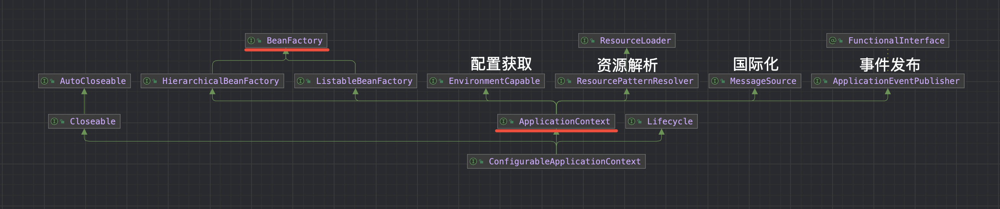
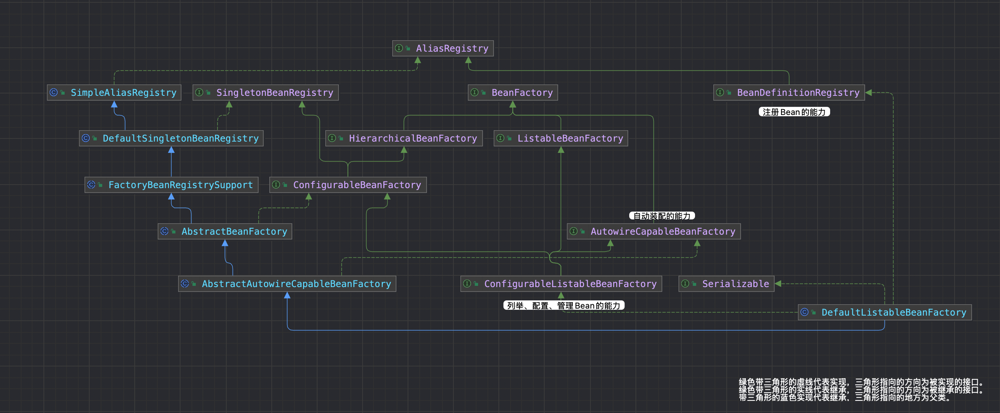
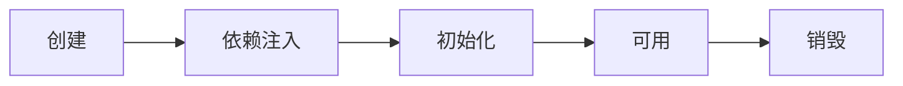
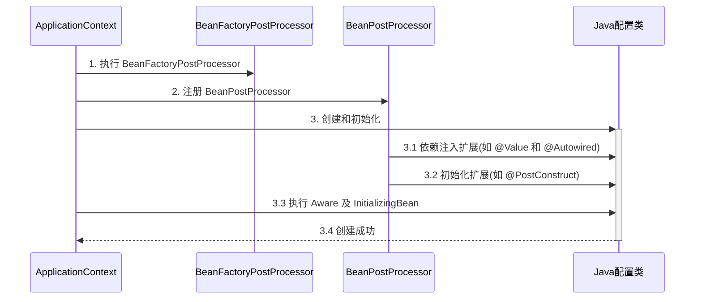
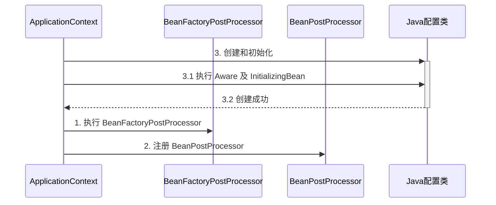
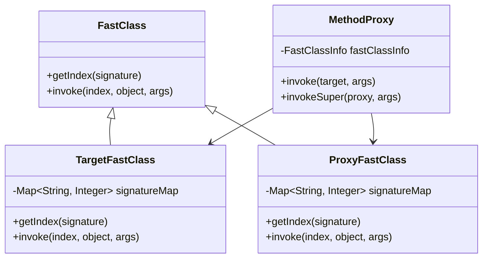

 
## 容器接口和Bean
>`BeanFactory` 提供的基本功能，`ApplicationContext` 在 `BeanFactory` 的基础上扩展功能

### ApplicationContext
>是 `BeanFactory` 的子接口。它扩展了 `BeanFactory` 接口的功能

* 国际化
* 通配符方式获取一组 Resource 资源
* 整合 Environment 环境（能通过它获取各种来源的配置信息）
* 事件发布与监听，实现组件之间的解耦



### BeanFactory
>Spring 的核心容器
- BeanFactory 接口本身只有少量功能，典型功能有：`getBean`
- 但是其实现类提供了丰富的拓展功能，如最重要的实现类`DefaultListableBeanFactory`

```java
public class DefaultListableBeanFactory extends AbstractAutowireCapableBeanFactory implements ConfigurableListableBeanFactory, BeanDefinitionRegistry, Serializable {

}
```



综合来说，DefaultListableBeanFactory 实现了 3 个接口
`ConfigurableListableBeanFactory`:
- 它整合了配置、列举和管理 bean 的能力
- 允许以编程方式配置 bean factory 的各种特性，比如设置类加载器、属性编辑器等
- 提供了完整的 bean 工厂客户端功能，包括枚举所有 bean、按类型查找 bean 等
- 继承了 ListableBeanFactory 和 ConfigurableBeanFactory，是一个功能最完整的 bean factory 接口

`BeanDefinitionRegistry`:
- 它是 bean definition 的注册中心
- 主要负责管理 bean definitions 的注册和查询
- 允许注册、移除、查询 bean definitions
- 是 Spring IOC 容器管理 bean 定义的核心接口

`AutowireCapableBeanFactory`:
- 提供自动装配（autowiring）功能
- 能够自动装配和初始化现有对象实例
- 允许在 Spring 容器外部创建的对象也能享受 Spring 的依赖注入功能
- 提供了 bean 生命周期管理的方法，如初始化、销毁等


### Bean 的生命周期
#### Bean 生命周期主要阶段



一个受 Spring 管理的 bean，生命周期主要阶段有

1. 创建：根据 bean 的构造方法或者工厂方法来创建 bean 实例对象
2. 依赖注入：根据 @Autowired，@Value 或其它一些手段，为 bean 的成员变量填充值、建立关系
3. 初始化：回调各种 Aware 接口，调用对象的各种初始化方法
4. 销毁：在容器关闭时，会销毁所有单例对象（即调用它们的销毁方法）

#### Bean 生命周期的扩展

生命周期中还有一类 bean 后处理器：BeanPostProcessor。我们可以使用 `InstantiationAwareBeanPostProcessor`、`BeanPostProcessor`、`DestructionAwareBeanPostProcessor` 接口实现对 6 个拓展点的拓展，这 3 个接口允许我们在 bean 的生命周期中，提供一些扩展逻辑

用一个具体的例子来说明：
```java
// 假设我们有一个普通的Service类
@Service
	public class UserService {
    private String name;
    
    public void setName(String name) {
        this.name = name;
    }
    
    public void sayHello() {
        System.out.println("Hello from " + name);
    }
}

// 我们可以创建一个后处理器来干预这个Service的创建过程
@Component
public class MyPostProcessor implements 
        InstantiationAwareBeanPostProcessor,  // 实例化相关的接口
        BeanPostProcessor,                     // 初始化相关的接口
        DestructionAwareBeanPostProcessor {    // 销毁相关的接口
    
    // 来自 InstantiationAwareBeanPostProcessor
	// 这里返回的对象若不为 null 会替换掉原本的 bean，并且仅会走 postProcessAfterInitialization 流程
    @Override
    public Object postProcessBeforeInstantiation(Class<?> beanClass, String beanName) {
	    // 后处理器是对所有Bean都生效，如果只想对特定Bean生效，我们需要处理一下
        if ("userService".equals(beanName)) {
            System.out.println("1. 实例化前");
            return null;
        }
        return null;
    }
    
    // 来自 InstantiationAwareBeanPostProcessor
	// 这里如果返回 false 会跳过依赖注入阶段
    @Override
    public boolean postProcessAfterInstantiation(Object bean, String beanName) {
        if (bean instanceof UserService) {
            System.out.println("2. 实例化后");
            return true;
        }
        return true;
    }
    
    // 来自 InstantiationAwareBeanPostProcessor
	// 依赖注入前的增强 如 @Autowired、@Value、@Resource 
    @Override
    public PropertyValues postProcessProperties(PropertyValues pvs, Object bean, String beanName) {
        if (bean instanceof UserService) {
            System.out.println("3. 依赖注入前");
            return pvs;
        }
        return pvs;
    }
    
    // 来自 BeanPostProcessor
    @Override
    public Object postProcessBeforeInitialization(Object bean, String beanName) {
        if (bean instanceof UserService) {
            System.out.println("4. 初始化前");
            UserService service = (UserService) bean;
            service.setName("modified name");
        }
        return bean;
    }
    
    // 来自 BeanPostProcessor
	// 这里返回的对象会替换掉原本的 bean
    @Override
    public Object postProcessAfterInitialization(Object bean, String beanName) {
        if (bean instanceof UserService) {
            System.out.println("5. 初始化后");
        }
        return bean;
    }
    
    // 来自 DestructionAwareBeanPostProcessor
	// 这里返回的对象会替换掉原本的 bean
    @Override
    public void postProcessBeforeDestruction(Object bean, String beanName) {
        if (bean instanceof UserService) {
            System.out.println("6. 销毁前");
        }
    }
}
```

实际应用场景：

1. AOP代理创建：
```java
@Component
public class AopPostProcessor implements InstantiationAwareBeanPostProcessor {
    @Override
    public Object postProcessBeforeInstantiation(Class<?> beanClass, String beanName) {
        if (needProxy(beanClass)) {
            // 创建代理
            return Proxy.newProxyInstance(...);
        }
        return null;
    }
}
```

2. 属性值修改：
```java
@Component
public class PropertyPostProcessor implements BeanPostProcessor {
    @Override
    public Object postProcessBeforeInitialization(Object bean, String beanName) {
        if (bean instanceof DataSource) {
            // 修改数据源的属性
            DataSource ds = (DataSource) bean;
            ds.setMaxActive(100);
        }
        return bean;
    }
}
```

3. 安全检查：
```java
@Component
public class SecurityPostProcessor implements BeanPostProcessor {
    @Override
    public Object postProcessBeforeInitialization(Object bean, String beanName) {
        if (bean instanceof UserService) {
            // 进行安全检查
            checkSecurity((UserService) bean);
        }
        return bean;
    }
}
```

### Bean 后处理器
#### Bean 后处理器原理模拟
>主要应用了模板方法的模式。这种设计在 Spring 框架中被广泛使用，允许通过添加不同的后处理器来扩展 Bean 的处理流程。

```java
// BeanPostProcessor 接口
public interface BeanPostProcessor {
    void inject(Object bean);
}

// 具体的后处理器实现
public class AutowiredPostProcessor implements BeanPostProcessor {
    @Override
    public void inject(Object bean) {
        System.out.println("解析 @Autowired");
    }
}

public class ResourcePostProcessor implements BeanPostProcessor {
    @Override
    public void inject(Object bean) {
        System.out.println("解析 @Resource");
    }
}

// Bean 工厂
public class MyBeanFactory {
    private List<BeanPostProcessor> processors = new ArrayList<>();
    
    // 添加 Bean 后处理器
    public void addBeanPostProcessor(BeanPostProcessor processor) {
        processors.add(processor);
    }
    
    // 模板方法，定义了 Bean 的创建流程
    public Object getBean() {
        Object bean = createBean();       // 1. 创建原始对象
        injectBean(bean);                 // 2. 依赖注入  - @Autowired, @Resource
        initializeBean(bean);             // 3. 初始化    - @PostConstruct
        return bean;
    }
    
    private Object createBean() {
        Object bean = new Object();
        System.out.println("1. 构造 " + bean);
        return bean;
    }
    
    private void injectBean(Object bean) {
        System.out.println("2. 依赖注入 " + bean);
        for (BeanPostProcessor processor : processors) {
            processor.inject(bean);
        }
    }
    
    private void initializeBean(Object bean) {
        System.out.println("3. 初始化 " + bean);
    }
}

// 测试类
public class TestMethodTemplate {
    public static void main(String[] args) {
        MyBeanFactory beanFactory = new MyBeanFactory();
        
        // 添加多个 Bean 后处理器
        beanFactory.addBeanPostProcessor(new AutowiredPostProcessor());
        beanFactory.addBeanPostProcessor(new ResourcePostProcessor());
        
        // 获取 Bean，将会执行创建流程
        beanFactory.getBean();
    }
}
```

运行结果：
```
1. 构造 java.lang.Object@123456
2. 依赖注入 java.lang.Object@123456
解析 @Autowired
解析 @Resource
3. 初始化 java.lang.Object@123456
```

总结：
1. Bean 的创建流程：构造、依赖注入、初始化
2. 使用模板方法模式定义了标准流程
3. 通过 BeanPostProcessor 实现了可扩展的依赖注入处理
4. 处理器的添加顺序会影响最终的处理顺序


##### 常见的 Bean 后处理器
1. @Autowired 等注解的解析属于 bean 生命周期阶段（依赖注入, 初始化）的扩展功能，这些扩展功能由 bean 后处理器来完成
2. 每个后处理器各自增强什么功能
   * `AutowiredAnnotationBeanPostProcessor` 解析 `@Autowired` 与 `@Value`
   * `CommonAnnotationBeanPostProcessor` 解析 `@Resource`、`@PostConstruct`、`@PreDestroy`
   * `ConfigurationPropertiesBindingPostProcessor` 解析 `@ConfigurationProperties`
3. 另外 `ContextAnnotationAutowireCandidateResolver` 负责获取 `@Value` 的值，解析 `@Qualifier`、泛型、`@Lazy` 等

1. `AutowiredAnnotationBeanPostProcessor.findAutowiringMetadata` 用来获取某个 bean 上加了 `@Value` `@Autowired` 的成员变量，方法参数的信息，表示为 `InjectionMetadata`
2. 调用 `InjectionMetadata` inject 方法。其内部原理就是把成员变量、方法参数信息、或者 String 信息封装为 `DependencyDescriptor` 类型。然后在 `BeanFactory` `doResolveDependency` 中按照类型查找

#### BeanFactory 后处理器

@ComponentScan , @Bean, @Mapper 等注解的解析属于核心容器（即 BeanFactory）的扩展功能。这些扩展功能由不同的 BeanFactory 后处理器来完成

两个常见的 BeanFactory 后处理器
- `ConfigurationClassPostProcessor` 可以解析
  * @ComponentScan
  * @Bean
  * @Import
  * @ImportResource
* `MapperScannerConfigurer` 可以解析
  * Mapper 接口

#### Aware 接口

1. Aware 接口提供了一种【内置】 的注入手段，例如
   * BeanNameAware 注入 bean 的名字
   * BeanFactoryAware 注入 BeanFactory 容器
   * ApplicationContextAware 注入 ApplicationContext 容器
   * EmbeddedValueResolverAware 注入 ${} 解析器
2. InitializingBean 接口提供了一种【内置】的初始化手段
3. 对比
   * 内置的注入和初始化不受扩展功能的影响，总会被执行
   * 而扩展功能受某些情况影响可能会失效
   * 因此 Spring 框架内部的类常用内置注入和初始化

配置类 `@Autowired` 失效分析
```java
@Configuration
public class MyConfig1 {

    private static final Logger log = LoggerFactory.getLogger(MyConfig1.class);

    @Autowired
    public void setApplicationContext(ApplicationContext applicationContext) {
        log.debug("注入 ApplicationContext");
    }

    @PostConstruct
    public void init() {
        log.debug("初始化");
    }

    @Bean // 注释或添加 beanFactory 后处理器对应两种情况
    public BeanFactoryPostProcessor processor1() {
        return beanFactory -> {
            log.debug("执行 processor1");
        };
    }

}
```

Java 配置类不包含 `BeanFactoryPostProcessor` 的情况


Java 配置类包含 `BeanFactoryPostProcessor` 的情况，因此要创建其中的 BeanFactoryPostProcessor 必须提前创建 Java 配置类，而此时的 BeanPostProcessor 还未准备好，导致 @Autowired 等注解失效



解决方法：
* 用内置依赖注入和初始化取代扩展依赖注入和初始化
* 用静态工厂方法代替实例工厂方法，避免工厂对象提前被创建

### 初始化与销毁

Spring 提供了多种初始化手段，除了 @PostConstruct，@Bean(initMethod) 之外，还可以实现 InitializingBean 接口来进行初始化，如果同一个 bean 用了以上手段声明了 3 个初始化方法，那么它们的执行顺序是

1. @PostConstruct 标注的初始化方法
2. InitializingBean 接口的初始化方法
3. @Bean(initMethod) 指定的初始化方法

与初始化类似，Spring 也提供了多种销毁手段，执行顺序为

1. @PreDestroy 标注的销毁方法
2. DisposableBean 接口的销毁方法
3. @Bean(destroyMethod) 指定的销毁方法


### Scope 

在当前版本的 Spring 和 Spring Boot 程序中，支持五种 Scope

* singleton，容器启动时创建（未设置延迟），容器关闭时销毁
* prototype，每次使用时创建，不会自动销毁，需要调用 DefaultListableBeanFactory.destroyBean(bean) 销毁
* request，每次请求用到此 bean 时创建，请求结束时销毁
* session，每个会话用到此 bean 时创建，会话结束时销毁
* application，web 容器用到此 bean 时创建，容器停止时销毁

有些文章提到有 globalSession 这一 Scope，也是陈旧的说法，目前 Spring 中已废弃

但要注意，如果在 singleton 注入其它 scope 都会有问题，解决方法有

* @Lazy
* @Scope(proxyMode = ScopedProxyMode.TARGET_CLASS)
* ObjectFactory
* ApplicationContext.getBean

### 例子
#### 例子：事件发布/AOP 的使用
```java
// 公共部分
@Service
public class SmsService {
    public void sendRegistrationSms(String phone) {
        // 发送短信的具体实现
    }
}

public class User {
    private String phone;
    // 其他属性和方法
}
```

##### 事件方式实现
```java

// 1.1 注册事件
public class UserRegisteredEvent extends ApplicationEvent {
    private final User user;
    
    public UserRegisteredEvent(Object source, User user) {
        super(source);
        this.user = user;
    }
    
    public User getUser() {
        return user;
    }
}

// 1.2 事件监听器
@Component
public class UserRegistrationListener implements ApplicationListener<UserRegisteredEvent> {
    private final SmsService smsService;
    
    public UserRegistrationListener(SmsService smsService) {
        this.smsService = smsService;
    }
    
    @Override
    public void onApplicationEvent(UserRegisteredEvent event) {
        User user = event.getUser();
        smsService.sendRegistrationSms(user.getPhone());
    }
}

// 1.3 用户服务
@Service
public class UserService {
    private final ApplicationEventPublisher eventPublisher;
    
    public UserService(ApplicationEventPublisher eventPublisher) {
        this.eventPublisher = eventPublisher;
    }
    
    public void register(User user) {
        // 用户注册逻辑
        saveUser(user);
        
        // 发布注册事件
        eventPublisher.publishEvent(new UserRegisteredEvent(this, user));
    }
}
```
##### AOP 方式实现
```java
// 2.1 自定义注解
@Target(ElementType.METHOD)
@Retention(RetentionPolicy.RUNTIME)
public @interface SendSmsAfterRegistration {
}

// 2.2 切面类
@Aspect
@Component
public class UserRegistrationAspect {
    private final SmsService smsService;
    
    public UserRegistrationAspect(SmsService smsService) {
        this.smsService = smsService;
    }
    
    @AfterReturning(pointcut = "@annotation(SendSmsAfterRegistration)", returning = "user")
    public void sendSmsAfterRegistration(JoinPoint joinPoint, User user) {
        smsService.sendRegistrationSms(user.getPhone());
    }
}

// 2.3 用户服务
@Service
public class UserService {
    @SendSmsAfterRegistration
    public User register(User user) {
        // 用户注册逻辑
        saveUser(user);
        return user;
    }
}

```


#### 例子：注册 Bean 和添加后处理器
##### 1. 演示 BeanDefinition 的注册

```java
// 创建一个默认的 BeanFactory
DefaultListableBeanFactory beanFactory = new DefaultListableBeanFactory();

// 1.1 手动注册 BeanDefinition
AbstractBeanDefinition beanDefinition = BeanDefinitionBuilder
    .genericBeanDefinition(UserService.class)  // 指定 Bean 的类
    .setScope(BeanDefinition.SCOPE_SINGLETON)  // 设置 Bean 的作用域为单例
    .addPropertyValue("name", "张三")          // 设置 Bean 的属性值
    .setInitMethodName("init")                // 设置初始化方法
    .setDestroyMethodName("destroy")          // 设置销毁方法
    .getBeanDefinition();

// 将 BeanDefinition 注册到 BeanFactory 中
beanFactory.registerBeanDefinition("userService", beanDefinition);
```

##### 2. 添加并执行 BeanFactory 后处理器

`BeanFactory` 后处理器用于解析配置类中的注解（如 `@Bean`、`@ComponentScan` 等），并生成相应的 `BeanDefinition`。

```java
// 创建一个 AnnotationConfigApplicationContext，用于加载配置类
AnnotationConfigApplicationContext context = new AnnotationConfigApplicationContext();

// 创建 ConfigurationClassPostProcessor，用于解析配置类
ConfigurationClassPostProcessor processor = new ConfigurationClassPostProcessor();

// 执行 BeanFactory 后处理器，解析配置类中的注解并注册 BeanDefinition
processor.postProcessBeanDefinitionRegistry(beanFactory);
```

- `ConfigurationClassPostProcessor`
    - 解析 @Configuration 配置类
    - 解析 @ComponentScan 扫描的包
    - 解析 @Bean 方法
    - 解析 @Import 导入的类
    - 解析 @PropertySource 属性文件

##### 3. 添加 Bean 后处理器

`Bean` 后处理器用于在 Bean 的创建过程中进行增强，例如解析 `@Autowired`、`@Resource` 等注解。

```java
// 添加 AutowiredAnnotationBeanPostProcessor，用于解析 @Autowired 注解
beanFactory.addBeanPostProcessor(new AutowiredAnnotationBeanPostProcessor());

// 添加 CommonAnnotationBeanPostProcessor，用于解析 @Resource 注解
beanFactory.addBeanPostProcessor(new CommonAnnotationBeanPostProcessor());

// 注意：后处理器的添加顺序会影响注解的解析结果
// 例如，如果同时存在 @Autowired 和 @Resource，后添加的处理器会覆盖前面的效果
// 在 Spring 中，默认情况下，@Resource 会覆盖 @Autowired 的行为。
```

- AutowiredAnnotationBeanPostProcessor 解析 @Autowired 与 @Value
* CommonAnnotationBeanPostProcessor 解析 @Resource、@PostConstruct、@PreDestroy

##### 4. 初始化单例 Bean

在 `BeanFactory` 中，单例 Bean 需要手动初始化。

```java
// 初始化所有单例 Bean
beanFactory.preInstantiateSingletons();
```

##### 5. 设置解析的能力

`BeanFactory` 需要额外设置才能解析 `${}` 和 `#{}` 表达式。

```java
// 设置 Environment，用于解析 ${} 表达式
beanFactory.setEnvironment(context.getEnvironment());

// 设置 BeanExpressionResolver，用于解析 #{} 表达式
beanFactory.setBeanExpressionResolver(new StandardBeanExpressionResolver());
```

##### 6. 配置类和 Bean 定义

```java
@Configuration
public class Config {
    @Bean
    public UserService userService() {
        return new UserService();
    }
}

public class UserService {
    @Autowired // 或者 @Resource
    private OrderService orderService;
    
    @Value("${server.port}")
    private int port;
    
    @Value("#{1+2}")
    private int result;
    
    public void init() {}
    public void destroy() {}
}
```

###### 7.总结

1. **`BeanDefinition` 的注册**：通过 `BeanDefinitionBuilder` 创建 `BeanDefinition`，并手动注册到 `BeanFactory` 中。
2. **`BeanFactory` 后处理器**：通过 `ConfigurationClassPostProcessor` 解析配置类中的注解，生成并注册 `BeanDefinition`。
3. **`Bean` 后处理器**：添加 `AutowiredAnnotationBeanPostProcessor` 和 `CommonAnnotationBeanPostProcessor` 来解析 `@Autowired` 和 `@Resource` 注解。
4. **初始化单例 Bean**：调用 `preInstantiateSingletons` 方法初始化所有单例 Bean。
5. **解析 `${}` 和 `#{}`**：设置 `Environment` 和 `BeanExpressionResolver` 来解析 `${}` 和 `#{}` 表达式。


#### Bean 的生命周期

Spring Bean的完整生命周期包括实例化、初始化和销毁三大阶段

1. 实例化阶段：
```java
// 1. Bean实例化前
InstantiationAwareBeanPostProcessor#postProcessBeforeInstantiation()

// 2. 实例化Bean（调用构造方法）
Constructor.newInstance()

// 3. Bean实例化后
InstantiationAwareBeanPostProcessor#postProcessAfterInstantiation()
```

2. 属性赋值阶段：
```java
// 4. 设置属性值之前
InstantiationAwareBeanPostProcessor#postProcessProperties()

// 5. 依赖注入
@Autowired, @Value, @Resource等注入
```

3. 初始化阶段：
```java
// 6. 初始化之前
BeanPostProcessor#postProcessBeforeInitialization()

// 7. 各种初始化方法按顺序执行：
@PostConstruct           // 注解方式
InitializingBean接口     // 接口方式
定制的init-method       // XML或注解配置方式

// 8. 初始化之后
BeanPostProcessor#postProcessAfterInitialization()
```

4. 使用阶段：
```java
// 9. Bean可以使用了
bean.method()
```

5. 销毁阶段：
```java
// 10. 销毁之前
DestructionAwareBeanPostProcessor#postProcessBeforeDestruction()

// 11. 各种销毁方法按顺序执行：
@PreDestroy             // 注解方式
DisposableBean接口      // 接口方式
定制的destroy-method    // XML或注解配置方式
```

来看一个完整的示例：
```java
@Component
public class CompleteLifecycleBean implements InitializingBean, DisposableBean {
    private static final Logger log = LoggerFactory.getLogger(CompleteLifecycleBean.class);
    
    public CompleteLifecycleBean() {
        log.debug("2. 构造方法执行");
    }
    
    @Autowired
    public void setDependency(SomeService service) {
        log.debug("5. 依赖注入");
    }
    
    @PostConstruct
    public void postConstruct() {
        log.debug("7.1 @PostConstruct");
    }
    
    @Override
    public void afterPropertiesSet() {
        log.debug("7.2 InitializingBean初始化");
    }
    
    @Bean(initMethod = "customInit")
    public void customInit() {
        log.debug("7.3 自定义初始化方法");
    }
    
    @PreDestroy
    public void preDestroy() {
        log.debug("11.1 @PreDestroy");
    }
    
    @Override
    public void destroy() {
        log.debug("11.2 DisposableBean销毁");
    }
    
    @Bean(destroyMethod = "customDestroy")
    public void customDestroy() {
        log.debug("11.3 自定义销毁方法");
    }
}

// Bean后处理器
@Component
public class MyBeanPostProcessor implements InstantiationAwareBeanPostProcessor, BeanPostProcessor {
    @Override
    public Object postProcessBeforeInstantiation(Class<?> beanClass, String beanName) {
        log.debug("1. 实例化之前");
        return null;
    }
    
    @Override
    public boolean postProcessAfterInstantiation(Object bean, String beanName) {
        log.debug("3. 实例化之后");
        return true;
    }
    
    @Override
    public Object postProcessBeforeInitialization(Object bean, String beanName) {
        log.debug("6. 初始化之前");
        return bean;
    }
    
    @Override
    public Object postProcessAfterInitialization(Object bean, String beanName) {
        log.debug("8. 初始化之后");
        return bean;
    }
}
```

一些重要的注意点：
1. 初始化方法的执行顺序：
   - @PostConstruct
   - InitializingBean的afterPropertiesSet
   - 自定义初始化方法

2. 销毁方法的执行顺序：
   - @PreDestroy
   - DisposableBean的destroy
   - 自定义销毁方法

3. Bean后处理器的作用：
   - 负责生命周期各个阶段的拦截处理
   - 可以修改Bean实例
   - 可以替换Bean实例
   - 可以拦截Bean的创建过程

## AOP
###  AOP 实现之 ajc 编译器

- 编译器也能修改 class 实现增强
- 编译器增强能突破代理仅能通过方法重写增强的限制：可以对构造方法、静态方法等实现增强

### AOP 实现之 agent 类加载

- 类加载时可以通过 agent 修改 class 实现增强

### AOP 实现之 proxy

#### jdk 动态代理 - 演示
* jdk 动态代理要求目标**必须**实现接口，生成的代理类实现相同接口，因此代理与目标之间是`平级兄弟关系`

```java
public class JdkProxyDemo {

    interface Foo {
        void foo();
    }

    static class Target implements Foo {
        public void foo() {
            System.out.println("target foo");
        }
    }

    public static void main(String[] param) {
        // 目标对象
        Target target = new Target();
        // 代理对象
        Foo proxy = (Foo) Proxy.newProxyInstance(
				// 类加载器用于加载动态生成的字节码
                Target.class.getClassLoader(),
                // 接口的字节码 
                new Class[]{Foo.class},
                // invokeHandler接口的匿名内部类实现
                // 代理类本身，方法对象，方法参数
                (p, method, args) -> {
                    System.out.println("proxy before...");
                    Object result = method.invoke(target, args);
                    System.out.println("proxy after...");
                    return result;
                });
        // 调用代理
        proxy.foo();
    }
}
```

运行结果

```
proxy before...
target foo
proxy after...
```

#### cglib 代理 - 演示
* cglib 不要求目标实现接口，它生成的代理类是`目标类的子类`，因此代理与目标之间是`子父关系`
* 限制⛔：根据上述分析 final 类无法被 cglib 增强

```java
public class CglibProxyDemo {

    static class Target {
        public void foo() {
            System.out.println("target foo");
        }
    }

    public static void main(String[] param) {
        // 目标对象
        Target target = new Target();
        // 代理对象
        Target proxy = (Target) Enhancer.create(Target.class, (MethodInterceptor) (p, method, args, methodProxy) -> {
            System.out.println("proxy before...");
            Object result = methodProxy.invoke(target, args);
            // 另一种调用方法，不需要目标对象实例
			// Object result = methodProxy.invokeSuper(p, args);
            System.out.println("proxy after...");
            return result;
        });
        // 调用代理
        proxy.foo();
    }
}
```

运行结果与 jdk 动态代理相同

### jdk 动态代理进阶

#### 模拟 jdk 动态代理

```java
public class A12 {

    interface Foo {
        void foo();
        int bar();
    }

    static class Target implements Foo {
        public void foo() {
            System.out.println("target foo");
        }

        public int bar() {
            System.out.println("target bar");
            return 100;
        }
    }

    public static void main(String[] param) {
        // 1. 创建代理，这时传入 InvocationHandler
        Foo proxy = new $Proxy0(new InvocationHandler() {    
            // 5. 进入 InvocationHandler
            public Object invoke(Object proxy, Method method, Object[] args) throws Throwable{
                // 6. 功能增强
                System.out.println("before...");
                // 7. 反射调用目标方法
                return method.invoke(new Target(), args);
            }
        });
        // 2. 调用代理方法
        proxy.foo();
        proxy.bar();
    }
}
```

模拟代理实现

```java
public class $Proxy0 extends Proxy implements A12.Foo {

    public $Proxy0(InvocationHandler h) {
        super(h);
    }
    // 3. 进入代理方法
    public void foo() {
        try {
            // 4. 回调 InvocationHandler
            h.invoke(this, foo, new Object[0]);
        } catch (RuntimeException | Error e) {
            throw e;
        } catch (Throwable e) {
            throw new UndeclaredThrowableException(e);
        }
    }

    @Override
    public int bar() {
        try {
            Object result = h.invoke(this, bar, new Object[0]);
            return (int) result;
        } catch (RuntimeException | Error e) {
            throw e;
        } catch (Throwable e) {
            throw new UndeclaredThrowableException(e);
        }
    }

    static Method foo;
    static Method bar;
    static {
        try {
            foo = A12.Foo.class.getMethod("foo");
            bar = A12.Foo.class.getMethod("bar");
        } catch (NoSuchMethodException e) {
            throw new NoSuchMethodError(e.getMessage());
        }
    }
}
```

代理无非就是利用了多态、反射的知识

1. 方法重写可以增强逻辑，只不过这【增强逻辑】千变万化，不能写死在代理内部
2. 通过接口回调将【增强逻辑】置于代理类之外
3. 配合接口方法反射（是多态调用），就可以再联动调用目标方法
4. 会用 arthas 的 jad 工具反编译代理类
5. 限制⛔：代理增强是借助多态来实现，因此成员变量、静态方法、final 方法均不能通过代理实现


#### 方法反射优化

1. 前 16 次反射性能较低
2. 第 17 次调用会生成代理类，优化为非反射调用
3. 可以使用 arthas 的 jad 工具反编译第 17 次调用生成的代理类

>[!Warning]
>运行时请添加 `--add-opens java.base/java.lang.reflect=ALL-UNNAMED --add-opens java.base/jdk.internal.reflect=ALL-UNNAMED`


具体到反射优化的工作原理：

1. 前16次调用使用的是 `NativeMethodAccessor`
   - 这是一个解释执行的实现
   - 性能较慢但内存占用小
   - 适合偶尔使用的反射调用

2. 第 17 次调用时会触发优化
   - `JVM` 会使用 `sun.reflect.MethodAccessorGenerator` 生成专用的访问器类
   - 生成的类直接包含了调用目标方法的字节码
   - 这个过程需要访问上述受限制的包

### cglib 代理进阶

#### 模拟 cglib 代理

```java
public class Target {

    public void save() {
        System.out.println("save()");
    }

    public void save(int i) {
        System.out.println("save(int)");
    }

    public void save(long j) {
        System.out.println("save(long)");

    }
}

import org.springframework.cglib.proxy.MethodInterceptor;
import org.springframework.cglib.proxy.MethodProxy;

import java.lang.reflect.Method;
import java.lang.reflect.UndeclaredThrowableException;

// 代理类
public class Proxy extends Target {

    private MethodInterceptor methodInterceptor;

    public void setMethodInterceptor(MethodInterceptor methodInterceptor) {
        this.methodInterceptor = methodInterceptor;
    }

    static Method save0;
    static Method save1;
    static Method save2;
    static MethodProxy save0Proxy;
    static MethodProxy save1Proxy;
    static MethodProxy save2Proxy;
    static {
        try {
            save0 = Target.class.getMethod("save");
            save1 = Target.class.getMethod("save", int.class);
            save2 = Target.class.getMethod("save", long.class);
            save0Proxy = MethodProxy.create(Target.class, Proxy.class, "()V", "save", "saveSuper");
            save1Proxy = MethodProxy.create(Target.class, Proxy.class, "(I)V", "save", "saveSuper");
            save2Proxy = MethodProxy.create(Target.class, Proxy.class, "(J)V", "save", "saveSuper");
        } catch (NoSuchMethodException e) {
            throw new NoSuchMethodError(e.getMessage());
        }
    }

    // >>>>>>>>>>>>>>>>>>>>>>>>>>>>>>> 带原始功能的方法
    public void saveSuper() {
        super.save();
    }
    public void saveSuper(int i) {
        super.save(i);
    }
    public void saveSuper(long j) {
        super.save(j);
    }
    // >>>>>>>>>>>>>>>>>>>>>>>>>>>>>>> 带增强功能的方法
    @Override
    public void save() {
        try {
            methodInterceptor.intercept(this, save0, new Object[0], save0Proxy);
        } catch (Throwable e) {
            throw new UndeclaredThrowableException(e);
        }
    }

    @Override
    public void save(int i) {
        try {
            methodInterceptor.intercept(this, save1, new Object[]{i}, save1Proxy);
        } catch (Throwable e) {
            throw new UndeclaredThrowableException(e);
        }
    }

    @Override
    public void save(long j) {
        try {
            methodInterceptor.intercept(this, save2, new Object[]{j}, save2Proxy);
        } catch (Throwable e) {
            throw new UndeclaredThrowableException(e);
        }
    }
}


import org.springframework.cglib.proxy.MethodInterceptor;
import org.springframework.cglib.proxy.MethodProxy;

import java.lang.reflect.Method;

public class A13 {

    public static void main(String[] args) {
        Proxy proxy = new Proxy();
        Target target = new Target();
        proxy.setMethodInterceptor(new MethodInterceptor() {
            @Override
            public Object intercept(Object p, Method method, Object[] args, MethodProxy methodProxy) throws Throwable {
                System.out.println("before...");
				// return method.invoke(target, args); // 反射调用
				
                // FastClass
				// return methodProxy.invoke(target, args); // 内部无反射, 结合目标用
                return methodProxy.invokeSuper(p, args); // 内部无反射, 结合代理用
            }
        });

        proxy.save();
        proxy.save(1);
        proxy.save(2L);
    }
}

```

和 jdk 动态代理原理查不多

1. 回调的接口换了一下，`InvocationHandler` 改成了 `MethodInterceptor`
2. 调用目标时有所改进，见下面代码片段
   1. `method.invoke` 是反射调用，必须调用到足够次数才会进行优化
   2. `methodProxy.invoke` 是不反射调用，它会正常（间接）调用目标对象的方法（Spring 采用）
   3. `methodProxy.invokeSuper` 也是不反射调用，它会正常（间接）调用代理对象的方法，可以省略目标对象


```java
public class A14Application {
    public static void main(String[] args) throws InvocationTargetException {

        Target target = new Target();
        Proxy proxy = new Proxy();
        
        proxy.setCallbacks(new Callback[]{(MethodInterceptor) (p, m, a, mp) -> {
            System.out.println("proxy before..." + mp.getSignature());
            // 调用目标方法(三种)
			// Object result = m.invoke(target, a);  // ⬅️反射调用
			// Object result = mp.invoke(target, a); // ⬅️非反射调用, 结合目标用
            Object result = mp.invokeSuper(p, a);   // ⬅️非反射调用, 结合代理用
            System.out.println("proxy after..." + mp.getSignature());
            return result;
        }});
        
        // 调用代理方法
        proxy.save();
    }
}
```

> ***注意***
>
> * 调用 Object 的方法, 后两种在 jdk >= 9 时都有问题, 需要 --add-opens java.base/java.lang=ALL-UNNAMED


#### cglib 如何避免反射




CGLIB 的 MethodProxy 工作原理如下：

1. FastClass 生成：
   - 当调用 MethodProxy 的 invoke 或 invokeSuper 方法时, CGLIB 会动态生成两个类
   - 目标类的 FastClass 用于 invoke() 方法(Spring 用的这种)
   - 代理类的 FastClass 用于 invokeSuper() 方法

2. 方法索引映射：
   - 在 FastClass 的子类中维护了一个方法签名到数字索引的映射（signatureMap）
   - 每个方法都被分配一个唯一的索引号
   - getIndex() 方法通过方法签名快速查找对应的索引

3. 调用机制：
   ```java
   // MethodProxy 的两个主要调用方法
   methodProxy.invoke(target, args);     // 使用 TargetFastClass 直接调用目标对象方法
   methodProxy.invokeSuper(proxy, args); // 使用 ProxyFastClass 调用代理对象的父类方法
   ```

4. 性能优化：
   - FastClass 通过索引直接定位方法，避免了反射调用
   - 使用 switch 语句根据索引直接跳转到相应的方法调用
   - 生成的字节码直接调用方法，没有反射开销

5. 生成的 `TargetFastClass` 实现示例：
```java
public class TargetFastClass extends FastClass {
    // 方法签名到索引的映射
    private static Map<String, Integer> signatureMap = new HashMap<>();
    
    static {
        signatureMap.put("()V", 0);        // save()
        signatureMap.put("(I)V", 1);       // save(int)
        signatureMap.put("(J)V", 2);       // save(long)
    }
    
    public int getIndex(String signature) {
        Integer index = signatureMap.get(signature);
        if (index == null) {
            throw new IllegalArgumentException("Unknown method signature: " + signature);
        }
        return index;
    }
    
    public Object invoke(int index, Object obj, Object[] args) {
        Target target = (Target)obj;
        switch(index) {
            case 0: 
                target.save();
                return null;
            case 1: 
                target.save((Integer)args[0]);
                return null;
            case 2:
                target.save((Long)args[0]);
                return null;
            default: 
                throw new IllegalArgumentException("Unknown method index: " + index);
        }
    }
}
```

ProxyFastClass 记录了 Proxy 中方法与编号的对应关系，不过 Proxy 额外提供了下面几个方法
* saveSuper(long) 编号 2，不增强，仅是调用 super.save(long)
* saveSuper(int) 编号 1，不增强, 仅是调用 super.save(int)
* saveSuper() 编号 0，不增强, 仅是调用 super.save()
* 查找方式与 TargetFastClass 类似

为什么有这么麻烦的一套东西呢？
   * 避免反射, 提高性能, 代价是一个代理类配两个 FastClass 类, 代理类中还得增加仅调用 super 的一堆方法
   * 用编号处理方法对应关系比较省内存, 另外, 最初获得方法顺序是不确定的, 这个过程没法固定死

### jdk 和 cglib 在 Spring 中的统一

ProxyFactory 用来创建代理
   * 如果指定了接口，且 proxyTargetClass = false，使用 JdkDynamicAopProxy
   * 如果没有指定接口，或者 proxyTargetClass = true，使用 ObjenesisCglibAopProxy

### 切点匹配
```java
// 首先定义测试类
class T1 {
	@Transactional
    public void foo() {}
    public void bar() {}
}

// 测试代码
public class PointcutTest {
    public static void main(String[] args) throws NoSuchMethodException {
        // 测试方法执行表达式切点
        AspectJExpressionPointcut pt1 = new AspectJExpressionPointcut();
        pt1.setExpression("execution(* bar())");
        
        System.out.println(pt1.matches(T1.class.getMethod("foo"), T1.class)); // 输出: false
        
        System.out.println(pt1.matches(T1.class.getMethod("bar"), T1.class)); // 输出: true

        // 测试注解表达式切点
        AspectJExpressionPointcut pt2 = new AspectJExpressionPointcut();
        pt2.setExpression(
            "@annotation(org.springframework.transaction.annotation.Transactional)"
        );
        
        System.out.println(pt2.matches(T1.class.getMethod("foo"), T1.class)); // 输出: true
        
        System.out.println(pt2.matches(T1.class.getMethod("bar"), T1.class)); // 输出: false
    }
}
```

但 Sping 中 `@Transactional` 并不是使用的 `AspectJ` 来实现的。`@Transactional` 可以夹在类、方法、接口上。使用 `Aspectj` 的话只能扫描方法上的。

Spring 的实现类似：

```java
StaticMethodMatcherPointcut pt3 = new StaticMethodMatcherPointcut() {
   @Override
   public boolean matches(Method method, Class<?> targetClass) {
       // 检查方法上是否加了 Transactional 注解
       MergedAnnotations annotations = MergedAnnotations.from(method);
       if (annotations.isPresent(Transactional.class)) {
           return true;
       }
       
       // 检查类上是否加了 Transactional 注解
       annotations = MergedAnnotations.from(targetClass);
       if (annotations.isPresent(Transactional.class)) {
           return true;
       }
       
       return false;
   }
};

// 测试方法
System.out.println(pt3.matches(T1.class.getMethod("foo"), T1.class));
```


### 从 @Aspect 到 Advisor
1. AnnotationAwareAspectJAutoProxyCreator 的作用
   * 将高级 @Aspect 切面统一为低级 Advisor 切面
   * 在合适的时机创建代理
2. findEligibleAdvisors 找到有【资格】的 Advisors
   * 有【资格】的 Advisor 一部分是低级的, 可以由自己编写, 如本例 A 17 中的 advisor 3
   * 有【资格】的 Advisor 另一部分是高级的, 由解析 @Aspect 后获得
3. wrapIfNecessary
   * 它内部调用 findEligibleAdvisors, 只要返回集合不空, 则表示需要创建代理
   * 它的调用时机通常在原始对象初始化后执行, 但碰到循环依赖会提前至依赖注入之前执行


## WEB
### RequestMappingHandlerMapping 与 RequestMappingHandlerAdapter
RequestMappingHandlerMapping 与 RequestMappingHandlerAdapter 俩是一对，分别用来

* 处理 @RequestMapping 映射
* 调用控制器方法、并处理方法参数与方法返回值

1. DispatcherServlet 是在第一次被访问时执行初始化, 也可以通过配置修改为 Tomcat 启动后就初始化
2. 在初始化时会从 Spring 容器中找一些 Web 需要的组件, 如 `HandlerMapping`、`HandlerAdapter` 等，并逐一调用它们的初始化
3. RequestMappingHandlerMapping 初始化时，会收集所有 @RequestMapping 映射信息，封装为 Map，其中
   * key 是 RequestMappingInfo 类型，包括请求路径、请求方法等信息
   * value 是 HandlerMethod 类型，包括控制器方法对象、控制器对象
   * 有了这个 Map，就可以在请求到达时，快速完成映射，找到 HandlerMethod 并与匹配的拦截器一起返回给 DispatcherServlet
4. RequestMappingHandlerAdapter 初始化时，会准备 HandlerMethod 调用时需要的各个组件，如：
   * HandlerMethodArgumentResolver 解析控制器方法参数
   * HandlerMethodReturnValueHandler 处理控制器方法返回值


### mvc 处理流程

当浏览器发送一个请求 `http://localhost:8080/hello` 后，请求到达服务器，其处理流程是：

1. 服务器提供了 `DispatcherServlet`，它使用的是标准 `Servlet` 技术
   * 路径：默认映射路径为 `/`，即会匹配到所有请求 URL，可作为请求的统一入口
     * jsp 不会匹配到 `DispatcherServlet`
     * 其它有路径的 Servlet 匹配优先级也高于 DispatcherServlet
   * 创建：在 Boot 中，由 `DispatcherServletAutoConfiguration` 这个自动配置类提供 `DispatcherServlet` 的 `bean`
   * 初始化：`DispatcherServlet` 初始化时会优先到容器里寻找各种组件，作为它的成员变量
     * `HandlerMapping`，初始化时记录`映射关系`
     * `HandlerAdapter`，初始化时准备`参数解析器`、`返回值处理器`、`消息转换器`
     * `HandlerExceptionResolver`，初始化时准备参数解析器、返回值处理器、消息转换器
     * `ViewResolver`
2. `DispatcherServlet` 会利用 `RequestMappingHandlerMapping` 查找控制器方法
   * 例如根据 /hello 路径找到 @RequestMapping("/hello") 对应的控制器方法
   * 控制器方法会被封装为 `HandlerMethod` 对象，并结合匹配到的拦截器一起返回给 `DispatcherServlet` 
   * `HandlerMethod` 和拦截器合在一起称为 `HandlerExecutionChain`（调用链）对象
   * 
3. `DispatcherServlet` 接下来会：
   1. 调用拦截器的 `preHandle` 方法
   2. `RequestMappingHandlerAdapter` 调用 `handle` 方法，准备数据绑定工厂、模型工厂、ModelAndViewContainer、将 `HandlerMethod` 完善为 `ServletInvocableHandlerMethod`
      * `@ControllerAdvice` 全局增强点1️⃣：补充模型数据
      * `@ControllerAdvice` 全局增强点2️⃣：补充自定义类型转换器
      * 使用 `HandlerMethodArgumentResolver` 准备参数
        * `@ControllerAdvice` 全局增强点3️⃣：`RequestBody` 增强
      * 调用 `ServletInvocableHandlerMethod` 
      * 使用 `HandlerMethodReturnValueHandler` 处理返回值
        * `@ControllerAdvice` 全局增强点4️⃣：`ResponseBody` 增强
      * 根据 `ModelAndViewContainer` 获取 `ModelAndView`
        * 如果返回的 `ModelAndView` 为 `null`，不走第 4 步视图解析及渲染流程
          * 例如，有的返回值处理器调用了 `HttpMessageConverter` 来将结果转换为 `JSON`，这时 `ModelAndView` 就为 `null`
        * 如果返回的 `ModelAndView` 不为 `null`，会在第 4 步走视图解析及渲染流程
   3. 调用拦截器的 `postHandle` 方法
   4. 处理异常或视图渲染
      * 如果 1~3 出现异常，走 `ExceptionHandlerExceptionResolver` 处理异常流程
        * `@ControllerAdvice` 全局增强点5️⃣：`@ExceptionHandler` 异常处理
      * 正常，走视图解析及渲染流程
   5. 调用拦截器的 `afterCompletion` 方法


### Tomcat 内嵌容器

Tomcat 基本结构

```
Server
└───Service
    ├───Connector (协议, 端口)
    └───Engine
        └───Host(虚拟主机 localhost)
            ├───Context1 (应用1, 可以设置虚拟路径, / 即 url 起始路径; 项目磁盘路径, 即 docBase )
            │   │   index.html
            │   └───WEB-INF
            │       │   web.xml (servlet, filter, listener) 3.0
            │       ├───classes (servlet, controller, service ...)
            │       ├───jsp
            │       └───lib (第三方 jar 包)
            └───Context2 (应用2)
                │   index.html
                └───WEB-INF
                        web.xml
```

#### Tomcat 内嵌容器 - 演示

##### 关键代码

```java
public static void main(String[] args) throws LifecycleException, IOException {
    // 1.创建 Tomcat 对象
    Tomcat tomcat = new Tomcat();
    tomcat.setBaseDir("tomcat");

    // 2.创建项目文件夹, 即 docBase 文件夹
    File docBase = Files.createTempDirectory("boot.").toFile();
    docBase.deleteOnExit();

    // 3.创建 Tomcat 项目, 在 Tomcat 中称为 Context
    Context context = tomcat.addContext("", docBase.getAbsolutePath());

    // 4.编程添加 Servlet
    context.addServletContainerInitializer(new ServletContainerInitializer() {
        @Override
        public void onStartup(Set<Class<?>> c, ServletContext ctx) throws ServletException {
            HelloServlet helloServlet = new HelloServlet();
            ctx.addServlet("aaa", helloServlet).addMapping("/hello");
        }
    }, Collections.emptySet());

    // 5.启动 Tomcat
    tomcat.start();

    // 6.创建连接器, 设置监听端口
    Connector connector = new Connector(new Http11Nio2Protocol());
    connector.setPort(8080);
    tomcat.setConnector(connector);
}
```


#### 集成 Spring 容器 - 演示

#### 关键代码

```java
WebApplicationContext springContext = getApplicationContext();

// 4.编程添加 Servlet
context.addServletContainerInitializer(new ServletContainerInitializer() {
    @Override
    public void onStartup(Set<Class<?>> c, ServletContext ctx) throws ServletException {
        // 通过 ServletRegistrationBean 添加 DispatcherServlet 等
        // ServletRegistrationBean，简单来说，它的作用就是将 Servlet 注册到的内嵌 Servlet 容器中。
        for (ServletRegistrationBean registrationBean : 
             springContext.getBeansOfType(ServletRegistrationBean.class).values()) {
            registrationBean.onStartup(ctx);
        }
    }
}, Collections.emptySet());
```


### 自动配置
#### @Import

`@Import` 是 Spring 框架提供的一个注解，它的主要作用是**将其他配置类或组件引入到当前的 Spring 应用上下文中**。通过 `@Import`，可以将额外的配置类、`@Bean` 方法、`ImportSelector` 实现类或 `ImportBeanDefinitionRegistrar` 实现类导入到当前的 Spring 配置中，从而扩展应用的功能。

##### 2. @Import的使用方式

###### （1）导入普通配置类
如果有一个配置类（用 `@Configuration` 注解标记），可以通过 `@Import` 将其导入到当前的配置中。

```java
@Configuration
public class ConfigA {
    @Bean
    public MyBean myBean() {
        return new MyBean();
    }
}

@Configuration
@Import(ConfigA.class) // 导入 ConfigA 配置类
public class ConfigB {
    // ConfigB 中可以访问 ConfigA 中定义的 Bean
}
```

在这个例子中：
- `ConfigA` 是一个配置类，定义了一个 `MyBean` Bean。
- `ConfigB` 通过 `@Import` 导入了 `ConfigA`，因此 `ConfigB` 中可以直接使用 `ConfigA` 中定义的 `MyBean`。

---

###### （2）导入 `ImportSelector` 实现类
`ImportSelector` 是一个接口，允许动态选择需要导入的配置类。通过 `@Import` 导入 `ImportSelector` 实现类，可以实现更灵活的配置加载。

```java
public class MyImportSelector implements ImportSelector {
    @Override
    public String[] selectImports(AnnotationMetadata importingClassMetadata) {
        // 动态返回需要导入的配置类
        return new String[] {
            "com.example.ConfigA",
            "com.example.ConfigB"
        };
    }
}

@Configuration
@Import(MyImportSelector.class) // 导入 ImportSelector 实现类
public class AppConfig {
}
```

在这个例子中：
- `MyImportSelector` 实现了 `ImportSelector` 接口，动态返回需要导入的配置类（`ConfigA` 和 `ConfigB`）。
- `AppConfig` 通过 `@Import` 导入了 `MyImportSelector`，从而动态加载了 `ConfigA` 和 `ConfigB`。

---

###### （3）导入 `ImportBeanDefinitionRegistrar` 实现类
`ImportBeanDefinitionRegistrar` 是另一个接口，允许通过编程方式注册 Bean 定义。通过 `@Import` 导入 `ImportBeanDefinitionRegistrar` 实现类，可以实现更复杂的 Bean 注册逻辑。

```java
public class MyBeanDefinitionRegistrar implements ImportBeanDefinitionRegistrar {
    @Override
    public void registerBeanDefinitions(AnnotationMetadata importingClassMetadata, BeanDefinitionRegistry registry) {
        // 通过编程方式注册 Bean 定义
        RootBeanDefinition beanDefinition = new RootBeanDefinition(MyBean.class);
        registry.registerBeanDefinition("myBean", beanDefinition);
    }
}

@Configuration
@Import(MyBeanDefinitionRegistrar.class) // 导入 ImportBeanDefinitionRegistrar 实现类
public class AppConfig {
}
```

---

##### 常见使用场景

##### 模块化配置
将应用的配置拆分为多个模块，每个模块对应一个配置类。通过 `@Import` 将这些模块化的配置类导入到主配置类中。

```java
@Configuration
@Import({DatabaseConfig.class, WebConfig.class, SecurityConfig.class})
public class AppConfig {
}
```

##### 启用自动配置
Spring Boot 的 `@EnableAutoConfiguration` 注解内部使用了 `@Import(AutoConfigurationImportSelector.class)`，用于启用自动配置机制。

```java
@Import(AutoConfigurationImportSelector.class)
public @interface EnableAutoConfiguration {
}
```

##### 扩展框架功能
通过 `@Import` 导入自定义的 `ImportSelector` 或 `ImportBeanDefinitionRegistrar` 实现类，扩展 Spring 框架的功能。


### SpringBoot自动装配
SpringBoot 的自动配置类的加载是通过 `@EnableAutoConfiguration` 注解实现的。这个注解一般包含在 `@SpringBootApplication` 中。

具体的加载过程：

1. **入口**：`@SpringBootApplication`
```java
@SpringBootApplication  
// 实际上包含了：
@EnableAutoConfiguration
```

2. **核心加载机制**：
```java
// @EnableAutoConfiguration 导入了 AutoConfigurationImportSelector
@Import(AutoConfigurationImportSelector.class)

// 通过 `@Import`，可以将其他配置类中定义的 Bean 引入到当前的应用上下文中。
// AutoConfigurationImportSelector 会去读取
// META-INF/spring.factories 文件里的配置类
```

3. **配置文件位置**：
这些自动配置类都配置在 `spring-boot-autoconfigure` 包的 `META-INF/spring.factories` 文件中：
```properties
# Auto Configure
org.springframework.boot.autoconfigure.EnableAutoConfiguration=\
org.springframework.boot.autoconfigure.jdbc.DataSourceAutoConfiguration,\
org.springframework.boot.autoconfigure.mybatis.MybatisAutoConfiguration,\
org.springframework.boot.autoconfigure.transaction.TransactionAutoConfiguration,\
# ... 更多配置
```

### 条件装配底层
>条件装配的底层是本质上是 `@Conditional` 与 `Condition`，这两个注解。引入自动配置类时，期望满足一定条件才能被 Spring 管理。

条件装配的简单实现：
比如条件是【类路径下必须有 dataSource】这个 bean ，怎么做呢？

首先编写条件判断类，它实现 Condition 接口，编写条件判断逻辑

```java
static class MyCondition1 implements Condition { 
    // 如果存在 Druid 依赖，条件成立
    public boolean matches(ConditionContext context, AnnotatedTypeMetadata metadata) {
        return ClassUtils.isPresent("com.alibaba.druid.pool.DruidDataSource", null);
    }
}
```

其次，在要导入的自动配置类上添加 `@Conditional(MyCondition1.class)`，将来此类被导入时就会做条件检查

```java
@Configuration // 第三方的配置类
@Conditional(MyCondition1.class) // 加入条件
static class AutoConfiguration1 {
    @Bean
    public Bean1 bean1() {
        return new Bean1();
    }
}
```

分别测试加入和去除 druid 依赖，观察 bean 1 是否存在于容器

```xml
<dependency>
    <groupId>com.alibaba</groupId>
    <artifactId>druid</artifactId>
    <version>1.1.17</version>
</dependency>
```
## 其他

### spring 代理的设计特点
1. spring 代理的设计特点
- 第一个特性：依赖注入和初始化影响的是原始对象
	- 当Spring容器启动时，首先创建Bean1的原始对象
	- 依赖注入（如@Autowired）发生在原始对象上
	- 初始化方法（如@PostConstruct）也是在原始对象上执行
	- 之后才会基于这个原始对象创建代理对象

- 第二个特性：代理与目标是两个对象，二者成员变量不共用数据
	- 在这段代码中，proxy.setBean2(new Bean2())设置的Bean2实例只会存储在代理对象中
	- 原始对象和代理对象的成员变量是独立的，不会相互影响
	- 这意味着通过代理对象修改的成员变量，在原始对象中是看不到的

2. static 方法、final 方法、private 方法均无法增强。代理增强基于方法重写
- 如果想要打破这种限制的话，可以使用 `aspectj编译器` 或者在类夹在阶段进行增强。