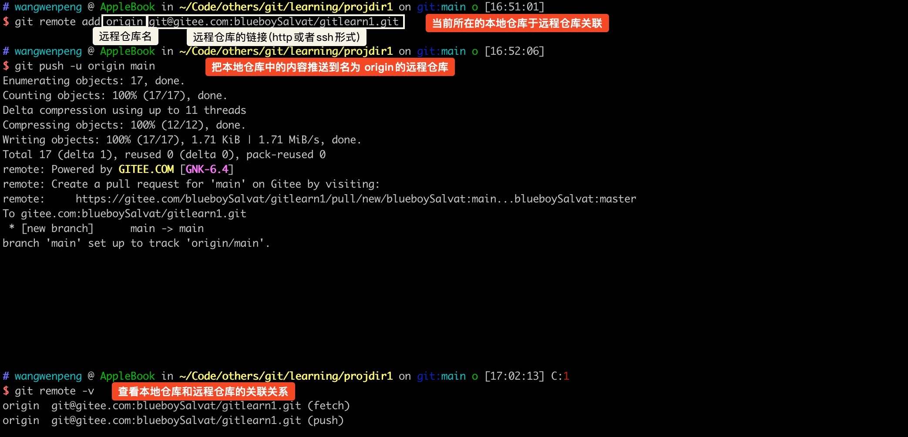
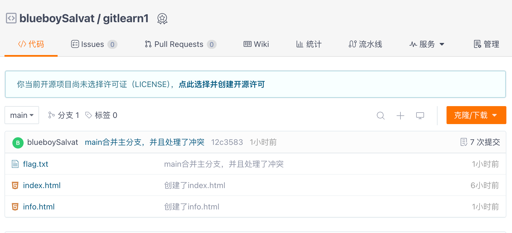

### 添加文件到忽略列表
一般我们总会有些文件无需纳入Git的管理，也不希望它们总出现在未跟踪文件列表。 通常都是些自动生成的文件，比如日志文件，或者编译过程中创建的临时文件等。 在这种情况下，我们可以在工作目录中创建一个名为 .gitignore的文件（文件名称固定），列出要忽略的文件模式。

通常开发工具会帮我们生成。


## 远程仓库

### 注册 gitee/github
### 配置 SSH
#### 在本地生成密钥
```shell
ssh-keygen -t rsa -C "your email@example.com" 
//引号里面填写你的邮箱地址，比如我的是 ssh-keygen -t rsa -C "xxxxx@163.com" 
```
```shell
## wangwenpeng @ AppleBook in ~/.ssh [16:46:18]
$ cd ~/.ssh

## wangwenpeng @ AppleBook in ~/.ssh [16:47:54]
$ pwd
/Users/wangwenpeng/.ssh

## wangwenpeng @ AppleBook in ~/.ssh [16:47:55]
$ ls
id_rsa          id_rsa.pub
```

#### 在 gitee/github 上填入密钥
把 id_rsa.pub 中的内容填入

### 操作远程仓库
#### 上传操作
##### 在 gitee/github 创建远程仓库
##### 将本地仓库关联到远程仓库并且推送

本地仓库关联远程仓库，以及推送：

在 gitee 上查看：


命令：git push [-f] [--set-upstream] [远端名称 [本地分支名][:远端分支名] ]

如果远程分支名和本地分支名称相同，则可以只写本地分支

例如： `git push origin main`，向名为 origin 的远程仓库，推送本地 main 分支到 origin 远程仓库的 main 分支。

如果远程分支名和本地分支名称不同，则需要特别指定

例如： `git push origin main:master`，向名为 origin 的远程仓库，推送本地 main 分支到 origin 远程仓库的 master 分支。

- -f 表示强制覆盖(谨慎使用，可能出现数据覆盖，致使原来数据找不回来的情况)
- --set-upstream 推送到远端的同时并且建立起和远端分支的关联关系
- git push --set-upstream origin main(推送时同时把本地 main 分支和远程 main 分支建立关联关系)
	- 如果当前分支已经和远端分支关联，则可以省略分支名和远端名
	- 下次直接使用 `git push` 。当你运行 `git push` 命令时，如果当前分支已经与远程分支建立了关联关系（使用 `--set-upstream` 或 `-u` 选项），Git 将会根据当前分支的上游分支来决定推送到哪个远程分支。

#### 下载操作
##### 从远程仓库克隆
如果已经有一个远端仓库，我们可以直接clone到本地。

命令： `git clone <仓库路径> [本地目录]`

- 本地目录可以省略，会自动生成一个目录

##### 从远程仓库抓取和拉取
远程分支和本地的分支一样，我们可以进行merge操作，只是需要先把远端仓库里的更新都下载到本地，再进行操作。

- 抓取命令：git fetch \[remote name\] \[branch name\]

抓取指令就是将仓库里的更新都抓取到本地，不会进行合并

如果不指定远端名称和分支名，则抓取所有分支。

- 拉取命令：git pull \[remote name\] \[branch name\]

拉取指令就是将远端仓库的修改拉到本地并自动进行合并，等同于fetch+merge
如果不指定远端名称和分支名，则抓取所有并更新当前分支


### 解决合并冲突
A、B用户修改了同一个文件，且修改了同一行位置的代码，此时会发生合并冲突。

A用户在本地修改代码后优先推送到远程仓库，此时B用户在本地修订代码，提交到本地仓库后，也需要推送到远程仓库，此时B用户晚于A用户，故需要先拉取远程仓库的提交，经过合并后才能推送到远端分支。

在B用户拉取代码时，因为A、B用户同一段时间修改了同一个文件的相同位置代码，故会发生合并冲突。

远程分支也是分支，所以合并时冲突的解决方式也和解决本地分支冲突相同相同。


