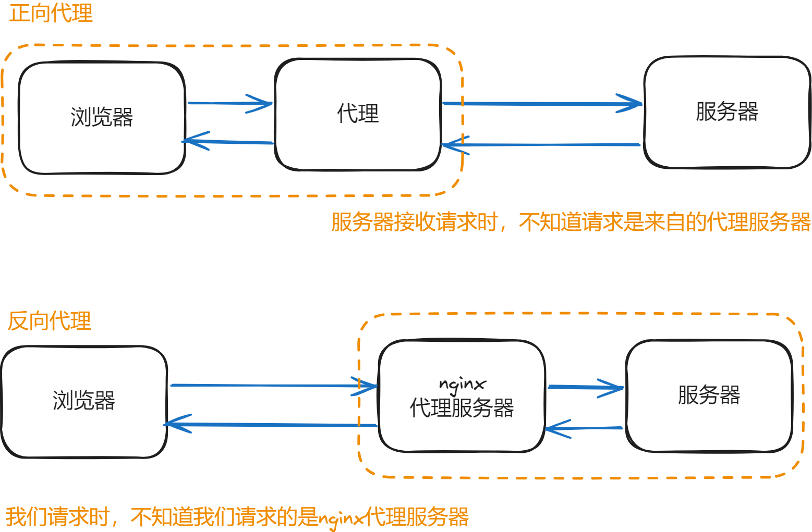

## 什么是 nginx
>Nginx 是一款**轻量级**的 Web 服务器/反向代理服务器及电子邮件（IMAP/POP3）代理服务器，特点是占有内存少、并发能力强。Nginx 高并发能力强大、支持热不熟、启动简单。

## Nginx 的反向代理
### 什么是正向/反向代理

- 正向代理，即在我们电脑本地上配置的一个代理，我们将使用我们自己配置的这个代理来帮我们去访问目标站点。举一个简单的例子，我们想要访问 X（推特）、Github 的时候，正常情况下国内是很慢或者无法访问的，但是我们可以在我们的电脑上配置一个代理服务器，让他帮我们去访问然后就 X 网站返回的内容交给我们本地电脑进行显示。
- 反向代理，现在代理服务器的配置不再由我们自己配置，而是由服务器那边人员去进行配置。同样的，配置代理服务器的目的也是为了提高访问体验。服务器那边配置好代理服务器后，当我们请求时请求的是代理服务器，而代理服务器会根据各个服务器的负载情况，动态的分配我们这次请求的流量往哪里走。Nginx 不但解决了向各个服务器的流量动态分发，还解决了在服务器之间共享 session 的问题。

一个不成方圆的记忆法：
- 正向代理是我们自己配置的，我们自己心知肚明的，所以叫正。
- 反向代理不是我们自己配置的，我们自己不知道有没有这个东西，翻译叫反。

## 负载均衡
>Nginx 可以实现向一个服务器集群那边派发合适的流量，从而提高访问速度等性能表现。


## 动静分离
Nginx 将处理静态资源，而动态请求将由 Apache 处理
```nginx
upstream mytest {
    server localhost:9999;
    server localhost:9900;
}

server {
    listen       80;
    server_name  localhost;

    #拦截静态资源
    location ~ .*\.(html|htm|gif|jpg|jpeg|bmp|png|ico|js|css|map|eot|svg|ttf|woff|woff2)$ {
		root /home/pages;
		index index.html index.htm;
	}

	# 反向代理服务器资源
    location / {
    	proxy_pass http://mytest/;
    }
}
```


1. **静态资源拦截**： 这部分配置用于拦截静态资源，例如 HTML、CSS、JavaScript、图片等。当客户端请求这些资源时，Nginx 会直接返回它们，而不需要将请求转发到后端服务器（如 Apache）。
    
    ```nginx
    location ~ .*\.(html|htm|gif|jpg|jpeg|bmp|png|ico|js|css|map|eot|svg|ttf|woff|woff2)$ {
        root /home/pages;
        index index.html index.htm;
    }
	
	# location ~ .*\.(...)：这是一个正则表达式，匹配指定后缀的文件。
    # root /home/pages;：指定静态资源的根目录。
    # index index.html index.htm;：如果请求的路径是目录，Nginx 会尝试返回 index.html 或 index.htm。
    ```
    
2. **反向代理**： 这部分配置用于将请求转发到后端服务器。在你的配置中，请求会被代理到名为 `mytest` 的后端服务器组。以下是相关部分：
    
    ```nginx
    location / {
        proxy_pass http://mytest/;
    }
    ```
    
    - `proxy_pass http://mytest/;`：将请求转发到 `mytest` 后端服务器组。

## 常用命令

```
cd /usr/local/nginx/sbin/
./nginx  启动
./nginx -s stop  停止
./nginx -s quit  安全退出
./nginx -s reload  重新加载配置文件如果我们修改了配置文件，就需要重新加载。
ps aux|grep nginx  查看 nginx 进程
```

补充相关命令：
```
## 开启 service firewalld start
## 重启 service firewalld restart
## 关闭 service firewalld stop
## 查看防火墙规则 firewall-cmd --list-all
## 查询端口是否开放 firewall-cmd --query-port=8080/tcp
## 开放80端口 firewall-cmd --permanent --add-port=80/tcp
## 移除端口 firewall-cmd --permanent --remove-port=8080/tcp#重启防火墙(修改配置后要重启防火墙)

1、firwall-cmd：是Linux提供的操作firewall的一个工具；
2、--permanent：表示设置为持久；
3、--add-port：标识添加的端口；

```


## 在Mac上安装nginx

```shell
brew install nginx
```

安装成功后很有用的提示信息：
```
Docroot is: /opt/homebrew/var/www

The default port has been set in /opt/homebrew/etc/nginx/nginx.conf to 8080 so that
nginx can run without sudo.

nginx will load all files in /opt/homebrew/etc/nginx/servers/.

To start nginx now and restart at login:
  brew services start nginx
Or, if you don't want/need a background service you can just run:
  /opt/homebrew/opt/nginx/bin/nginx -g daemon\ off\;
```

## 相关参考
[Nginx详解（一文带你搞懂Nginx）-CSDN博客](https://blog.csdn.net/hyfsbxg/article/details/122322125)