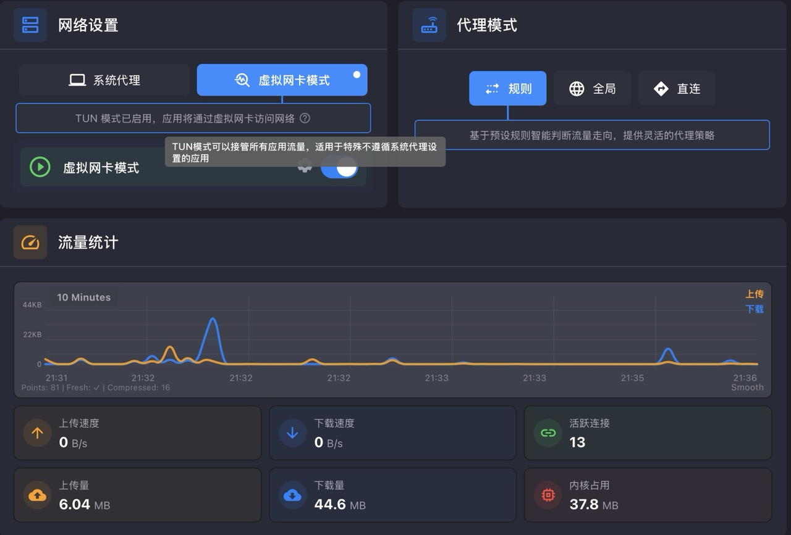

## 安装 easyconnect-docker

```shell
docker run \
  --name app-easyconnect \            # 容器名称
  --device /dev/net/tun \             # 挂载网络隧道设备
  --cap-add NET_ADMIN \               # 添加网络管理权限
  -privileged \                       # 最高权限模式
  -ti \                              # 交互式终端
  -e PASSWORD=xxxx \                  # VNC 连接密码
  -e URLWIN=1 \                      # 启用窗口模式
  -e DISABLE_PKG_VERSION_XML=1 \     # 禁用包版本检查（适配 ARM64）
  -v /Users/wangwenpeng/docker/app/easy-connect:/root \ # 挂载数据卷
  -p 127.0.0.1:5901:5901 \          # VNC 端口映射
  -p 127.0.0.1:1080:1080 \          # SOCKS5 代理端口映射
  -p 127.0.0.1:8888:8888 \          # HTTP 代理端口映射
  hagb/docker-easyconnect:7.6.7      # 镜像名称和版本
```

- `--name`：容器名称，便于管理和引用
- `--device /dev/net/tun`：挂载网络隧道设备，VPN 连接必需
- `--cap-add NET_ADMIN`：添加网络管理能力，允许修改网络配置
- `-privileged`：特权模式，给予容器几乎所有主机权限
- `-ti`：`-t` 分配伪终端 + `-i` 保持交互式输入
- `-e PASSWORD=xxxx`：设置 VNC 远程桌面连接密码
- `-e URLWIN=1`：启用 URL 窗口模式，方便操作
- `-e DISABLE_PKG_VERSION_XML=1`：禁用软件包版本 XML 检查，解决 ARM64 兼容性问题
- `-v /path:/root`：将主机目录挂载到容器内，持久化配置和数据
- `-p 127.0.0.1:5901:5901`：VNC 服务端口，用于远程桌面访问
- `-p 127.0.0.1:1080:1080`：SOCKS5 代理端口，供其他应用使用
- `-p 127.0.0.1:8888:8888`：HTTP 代理端口，Web 浏览器代理

## 编辑全局拓展脚本


根据需要修改，我写的是：

- name 中的名字可以随便起
- `127.0.0.1:1080` 是我本地 docker 中，容器 `app-easyconnect` 暴露出来的 Socks5 代理端口。这个 `server` 与 `port` 可以按需而改
- UDP 为 true 意味着像是游戏、视频场景的流量也可以转发到这个地址的端口处
- `config.rules.unshift` 意思是往数组中最开始添加一条规则，匹配网段 `10.193.108.0/24` 的地址，走名字为 `ec` 的代理

```javascript
function main(config, profileName) {
  // 添加 EasyConnect 代理
  config.proxies.push({
    name: 'ec',
    type: 'socks5',
    server: '127.0.0.1',
    port: 1080,
    udp: true
  });

  // 添加内网规则
  config.rules.unshift(
    "IP-CIDR,10.193.108.0/24,ec"
  );

  return config;
}
```

## 修改系统配置

首先查看一下自己的代理软件配置，找到代理端口


打开系统的网络设置


设置一下代理标签页，在 SOCKS 代理这里，填写正确的地址与端口。

只开 `SOCKS` 就行，这样配置后，`SOCKS5` 能确保所有 TCP 流量（HTTP、FTP、SSH）都能被代理

SOCKS5 vs HTTP 代理的区别：

- SOCKS5 代理：
    - 传输层代理，透明转发 TCP/UDP 数据包
    - 不关心上层协议内容（HTTP、FTP、SSH 都可以）
    - 支持所有基于 TCP 的应用协议
- HTTP 代理：
    - 应用层代理，理解 HTTP 协议
    - 只能代理 HTTP/HTTPS 流量
    - 通过 HTTP CONNECT 方法建立隧道


> [!tip] 
> 有一点需要注意，如果你希望某个内网地址走代理的话，要看看一下蓝色区域中是否包含，如果有的话自行删除，否则不会走代理客户端。


## 配置 Git 代理

经过上述配置之后，如果你的远程地址也是使用的是 HTTP 协议的，如：`http://10.100.108.110:8600/project/your-project.git`，按理来说，你的 IDEA 可以正常拉取更新代码了。

如果不行，最推荐的方式是改为 HTTP 的，配置更简单。

```shell
# 查看当前远程地址
git remote -v

# 将 SSH 地址改为 HTTP 地址
git remote set-url origin http://10.100.108.110:8600/project/your-project.git

# 验证修改
git remote -v
```


## 配置 SSH 走 SOCK

> [!tips]
> macOS 系统代理的应用范围有限制：  
> ✅ HTTP/HTTPS 流量：curl、浏览器等会使用系统代理  
> ❌ SSH 协议：SSH 客户端通常不使用系统代理设置  
> 大多数命令行工具会检查 `HTTP_PROXY`、`HTTPS_PROXY` 环境变量  
> SSH 客户端有自己的网络栈，**绕过**系统代理  

跟着我做：
- 找到 ssh 目录
- 如果没有配置文件就自行创建
- 填入配置内容

完整执行脚本：
```shell
# 当前在 /Users/wangwenpeng/.ssh 目录下
touch config
echo "Host 10.193.108.*
    ProxyCommand nc -X 5 -x 127.0.0.1:7897 %h %p
    StrictHostKeyChecking no" > config
chmod 600 config

# 验证配置
cat config
```

-  `Host 10.193.108.*`
	- 作用：定义匹配规则
	- 含义：对所有 10.193.108.x 网段的主机应用以下配置

-  `ProxyCommand nc -X 5 -x 127.0.0.1:7897 %h %p`
	- 作用：指定代理连接命令
	- 分解说明：
		- nc：netcat 工具（网络连接工具）
		- -X 5：使用 SOCKS 5 代理协议
		- -x 127.0.0.1:7897：代理服务器地址和端口
		- %h：SSH 配置中的变量，代表目标主机名
		- %p：SSH 配置中的变量，代表目标端口

-  `StrictHostKeyChecking no`
	- 作用：跳过主机密钥验证
	- 含义：不询问"是否信任此主机"，直接连接
	- 适用场景：内网环境或测试环境
	- 安全提醒：生产环境建议设为 yes 或 ask

-  `SendEnv -LC_*`
	- 作用：控制环境变量传递
	- 含义：不发送所有以 LC_ 开头的环境变量
	- 目的：避免语言环境冲突警告

## 关于不好配置代理的地方

比如 Navicat，它自身不带配置代理的地方，就不大好处理。如果你的软件支持开启隧道模式，可以在特殊情况的时候直接开隧道模式，或者一直开着也行，但是听说隧道模式是网卡级别的处理，所以耗电量会略多那么一一点点点。

