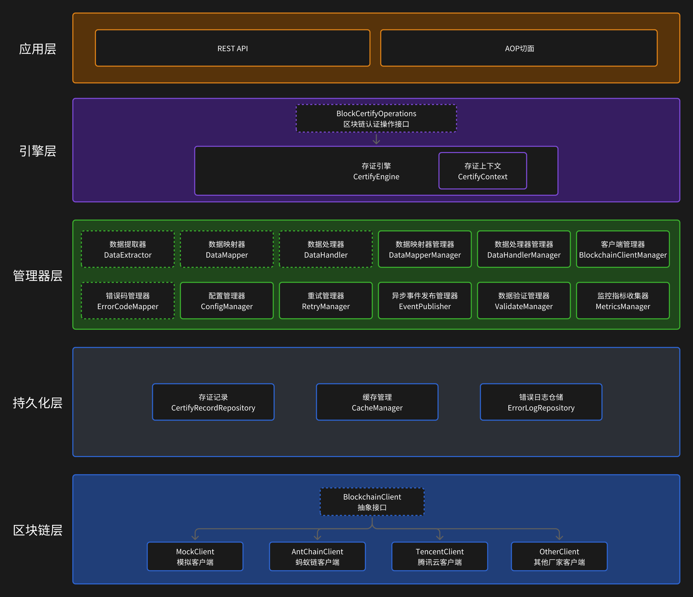

## Part 1: 理论基础篇 (Foundation)

### 场景再现

#### 业务痛点

传统的业务系统中，业务操作产生的相关记录的可信度并不高。业务操作方有很大的空间可以自己捏造改造假的数据，另外就算依靠第三方机构，也并不安全，非常考验第三方机构本身的专业性，以及可信度。

这两种方式都有一个特点，就是真实性非常依赖一方。为了解决这个痛点，去中心化的方案应运而生。

#### 传统方案的局限性

- 业务系统拥有方/操作方捏造/修改数据非常容易
- 第三方机构可能存在可信度，以及数据安全性低的问题

#### 区块链存证的价值

- 存在区块链中的数据很难被篡改，可信度极高，具备法律效应

### 什么是区块链

#### 区块链的基本概念

##### 哈希

> 哈希是一种将任意长度的数据，通过特定算法转换为固定长度、唯一且不可逆的字符串的过程。

简单说就是，吃一堆数据进去，经过计算，能吐出一个唯一的指纹信息。如果我们后续想判断这一堆数据有没有被修改过，就再计算一次，和指纹信息比一比就可以了。注意，我们并不能通过指纹信息反推数据哦。

在区块链系统中，会涉及到两个哈希：

|                         |                     |                              |
| ----------------------- | ------------------- | ---------------------------- |
| 交易哈希 (Transaction Hash) | 唯一标识一笔交易            | 任何人拿到这个哈希，都可以在链上查到这笔交易的具体内容。 |
| 区块哈希 (Block Hash)       | 唯一标识一个区块，并保证区块不可篡改。 | 是该区块所有数据的数字指纹，证明整个区块的有效性     |

它们两个的关系：
- 交易哈希被包含在区块中。先有交易，然后交易被打包进区块。
- 区块哈希包含了所有交易哈希。它的计算依赖于区块内的所有交易。

这俩个哈希打组合🃏，巧妙的链式结构保证不可篡改：
- 用交易数据重新计算出交易哈希，交易哈希是验证数据是否被修改的第一个秘密武器。
- 区块哈希包含了所有交易哈希，它的计算依赖于区块内的所有交易，根据这些内容，计算出区块哈希，这是判断数据是否被修改的第二个秘密武器
- 形成链式结构；区块 N 的哈希 = Hash( 区块 N-1 的哈希 + 区块 N 的所有交易 + ... )。这意味着要想成功篡改一个历史区块，必须同时重新计算它之后所有区块的哈希，算力上几乎不可能实现，你把你能竭尽所能买到的电脑拼起来，算冒烟了估计都算不出来。

##### 确认数

> 确认数是指一笔交易被打包进区块后，在它之上又产生了多少个新区块。

```
假设当前区块链高度是 1000：

区块高度 997: [包含你的交易 TX1]
区块高度 998: [其他交易]
区块高度 999: [其他交易] 
区块高度 1000: [其他交易] <- 当前最新区块

那么你的交易 TX1 的确认数就是：1000 - 997 = 3
```

作用：
- 可以估算重组概率。确认数越多，交易被重组的概率越低
- 不同业务对确认数的要求不一样，估算安全性
	- 小额交易：1-3个确认即可
	- 重要存证：6-12个确认更安全
	- 关键业务：可能需要20+个确认

```
确认数 0: PACKED (刚被打包，风险最高)
确认数 1-5: CONFIRMED (基本安全)  
确认数 6+: FINALIZED (非常安全，几乎不可逆)
```

#### 存证的技术原理

- 去中心化存储，数据在互联网中的多个节点中拷贝存储
- 多数节点中的数据确定最终数据，不受个别节点中数据变更的影响
- 很难被篡改，可信度极高

### AOP 的基本概念

#### 切面编程的原理

切面一词，本身就非常通俗易懂了。我们就像是把一条流程且了几道口子，在此处编程书写我们想要的逻辑，流程本身还是没变，多的只是在某处要执行的额外逻辑。

切面编程的关键概念：
- 切面类
- 切面
- 通知
- 切点

#### 为什么选择使用 AOP 实现

- 存证执行失败，也不影响原业务流程
- 存证逻辑与业务逻辑完全解耦，不需要在原业务流程中修改，确保系统稳定性
- 存证逻辑集中，修改维护方便。并且可以封装为 starter（公共组件）以便复用

### 常见的设计模式

## Part 2: 渐进式实现篇 (Progressive Implementation)

### 表设计

考虑到数据字段可能比较大，为了优化查询性能，我们将分为 2 张表 `blockchain_certify_record`、`blockchain_certify_detail`

这样的好处是：
1. 优化查询性能，简单的查询不需要加载大字段的内容
2. 减轻主表的存储压力，大字段单独存储
3. 方便未来在详情表中增加更多大数据字段


#### 主表 blockchain_certify_record

##### 状态

- 状态值设计

| 状态名称 | 英文标识          | 说明               |
| ---- | ------------- | ---------------- |
| 初始化  | INIT          | 刚创建记录，还未开始存证     |
| 提交中  | SUBMITTING    | 正在向区块链网络提交交易     |
| 待打包  | PENDING       | 交易已提交到内存池，等待矿工打包 |
| 已打包  | PACKED        | 交易已被打包进区块，但确认数不足 |
| 已确认  | CONFIRMED     | 交易已获得足够确认数，相对安全  |
| 已重组  | REORGED       | 曾经打包的区块被重组废弃     |
| 提交失败 | SUBMIT_FAILED | 提交到区块链网络失败       |
| 打包失败 | PACK_FAILED   | 长时间未被打包，被丢弃      |
| 最终确认 | FINALIZED     | 达到最终确认数，几乎不可逆转   |

关于确认数值与状态

| 状态        | 确认数范围 | 安全级别 | 适用场景      |
| --------- | ----- | ---- | --------- |
| PACKED    | 0     | 最低   | 刚被打包，高风险  |
| CONFIRMED | 1-5   | 基本安全 | 一般业务操作    |
| FINALIZED | 6+    | 高安全  | 重要存证、大额交易 |

- 状态流转机制

正常流程
```
INIT -> SUBMITTING -> PENDING -> PACKED -> CONFIRMED -> FINALIZED
```

异常流程
```
INIT -> SUBMITTING -> SUBMIT_FAILED 提交失败，然后重试
```

```
INIT -> SUBMITTING -> PENDING -> PACK_FAILED 一直没等到被打包，然后重试
```

```
PACKED/CONFIRMED -> REORGED -> 重新开始流程 -> 复制改记录状态改为INIT -> ....
```

| **字段名称**              | **字段类型**     | **字段说明**        | **是否必填** | **备注**                                 |
| --------------------- | ------------ | --------------- | -------- | -------------------------------------- |
| id                    | bigint       | 主键（逻辑主键）        | 是        |                                        |
| biz_type              | varchar(100) | 操作业务的类型         | 是        | 如 stockIn/stockOut/stockTransfer       |
| biz_id                | varchar(100) | 操作业务的主键         | 是        | 关联的具体业务记录 ID                           |
| biz_opt_time          | datetime     | 业务操作时间          | 是        | 实际的业务操作发生时间                            |
| certify_time          | datetime     | 存证时间            |          | 区块链存证成功的时间                             |
| status                | varchar(20)  | 存证状态            | 是        |                                        |
| errorCode             | varchar(50)  | 我们自己的统一错误码      |          |                                        |
| error_message         | varchar(100) | 我们自己的统一错误描述     |          |                                        |
| tx_hash               | varchar(128) | 区块链的交易哈希        |          | 唯一标识一笔交易。区块链上每笔交易的唯一标识符，类似于交易的"身份证号"   |
| block_height          | bigint       | 区块链的区块高度        |          | 表示该交易被打包到区块链的第几个区块中                    |
| block_hash            | varchar(100) | 区块链的区块哈希        |          | 唯一标识一个区块，并保证区块不可篡改。它是该区块所有数据的数字指纹。     |
| confirmation_count    | int          | 当前确认数           |          |                                        |
| required_confirmation | int          | 要求的确认数（默认6）     |          |                                        |
| is_in_main_chain      | tinyint(1)   | 是否在主链上          |          |                                        |
| last_check_time       | datetime     | 最后检查时间          |          |                                        |
| reorg_count           | int          | 重组次数            |          |                                        |
| original_tx_hash      | varchar(128) | 原始交易哈希（重新提交时记录） |          | 用于记录重组前的交易标识，建立重试关系的追踪链条，能追溯到这笔存证的完整历史 |
| sdk_certificate_id    | varchar(255) | SDK 存证凭证ID      |          | SDK 返回的 业务层面的凭证编号                      |
| sdk_code              | varchar(50)  | SDK 错误码         |          | SDK 返回的 code 字段                        |
| sdk_message           | varchar(500) | SDK 返回消息        |          | SDK 返回的 msg 字段                         |
| retry_count           | int          | 重试次数            |          | DEFAULT 0                              |
| max_retry_count       | int          | 最大重试次数          |          | DEFAULT 3                              |
| next_retry_time       | datetime     | 下次重试时间          |          |                                        |
| sdk_vendor            | varchar(50)  | SDK 厂商标识        | 是        |                                        |
| sdk_version           | varchar(20)  | SDK 版本号         | 是        |                                        |
| tenant_id             | bigint(20)   | 租户编号            |          |                                        |
| creator               | varchar(255) | 创建人 ID          | 是        |                                        |
| create_time           | datetime     | 创建时间            | 是        | DEFAULT CURRENT_TIMESTAMP              |
| updater               | varchar(255) | 更新人 ID          |          |                                        |
| update_time           | datetime     | 更新时间            |          | ON UPDATE CURRENT_TIMESTAMP            |
| deleted               | tinyint(1)   | 逻辑删除标记          | 是        | 0:未删除 1:已删除                            |

索引：
- biz_type, biz_id
- tx_hash
- next_retry_time -- 用于重试任务扫描
- last_check_time -- 用于状态检查任务
- status
- create_time

#### 详情表 blockchain_certify_detail

| **字段名称**                 | **字段类型**     | **字段说明**          | **是否必填** | **备注**                       |
| ------------------------ | ------------ | ----------------- | -------- | ---------------------------- |
| id                       | bigint       | 主键                | 是        |                              |
| certify_record_id        | bigint       | 关联主表ID            | 是        |                              |
| certify_struct_data      | json         | 存证结构化数据（JSON 格式）  |          | 业务表单数据组合                     |
| certify_struct_data_hash | varchar(255) | 结构化数据的 HASH 值     |          | 结构化数据的 HASH 值                |
| certify_un_struct_data   | json         | 存证非结构化数据（JSON 格式） |          | 业务表单的附件信息                    |
| sdk_data                 | text         | SDK 返回数据          |          | SDK 返回的 data 字段内容            |
| sdk_response_data        | text         | 完整响应数据            |          | SDK 返回的完整 JSON 响应（用于备份和排查问题） |
| create_time              | datetime     | 创建时间              | 是        | DEFAULT CURRENT_TIMESTAMP    |
索引：
- certify_record_id

主键约束：
- certify_record_id

### 架构与接口设计




- 数据提取器 DataExtractor
    - 提供一个规范的数据提取接口，需要存证的业务自行实现改接口，完善数据构建逻辑

- 数据映射器 DataMapper
    - 提供对于业务中普遍存在的数字ID字段的映射接口

- 数据处理器 DataHandler
    - 提供数据预处理接口，处理业务数据中的计算、格式转换、敏感信息脱敏等场景

- 数据映射器 DataMapperManager
    - 提供数据映射管理器的管理类，可以自动收集所有实现，统一调用处理。

- 数据处理器 DataHandlerManager
    - 提供数据处理管理器的管理类，可以自动收集所有实现，统一调用处理。

- 客户端管理器 BlockchainClientManager
    - 统一管理区块链客户端，提供统一的接口，管理使用的区块链客户端的全流程管理

- 配置管理器 ConfigManager
    - 统一管理不同区块链厂商的配置信息（认证信息、API地址、超时设置等）

- 错误管理器 ErrorCodeMapper
    - 提供规范接口，统一处理不同厂商的错误，返回规范统一的错误响应

- 重试管理器 RetryManager
    - 应对存值失败场景下的管理器

- 数据验证管理器 ValidateManager
    - 不同厂家对于存值数据长度、每个字段等可能有特殊的数据要求

- 异步事件发布管理器 EventPublisher
    - 负责事件通知，比如通知业务状态更新，发送邮件等

- 监控指标收集器 MetricsManager
    - 负责数据收集，例如存证成功率、响应时间

---

完整的调用链路

```
@BlockchainCertify --> AOP切面 
    ↓
CertifyEngine.certify() 
    ↓  
DataExtractor.extract() --> 提取业务数据
    ↓
DataMapper.map() --> 转换为统一格式
    ↓  
DataHandler.handle() --> 数据计算处理
    ↓
ValidateManager.validate() --> 数据校验处理
	↓
CertifyRecordRepository.save() --> 保存业务数据
    ↓
ClientManager.getClient() --> 获取具体客户端
    ↓
BlockchainClient.certify() --> 调用区块链API
    ↓
ErrorLogRepository.log() --> 记录日志信息
    ↓
EventPublisher.publish() --> 发布事件（异步）
	↓
MetricsManager.collect() --> 收集各项监控数据
```

### 持久化层


### 区块链层


### 管理器层

#### 数据提取（策略模式、模板方法模式）

- `AbstractDataExtractor` 提供通用的文件处理和哈希计算模板
- `DataExtractor` 接口支持不同业务类型的数据提取策略
- 子类只需重点实现具体的业务数据提取逻辑即可，无特殊情况无需编写文件处理逻辑。

#### 统一处理机制（策略模式）

统一映射处理


统一数据计算处理


#### 兼容不同 SDK（包装器模式）

  - `BlockchainClient` 接口统一不同区块链 SDK 的调用方式
  - 可以通过创建实现该接口的包装类，来包装区块链厂商的 SDK，以屏蔽不同厂商的调用方式
  - 并且同时支持真实 `SDK` 和 `Mock SDK`，便于测试和开发
  - 可以通过配置切换不同实现，无需修改业务代码

`BlockchainClient`
- 区块链技术类型
- 发送交易
- 查询交易
- 验证交易
- 获取客户端状态

`BlockchainClientManager`
- 获取默认的区块链客户端
- 获取指定技术类型的区块链客户端
- 注册区块链客户端
- 移除区块链客户端


#### 使用管理器模式管理组件

提供多种管理器组件，组件各司其职，符合单一职责原则，方便拓展维护。

#### 重试机制与监控告警

告警触发条件：
1. 检测到重组状态 (REORGED)
2. 重试次数超过阈值
3. 确认数异常下降
4. 长时间停留在 PENDING 状态

告警内容大致包括：
- 业务类型和业务 ID
- 原交易哈希
- 重组发生时间
- 建议处理方式

### 引擎层

#### 存证引擎
- 区块链存证操作接口
    - 提供三大操作方法
        - 区块链存证
        - 查询存证状态
        - 验证存证哈希

#### 存证上下文

将整个业务流程的状态信息集中管理，避免了在方法间传递大量参数，同时提供了完整的操作审计追踪能力


### 应用层
#### 使用 AOP 无感引入 

  核心思路：
  - 自定义注解 `@BlockchainCertify`，标记需要存证的方法
  - 通过 `AOP` 拦截带注解的方法调用、提取数据、异步调用区块链 SDK
  - 在方法执行成功后，异步处理存证逻辑，不影响业务流程，完全解耦


#### 暴露 API


## Part 3: 封装为复用 Starter (Reusable Component)

### 工程结构划分


## Part 4: 总结（Summary）


 

 
